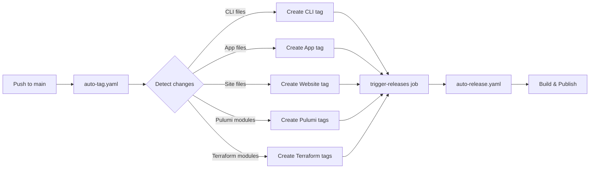
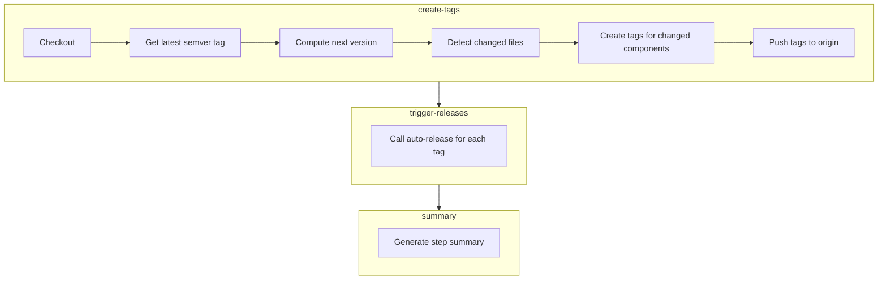
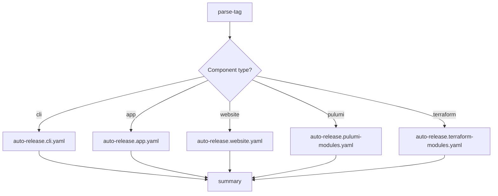

# Auto-Tag and Auto-Release System

Automated tag creation and release pipeline that triggers builds whenever code changes land on `main`.

## Why it exists

Manual releases are error-prone and create bottlenecks. Developers forget to tag, version numbers drift, and releases pile up. The auto-tag system eliminates this friction: push code, get a release. Every commit to `main` that touches relevant paths automatically creates a semver-compliant tag and triggers the appropriate build pipeline.

## How it works



Two workflows work together:

1. **`auto-tag.yaml`** - Detects changes, creates tags, triggers releases
2. **`auto-release.yaml`** - Receives tag, builds and publishes artifacts

## Tag format

Tags use semver pre-release format based on the _next_ patch version:

```
v{next_patch}-{component}.{YYYYMMDD}.{sequence}
```

| Component | Example Tag                            | Sorted Position |
| --------- | -------------------------------------- | --------------- |
| CLI       | `v0.3.5-cli.20260108.0`                | Above `v0.3.4`  |
| App       | `v0.3.5-app.20260108.0`                | Above `v0.3.4`  |
| Website   | `v0.3.5-website.20260108.0`            | Above `v0.3.4`  |
| Pulumi    | `v0.3.5-pulumi.postgres.20260108.0`    | Above `v0.3.4`  |
| Terraform | `v0.3.5-terraform.postgres.20260108.0` | Above `v0.3.4`  |

### Why next version?

Auto-release tags are based on the _next_ patch version so they appear **above** the current stable release in GitHub's tag list. If the latest release is `v0.3.4`, auto-releases become `v0.3.5-cli.*`. This provides immediate visibility into what's been built since the last official release.

### Why hyphen, not plus?

Semver supports two metadata formats:

- **Pre-release** (`-`): `v1.0.0-alpha.1` - affects version precedence
- **Build metadata** (`+`): `v1.0.0+build.123` - ignored for precedence

We use hyphen (`-`) because GitHub Actions tag patterns don't support the `+` character. The hyphen format is valid semver and works with both GitHub Actions and GoReleaser.

## Path detection

The system monitors specific paths to determine which components need releases:

| Component | Monitored Paths                                            |
| --------- | ---------------------------------------------------------- |
| CLI       | `cmd/`, `internal/`, `pkg/`, `main.go`, `go.mod`, `go.sum` |
| App       | `app/`                                                     |
| Website   | `site/`                                                    |
| Pulumi    | `apis/**/iac/pulumi/`                                      |
| Terraform | `apis/**/iac/tf/`                                          |

A single commit can trigger multiple releases if it touches multiple components.

## Sequence numbers

Multiple releases on the same day increment a sequence number:

```
v0.3.5-cli.20260108.0  # First CLI release today
v0.3.5-cli.20260108.1  # Second CLI release today
v0.3.5-cli.20260108.2  # Third CLI release today
```

The sequence resets when the base semver changes (after a new official release).

## Workflow details

### auto-tag.yaml

**Triggers:**

- Push to `main` with changes in monitored paths
- Manual dispatch with force flags

**Jobs:**



**Permissions required:**

- `contents: write` - Create and push tags
- `actions: write` - Trigger auto-release workflow

### auto-release.yaml

**Triggers:**

- `workflow_dispatch` with `tag` input (called by auto-tag)

**Jobs:**



The `parse-tag` job extracts the component type from the tag pattern and routes to the appropriate reusable workflow.

## Why workflow_dispatch instead of tag push?

GitHub's `GITHUB_TOKEN` has a security feature: events triggered by it don't create new workflow runs. This prevents infinite loops but means tag pushes from `auto-tag` won't trigger `auto-release`.

We solve this by having `auto-tag` explicitly call `auto-release` via `workflow_dispatch`. This provides:

- **Explicit control** - Clear which tags trigger which releases
- **No external tokens** - Uses built-in `GITHUB_TOKEN`
- **Visible chain** - Both workflows appear in Actions UI
- **Debuggable** - Easy to trace what triggered what

## Manual triggers

### Force a specific component

Run `auto-tag` manually with force flags:

```
gh workflow run auto-tag.yaml -f force_cli=true
```

Available flags:

- `force_cli` - Force CLI tag even without changes
- `force_app` - Force App tag
- `force_website` - Force Website tag
- `force_pulumi_all` - Force tags for all Pulumi modules
- `force_terraform_all` - Force tags for all Terraform modules

### Re-run a failed release

If a release fails, run `auto-release` manually with the tag:

```
gh workflow run auto-release.yaml -f tag=v0.3.5-cli.20260108.0
```

## Release artifacts by component

| Component | Build Tool  | Output                                                |
| --------- | ----------- | ----------------------------------------------------- |
| CLI       | GoReleaser  | Binaries for darwin/linux (amd64/arm64), Homebrew tap |
| App       | Docker      | Image pushed to GHCR                                  |
| Website   | Hugo/Static | Deployed to GitHub Pages                              |
| Pulumi    | Go build    | Pre-compiled binaries per module                      |
| Terraform | Archive     | Zip files attached to release                         |

## Troubleshooting

### Tag created but no release

Check if `trigger-releases` job ran in `auto-tag`. If it failed, manually trigger:

```bash
gh workflow run auto-release.yaml -f tag=<the-tag>
```

### Wrong component detected

The path regex in `auto-tag.yaml` determines component type. Verify your changes match the expected patterns in the "Path detection" section above.

### Sequence number collision

If you delete and recreate tags on the same day, sequence detection uses `git tag -l`. Make sure remote tags are fetched:

```bash
git fetch --tags
```

### GoReleaser fails on tag

GoReleaser requires strict semver. The hyphen format (`v0.3.5-cli.20260108.0`) is valid. If you see semver errors, check for typos in the tag format.

## Related files

- [`auto-tag.yaml`](../auto-tag.yaml) - Tag creation workflow
- [`auto-release.yaml`](../auto-release.yaml) - Release orchestrator
- [`auto-release.cli.yaml`](../auto-release.cli.yaml) - CLI build with GoReleaser
- [`auto-release.app.yaml`](../auto-release.app.yaml) - Docker image build
- [`auto-release.website.yaml`](../auto-release.website.yaml) - Website deployment
- [`auto-release.pulumi-modules.yaml`](../auto-release.pulumi-modules.yaml) - Pulumi binary builds
- [`auto-release.terraform-modules.yaml`](../auto-release.terraform-modules.yaml) - Terraform zip archives
- [`release.yaml`](../release.yaml) - Manual semver releases (separate from auto-release)
