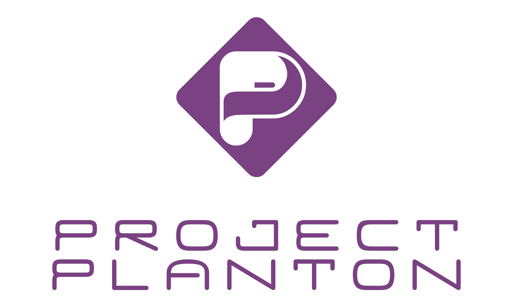
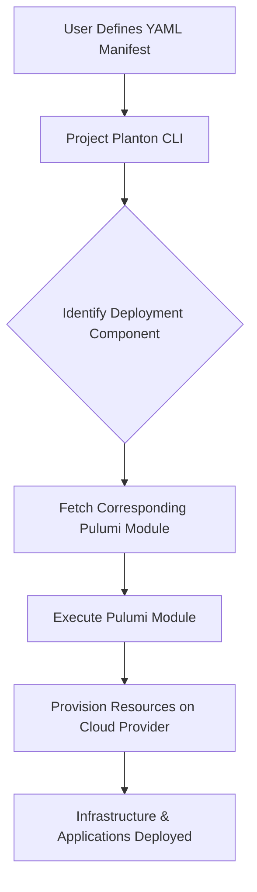

Simple, powerful and flexible `Multi-Cloud Deployments` framework with everything you love
from [Kubernetes Resource Model (KRM)](https://github.com/kubernetes/design-proposals-archive/blob/main/architecture/resource-management.md), [Protobuf](https://protobuf.dev/), [Buf Schema Registry](https://buf.build/product/bsr)
and [Pulumi](https://github.com/pulumi/pulumi).

**Effortlessly deploy complex infrastructure across any cloud provider using simple YAML manifests and powerful
automation.**

<p align="center">
  
</p>

## Documentation

https://project-planton.org

## TL;DR

ProjectPlanton is an open-source framework that simplifies the deployment of multi-cloud environments with
Kubernetes-like declarative configuration. It enables you to:

- **Define Configuration**: Create Kubernetes-like manifests based
  on [ProjectPlanton APIs](apis/project/planton/provider), using simple, consistent APIs written
  in [protobuf](https://protobuf.dev/) and published on the [Buf Schema Registry](https://buf.build/product/bsr) to
  manage resources across various cloud providers. Essentially, Kubernetes manifests for multi-cloud deployments.

- **Deploy Infrastructure**: Utilize
  pre-written [Pulumi modules](https://project-planton.org/pulumi-modules) that take
  your YAML configuration manifests as input and handle the complex infrastructure provisioning. Avoid the complexity of
  learning intricate deployments with the `project-planton` CLI. The
  CLI reads your manifest and determines the appropriate [Pulumi module](https://project-planton.org/pulumi-modules) for
  deployment.



**Get Started in 3 Easy Steps:**

1. **Install the CLI Tool**

   ```bash
   brew install project-planton/tap/project-planton
   ```

2. **Create a YAML Manifest**

   Example manifest
   for
   deploying [Redis On Kubernetes](https://github.com/project-planton/project-planton/tree/main/apis/project/planton/provider/kubernetes/rediskubernetes/v1)
   as per
   the [redis-kubernetes](https://buf.build/project-planton/apis/file/main:project/planton/provider/kubernetes/rediskubernetes/v1/spec.proto)
   deployment component

   You can create similar manifests
   for [AWS VPC](https://github.com/project-planton/project-planton/tree/main/apis/project/planton/provider/aws/awsvpcv1), [GKE Cluster](https://github.com/project-planton/project-planton/tree/main/apis/project/planton/provider/gcp/gkecluster/v1), [Kafka on Kubernetes](https://github.com/project-planton/project-planton/tree/main/apis/project/planton/provider/kubernetes/kafkakubernetes/v1)
   or [Kafka On ConfluentCloud](https://github.com/project-planton/project-planton/tree/main/apis/project/planton/provider/confluent/kafkaconfluent/v1)
   and [many more](https://github.com/project-planton/project-planton/tree/main/apis/project/planton/provider).

```yaml
apiVersion: kubernetes.project-planton.org/v1
kind: RedisKubernetes
metadata:
  name: payments
  id: payments-namespace
spec:
  container:
    replicas: 1
    resources:
      limits:
        cpu: 50m
        memory: 2Gi
      requests:
        cpu: 50m
        memory: 100Mi
    isPersistenceEnabled: true
    diskSize: 1Gi
```

3. **Deploy Your Infrastructure**

The above manifest is the input
for [redis-kubernetes-pulumi-module](https://github.com/project-planton/redis-kubernetes-pulumi-module). Running
`project-planton pulumi up` command will read the manifest and set it up as input for the pulumi module and also run the
pulumi module.

   ```bash
   project-planton pulumi up --manifest redis.yaml
   ```


## Contributing

Visit [CONTRIBUTING.md](CONTRIBUTING.md) for information on building ProjectPlanton from source or contributing improvements.

Also, refer to this [Contributor Guide](https://project-planton.org/docs/guide/contributor-guide) for detailed information about becoming a contributor to Project-Planton.

## License

Project Planton is released under the [Apache 2.0 license](LICENSE). You are free to use, modify,
and distribute this software in accordance with the license terms.

## Acknowledgments

- **Brian Grant & Kubernetes API team** for their foundational work on the Kubernetes Resource Model.
- The **[Protobuf Team](https://alpha-t9kmve036m159v8u4una.sandstorm.io/)** for laying the foundation for a powerful
  language neutral contract definition language.
- The **[Buf](https://github.com/bufbuild/buf) Team** for their Protobuf tooling—including BSR Docs, BSR SDKs, and
  ProtoValidate — which collectively democratized protobuf adoption and made this project possible.
- The **[Pulumi](https://github.com/pulumi/pulumi)** team for providing a powerful infrastructure as code platform that
  enables multi-language support.
- The **[spf13/cobra](https://github.com/spf13/cobra)** team for making building command line tools a bliss.
