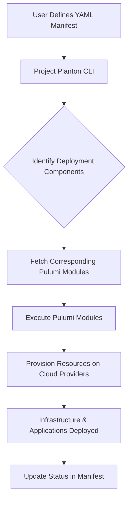

# Multi-Cloud Unified Resource Model (MURM)

Project Planton is an open-source framework that brings the declarative design principles of the Kubernetes Resource
Model (KRM) to multi-cloud environments. By leveraging Pulumi modules and a straightforward CLI tool, Project Planton
enables developers to define and deploy infrastructure and applications across multiple cloud providers using
declarative configurations.

Project Planton aims to simplify the deployment of microservices, popular open-source software infrastructure, cloud
infrastructure across multiple cloud providers using a consistent, declarative approach. Developers often struggle with
the complexity and inconsistencies of deploying infrastructure on different clouds like AWS, Azure, and Google Cloud.

With Project Planton, a developer can define their infrastructure and application configurations in a YAML manifest
using familiar Kubernetes-like API resources. By running a single CLI command, the specified Pulumi modules are
automatically fetched and executed to bring the desired state to reality on the target cloud platforms. This means a
developer can focus on writing the application and its configuration once, and deploy it consistently across any
supported cloud environment without dealing with cloud-specific nuances. This accelerates development, reduces the
learning curve for multi-cloud deployment, and ensures that infrastructure remains consistent and manageable.

## Key Features

- **Declarative Multi-Cloud Deployments**: Define your infrastructure and application configurations using
  Kubernetes-like YAML manifests. Deploy across multiple cloud providers seamlessly, ensuring consistency and reducing
  complexity.

- **Pulumi Module Integration**: Leverage Pulumi modules versioned and hosted in their own repositories. These modules
  handle the provisioning of resources declared in your manifests, bringing your desired state into reality when you
  trigger them.

- **Familiar API Design**: Utilize API resources modeled after the Kubernetes Resource Model (KRM), including `version`,
  `kind`, `metadata`, `spec`, and `status` fields. This familiar structure makes it easier for developers with
  Kubernetes experience to adopt and use.

- **CLI Tooling**: Install the `project-planton` CLI via Homebrew (`brew install plantoncloud/tap/project-planton`) to
  manage your deployments effortlessly. The CLI handles fetching the necessary Pulumi modules and orchestrates the
  deployment process based on your manifests.

- **Extensible and Open Source**: All APIs are defined using Protocol Buffers and published to the Buf Schema Registry (
  BSR), providing readily available documentation and SDK generation in multiple languages. The open-source nature
  encourages community contributions and transparency.

- **Advanced Validation**: Field validations are embedded within the protobuf definitions using Protovalidate and Common
  Expression Language (CEL). This ensures configurations are correct and reduces errors during deployment.

## Getting Started

To start using **Project Planton**, follow the steps below to set up your environment and deploy your first manifest.

### Prerequisites

- **Pulumi Installed**: Ensure you have [Pulumi](https://www.pulumi.com/docs/get-started/install/) installed on your
  machine.
- **Project Planton CLI**: Install the Project Planton CLI using Homebrew:

  ```bash
  brew install plantoncloud/tap/project-planton
  ```

- **Cloud Provider Credentials**: Set up credentials for the cloud providers you plan to use (e.g., AWS, Azure, Google
  Cloud). Refer to Pulumi's documentation on [cloud provider setup](https://www.pulumi.com/docs/intro/cloud-providers/)
  for guidance.

### Installation

1. **Install the CLI Tool**

   Install the Project Planton CLI if you haven't already:

   ```bash
   brew install plantoncloud/tap/project-planton
   ```

2. **Verify the Installation**

   Confirm that the CLI is installed correctly by checking its version:

   ```bash
   project-planton --version
   ```

### Creating a Manifest

Create a YAML manifest file that defines your desired infrastructure or application configuration. Here's an example of
a simple manifest:

```yaml
apiVersion: gcp.project.planton/v1
kind: GcsBucket
metadata:
  name: example-storage-bucket
spec:
  gcpProjectId: gcp-project-id
  gcpRegion: us-west-1
```

### Deploying Your Manifest

Use the Project Planton CLI to deploy your manifest:

```bash
project-planton pulumi up --manifest manifest.yaml --gcp-credential gcp-credential.yaml
```

This command will:

- Download the appropriate Pulumi module based on the `componentType` specified in your manifest.
- Pass the manifest and Kubernetes cluster information to the Pulumi module.
- Execute the Pulumi stack to provision the resources as declared in your manifest.

## How It Works

Project Planton bridges the gap between Kubernetes' declarative resource model and multi-cloud deployments by leveraging
Pulumi modules and a simple CLI tool. Here's an overview of how the system operates:

1. **Declarative Manifests**: Users define their desired infrastructure or application configurations in YAML manifests,
   following the familiar structure of Kubernetes resources with `apiVersion`, `kind`, `metadata`, `spec`, and `status`.

2. **Protocol Buffers Definitions**: These manifests correspond to API resources defined in Protocol Buffers (protobuf).
   The APIs are published to the Buf Schema Registry (BSR), providing accessible documentation and on-demand SDK
   generation in multiple languages.

3. **Field Validation**: Validations are embedded within the protobuf definitions using Protovalidate and Common
   Expression Language (CEL). This ensures that the configurations adhere to the expected formats and constraints before
   deployment.

4. **CLI Execution**: When the user runs the `project-planton` CLI command, the tool performs the following actions:
    - **Module Retrieval**: It identifies the appropriate Pulumi module repository for the specified deployment
      component (e.g., a Kubernetes cluster, database service, etc.).
    - **Pulumi Module Execution**: It clones the Pulumi module and passes the manifest and any additional configuration
      to it.
    - **State Management**: Users manage the Pulumi state backend, ensuring that state is preserved across deployments.
    - **Provisioning**: The Pulumi module uses the provided configurations to interact with the target cloud providers'
      APIs, provisioning the resources as declared.

5. **Desired State Realization**: Pulumi modules act similarly to Kubernetes controllers but are triggered manually by
   the user. They reconcile the declared state in the manifests with the actual state in the cloud environment, ensuring
   that the infrastructure matches the desired specifications.

6. **Status Reporting**: After deployment, the `status` field in the manifest can be updated to reflect the current
   state of the resources, providing feedback to the user.



### Advantages of This Approach

- **Consistency Across Clouds**: By abstracting cloud-specific details, developers can deploy resources to any supported
  cloud provider using the same declarative approach.
- **Modularity and Reusability**: Pulumi modules are versioned and maintained in separate repositories, promoting reuse
  and ease of updates.
- **Transparency and Control**: Unlike automated controllers, users have explicit control over when deployments occur,
  allowing for better planning and coordination.

## Use Cases and Examples

### Use Case 1: Multi-Cloud Application Deployment

**Scenario**: A development team needs to deploy a microservices-based application across multiple cloud providers to
ensure high availability and reduce dependency on a single vendor.

**How Project Planton Helps**:

- **Unified Configuration**: Developers define their infrastructure and application components in a single YAML manifest
  using Project Planton's API resources.
- **Consistent Deployment**: By using the `project-planton` CLI, the team can deploy to AWS, Azure, and Google Cloud
  seamlessly without altering the core configuration.
- **Simplified Management**: Updates and scaling can be managed centrally, reducing complexity and potential for errors.

### Use Case 2: Rapid Provisioning of Development Environments

**Scenario**: Individual developers require consistent and isolated development environments that mirror production for
testing new features.

**How Project Planton Helps**:

- **Reusable Manifests**: Developers can use predefined manifests to spin up their environments quickly, ensuring
  consistency across the team.
- **Automated Setup**: The Pulumi modules handle the provisioning of necessary resources like Kubernetes clusters,
  databases, and networking components.
- **Cost Efficiency**: Environments can be easily destroyed when not needed, optimizing resource usage and cost.

### Use Case 3: Infrastructure Migration

**Scenario**: An organization plans to migrate its applications from one cloud provider to another due to cost or
performance considerations.

**How Project Planton Helps**:

- **Cloud-Agnostic Configuration**: The same manifest can be adapted for different cloud providers with minimal changes.
- **Ease of Transition**: Pulumi modules abstract the underlying cloud specifics, allowing for a smoother migration
  process.
- **Risk Mitigation**: Consistent deployment practices reduce the risk of discrepancies between environments.

### Example Manifest

Here's an example of a manifest that deploys a backend api application and its required database:

```yaml
apiVersion: code2cloud.planton.cloud/v1
kind: MicroserviceKubernetes
metadata:
  name: todo-list-api
spec:
  version: main
  container:
    app:
      env:
        variables:
          DATABASE_NAME: todo
      image:
        repo: nginx
        tag: latest
      ports:
        - appProtocol: http
          containerPort: 8080
          isIngressPort: true
          servicePort: 80
      resources:
        requests:
          cpu: 100m
          memory: 100Mi
        limits:
          cpu: 2000m
          memory: 2Gi
---
apiVersion: kubernetes.project.planton/v1
kind: RedisKubernetes
metadata:
  name: basic-redis
spec:
  container:
    replicas: 1
    resources:
      requests:
        cpu: 50m
        memory: 256Mi
      limits:
        cpu: 1
        memory: 1Gi
    is_persistence_enabled: false
  ingress:
    host: redis.example.com
    tls:
      enabled: true
      secretName: redis-tls
    rules:
      - path: /redis
        backend:
          serviceName: basic-redis-service
          servicePort: 6379
```

**Deployment Command**:

```bash
project-planton pulumi up --manifest ./example-manifest.yaml --kubernetes-cluster ./k8s-cluster.yaml
```

**Explanation**:

- The manifest defines two `DeploymentComponent` resources: one for the web application and one for the database.
- The `web-application` component specifies the Docker image, the number of replicas, and environment variables,
  including a reference to database credentials.
- The `database` component defines the database engine, version, storage size, and specifies the cloud provider and
  region.
- Running the deployment command will provision both components in the specified cloud environments, using the Pulumi
  modules to handle provider-specific details.

## Comparison with Similar Tools

Understanding how **Project Planton** differs from other tools can help you choose the right solution for your needs.
Here's how it compares to some existing tools in the market:

### Crossplane

**Overview**: Crossplane is an open-source project that allows you to manage cloud infrastructure and services using
Kubernetes-native APIs and control loops.

**Comparison**:

- **Requires Kubernetes Cluster**: Crossplane operates within a Kubernetes cluster, extending its API to manage external
  resources.
- **Controller-Based Reconciliation**: Uses Kubernetes controllers to continuously reconcile desired and actual states,
  which can add operational overhead.
- **Multi-Cloud Support**: Supports multiple cloud providers but is tightly coupled with Kubernetes.

**Project Planton Advantages**:

- **No Kubernetes Dependency**: Does not require a Kubernetes cluster, reducing complexity and resource requirements.
- **On-Demand Execution**: Uses Pulumi modules that are triggered by the user, giving more control over when and how
  changes are applied.
- **Simplified Architecture**: Eliminates the need for continuously running controllers, making it easier to manage.

### GCP Config Connector

**Overview**: GCP Config Connector is a Kubernetes add-on that allows you to manage Google Cloud resources through
Kubernetes Custom Resource Definitions (CRDs).

**Comparison**:

- **GCP Only**: Specifically designed for managing Google Cloud resources.
- **Requires Kubernetes Cluster**: Needs a Kubernetes cluster to function, adding operational overhead.

**Project Planton Advantages**:

- **Multi-Cloud Support**: Works across various cloud providers, not limited to Google Cloud.
- **No Kubernetes Requirement**: Operates independently of Kubernetes, simplifying deployment and management.

### SST (Serverless Stack)

**Overview**: SST is an open-source framework that makes it easy to build serverless applications on AWS.

**Comparison**:

- **AWS Only**: Focused exclusively on Amazon Web Services.
- **Opinionated Framework**: Provides a specific way of building applications, which may not suit all use cases.
- **TypeScript Only**: Infrastructure is defined using TypeScript, which might not be familiar to all developers.

**Project Planton Advantages**:

- **Cloud-Agnostic**: Supports multiple cloud providers, offering greater flexibility.
- **Language Flexibility**: Uses YAML manifests and Pulumi modules, which can be written in various programming
  languages.
- **Declarative Approach**: Follows Kubernetes-like declarative configuration, which may be more familiar to developers
  used to KRM.

### Cloud Posse

**Overview**: Cloud Posse offers a collection of Terraform modules and tooling to manage AWS infrastructure.

**Comparison**:

- **AWS Only**: The modules are tailored for AWS services.
- **Terraform-Based**: Uses Terraform and HCL (HashiCorp Configuration Language), which might have a steeper learning
  curve.
- **Variable-Based Configuration**: Relies on Terraform variables for configuration, which can become complex in large
  deployments.

**Project Planton Advantages**:

- **Declarative YAML Configuration**: Utilizes Kubernetes-like YAML manifests for configuration, promoting readability
  and ease of use.
- **Protocol Buffers and Validations**: Employs protobuf definitions with embedded validations using Protovalidate and
  CEL, enhancing reliability.
- **Multi-Cloud Support**: Not limited to AWS, enabling deployments across different cloud environments.

## Contributing

We welcome contributions from the community to enhance **Project Planton**. Whether you want to fix bugs, add new
features, or improve documentation, your efforts are appreciated and will help make this project better for everyone.

### How to Contribute

1. **Fork the Repository**

   Start by forking the [Project Planton GitHub repository](https://github.com/plantoncloud/project-planton) to your own
   GitHub account.

2. **Clone the Repository**

   Clone your forked repository to your local machine:

   ```bash
   git clone https://github.com/yourusername/project-planton.git
   ```

3. **Create a Branch**

   Create a new branch for your feature or bug fix:

   ```bash
   git checkout -b feature/your-feature-name
   ```

4. **Make Changes**

    - Implement your changes, following the project's coding standards and guidelines.
    - Ensure that any new code is well-documented and adheres to the existing style.

5. **Run Tests**

    - Before committing your changes, run existing tests to ensure nothing is broken.
    - Add new tests if you're introducing new features or modifying existing functionality.

6. **Commit Changes**

   Commit your changes with clear and descriptive messages:

   ```bash
   git commit -m "Add feature X to improve Y"
   ```

7. **Push to GitHub**

   Push your branch to your forked repository:

   ```bash
   git push origin feature/your-feature-name
   ```

8. **Create a Pull Request**

    - Go to the original repository and click on "New Pull Request."
    - Select your branch and provide a detailed description of your changes.
    - Include any relevant issue numbers or context that helps reviewers understand your contribution.

9. **Review Process**

    - Your pull request will be reviewed by the maintainers.
    - Be prepared to make adjustments based on feedback.
    - Once approved, your changes will be merged into the main branch.

### Contribution Guidelines

- **Coding Standards**: Follow the established coding conventions and style guides for the project.
- **Documentation**: Update or add documentation to reflect your changes, especially in code comments and README files.
- **Commit Messages**: Write clear and concise commit messages that explain the "what" and "why" of your changes.
- **Issue Reporting**: If you encounter a bug or have a feature request, please open an issue before working on it to
  discuss the best approach.

### Code of Conduct

By participating in this project, you agree to abide by our [Code of Conduct](link-to-code-of-conduct), which outlines
expectations for respectful and collaborative behavior.

### Getting Help

If you need assistance or have questions, feel free to:

- Open an issue on GitHub.
- Join our community discussions (link to forums, Slack, Discord, etc.).
- Contact the maintainers directly via email.

## FAQ

### Q: What is Project Planton?

**A:** Project Planton is an open-source framework that brings the declarative design principles of the Kubernetes
Resource Model (KRM) to multi-cloud environments. It allows developers to define and deploy infrastructure across
multiple cloud providers using familiar Kubernetes-like manifests and a simple CLI tool.

### Q: Do I need to know Pulumi to use Project Planton?

**A:** No, you don't need prior knowledge of Pulumi to use Project Planton. The `project-planton` CLI handles the
interaction with Pulumi modules behind the scenes. However, understanding Pulumi can enhance your ability to customize
and extend the modules if needed.

### Q: Which cloud providers are supported?

**A:** Project Planton aims to support all major cloud providers, including AWS, Azure, and Google Cloud Platform.
Support for additional providers can be added through community contributions.

### Q: How does Project Planton differ from Kubernetes?

**A:** While Project Planton is inspired by the Kubernetes Resource Model, it does not require a Kubernetes cluster to
operate. It focuses on multi-cloud deployments using a similar declarative approach but leverages Pulumi modules instead
of Kubernetes controllers.

### Q: Can I contribute my own Pulumi modules?

**A:** Yes, contributions are welcome! You can create and share your own Pulumi modules for different deployment
components. Please refer to the [Contributing](#contributing) section for guidelines.

## License

Project Planton is released under the [MIT License](https://opensource.org/licenses/MIT). You are free to use, modify,
and distribute this software in accordance with the license terms.

## Community and Support

We encourage you to join our community and contribute to the project:

- **GitHub Issues**: Report bugs or request new features by opening an issue
  on [GitHub](https://github.com/plantoncloud/project-planton/issues).
- **Discussions**: Engage with other users and contributors in
  our [GitHub Discussions](https://github.com/plantoncloud/project-planton/discussions) forum.

## Acknowledgments

We would like to thank:

- **Brian Grant** and **Kelsey Hightower** for their foundational work on the Kubernetes Resource Model and insights
  into declarative configuration.
- The **Pulumi** team for providing a powerful infrastructure as code platform that enables multi-language support.
- **Megan** for her insightful blog post on building developer platforms with KRM.
- All the contributors and community members who have helped shape and improve Project Planton.

