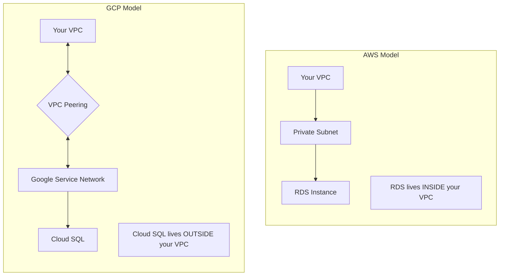
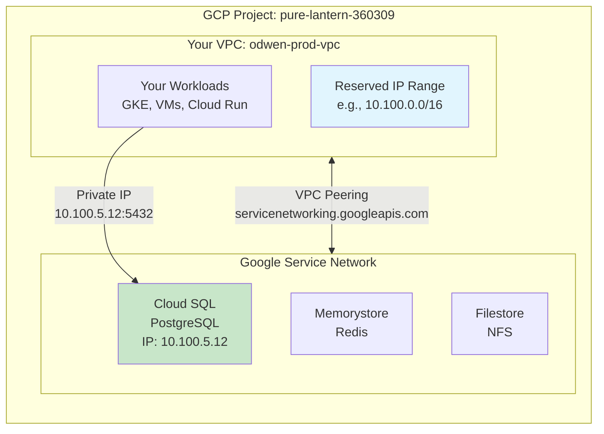
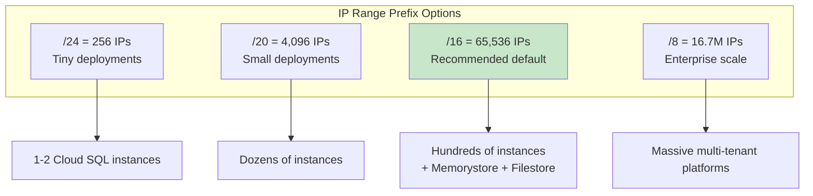
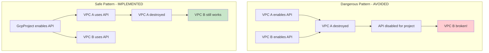
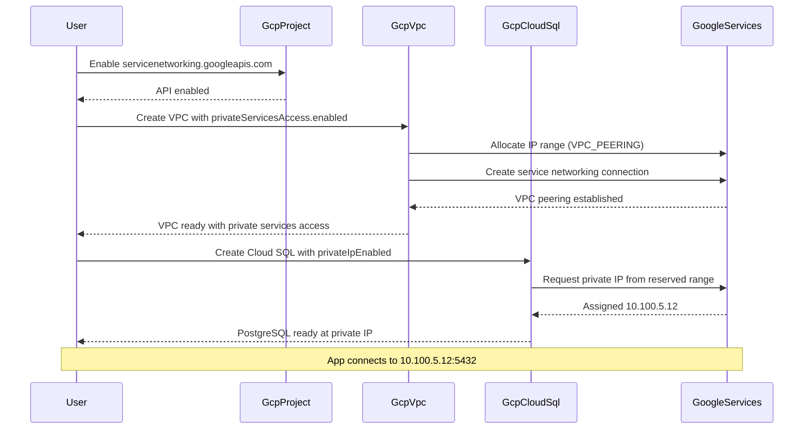

# GcpVpc: Private Services Access for Google Managed Services

**Date**: December 29, 2025
**Type**: Feature
**Components**: GCP Provider, GcpVpc, Pulumi Module, Terraform Module, API Definitions

## Summary

Added Private Services Access support to the GcpVpc component, enabling VPC peering with Google's service network. This allows Google managed services like Cloud SQL, Memorystore, and Filestore to use private IP addresses, providing secure connectivity without exposing databases to the public internet. The implementation spans proto schema, Pulumi module, Terraform module, and documentation.

## Problem Statement / Motivation

When deploying Cloud SQL with `privateIpEnabled: true`, deployments were failing with `SERVICE_NETWORKING_NOT_ENABLED` errors. Users coming from AWS expected a simple "put database in private subnet" model, but GCP's architecture for managed service networking is fundamentally different.

### Pain Points

- **Deployment failures**: Cloud SQL with private IP failed without clear guidance on prerequisites
- **Conceptual gap**: AWS-to-GCP migration users didn't understand the VPC peering model
- **Manual setup required**: Users had to manually configure Private Services Access via gcloud or console
- **No automation**: The GcpVpc module didn't support private service connectivity out of the box
- **Documentation gap**: The relationship between VPC configuration and managed service connectivity wasn't clear

### The AWS vs GCP Networking Difference

The root cause was a fundamental architectural difference between AWS and GCP that trips up many users:



**AWS**: RDS instances live inside your VPC subnets. You specify a subnet group, and the database gets a private IP from your subnet's CIDR range.

**GCP**: Cloud SQL (and other managed services) live in Google's service network, which is external to your VPC. To connect privately, you need VPC peering between your VPC and Google's service network.

## Solution / What's New

Added an optional `privateServicesAccess` configuration to `GcpVpcSpec` that, when enabled, automatically creates:

1. **IP Range Allocation**: A reserved IP range for Google managed services
2. **VPC Peering**: A connection between your VPC and `servicenetworking.googleapis.com`

### Architecture Overview



### Configuration Model

```yaml
apiVersion: gcp.project-planton.org/v1
kind: GcpVpc
metadata:
  name: prod-vpc
spec:
  networkName: prod-vpc
  projectId:
    value: my-project
  privateServicesAccess:
    enabled: true
    ipRangePrefixLength: 16  # /16 = 65,536 IPs (default)
```

### IP Range Prefix Length

The `ipRangePrefixLength` determines how many IPs are reserved for Google managed services:



Each managed service instance consumes IPs from this range:
- Cloud SQL (single): 1-2 IPs
- Cloud SQL (HA): 2-4 IPs
- Cloud SQL (read replicas): 1 IP per replica
- Memorystore Redis: 1-2 IPs
- Memorystore Memcached: Multiple (one per node)

## Implementation Details

### Proto Schema Changes

**File**: `apis/org/project_planton/provider/gcp/gcpvpc/v1/spec.proto`

Added new message type and field:

```protobuf
// Private Services Access configuration for Google managed services.
message GcpVpcPrivateServicesAccess {
  // Enable Private Services Access (VPC peering with Google's service network).
  bool enabled = 1;

  // IP range prefix length for private services allocation.
  // Default: 16 (/16 = 65,536 IPs). Valid range: 8-24.
  int32 ip_range_prefix_length = 2 [
    (buf.validate.field).ignore = IGNORE_IF_ZERO_VALUE,
    (buf.validate.field).int32 = {
      gte: 8
      lte: 24
    },
    (org.project_planton.shared.options.default) = "16"
  ];
}

message GcpVpcSpec {
  // ... existing fields ...
  
  // Private Services Access configuration
  GcpVpcPrivateServicesAccess private_services_access = 5;
}
```

**File**: `apis/org/project_planton/provider/gcp/gcpvpc/v1/stack_outputs.proto`

Added new outputs:

```protobuf
message GcpVpcStackOutputs {
  string network_self_link = 1;
  string private_services_ip_range_name = 2;  // NEW
  string private_services_ip_range_cidr = 3;  // NEW
}
```

### Pulumi Module Changes

**File**: `apis/org/project_planton/provider/gcp/gcpvpc/v1/iac/pulumi/module/vpc.go`

Added `privateServicesAccess()` function that creates:

1. **Global Address**: IP range allocation with `purpose: VPC_PEERING`
2. **Service Networking Connection**: VPC peering with `servicenetworking.googleapis.com`

```go
func privateServicesAccess(ctx *pulumi.Context, locals *Locals, 
    gcpProvider *gcp.Provider, network *compute.Network) error {
    
    // 1. Allocate IP range for private services
    privateIpAlloc, err := compute.NewGlobalAddress(ctx, "private-services-range",
        &compute.GlobalAddressArgs{
            Name:         pulumi.Sprintf("%s-private-svc", spec.NetworkName),
            Purpose:      pulumi.String("VPC_PEERING"),
            AddressType:  pulumi.String("INTERNAL"),
            PrefixLength: pulumi.Int(prefixLength),
            Network:      network.ID(),
        }, pulumi.Provider(gcpProvider))

    // 2. Create VPC peering with Google's service network
    _, err = servicenetworking.NewConnection(ctx, "private-services-connection",
        &servicenetworking.ConnectionArgs{
            Network:               network.ID(),
            Service:               pulumi.String("servicenetworking.googleapis.com"),
            ReservedPeeringRanges: pulumi.StringArray{privateIpAlloc.Name},
        }, pulumi.Provider(gcpProvider))

    return nil
}
```

### Terraform Module Changes

**File**: `apis/org/project_planton/provider/gcp/gcpvpc/v1/iac/tf/main.tf`

Added equivalent Terraform resources:

```hcl
# Allocate IP range for private services
resource "google_compute_global_address" "private_services_range" {
  count         = local.enable_private_services ? 1 : 0
  name          = "${var.spec.network_name}-private-svc"
  purpose       = "VPC_PEERING"
  address_type  = "INTERNAL"
  prefix_length = local.private_services_prefix_length
  network       = google_compute_network.vpc.id
}

# Create VPC peering with Google's service network
resource "google_service_networking_connection" "private_services" {
  count                   = local.enable_private_services ? 1 : 0
  network                 = google_compute_network.vpc.id
  service                 = "servicenetworking.googleapis.com"
  reserved_peering_ranges = [google_compute_global_address.private_services_range[0].name]
}
```

### Key Design Decision: No API Enablement at VPC Level

We explicitly chose **not** to enable `servicenetworking.googleapis.com` at the VPC level. This is a critical safety decision:



**Reason**: In Terraform/Pulumi, when you enable an API via `google_project_service`, destroying that resource can disable the API. If multiple VPCs share the same project, destroying one VPC could break all others.

**Solution**: The VPC module assumes `servicenetworking.googleapis.com` is already enabled at the GcpProject level.

## Benefits

### For Developers
- **One-click private networking**: Enable `privateServicesAccess.enabled: true` and it just works
- **Sensible defaults**: `/16` prefix provides 65K IPs without requiring thought
- **Clear documentation**: Example 6 in `examples.md` shows the complete pattern

### For Operations
- **Consistent deployments**: Same configuration works across Pulumi and Terraform
- **Auditable outputs**: Stack outputs include IP range name and CIDR for reference
- **Safe design**: No risk of accidentally disabling APIs across VPCs

### For Security
- **Private by design**: Managed services never need public IP exposure
- **Network isolation**: All traffic stays within Google's network backbone
- **Reduced attack surface**: No public endpoints for databases

## Required IAM Roles

Deploying Private Services Access requires these roles on the service account:

| Role | Purpose |
|------|---------|
| `roles/compute.networkAdmin` | Create global addresses, use networks, set labels |
| `roles/servicenetworking.networksAdmin` | Create VPC peering with Google's service network |

## Usage Flow



## Impact

### Who's Affected
- **GcpVpc users**: New optional feature, no breaking changes
- **GcpCloudSql users**: Can now use `privateIpEnabled: true` without manual VPC peering setup
- **AWS migration users**: Clearer path to private database connectivity on GCP

### Files Changed

| File | Change Type |
|------|-------------|
| `apis/.../gcpvpc/v1/spec.proto` | Added `GcpVpcPrivateServicesAccess` message |
| `apis/.../gcpvpc/v1/stack_outputs.proto` | Added output fields |
| `apis/.../gcpvpc/v1/iac/pulumi/module/vpc.go` | Added `privateServicesAccess()` |
| `apis/.../gcpvpc/v1/iac/pulumi/module/outputs.go` | Added output constants |
| `apis/.../gcpvpc/v1/iac/tf/main.tf` | Added Private Services Access resources |
| `apis/.../gcpvpc/v1/iac/tf/locals.tf` | Added local variables |
| `apis/.../gcpvpc/v1/iac/tf/outputs.tf` | Added new outputs |
| `apis/.../gcpvpc/v1/examples.md` | Added Example 6 |

## Related Work

- **GcpCloudSql**: Uses VPC with Private Services Access for `privateIpEnabled: true`
- **GcpProject**: Should enable `servicenetworking.googleapis.com` as prerequisite
- **Future**: Consider adding automatic prerequisite validation

## Example: Complete Private Database Setup

### Step 1: GcpProject (Enable API)
```yaml
apiVersion: gcp.project-planton.org/v1
kind: GcpProject
spec:
  enabledApis:
    - compute.googleapis.com
    - servicenetworking.googleapis.com
```

### Step 2: GcpVpc (Enable Private Services Access)
```yaml
apiVersion: gcp.project-planton.org/v1
kind: GcpVpc
metadata:
  name: prod-vpc
spec:
  networkName: prod-vpc
  projectId:
    value: my-project
  privateServicesAccess:
    enabled: true
    ipRangePrefixLength: 16
```

### Step 3: GcpCloudSql (Use Private IP)
```yaml
apiVersion: gcp.project-planton.org/v1
kind: GcpCloudSql
spec:
  databaseEngine: POSTGRESQL
  databaseVersion: POSTGRES_15
  network:
    privateIpEnabled: true
    vpcId:
      ref:
        kind: GcpVpc
        name: prod-vpc
```

---

**Status**: ✅ Production Ready
**Timeline**: ~3 hours (research, implementation, testing, documentation)

