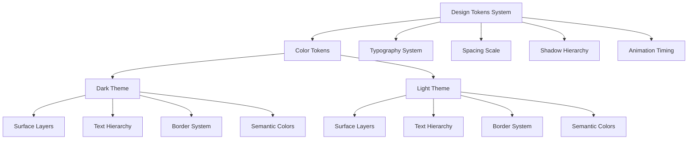
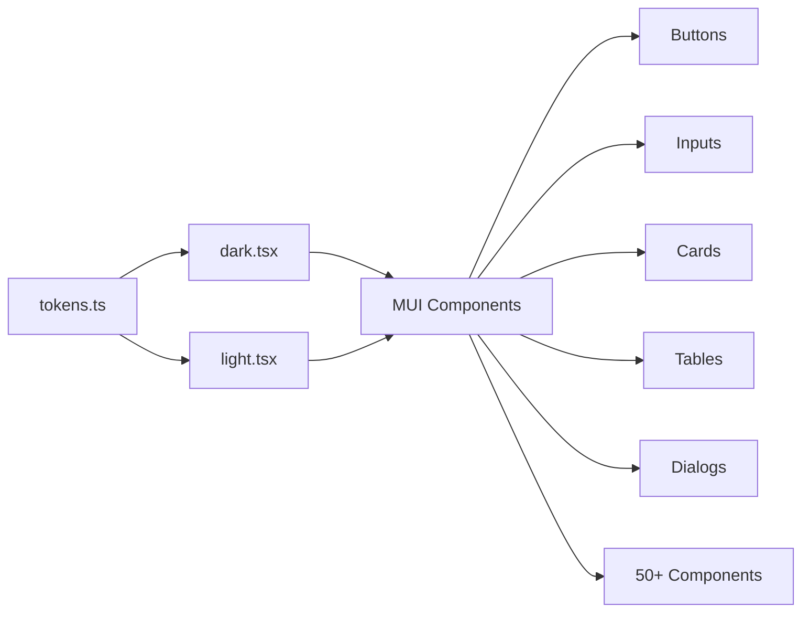
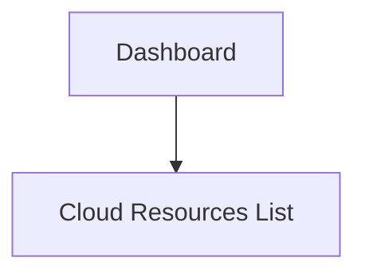
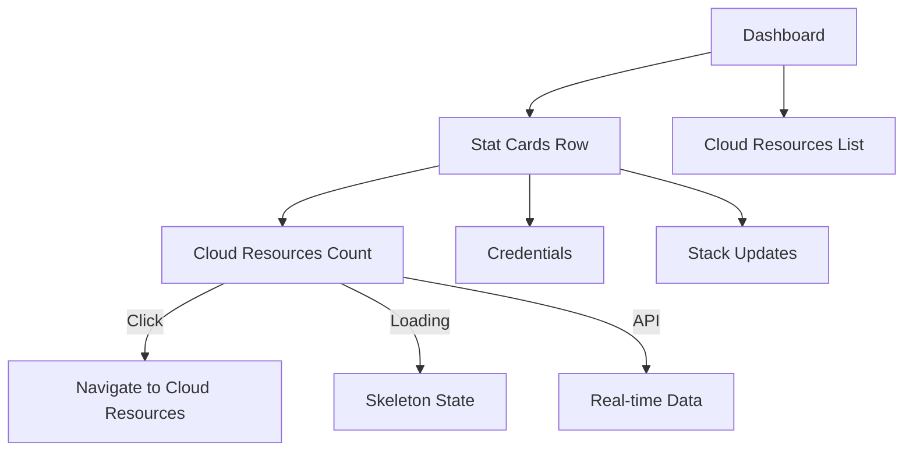

# Frontend Design System & Dashboard Enhancement

**Date**: January 12, 2026
**Type**: Enhancement
**Components**: Frontend UI, Design System, Dashboard, Theme System

## Summary

Implemented a comprehensive design system inspired by Linear, Vercel, and Stripe, along with new shared UI components and an enhanced dashboard experience. This update establishes a modern, semantic design token system, introduces reusable components for loading states and empty states, and significantly improves the visual polish and user experience across the application.

## Problem Statement / Motivation

The frontend lacked a cohesive design language and reusable component patterns. Key pain points included:

### Pain Points

- **Inconsistent styling**: Theme values were hardcoded throughout components without a unified token system
- **No loading patterns**: Missing skeleton loaders led to jarring content shifts during data fetching
- **Repetitive empty states**: No standardized way to handle empty data scenarios
- **Theme inconsistencies**: Dark and light themes used arbitrary color values without semantic meaning
- **Dashboard limitations**: Basic dashboard with minimal visual engagement and no statistical overview
- **Component duplication**: Styling patterns repeated across files without shared design primitives

## Solution / What's New

Introduced a modern design system with semantic tokens, new shared components, and an enhanced dashboard that creates a polished, production-ready user experience.

### Design Token System

Created a comprehensive token system organized by semantic purpose rather than arbitrary scales:



### New Shared Components

#### 1. EmptyState Component
A flexible, reusable component for displaying empty data scenarios:

```typescript
<EmptyState
  icon={<CloudIcon />}
  title="No cloud resources yet"
  description="Create your first cloud resource to get started"
  actionLabel="Create Resource"
  onAction={handleCreate}
  secondaryActionLabel="Learn More"
  onSecondaryAction={handleLearnMore}
/>
```

**Features**:
- Customizable icon, title, and description
- Primary and secondary action buttons
- Consistent styling with design tokens
- Dashed border and subtle background for visual separation

#### 2. ShimmerSkeleton Component
Modern loading skeletons with animated shimmer effect:

```typescript
<ShimmerSkeleton width={200} height={24} borderRadius={8} />
```

**Pre-built variants**:
- `TextSkeleton` - For text content
- `CircleSkeleton` - For avatars and icons
- `CardSkeleton` - For card containers
- `TableRowSkeleton` - For table rows
- `StatCardSkeleton` - For dashboard stat cards

**Animation**: Smooth 1.5s shimmer effect using CSS keyframes

#### 3. StatCard Component
Premium dashboard card component with hover effects and optional click actions:

```typescript
<StatCard
  title="Cloud Resources"
  value={resourceCount}
  icon={<CloudIcon />}
  loading={isLoading}
  accent={true}
  href="/cloud-resources"
  trend={{ value: "+12%", positive: true }}
  subtitle="Last 7 days"
/>
```

**Features**:
- Loading states with skeleton integration
- Accent styling for primary metrics
- Click/link support for navigation
- Trend badges with positive/negative indicators
- Hover animations with lift effect and arrow reveal
- Icon containers with themed backgrounds
- Gradient overlays for depth

## Implementation Details

### Design Token Architecture

**File**: `app/frontend/src/themes/tokens.ts`

Organized tokens into logical categories:

**Color System** (Dark/Light Variants):
- **Surface hierarchy**: 5 levels (base, raised, elevated, overlay, subtle)
- **Text hierarchy**: 5 levels (primary, secondary, muted, disabled, inverse)
- **Border system**: 4 levels (default, strong, focus, subtle)
- **Accent colors**: Brand blue with hover/pressed/subtle variants
- **Semantic colors**: Success, warning, error, info with subtle/muted backgrounds

**Typography System**:
- Font families: Inter (sans-serif), JetBrains Mono (monospace)
- Size scale: 11 sizes from 12px to 40px
- Weight scale: normal (400), medium (500), semibold (600), bold (700)
- Line height: 6 options from tight (1.2) to loose (2)
- Letter spacing: 5 options from tighter (-0.02em) to wider (0.02em)

**Spacing System**:
- 26 values from 1px to 128px following a logical progression
- Aligned with Material-UI's spacing function

**Shadows System**:
- Light theme: 6 levels (xs to 2xl)
- Dark theme: 6 levels with darker opacity
- Glow effects for accent/success/error states
- Focus rings for accessibility

**Transitions**:
- Duration: fast (100ms), normal (150ms), slow (200ms), slower (300ms)
- Easing: default, in, out, inOut, spring
- Pre-composed transitions for common use cases

### Theme Integration

**Files**: `app/frontend/src/themes/dark.tsx`, `app/frontend/src/themes/light.tsx`

Migrated all Material-UI component styles to use design tokens:



**Key improvements**:
- Buttons: Gradient backgrounds, glow effects on hover, focus rings
- Cards: Smooth border transitions, hover lift effects
- Inputs: Consistent focus states with shadow rings
- Tabs: Pill-style design with smooth transitions
- Switches: Modern toggle design
- Drawers: Backdrop blur effects

### Dashboard Enhancement

**File**: `app/frontend/src/app/dashboard/page.tsx`

Transformed the dashboard from a basic page to an engaging overview:

**Before**:


**After**:


**Features**:
- Real-time cloud resource count with API integration
- Three stat cards: Cloud Resources (accent), Credentials, Stack Updates
- Loading skeletons during data fetch
- Clickable cards for navigation
- Responsive grid layout (3 columns desktop, 2 tablet, 1 mobile)
- Auto-refresh when resources change

### Component Updates

#### Layout Sidebar
Enhanced navigation with cleaner structure and hover states

#### Theme Switch
Refined styling using design tokens for consistency

#### Table Styling
Improved table components with token-based spacing and colors

#### Snackbar
Modernized notification styling with new semantic colors

### TypeScript Type Definitions

**File**: `app/frontend/theme.d.ts`

Extended Material-UI theme types to support custom palette colors:

```typescript
declare module '@mui/material/styles' {
  interface Palette {
    neutral: Palette['primary'];
    exceptions: Record<string, string>;
    crimson: Record<string, string>;
  }
}
```

## Benefits

### For End Users
- **Faster perceived performance**: Skeleton loaders reduce layout shift and provide immediate feedback
- **Clearer navigation**: Dashboard stat cards provide at-a-glance overview and quick access
- **Better visual hierarchy**: Semantic color system guides attention to important elements
- **Smoother interactions**: Consistent animations and transitions feel polished
- **Accessibility**: Focus rings and sufficient color contrast

### For Developers
- **Faster development**: Reusable components (EmptyState, StatCard, Skeleton) reduce implementation time
- **Consistency**: Design tokens ensure uniform styling across all pages
- **Maintainability**: Centralized token system makes global design changes trivial
- **Type safety**: TypeScript definitions for theme prevent errors
- **Scalability**: Token system scales to new components without additional complexity

### Metrics
- **Files changed**: 15 files
- **Lines added**: 2,367 additions, 769 deletions
- **New components**: 3 shared components (EmptyState, ShimmerSkeleton, StatCard)
- **Design tokens**: 412 lines of semantic design tokens
- **Theme updates**: 877 lines of dark theme, 862 lines of light theme

## Usage Examples

### Using Design Tokens in Custom Components

```typescript
import { alpha } from '@mui/material';
import { darkColors, typography, borderRadius, transitions } from '@/themes/tokens';

const CustomCard = styled(Box)(({ theme }) => ({
  backgroundColor: theme.palette.mode === 'dark'
    ? darkColors.background.raised
    : lightColors.background.raised,
  border: `1px solid ${theme.palette.mode === 'dark'
    ? darkColors.border.default
    : lightColors.border.default}`,
  borderRadius: borderRadius.xl,
  padding: spacing[6],
  transition: transitions.all.normal,

  '&:hover': {
    borderColor: theme.palette.mode === 'dark'
      ? darkColors.border.strong
      : lightColors.border.strong,
    transform: 'translateY(-2px)',
  },
}));
```

### Creating Empty States

```typescript
import { EmptyState } from '@/components/shared/empty-state';
import { CloudOff } from '@mui/icons-material';

function CloudResourcesPage() {
  const hasResources = resources.length > 0;

  if (!hasResources) {
    return (
      <EmptyState
        icon={<CloudOff />}
        title="No cloud resources found"
        description="Get started by deploying your first cloud resource"
        actionLabel="Deploy Resource"
        onAction={() => router.push('/deploy')}
      />
    );
  }

  // ... render resources
}
```

### Implementing Loading States

```typescript
import { ShimmerSkeleton, StatCardSkeleton } from '@/components/shared/skeleton';

function Dashboard() {
  const [loading, setLoading] = useState(true);

  return (
    <Grid container spacing={2.5}>
      {loading ? (
        <>
          <Grid item xs={12} md={4}>
            <StatCardSkeleton />
          </Grid>
          <Grid item xs={12} md={4}>
            <StatCardSkeleton />
          </Grid>
          <Grid item xs={12} md={4}>
            <StatCardSkeleton />
          </Grid>
        </>
      ) : (
        // ... render actual stat cards
      )}
    </Grid>
  );
}
```

## Before / After Comparison

### Dashboard
**Before**:
- Basic page with just a cloud resources list
- No overview metrics
- Jarring loading experience with blank page

**After**:
- Engaging stat cards with real-time data
- At-a-glance overview of key metrics
- Smooth loading with skeleton states
- Clickable cards for quick navigation
- Visual hierarchy with accent card

### Theme System
**Before**:
- Hardcoded color values scattered across files
- Inconsistent spacing and border radius values
- No semantic meaning to color choices

**After**:
- Centralized design token system
- Semantic color naming (background.raised, text.secondary)
- Consistent spacing scale across all components
- Easy theme switching with token support

### Component Patterns
**Before**:
- Manual implementation of loading states
- Inconsistent empty state designs
- Repeated styling patterns

**After**:
- Drop-in skeleton components
- Standardized EmptyState with actions
- Reusable StatCard for metrics
- Shared design language

## Design Decisions

### Why Design Tokens?
- **Semantic naming**: `background.raised` is clearer than `grey.100`
- **Theme independence**: Tokens abstract away mode-specific values
- **Scalability**: Add new tokens without touching components
- **Industry standard**: Follows patterns from Linear, Vercel, Stripe

### Why Shimmer Skeletons?
- **Modern UX**: Shimmer effect is more engaging than static blocks
- **Performance**: CSS animations are hardware-accelerated
- **Customizable**: Width, height, borderRadius props for any use case

### Why StatCard Design?
- **Visual hierarchy**: Accent cards draw attention to primary metrics
- **Interactivity**: Hover effects and click actions encourage exploration
- **Loading integration**: Built-in loading prop with skeleton
- **Flexibility**: Optional trend badges and subtitles

## Impact

### User Experience
- **Perception of speed**: Skeletons make loading feel faster
- **Visual polish**: Consistent design creates professional impression
- **Clarity**: Dashboard provides immediate value with key metrics
- **Navigation**: Clickable cards reduce friction

### Development Workflow
- **Faster feature development**: Reusable components reduce implementation time
- **Easier maintenance**: Centralized tokens simplify global design updates
- **Reduced bugs**: Consistent patterns prevent styling inconsistencies
- **Better collaboration**: Shared design language improves team communication

### Codebase Health
- **Reduced duplication**: Shared components replace repeated patterns
- **Better organization**: Tokens centralize design decisions
- **Type safety**: TypeScript definitions prevent theme errors
- **Scalability**: Token system grows with the application

## Related Work

This enhancement lays the foundation for:
- **Component library expansion**: More shared components using design tokens
- **Storybook integration**: Document components with token system
- **Advanced dashboard**: Charts, graphs, and real-time updates
- **Design system documentation**: Comprehensive guide for contributors

## Testing Strategy

**Manual Testing**:
- ✅ Verify stat cards load and display data correctly
- ✅ Confirm skeleton animations render smoothly
- ✅ Test empty state component with various configurations
- ✅ Validate dark/light theme switching
- ✅ Check responsive behavior on mobile, tablet, desktop
- ✅ Verify hover effects and click actions
- ✅ Test loading states and error scenarios

**Browser Testing**:
- ✅ Chrome, Firefox, Safari, Edge
- ✅ Mobile browsers (iOS Safari, Chrome Android)

**Accessibility**:
- ✅ Focus rings on interactive elements
- ✅ Keyboard navigation support
- ✅ Color contrast ratios meet WCAG standards
- ✅ Screen reader compatibility

## Known Limitations

- **Credentials and Stack Updates cards**: Display placeholder "—" values until backend integration
- **Trend indicators**: StatCard trend feature not yet used in dashboard (ready for future metrics)
- **Theme tokens**: Some legacy color imports remain for backward compatibility

## Future Enhancements

- **Real-time metrics**: WebSocket integration for live dashboard updates
- **Charts and graphs**: Visualize resource usage over time
- **More stat cards**: Add credentials count, stack update history
- **Customizable dashboard**: User-configurable card layout
- **Component library**: Expand shared components (DatePicker, Modal, etc.)
- **Animation library**: Standardized motion system for page transitions
- **Design system docs**: Interactive documentation with examples

---

**Status**: ✅ Production Ready
**Timeline**: Implemented in single session (January 12, 2026)
**Code Review**: Ready for review
