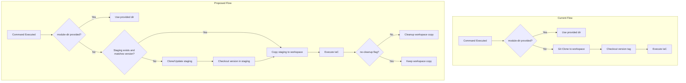

# Staging-Based Module Cache for ProjectPlanton

**Date**: January 1, 2026
**Type**: Feature
**Components**: CLI Commands, IAC Stack Runner, Pulumi CLI Integration, Staging Management

## Summary

Implemented a Homebrew-style staging mechanism where the ProjectPlanton repository is cloned once to a local staging area (`~/.project-planton/staging`) and copied to stack workspaces on demand, replacing the previous per-execution git clone approach. Added new `pull` and `checkout` commands for managing the staging area, along with a `--no-cleanup` flag to preserve workspace copies when needed.

## Problem Statement

Every time users executed `project-planton apply/preview/refresh/destroy` without providing `--module-dir`, the CLI would clone the entire ProjectPlanton monorepo. As the repository grew larger, this became increasingly problematic.

### Pain Points

- **Network bandwidth waste**: Full git clone on every command execution
- **Slow startup times**: Users waiting for repository download before IaC operations could begin
- **Disk space churn**: Multiple copies of the repository scattered across stack workspaces
- **No version management**: Difficult to switch between module versions without affecting the CLI binary
- **Poor offline experience**: Commands failed without network connectivity

## Solution

Implement a local staging mechanism with Homebrew-style semantics:



### Key Features

1. **One-time Clone**: Repository is cloned to `~/.project-planton/staging/project-planton` on first use
2. **Fast Local Copy**: Subsequent executions copy from staging (fast disk I/O vs network)
3. **Version Management**: New `pull` and `checkout` commands for staging control
4. **Automatic Cleanup**: Workspace copies are cleaned up after execution by default
5. **Optional Retention**: `--no-cleanup` flag preserves workspace copies for debugging

## Implementation Details

### New Staging Package

Created `internal/cli/staging/staging.go` with staging directory management:

```go
// Key functions in the staging package
func GetStagingDir() (string, error)           // Returns ~/.project-planton/staging
func GetStagingRepoPath() (string, error)      // Returns path to cloned repo
func EnsureStaging(version string) error       // Clones if needed, checks out version
func Pull() error                              // Fetches and pulls from upstream
func Checkout(version string) error            // Switches to specific version
func CopyToWorkspace(destDir string) (string, error)  // Copies staging to workspace
func CleanupWorkspaceCopy(path string) error   // Removes workspace copy
```

### New CLI Commands

**`project-planton pull`** - Updates staging from upstream:

```bash
$ project-planton pull
→ Pulling latest changes from upstream...
Fetching latest changes from upstream...

remote: Enumerating objects: 42, done.
...

✓ Successfully pulled latest changes

Staging area: /Users/user/.project-planton/staging/project-planton
Current version: v0.2.274
```

**`project-planton checkout <version>`** - Switches staging to specific version:

```bash
$ project-planton checkout v0.2.273
→ Checking out version: v0.2.273

Checking out version: v0.2.273

Switched to tag 'v0.2.273'

Successfully checked out: v0.2.273

Staging area: /Users/user/.project-planton/staging/project-planton
```

### Modified Module Path Resolution

Updated `pulumimodule.GetPath()` and `tofumodule.GetModulePath()` to return a result struct with cleanup function:

```go
type GetPathResult struct {
    ModulePath     string
    RepoPath       string
    CleanupFunc    func() error
    ShouldCleanup  bool
}

func GetPath(moduleDir string, stackFqdn, kindName string, noCleanup bool) (*GetPathResult, error) {
    // If user provided valid module directory, use it directly
    if isPulumiModuleDir {
        return &GetPathResult{
            ModulePath:    moduleDir,
            CleanupFunc:   func() error { return nil },
            ShouldCleanup: false,
        }, nil
    }

    // Ensure staging is ready with correct version
    if err := staging.EnsureStaging(targetVersion); err != nil {
        return nil, err
    }

    // Copy from staging to workspace
    repoPath, err := staging.CopyToWorkspace(stackWorkspaceDir)
    if err != nil {
        return nil, err
    }

    return &GetPathResult{
        ModulePath:    modulePath,
        RepoPath:      repoPath,
        CleanupFunc:   func() error { return staging.CleanupWorkspaceCopy(repoPath) },
        ShouldCleanup: !noCleanup,
    }, nil
}
```

### New Flag

Added `--no-cleanup` flag to all IaC commands:

```bash
# Keep workspace copy after execution for debugging
project-planton apply -f manifest.yaml --no-cleanup
```

### Files Changed

| Category | Files |
|----------|-------|
| **New Files** | `internal/cli/staging/staging.go`, `cmd/project-planton/root/pull.go`, `cmd/project-planton/root/checkout.go` |
| **Flag Definition** | `internal/cli/flag/flag.go` |
| **Module Resolution** | `pkg/iac/pulumi/pulumimodule/module_directory.go`, `pkg/iac/tofu/tofumodule/module_directory.go` |
| **Pulumi Stack Operations** | `pkg/iac/pulumi/pulumistack/run.go`, `init.go`, `cancel.go`, `remove.go` |
| **Tofu Operations** | `pkg/iac/tofu/tofumodule/run_command.go` |
| **Unified Commands** | `cmd/project-planton/root/apply.go`, `destroy.go`, `plan.go`, `refresh.go`, `init.go` |
| **Pulumi Subcommands** | `cmd/project-planton/root/pulumi/update.go`, `preview.go`, `destroy.go`, `refresh.go`, `init.go`, `cancel.go`, `delete.go` |
| **Tofu Subcommands** | `cmd/project-planton/root/tofu/init.go` |
| **Command Registration** | `cmd/project-planton/root.go` |
| **Backend Service** | `app/backend/internal/service/stack_update_service.go` |

## Benefits

### Performance Improvements

- **First run**: One-time git clone to staging (same as before for single execution)
- **Subsequent runs**: Local `cp -a` instead of git clone (orders of magnitude faster)
- **Estimated time savings**: 30-60 seconds per command execution after first run

### User Experience

- **Faster iteration**: Apply/preview cycles are near-instant
- **Version control**: Easy switching between module versions
- **Offline capability**: Commands work if staging exists and is up-to-date
- **Debugging support**: `--no-cleanup` preserves workspace for investigation

### Resource Efficiency

- **Network**: Only pulls when explicitly requested or on first run
- **Disk**: Single staging copy + temporary workspace copies (auto-cleaned)
- **CPU**: Avoids git operations on each command

## Usage Examples

### Typical Workflow

```bash
# One-time setup or periodic update
project-planton pull

# Fast apply operations
project-planton apply -f postgres.yaml      # Uses staging, cleans up after
project-planton apply -f redis.yaml         # Same fast path
project-planton apply -f kafka.yaml         # And again
```

### Version Management

```bash
# Check out specific version for compatibility
project-planton checkout v0.2.270

# Run commands with that version's modules
project-planton apply -f manifest.yaml

# Switch back to latest
project-planton checkout main
project-planton pull
```

### Debugging

```bash
# Keep workspace for investigation
project-planton apply -f manifest.yaml --no-cleanup

# Workspace copy preserved at ~/.project-planton/pulumi/<stack>/project-planton
```

## Impact

### Users
- Faster CLI operations after first run
- New commands for version control
- Optional `--no-cleanup` for advanced debugging

### Developers
- New staging package for module management
- Updated function signatures (breaking for direct callers)
- Cleanup handled via deferred functions

### CI/CD
- First run in fresh environment still requires network
- Caching `~/.project-planton/staging` can speed up pipelines

## Related Work

This change builds on existing infrastructure:
- Uses `internal/cli/workspace` for base directory management
- Leverages `pkg/iac/gitrepo` for repository URL and naming
- Integrates with `internal/cli/version` for version-aware staging

---

**Status**: ✅ Production Ready
**Timeline**: Single session implementation

