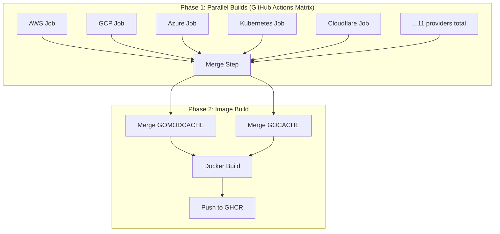

# IaC Runner Base Image with Matrix Build Strategy

**Date**: January 7, 2026
**Type**: Feature
**Components**: Base Images, GitHub Actions, Build System, IaC Runner

## Summary

Introduced a new IaC Runner base image system in project-planton that pre-warms Go caches for all Pulumi modules. The build uses a GitHub Actions matrix strategy to compile modules for each cloud provider in parallel, then merges the caches into a single Docker image. This dramatically reduces cold start times for Pulumi Go programs from 2-5 minutes to ~0.5 seconds for cached modules.

## Problem Statement / Motivation

The IaC Runner was experiencing slow cold starts when executing Pulumi Go programs. Each execution required downloading and compiling Pulumi provider SDKs (AWS, GCP, Azure, Kubernetes, etc.), which could take several minutes per module.

### Pain Points

- **Long cold starts**: First-time compilation of a Pulumi module took 2-5 minutes
- **High CPU usage**: Go compilation is CPU-intensive, impacting other workloads
- **Inconsistent performance**: Cache hits were unreliable due to workspace isolation
- **No pre-warming strategy**: Previous attempts with synthetic imports only partially warmed caches
- **Sequential Docker builds**: Building all modules in Docker took 30-60+ minutes

## Solution / What's New

A two-phase build strategy using GitHub Actions matrix parallelization:



### Key Features

1. **Matrix Strategy**: 11 cloud providers build in parallel
2. **Cache Merging**: GOMODCACHE and GOCACHE safely merge (content-addressable storage)
3. **Independent Versioning**: Triggered by `iac-runner-base-v*` tags
4. **Simplified Dockerfile**: `Dockerfile.merged` just copies pre-built caches

### Providers Included

| Provider | Modules |
|----------|---------|
| AWS | 22+ (EC2, EKS, Lambda, S3, etc.) |
| GCP | 17+ (GKE, Cloud Run, GCS, etc.) |
| Azure | 7+ (AKS, Key Vault, etc.) |
| Kubernetes | Helm, Manifests |
| Cloudflare | Workers, R2, DNS |
| DigitalOcean | Droplets, K8s |
| MongoDB Atlas | Clusters |
| Confluent | Kafka |
| Snowflake | Warehouses |
| Auth0 | Tenants |
| Civo | K8s clusters |

## Implementation Details

### New Files

```
base-images/
└── iac-runner/
    ├── Dockerfile           # Standalone build (clones repo, builds all)
    ├── Dockerfile.merged    # Used by GitHub Actions (copies pre-built caches)
    ├── Makefile             # Local build targets
    ├── README.md            # Documentation
    ├── simulate-matrix-build.sh  # Local testing script
    └── .gitignore           # Ignore local artifacts

.github/workflows/
└── iac-runner-base-image.yml  # Matrix build workflow
```

### GitHub Actions Workflow

```yaml
# Triggers on iac-runner-base-v* tags
on:
  push:
    tags:
      - 'iac-runner-base-v*'

jobs:
  # Phase 1: Build each provider in parallel
  build-provider-cache:
    strategy:
      matrix:
        provider: [aws, gcp, azure, kubernetes, cloudflare, ...]
    steps:
      - name: Build ${{ matrix.provider }} modules
        run: |
          find apis -path "*/provider/${{ matrix.provider }}/*/iac/pulumi" | \
            while read dir; do go build "$dir"; done
      - uses: actions/upload-artifact@v4

  # Phase 2: Merge and build Docker image
  build-and-push-image:
    needs: build-provider-cache
    steps:
      - uses: actions/download-artifact@v4
      - run: cp -rn artifacts/go-mod-*/* merged-cache/go-mod/
      - run: cp -rn artifacts/go-build-*/* merged-cache/go-build/
      - uses: docker/build-push-action@v5
```

### Cache Merging Strategy

Go caches are safely mergeable because:

1. **GOMODCACHE**: Uses module paths as directories (`github.com/pulumi/pulumi-aws/...`)
2. **GOCACHE**: Uses content-addressable storage (same hash = same content)

```bash
# Safe merge with -n (no-clobber)
cp -rn "$provider_cache/go-mod/"* "$MERGED_DIR/go-mod/"
cp -rn "$provider_cache/go-build/"* "$MERGED_DIR/go-build/"
```

### Performance Results (Local Simulation)

| Provider | Modules | Cache Size | Build Time |
|----------|---------|------------|------------|
| AWS | 22 | 2.2 GB | ~2 min |
| GCP | 17 | 2.3 GB | ~1.5 min |
| Azure | 7 | 1.5 GB | ~1 min |

**Rebuild times with cache**: ~0.5 seconds

## Benefits

### Build Time Improvements

| Approach | Sequential Time | Parallel Time |
|----------|-----------------|---------------|
| Docker-only build | 30-60 min | N/A |
| Matrix build | N/A | **~10 min** |

### Runtime Performance

| Scenario | Without Cache | With Pre-warmed Cache |
|----------|--------------|----------------------|
| First module build | 2-5 min | 15-40 sec |
| Rebuild (same module) | 2-5 min | **~0.5 sec** |

### Developer Experience

- **Predictable performance**: Every module has cached dependencies
- **Stateless pods**: No need for persistent volumes
- **Independent versioning**: Base image updates don't require full releases
- **Local testing**: `simulate-matrix-build.sh` for verification

## Impact

### Who Benefits

- **IaC Runner**: Faster Pulumi program execution
- **Users**: Reduced wait times for infrastructure deployments
- **CI/CD**: Lower resource consumption during builds
- **Operations**: Simpler architecture (stateless pods)

### Image Size Trade-off

The pre-warmed caches result in a larger image (~8-10GB), but this is acceptable because:

1. Images are pulled once per node and cached
2. Every Pulumi module has guaranteed cache hits
3. Eliminates need for persistent storage

## Related Work

- Previous IaC Runner optimization: `2026-01-06-164423-iac-runner-per-revision-module-caching.md`
- Race condition fix: `2026-01-06-191048-iac-runner-race-condition-marker-fix.md`
- Binary size reduction: `2026-01-03-103529-iac-runner-binary-size-cold-start.md`

## Usage

### Release a New Version

```bash
git tag iac-runner-base-v1.0.0
git push origin iac-runner-base-v1.0.0
```

### Use in Downstream Images

```dockerfile
FROM ghcr.io/plantonhq/project-planton/base-images/iac-runner:v1.0.0

COPY --from=builder /app /app
ENTRYPOINT ["/app"]
```

---

**Status**: ✅ Production Ready
**Timeline**: 1 day (design, implementation, local testing)

