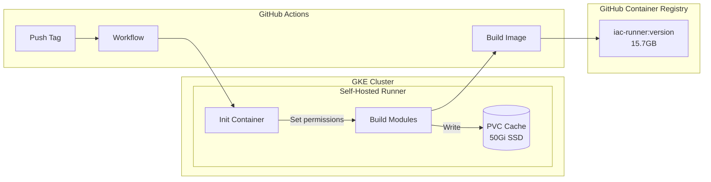

# IaC Runner Base Image with Pre-warmed Go Caches

**Date**: January 7, 2026
**Type**: Feature
**Components**: Base Images, GitHub Actions, Self-Hosted Runners, Go Build Caching, Docker

## Summary

Built and published the first production-ready IaC Runner base image (`ghcr.io/plantonhq/project-planton/base-images/iac-runner:latest`) with pre-warmed Go caches for all Pulumi provider SDKs. This dramatically reduces cold start times for Go-based Pulumi programs by including pre-compiled dependencies in the Docker image. The solution uses self-hosted GitHub Actions runners on Kubernetes with persistent volume storage for incremental cache builds.

## Problem Statement

### Background

The IaC Runner service executes Pulumi and OpenTofu stack jobs. After optimizing the binary size from ~2GB to 91MB by switching from statically-linked Pulumi programs to git-cloned modules at runtime, we introduced a new problem: **cold start compilation times**.

### Pain Points

- **Slow first execution**: Each Pulumi module required downloading and compiling large cloud provider SDKs (AWS, GCP, Azure, Kubernetes, etc.) on first run
- **High CPU usage**: Go compilation is CPU-intensive, affecting cluster resources
- **Poor user experience**: Users waited minutes for infrastructure changes while dependencies compiled
- **Repeated work**: Every new IaC Runner pod started with empty caches, redoing the same compilation

### Scale of the Problem

- 11 cloud providers: AWS, GCP, Azure, Kubernetes, Cloudflare, DigitalOcean, MongoDB Atlas, Confluent, Snowflake, Auth0, Civo
- Hundreds of deployment components per provider
- Provider SDKs are large (AWS SDK alone is ~500MB+ of dependencies)

## Solution

### Architecture Overview



### Key Components

1. **Self-Hosted Runner on Kubernetes**: GitHub Actions Runner Controller (ARC) deploys ephemeral runner pods
2. **Persistent Volume Claim**: 50Gi SSD (`premium-rwo`) stores GOMODCACHE and GOCACHE across builds
3. **Docker-in-Docker**: Privileged sidecar enables `docker build` within the runner
4. **Init Container**: Sets correct permissions on PVC mount for the runner user (UID 1001)
5. **Sequential Provider Builds**: Each provider builds in its own step for visibility and reliability

### Workflow Design

```yaml
# Trigger on version tags
on:
  push:
    tags:
      - 'iac-runner-base-v*'

# Prevent PVC conflicts
concurrency:
  group: iac-runner-base-image
  cancel-in-progress: false
```

Providers are built sequentially in alphabetical order:
1. atlas
2. auth0
3. aws
4. azure
5. civo
6. cloudflare
7. confluent
8. digitalocean
9. gcp
10. kubernetes
11. snowflake

## Implementation Details

### Self-Hosted Runner Setup

Created comprehensive documentation and configuration in `planton/tools/ci/github-runners/`:

```
github-runners/
├── README.md                     # High-level overview
├── github-app.md                 # GitHub App authentication
├── _cleanup/
│   ├── cleanup.sh               # Complete teardown script
│   └── README.md
├── runner-controller/
│   ├── namespace.yaml           # gha-runner-controller
│   ├── values.yaml              # Controller Helm values
│   └── github-app.private-key.pem
└── runners/
    ├── namespace.yaml           # gha-runners
    └── iac-runner-base-image-builder/
        ├── values.yaml          # Runner with DinD + PVC
        └── pvc.yaml             # 50Gi premium-rwo
```

### Runner Configuration

```yaml
# Key values.yaml configuration
containerMode:
  type: dind  # Docker-in-Docker for image builds

template:
  spec:
    initContainers:
      - name: init-cache-permissions
        image: busybox:latest
        command: ["sh", "-c", "mkdir -p /home/runner/.cache/go/mod /home/runner/.cache/go/build && chown -R 1001:1001 /home/runner/.cache/go"]
        securityContext:
          runAsUser: 0
    containers:
      - name: runner
        env:
          - name: GOMODCACHE
            value: /home/runner/.cache/go/mod
          - name: GOCACHE
            value: /home/runner/.cache/go/build
        volumeMounts:
          - name: go-cache
            mountPath: /home/runner/.cache/go
        resources:
          limits:
            cpu: "6"
            memory: 24Gi
```

### Dockerfile (Simplified)

```dockerfile
FROM debian:bullseye

# Install Go 1.25, Pulumi v3.202.0, OpenTofu 1.9.1
# ...

ENV GOMODCACHE=/var/cache/go-mod \
    GOCACHE=/var/cache/go-build

# Copy pre-built caches from GitHub Actions
COPY merged-cache/go-mod ${GOMODCACHE}
COPY merged-cache/go-build ${GOCACHE}
```

### Challenges Solved

| Problem | Solution |
|---------|----------|
| PVC permission denied | Init container runs as root, sets ownership to UID 1001 |
| PVC multi-attach errors | Workflow concurrency with `cancel-in-progress: false` |
| No Docker in runner | `containerMode.type: dind` adds privileged Docker sidecar |
| Cache path conflicts | Use `/home/runner/.cache/go/` (user-writable) |
| Slow sequential builds | Persistent PVC = incremental builds on subsequent runs |

## Benefits

### For IaC Runner Performance

| Metric | Before | After |
|--------|--------|-------|
| First module compilation | 5-15 minutes | Seconds (cache hit) |
| Provider SDK download | Every time | Pre-cached |
| Go compilation | CPU-intensive | Pre-compiled `.a` files |

### For Developer Experience

- **Faster infrastructure deployments**: No waiting for Go compilation
- **Predictable execution times**: Warm caches eliminate variability
- **Lower cluster CPU usage**: Pre-compiled artifacts reduce runtime load

### For Operations

- **Versioned base images**: Tagged releases (e.g., `v0.0.1-test.15`)
- **Incremental updates**: PVC persists caches across workflow runs
- **Self-healing**: If PVC is lost, full rebuild takes ~1-2 hours

## Image Specifications

```
ghcr.io/plantonhq/project-planton/base-images/iac-runner:latest

Size: 15.7GB
Components:
  - Debian Bullseye base
  - Go 1.25.0
  - Pulumi CLI v3.202.0
  - OpenTofu 1.9.1
  - Pre-warmed GOMODCACHE (~8GB)
  - Pre-warmed GOCACHE (~6GB)
```

### Pulling the Image

```bash
docker pull ghcr.io/plantonhq/project-planton/base-images/iac-runner:latest
```

### Using in IaC Runner

```dockerfile
FROM ghcr.io/plantonhq/project-planton/base-images/iac-runner:v0.0.1

# Your IaC Runner binary
COPY --from=builder /app /app
ENTRYPOINT ["/app"]
```

## Files Changed

### New Files (project-planton)

| File | Purpose |
|------|---------|
| `.github/workflows/iac-runner-base-image.yml` | Build workflow |
| `base-images/iac-runner/Dockerfile` | Image definition |
| `base-images/iac-runner/Makefile` | Local commands |
| `base-images/iac-runner/README.md` | Documentation |
| `base-images/iac-runner/.gitignore` | Ignore merged-cache/ |

### New Files (planton)

| File | Purpose |
|------|---------|
| `tools/ci/github-runners/README.md` | High-level overview |
| `tools/ci/github-runners/github-app.md` | GitHub App setup |
| `tools/ci/github-runners/_cleanup/cleanup.sh` | Teardown script |
| `tools/ci/github-runners/runner-controller/namespace.yaml` | Controller namespace |
| `tools/ci/github-runners/runner-controller/values.yaml` | Controller config |
| `tools/ci/github-runners/runners/namespace.yaml` | Runners namespace |
| `tools/ci/github-runners/runners/iac-runner-base-image-builder/values.yaml` | Runner config |
| `tools/ci/github-runners/runners/iac-runner-base-image-builder/pvc.yaml` | Go cache PVC |

## Usage

### Triggering a New Build

```bash
cd project-planton
git tag iac-runner-base-v1.0.0
git push origin iac-runner-base-v1.0.0
```

### Monitoring the Build

```bash
# Watch runner pods
kubectl -n gha-runners get pods -w

# Check listener logs
kubectl -n gha-runner-controller logs -l app.kubernetes.io/component=runner-scale-set-listener -f

# View cache sizes
kubectl -n gha-runners exec -it <runner-pod> -- du -sh /home/runner/.cache/go/mod /home/runner/.cache/go/build
```

### Complete Cleanup

```bash
cd planton/tools/ci/github-runners/_cleanup
./cleanup.sh
```

## Related Work

- **IaC Runner Binary Size Optimization**: Reduced from 2GB to 91MB by removing statically-linked programs
- **Git-Based Module Execution**: Modules cloned from Git at runtime
- **Per-Revision Module Caching**: Attempted caching per Git revision (superseded by this approach)

## Future Enhancements

- **ARM64 Support**: Multi-arch builds for ARM-based runners
- **Provider-Specific Images**: Smaller images with only required providers
- **Automated Version Bumps**: Update base image when provider SDKs are upgraded
- **BuildKit Migration**: Replace DinD with BuildKit for better security

---

**Status**: ✅ Production Ready
**Timeline**: ~6 hours of iterative development and testing
**Image Published**: `ghcr.io/plantonhq/project-planton/base-images/iac-runner:v0.0.1-test.15`

