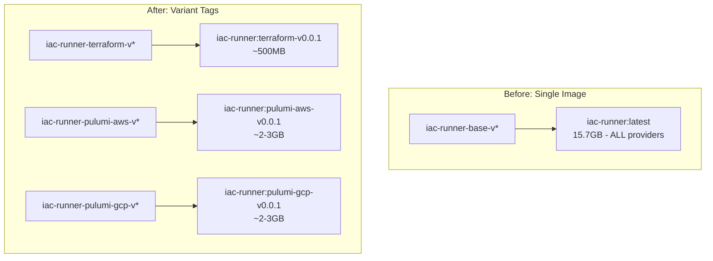

# Split IaC Runner into Terraform and Per-Provider Pulumi Variants

**Date**: January 7, 2026
**Type**: Refactoring
**Components**: Base Images, GitHub Actions, Docker, Build System

## Summary

Restructured the IaC Runner base image from a single 15.7GB monolithic image into separate variants: a lightweight ~500MB Terraform image and per-provider Pulumi images (1-3GB each). This dramatically reduces image pull times and disk usage by only including the dependencies needed for each specific use case.

## Problem Statement

### Background

The original `iac-runner` base image included pre-warmed Go caches for all 11 cloud providers (AWS, GCP, Azure, Kubernetes, etc.). While this eliminated cold start compilation times, it created a massive 15.7GB image.

### Pain Points

- **Slow image pulls**: 15.7GB takes minutes to pull, even on fast connections
- **Wasted resources**: Most deployments only use 1-2 providers
- **Large disk footprint**: Each runner pod consumed 15.7GB+ of disk space
- **Inefficient caching**: Provider SDKs for unused clouds were downloaded and stored

## Solution

Split the monolithic image into variant tags under the same repository:

```
ghcr.io/plantonhq/project-planton/base-images/iac-runner
├── :terraform-v0.0.1          # OpenTofu only (~500MB)
├── :pulumi-aws-v0.0.1         # Go + Pulumi + AWS SDK cache
├── :pulumi-gcp-v0.0.1         # Go + Pulumi + GCP SDK cache
├── :pulumi-kubernetes-v0.0.1  # Go + Pulumi + K8s SDK cache
└── ... (8 more providers)
```

### Architecture



## Implementation Details

### Directory Restructure

Reorganized `base-images/iac-runner/` into subdirectories:

```
base-images/iac-runner/
├── terraform/
│   └── Dockerfile     # OpenTofu only, no Go
├── pulumi/
│   └── Dockerfile     # Go + Pulumi + cache COPY
├── Makefile           # Updated cleanup targets
└── README.md          # Comprehensive documentation
```

### Terraform Dockerfile

Lightweight image with only OpenTofu:

```dockerfile
FROM debian:bullseye
ARG OPENTOFU_VERSION=1.9.1
# Base packages + OpenTofu only
# No Go, no Pulumi, no caches
```

### Pulumi Dockerfile

Go + Pulumi with provider-specific cache injection:

```dockerfile
FROM debian:bullseye
ARG PULUMI_VERSION=v3.202.0
ARG GOLANG_VERSION=1.25.0
# Go, Pulumi, plus pre-warmed caches
COPY merged-cache/go-mod ${GOMODCACHE}
COPY merged-cache/go-build ${GOCACHE}
```

### Separate Workflows

**Terraform workflow** (`.github/workflows/iac-runner-terraform.yml`):
- Triggered by: `iac-runner-terraform-v*` tags
- Runs on: `ubuntu-latest` (no self-hosted runner needed)
- Simple build, no cache warming required

**Pulumi workflow** (`.github/workflows/iac-runner-pulumi.yml`):
- Triggered by: `iac-runner-pulumi-{provider}-v*` tags
- Runs on: `project-planton-iac-runner-base-image-builder` (self-hosted with PVC)
- Parses provider name from tag
- Builds only that provider's modules to warm the cache

### Tag Parsing Logic

The Pulumi workflow extracts provider and version from the tag:

```bash
# Tag: iac-runner-pulumi-aws-v0.0.1
PROVIDER="${TAG%-v*}"    # aws
VERSION="v${TAG##*-v}"   # v0.0.1
```

### Provider Validation

Workflow validates the provider is in the supported list:

```yaml
VALID_PROVIDERS="atlas auth0 aws azure civo cloudflare confluent digitalocean gcp kubernetes snowflake"
```

## Files Changed

### Deleted
| File | Reason |
|------|--------|
| `.github/workflows/iac-runner-base-image.yml` | Replaced by separate terraform and pulumi workflows |
| `base-images/iac-runner/Dockerfile` | Split into terraform/ and pulumi/ subdirectories |

### Created
| File | Purpose |
|------|---------|
| `.github/workflows/iac-runner-terraform.yml` | Terraform variant build workflow |
| `.github/workflows/iac-runner-pulumi.yml` | Per-provider Pulumi variant build workflow |
| `base-images/iac-runner/terraform/Dockerfile` | OpenTofu-only image definition |
| `base-images/iac-runner/pulumi/Dockerfile` | Go + Pulumi + cache image definition |

### Updated
| File | Changes |
|------|---------|
| `base-images/iac-runner/README.md` | Comprehensive variant documentation |
| `base-images/iac-runner/Makefile` | Per-variant cleanup targets |

## Benefits

### Image Size Reduction

| Variant | Size | Reduction |
|---------|------|-----------|
| Terraform | ~500MB | 97% smaller |
| Per-provider Pulumi | 1-3GB | 80-95% smaller |

### Faster Operations

- **Image pulls**: Seconds instead of minutes
- **Pod startup**: Smaller images = faster container creation
- **Storage**: Significant disk savings per runner pod

### Better Resource Utilization

- Only download dependencies you actually need
- Reduced network bandwidth for image pulls
- Lower storage costs for container registries

## Usage

### Terraform Workloads

```dockerfile
FROM ghcr.io/plantonhq/project-planton/base-images/iac-runner:terraform-v0.0.1
```

### Pulumi Workloads

```dockerfile
# For AWS deployments
FROM ghcr.io/plantonhq/project-planton/base-images/iac-runner:pulumi-aws-v0.0.1

# For GCP deployments
FROM ghcr.io/plantonhq/project-planton/base-images/iac-runner:pulumi-gcp-v0.0.1

# For Kubernetes deployments
FROM ghcr.io/plantonhq/project-planton/base-images/iac-runner:pulumi-kubernetes-v0.0.1
```

### Building New Versions

```bash
# Terraform
git tag iac-runner-terraform-v0.0.1 && git push origin iac-runner-terraform-v0.0.1

# Pulumi (per-provider)
git tag iac-runner-pulumi-aws-v0.0.1 && git push origin iac-runner-pulumi-aws-v0.0.1
git tag iac-runner-pulumi-gcp-v0.0.1 && git push origin iac-runner-pulumi-gcp-v0.0.1
```

## Related Work

- **Previous**: IaC Runner Base Image with Pre-warmed Go Caches (2026-01-07-120202) - Created the original combined image
- **Infrastructure**: Self-hosted GitHub Actions runners with PVC storage (`planton/tools/ci/github-runners/`)

---

**Status**: ✅ Production Ready
**Timeline**: ~30 minutes

