# Pulumi Runner Pre-Built Binaries Workflow

**Date**: January 7, 2026
**Type**: Feature
**Components**: GitHub Actions, Build System, Base Images, Docker

## Summary

Introduced a new GitHub Actions workflow that builds pre-compiled binaries for all 130 Pulumi deployment components in parallel, eliminating the need for Go compilation at runtime. This replaces the previous Go cache pre-warming approach with a more direct solution: ship binaries, not caches.

## Problem Statement

### Background

The previous IaC Runner base image strategy pre-warmed Go caches for each cloud provider, resulting in:
- 2-3GB images per provider (or 15.7GB for all providers combined)
- Dependency on self-hosted GitHub runners with PVC storage
- Complex cache management across workflow runs
- Still required Go compilation at runtime (just with warm caches)

### Pain Points

- **Large image sizes**: Even per-provider images were 2-3GB due to Go module and build caches
- **Infrastructure overhead**: Required self-hosted runners with persistent volume storage
- **Complexity**: Cache invalidation, PVC mount issues, and permission management
- **Not truly zero-compile**: Warm cache only reduces compilation time, doesn't eliminate it

## Solution

### Pre-Built Binary Approach

Instead of shipping Go caches, compile all 130 Pulumi deployment components to standalone binaries during the CI build. The binaries can be executed directly by the Pulumi Automation API without any Go compilation at runtime.

```mermaid
flowchart TB
    subgraph Before ["Before: Cache Pre-warming"]
        B1[Clone project-planton] --> B2[go build each module]
        B2 --> B3[Save Go caches to PVC]
        B3 --> B4[COPY caches to image]
        B4 --> B5["Image: 2-3GB per provider"]
    end
    
    subgraph After ["After: Pre-Built Binaries"]
        A1[Matrix: 130 parallel jobs] --> A2[go build per component]
        A2 --> A3[Upload binary artifacts]
        A3 --> A4[Download + combine]
        A4 --> A5[COPY binaries to image]
        A5 --> A6["Image: ~1-2GB all providers"]
    end
```



### Key Design Decisions

1. **One matrix entry per component**: 130 parallel jobs on native GitHub runners (well under 256 limit)
2. **Static binaries**: `CGO_ENABLED=0` for maximum portability
3. **Stripped binaries**: `-ldflags="-s -w"` to reduce size
4. **Native runner caching**: Leverage GitHub's built-in Go caching, no self-hosted runners needed
5. **Single combined image**: All 130 binaries in one image for operational simplicity

## Implementation Details

### New Workflow: `.github/workflows/pulumi-runner.yml`

The workflow has two jobs:

**1. build-binary (130 parallel matrix jobs)**

Each job:
- Checks out the repo
- Sets up Go 1.25 with native caching
- Builds one binary for linux/amd64
- Uploads as artifact

```yaml
strategy:
  fail-fast: false
  matrix:
    include:
      - provider: aws
        component: awsekscluster
        path: apis/org/project_planton/provider/aws/awsekscluster/v1/iac/pulumi
      # ... 129 more entries
```

**2. build-image (single job)**

- Downloads all 130 binary artifacts
- Organizes into `binaries/{provider}/{component}` structure
- Builds Docker image with COPY
- Pushes to GHCR

### Updated Dockerfile: `base-images/iac-runner/pulumi/Dockerfile`

Changed from cache-based to binary-based approach:

```dockerfile
# Before: Copy Go caches
COPY merged-cache/go-mod ${GOMODCACHE}
COPY merged-cache/go-build ${GOCACHE}

# After: Copy pre-built binaries
COPY binaries/ ${PLANTON_BINARIES_DIR}/
```

The image still includes Go toolchain for organization (custom) modules that aren't part of project-planton.

### Component Coverage

| Provider | Components |
|----------|------------|
| Kubernetes | 45 |
| AWS | 22 |
| GCP | 17 |
| DigitalOcean | 14 |
| Civo | 11 |
| Cloudflare | 7 |
| Azure | 7 |
| Auth0 | 3 |
| Snowflake | 1 |
| Confluent | 1 |
| Atlas | 1 |
| **Total** | **130** |

## Benefits

### For Image Size

| Approach | Image Size | Notes |
|----------|------------|-------|
| All providers (cache) | 15.7GB | Original monolithic image |
| Per-provider (cache) | 2-3GB each | Previous iteration |
| All binaries | ~1-2GB | New approach |

### For Build Infrastructure

- **No self-hosted runners**: Uses native `ubuntu-latest` runners
- **No PVC management**: No persistent storage needed
- **Native Go caching**: GitHub's built-in caching handles dependencies
- **Parallel execution**: 130 jobs run concurrently (~10-15 min total)

### For Runtime Execution

- **Zero compilation**: Binaries execute directly
- **Instant cold start**: No Go toolchain initialization needed
- **Smaller attack surface**: Less tooling in production image

## Files Changed

### Created

| File | Purpose |
|------|---------|
| `.github/workflows/pulumi-runner.yml` | 130-component matrix build workflow |

### Modified

| File | Changes |
|------|---------|
| `base-images/iac-runner/pulumi/Dockerfile` | Changed from cache COPY to binary COPY |

## Usage

### Triggering a Build

The workflow triggers on version tags (aligned with releases):

```bash
git tag v0.0.100
git push origin v0.0.100
```

Or manually via workflow dispatch with a version input.

### Adding New Components

When adding a new deployment component:

1. Create component at `apis/org/project_planton/provider/{provider}/{component}/v1/iac/pulumi/`
2. Add entry to workflow matrix:
   ```yaml
   - provider: {provider}
     component: {component}
     path: apis/org/project_planton/provider/{provider}/{component}/v1/iac/pulumi
   ```
3. Next release will include the new binary

## Experimental Status

This is an experimental approach to validate:
- Build times with 130 parallel jobs
- GitHub Actions resource limits
- Artifact upload/download performance
- Final image size with all binaries

The IaC Runner has not yet been updated to consume these binaries. If validation succeeds, follow-up work will:
1. Update IaC Runner to detect and execute pre-built binaries
2. Fall back to Git-based execution for organization modules
3. Deprecate the per-provider cache workflows

## Related Work

- **Previous**: IaC Runner Base Image with Pre-warmed Go Caches (2026-01-07-120202)
- **Previous**: Split IaC Runner into Terraform and Pulumi Variants (2026-01-07-122407)
- **Follow-up**: IaC Runner binary execution mode (pending validation)

---

**Status**: Experimental - Pending Validation
**Timeline**: ~1 hour for workflow creation


