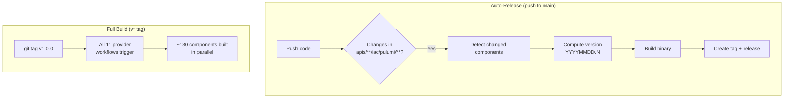

# Pulumi Module Auto-Release Workflow with Per-Provider Build System

**Date**: January 7, 2026
**Type**: Feature
**Components**: Build System, GitHub Actions, Pulumi CLI Integration, Provider Framework

## Summary

Implemented a comprehensive GitHub Actions workflow system for automatically building and releasing pre-compiled Pulumi module binaries. The system detects code changes in provider directories, computes date-based versions (`YYYYMMDD.N`), creates Git tags, and uploads binaries as GitHub Release artifacts. Additionally, created 11 per-provider workflows that build all components on semantic version tags (`v*`), replacing the monolithic runner approach.

## Problem Statement

### Background

The IaC Runner service executes Pulumi stack jobs for infrastructure deployments. Previous approaches all had significant trade-offs:

| Approach            | Image Size | Cold Start | Build Complexity |
| ------------------- | ---------- | ---------- | ---------------- |
| Monolithic binary   | 2GB        | Instant    | High             |
| Git clone + compile | 91MB       | 2-5 min    | Low              |
| Pre-warmed caches   | 15.7GB     | ~15 sec    | High             |

The 15.7GB pre-warmed cache image was impractical for self-hosted deployments. We needed a solution that provided fast cold starts with small distribution size.

### Pain Points

- **15.7GB image size** - Impractical for customer self-hosted deployments
- **Runtime compilation** - Even with warm caches, adds 15-30 seconds per job
- **Cold start variance** - Cache misses cause 2-5 minute delays
- **Complex cache management** - PVC storage, self-hosted runners, DinD required
- **All-or-nothing builds** - No way to release individual components

## Solution

### Per-Component Binary Releases

Each Pulumi deployment component is now built as an independent binary and published as a GitHub Release artifact:



### Version Format

Date-based versioning for easy identification:

```
pulumi-module-{component}-{YYYYMMDD}.{N}
```

**Examples**:

- `pulumi-module-awsecsservice-20260107.0` (first release today)
- `pulumi-module-awsecsservice-20260107.1` (second release today)
- `pulumi-module-gcpgkecluster-20260108.0` (next day release)

## Implementation Details

### Workflow Structure

Created 12 workflow files:

```
.github/workflows/
├── pulumi-module-auto-release.yml    # Auto-detect & release
├── pulumi-modules-atlas.yml          # 1 component
├── pulumi-modules-auth0.yml          # 3 components
├── pulumi-modules-aws.yml            # 22 components
├── pulumi-modules-azure.yml          # 7 components
├── pulumi-modules-civo.yml           # 11 components
├── pulumi-modules-cloudflare.yml     # 7 components
├── pulumi-modules-confluent.yml      # 1 component
├── pulumi-modules-digitalocean.yml   # 14 components
├── pulumi-modules-gcp.yml            # 17 components
├── pulumi-modules-kubernetes.yml     # 45 components
└── pulumi-modules-snowflake.yml      # 1 component
```

### Auto-Release Workflow

The `pulumi-module-auto-release.yml` workflow:

1. **Triggers on push to main** with changes in `apis/**/iac/pulumi/**`
2. **Detects changed components** by analyzing git diff
3. **Computes next version** using date + sequential number
4. **Builds binary** with `CGO_ENABLED=0 GOOS=linux GOARCH=amd64`
5. **Creates Git tag** (e.g., `pulumi-module-awsecsservice-20260107.0`)
6. **Creates GitHub Release** with binary as artifact

Key detection logic:

```yaml
# Extract provider/component pairs from changed files
# Pattern: apis/org/project_planton/provider/{provider}/{component}/v1/iac/pulumi
PULUMI_DIRS=$(echo "$CHANGED_FILES" | \
grep -E '^apis/org/project_planton/provider/[^/]+/[^/]+/v[0-9]+/iac/pulumi/' | \
sed 's|\(apis/org/project_planton/provider/[^/]*/[^/]*/v[0-9]*/iac/pulumi\)/.*|\1|' | \
sort -u)
```

Version computation:

```bash
# Find next version for today
TAG_PREFIX="pulumi-module-${COMPONENT}-${TODAY}"
LATEST_TAG=$(git tag -l "${TAG_PREFIX}.*" | sort -t. -k2 -n | tail -1)

if [ -z "$LATEST_TAG" ]; then
  NEXT_SEQ=0
else
  CURRENT_SEQ=$(echo "$LATEST_TAG" | sed "s/${TAG_PREFIX}\.//")
  NEXT_SEQ=$((CURRENT_SEQ + 1))
fi
```

### Per-Provider Workflows

Each provider workflow:

- Triggers on `v*` tags only
- Uses matrix strategy for parallel builds
- Builds all components for that provider
- Uploads artifacts for downstream consumption

Example matrix for AWS:

```yaml
matrix:
  include:
    - component: awsalb
      path: apis/org/project_planton/provider/aws/awsalb/v1/iac/pulumi
    - component: awsecsservice
      path: apis/org/project_planton/provider/aws/awsecsservice/v1/iac/pulumi
    # ... 20 more AWS components
```

### Binary Build Configuration

All binaries built with optimized settings:

```bash
CGO_ENABLED=0 GOOS=linux GOARCH=amd64 go build \
  -ldflags="-s -w" \
  -o binaries/${PROVIDER}/${COMPONENT} \
  ./${PATH}
```

- `CGO_ENABLED=0` - Static binary, no C dependencies
- `GOOS=linux GOARCH=amd64` - Single platform target
- `-ldflags="-s -w"` - Strip debug info for smaller size

## Benefits

### For IaC Runner

| Metric              | Pre-built Binaries | Pre-warmed Image    |
| ------------------- | ------------------ | ------------------- |
| Runner image size   | ~500 MB            | 15.7 GB             |
| Cold start          | 3-5 sec (download) | 15-30 sec (compile) |
| Binary download     | 10-25 MB           | N/A                 |
| Runtime compilation | None               | Cache-dependent     |

### For Development

- **Incremental releases** - Only changed components are rebuilt
- **Independent versioning** - Each component can evolve separately
- **Auditable history** - Git tags map 1:1 to releases
- **Self-hosted friendly** - Customers pull small images + binaries

### For Operations

- **Simplified runner image** - Just Pulumi CLI, no Go toolchain
- **Predictable execution** - No compilation variance
- **Easy rollback** - Pin to specific component versions
- **Reduced storage** - ~2GB total vs 15GB image

## Impact

### File Changes

| File                                                | Purpose                      |
| --------------------------------------------------- | ---------------------------- |
| `.github/workflows/pulumi-module-auto-release.yml`  | Auto-detect and release      |
| `.github/workflows/pulumi-modules-aws.yml`          | AWS provider builds          |
| `.github/workflows/pulumi-modules-gcp.yml`          | GCP provider builds          |
| `.github/workflows/pulumi-modules-azure.yml`        | Azure provider builds        |
| `.github/workflows/pulumi-modules-kubernetes.yml`   | Kubernetes provider builds   |
| `.github/workflows/pulumi-modules-cloudflare.yml`   | Cloudflare provider builds   |
| `.github/workflows/pulumi-modules-atlas.yml`        | Atlas provider builds        |
| `.github/workflows/pulumi-modules-auth0.yml`        | Auth0 provider builds        |
| `.github/workflows/pulumi-modules-civo.yml`         | Civo provider builds         |
| `.github/workflows/pulumi-modules-confluent.yml`    | Confluent provider builds    |
| `.github/workflows/pulumi-modules-digitalocean.yml` | DigitalOcean provider builds |
| `.github/workflows/pulumi-modules-snowflake.yml`    | Snowflake provider builds    |

### Component Coverage

| Provider     | Components | Binary Size |
| ------------ | ---------- | ----------- |
| AWS          | 22         | 9-14 MB     |
| GCP          | 17         | 9-12 MB     |
| Kubernetes   | 45         | 18-22 MB    |
| Azure        | 7          | 10-12 MB    |
| DigitalOcean | 14         | 10-12 MB    |
| Civo         | 11         | 10-12 MB    |
| Cloudflare   | 7          | 10-12 MB    |
| Auth0        | 3          | 11-12 MB    |
| Atlas        | 1          | 11-12 MB    |
| Confluent    | 1          | 11-12 MB    |
| Snowflake    | 1          | 11-12 MB    |
| **Total**    | **~130**   | **~1.5 GB** |

## Usage

### Auto-Release (Default)

Push changes to any Pulumi module:

```bash
# Make changes
vim apis/org/project_planton/provider/aws/awsecsservice/v1/iac/pulumi/main.go

# Commit and push
git add .
git commit -m "feat(aws): improve ECS service resource handling"
git push origin main

# Workflow automatically:
# 1. Detects change in awsecsservice
# 2. Creates tag: pulumi-module-awsecsservice-20260107.0
# 3. Builds binary and creates release
```

### Full Build (All Components)

Tag a version to build everything:

```bash
git tag v1.0.0
git push origin v1.0.0

# All 11 provider workflows trigger
# ~130 components built in parallel
# Artifacts available for download
```

### Manual Dispatch

Trigger specific provider or component builds:

```bash
# Via GitHub Actions UI or gh CLI
gh workflow run pulumi-module-auto-release.yml \
  -f provider=aws \
  -f component=awsecsservice
```

## Related Work

- **ADR**: `planton/docs/adr/2026-01/2026-01-07-150453-per-component-binary-releases-for-pulumi-modules.md`
- **Previous approach**: `_changelog/2026-01/2026-01-07-120202-iac-runner-base-image-with-prewarmed-go-caches.md`
- **IaC Runner Distribution Strategy**: `planton/_projects/2026-01/20260107.01.iac-runner-distribution-strategy/`

## Future Enhancements

- **IaC Runner integration** - Download binaries at runtime instead of including in image
- **IacModule API update** - Add `release_version` field to reference specific binary versions
- **Binary caching** - Cache downloaded binaries locally for repeated use
- **Multi-platform builds** - Add linux/arm64 support if needed

---

**Status**: ✅ Production Ready
**Timeline**: ~2 hours of implementation
**Workflows Created**: 12 files, ~35KB total
