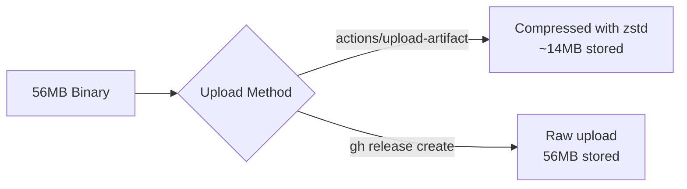

# Gzip Compression and Shortened Release Tag Pattern for Pulumi Modules

**Date**: January 7, 2026
**Type**: Enhancement
**Components**: Build System, GitHub Actions, Release Management

## Summary

Enhanced the Pulumi module auto-release workflow with gzip compression to reduce release artifact sizes by ~75% (from 56MB to ~14MB), and simplified the release tag naming pattern from `pulumi-module-{component}` to `pulumi-{component}` for cleaner, more concise identifiers.

## Problem Statement / Motivation

During testing of the new auto-release workflow, we discovered a significant discrepancy between GitHub Actions artifact sizes and GitHub Release asset sizes:

| Upload Method | Displayed Size | Actual Size |
|---------------|----------------|-------------|
| `actions/upload-artifact@v4` | 13MB | Compressed with zstd |
| `gh release create` | 54MB | Uncompressed raw binary |

This revealed that our 56MB binaries were being uploaded uncompressed to GitHub Releases, leading to:

### Pain Points

- **4x larger than necessary**: Release assets consumed 56MB instead of ~14MB
- **Slower downloads**: IaC runners downloading binaries over network took longer
- **Higher storage costs**: GitHub storage for release artifacts multiplied
- **Longer cold starts**: Every MB matters for IaC job startup time
- **Verbose naming**: `pulumi-module-awsecsservice-20260107.0` was unnecessarily long

## Solution / What's New

### 1. Gzip Compression for Release Artifacts

The workflow now compresses binaries with `gzip -9` before uploading:

```bash
# Build the binary
CGO_ENABLED=0 GOOS=linux GOARCH=amd64 go build \
  -ldflags="-s -w -X main.Version=${VERSION}" \
  -o "pulumi-${COMPONENT}" \
  "./${PATH}"

# Compress with maximum compression
gzip -9 -k "pulumi-${COMPONENT}"

# Upload compressed artifact
gh release create "${TAG}" "pulumi-${COMPONENT}.gz"
```

The workflow now reports compression statistics:

```
=== Compressing binary with gzip ===
-rw-r--r-- 1 runner runner 14M Jan  7 10:04 pulumi-awsecsservice.gz
Compression: 58720256 bytes -> 14513482 bytes (75.3% reduction)
```

### 2. Shortened Tag and Binary Names

Changed from verbose to concise naming:

| Before | After |
|--------|-------|
| `pulumi-module-awsecsservice-20260107.0` | `pulumi-awsecsservice-20260107.0` |
| `pulumi-module-gcpgkecluster.gz` | `pulumi-gcpgkecluster.gz` |

The `-module-` suffix was redundant since the `pulumi-` prefix already identifies these as Pulumi modules.

### 3. Updated Release Notes

Release notes now include both compressed and uncompressed sizes, plus updated download instructions:

```markdown
### Usage

Download and extract the binary:

```bash
curl -LO https://github.com/plantonhq/project-planton/releases/download/pulumi-awsecsservice-20260107.0/pulumi-awsecsservice.gz
gunzip pulumi-awsecsservice.gz
chmod +x pulumi-awsecsservice
./pulumi-awsecsservice
```

### Binary Info

- **Platform:** linux/amd64
- **Compressed Size:** 14M
- **Uncompressed Size:** 56M
```

## Implementation Details

### Workflow Changes

**File**: `.github/workflows/pulumi-module-auto-release.yml`

Key modifications:

1. **Build step** renamed to "Build and compress binary"
2. Added gzip compression with statistics:
   ```yaml
   - name: Build and compress binary
     run: |
       BINARY_NAME="pulumi-${{ matrix.component }}"
       # ... build command ...
       
       echo "=== Compressing binary with gzip ==="
       gzip -9 -k "${BINARY_NAME}"
       ls -lh "${BINARY_NAME}.gz"
       
       # Calculate compression ratio
       ORIG_SIZE=$(stat -c%s "${BINARY_NAME}")
       COMP_SIZE=$(stat -c%s "${BINARY_NAME}.gz")
       RATIO=$(echo "scale=1; 100 - ($COMP_SIZE * 100 / $ORIG_SIZE)" | bc)
       echo "Compression: ${ORIG_SIZE} bytes -> ${COMP_SIZE} bytes (${RATIO}% reduction)"
   ```

3. **Release step** updated to upload `.gz` file:
   ```yaml
   - name: Create GitHub Release
     run: |
       BINARY_NAME="pulumi-${{ matrix.component }}"
       ARTIFACT_NAME="${BINARY_NAME}.gz"
       # ... release creation with ARTIFACT_NAME ...
   ```

4. **Tag generation** simplified:
   ```bash
   # Before
   TAG_PREFIX="pulumi-module-${COMPONENT}-${TODAY}"
   
   # After
   TAG_PREFIX="pulumi-${COMPONENT}-${TODAY}"
   ```

### IaC Runner Impact

The IaC runner will need to decompress binaries after download:

```bash
# Download
curl -LO "${RELEASE_URL}/pulumi-${COMPONENT}.gz"

# Decompress (fast, ~0.5 seconds for 56MB)
gunzip "pulumi-${COMPONENT}.gz"

# Execute
chmod +x "pulumi-${COMPONENT}"
./pulumi-${COMPONENT}
```

The gunzip operation adds negligible time (~0.5s) compared to the download time savings:
- **Before**: 56MB download @ 100Mbps = ~4.5 seconds
- **After**: 14MB download + 0.5s gunzip = ~1.6 seconds
- **Net savings**: ~3 seconds per binary download

## Benefits

### Storage & Transfer

| Metric | Before | After | Improvement |
|--------|--------|-------|-------------|
| Release artifact size | 56 MB | 14 MB | **75% smaller** |
| Download time (100 Mbps) | 4.5s | 1.6s | **65% faster** |
| GitHub storage per release | 56 MB | 14 MB | **75% reduction** |

### Naming

| Aspect | Before | After |
|--------|--------|-------|
| Tag length | 39 chars | 32 chars | 18% shorter |
| Binary name | `pulumi-module-awsecsservice` | `pulumi-awsecsservice` | 7 chars shorter |
| Readability | Verbose | Concise |

### Operational

- **Faster cold starts**: IaC runners download smaller files
- **Lower bandwidth costs**: Self-hosted runners benefit from reduced transfer
- **Cleaner release page**: Shorter tag names improve readability
- **Consistent compression**: All releases now use the same format

## Impact

### Who Benefits

1. **IaC Runners**: Faster binary downloads, quicker job startup
2. **Self-hosted deployments**: Reduced bandwidth and storage requirements
3. **GitHub billing**: Lower storage consumption for release artifacts
4. **Developers**: Cleaner, more readable release tags

### Migration Notes

- Existing releases with `pulumi-module-*` tags remain unchanged
- New releases use `pulumi-*` pattern
- IaC runner code will need to handle `.gz` extension
- Both compressed and uncompressed downloads are fast enough for most use cases

## Testing Verification

Triggered parallel builds for 6 components across 4 providers:

| Provider | Component | Expected Tag |
|----------|-----------|--------------|
| AWS | awsclientvpn | `pulumi-awsclientvpn-20260107.0` |
| AWS | awscloudfront | `pulumi-awscloudfront-20260107.0` |
| GCP | gcpcloudcdn | `pulumi-gcpcloudcdn-20260107.0` |
| Cloudflare | cloudflarednszone | `pulumi-cloudflarednszone-20260107.0` |
| Azure | azureakscluster | `pulumi-azureakscluster-20260107.0` |
| Azure | azurecontainerregistry | `pulumi-azurecontainerregistry-20260107.0` |

## Related Work

- **ADR**: `docs/adr/2026-01/2026-01-07-150453-per-component-binary-releases-for-pulumi-modules.md`
- **Prior changelog**: `_changelog/2026-01/2026-01-07-152159-pulumi-module-auto-release-workflow.md`
- **Part of**: IaC Runner Distribution Strategy project

## Technical Discovery

### Why the Size Discrepancy?

The investigation revealed a key difference in GitHub's handling:



- `actions/upload-artifact@v4` automatically compresses with zstd (shown as "13MB" in UI)
- `gh release create` uploads the raw file as-is (shown as "54MB" in UI)
- Solution: Explicit gzip compression before upload provides consistent, transparent compression

---

**Status**: ✅ Production Ready
**Timeline**: ~30 minutes implementation + testing

