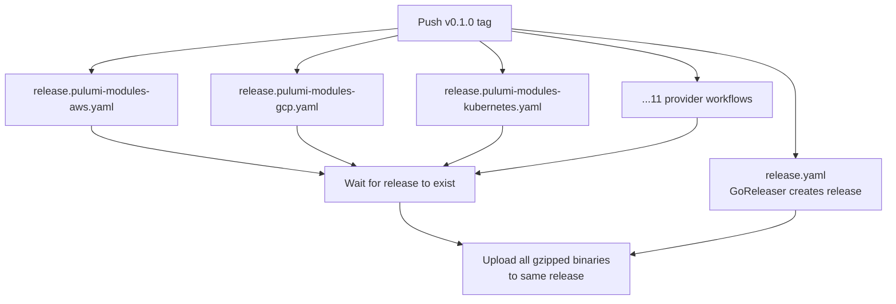
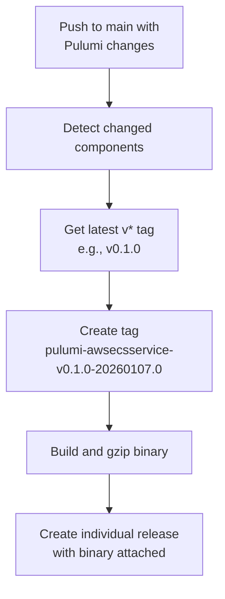

# Unified Release Workflow Architecture for Pulumi Modules

**Date**: January 7, 2026
**Type**: Refactoring
**Components**: Build System, GitHub Actions, Release Management

## Summary

Refactored the GitHub Actions workflow architecture to create a unified release system where all Pulumi module binaries are attached to the same GitHub Release as CLI binaries. This consolidation includes renaming workflows to `.yaml`, prefixing provider workflows with `release.`, and adding semantic versioning to auto-release tags for clear version lineage.

## Problem Statement / Motivation

After implementing the auto-release workflow, we identified several architectural improvements needed:

### Pain Points

- **Fragmented releases**: Individual Pulumi module releases were separate from semantic version releases
- **Inconsistent naming**: Mix of `.yml` and `.yaml` extensions, no clear naming convention
- **No version lineage**: Auto-release tags like `pulumi-awsecsservice-20260107.0` didn't indicate which semantic version they patched
- **Wasted artifacts**: Provider workflows uploaded binaries as workflow artifacts (7-day retention) instead of release assets
- **Unnecessary concurrency limits**: Workflows blocked each other when they could run in parallel
- **Obsolete workflows**: Terraform runner workflow was no longer needed

## Solution / What's New

### 1. Unified Release Workflow Naming

Renamed and prefixed all workflows for clarity:

| Old Name                          | New Name                                   |
| --------------------------------- | ------------------------------------------ |
| `release.yml`                     | `release.yaml`                             |
| `pulumi-module-auto-release.yml`  | `pulumi-module-auto-release.yaml`          |
| `pulumi-modules-aws.yml`          | `release.pulumi-modules-aws.yaml`          |
| `pulumi-modules-gcp.yml`          | `release.pulumi-modules-gcp.yaml`          |
| `pulumi-modules-kubernetes.yml`   | `release.pulumi-modules-kubernetes.yaml`   |
| `pulumi-modules-azure.yml`        | `release.pulumi-modules-azure.yaml`        |
| `pulumi-modules-cloudflare.yml`   | `release.pulumi-modules-cloudflare.yaml`   |
| `pulumi-modules-atlas.yml`        | `release.pulumi-modules-atlas.yaml`        |
| `pulumi-modules-auth0.yml`        | `release.pulumi-modules-auth0.yaml`        |
| `pulumi-modules-civo.yml`         | `release.pulumi-modules-civo.yaml`         |
| `pulumi-modules-confluent.yml`    | `release.pulumi-modules-confluent.yaml`    |
| `pulumi-modules-digitalocean.yml` | `release.pulumi-modules-digitalocean.yaml` |
| `pulumi-modules-snowflake.yml`    | `release.pulumi-modules-snowflake.yaml`    |

### 2. Provider Workflows Upload to GitHub Release

Changed from temporary workflow artifacts to permanent release assets:

```yaml
# Before: Workflow artifacts (7-day retention)
- name: Upload binary artifact
  uses: actions/upload-artifact@v4
  with:
    name: binary-aws-${{ matrix.component }}
    path: binaries/
    retention-days: 7

# After: GitHub Release assets (permanent)
- name: Upload to release
  env:
    GH_TOKEN: ${{ secrets.GITHUB_TOKEN }}
  run: |
    TAG="${GITHUB_REF#refs/tags/}"
    BINARY_NAME="pulumi-${{ matrix.component }}"

    # Wait for GoReleaser to create the release
    for i in {1..30}; do
      if gh release view "${TAG}" >/dev/null 2>&1; then
        break
      fi
      sleep 10
    done

    # Upload gzipped binary to the release
    gh release upload "${TAG}" "${BINARY_NAME}.gz" --clobber
```

### 3. Semantic Version in Auto-Release Tags

Updated tag format to include base semantic version:

| Before                            | After                                    |
| --------------------------------- | ---------------------------------------- |
| `pulumi-awsecsservice-20260107.0` | `pulumi-awsecsservice-v0.1.0-20260107.0` |
| `pulumi-gcpgkecluster-20260107.1` | `pulumi-gcpgkecluster-v0.1.0-20260107.1` |

The workflow now:

1. Detects the latest `v*` tag (e.g., `v0.1.0`)
2. Includes it in the component release tag
3. Falls back to `v0.0.0` if no semantic version exists

```bash
# Get latest semantic version
LATEST_SEMVER=$(git tag -l 'v*' --sort=-v:refname | head -1)
if [ -z "$LATEST_SEMVER" ]; then
  LATEST_SEMVER="v0.0.0"
fi

# Tag format: pulumi-{component}-{semver}-{YYYYMMDD}.{N}
NEXT_TAG="pulumi-${COMPONENT}-${LATEST_SEMVER}-${TODAY}.${NEXT_SEQ}"
```

### 4. Removed Concurrency Blocks

All workflows can now run in parallel:

```yaml
# Removed from all 13 workflows:
concurrency:
  group: pulumi-modules-aws-${{ github.ref }}
  cancel-in-progress: true
```

### 5. Deleted Obsolete Workflows

- `iac-runner-terraform.yml` - No longer needed

## Implementation Details

### Release Flow on `v*` Tag

When you push a semantic version tag (e.g., `v0.1.0`):



### Auto-Release Flow on Main Push

When you push changes to Pulumi modules on main:



### Workflow Files Changed

```
.github/workflows/
├── pulumi-module-auto-release.yaml    # Individual component releases
├── release.yaml                        # GoReleaser for CLI
├── release.pulumi-modules-atlas.yaml
├── release.pulumi-modules-auth0.yaml
├── release.pulumi-modules-aws.yaml
├── release.pulumi-modules-azure.yaml
├── release.pulumi-modules-civo.yaml
├── release.pulumi-modules-cloudflare.yaml
├── release.pulumi-modules-confluent.yaml
├── release.pulumi-modules-digitalocean.yaml
├── release.pulumi-modules-gcp.yaml
├── release.pulumi-modules-kubernetes.yaml
└── release.pulumi-modules-snowflake.yaml
```

### Key Changes in Provider Workflows

1. **Permissions**: Changed from `contents: read` to `contents: write`
2. **Workflow names**: Updated to match file names (`release.pulumi-modules-*`)
3. **Build step**: Now includes gzip compression
4. **Upload step**: Uses `gh release upload` instead of `actions/upload-artifact`
5. **Retry logic**: Waits up to 5 minutes for GoReleaser to create the release

## Benefits

### Unified Release Experience

| Aspect                 | Before             | After                    |
| ---------------------- | ------------------ | ------------------------ |
| Release contents       | CLI binaries only  | CLI + 139 Pulumi modules |
| Provider artifacts     | Temporary (7 days) | Permanent                |
| Module discoverability | Scattered releases | Single release page      |

### Clear Version Lineage

The new tag format `pulumi-{component}-{semver}-{date}.{seq}` provides:

- **Upgrade path visibility**: See which base version a patch applies to
- **Easy filtering**: `git tag -l 'pulumi-awsecsservice-v0.1.0-*'`
- **Rollback clarity**: Know which semantic version to revert to

### Operational Improvements

- **Parallel execution**: All workflows run simultaneously, no queue blocking
- **Consistent naming**: `.yaml` extension, `release.` prefix for release workflows
- **Reduced storage**: No more duplicate storage in workflow artifacts
- **Cleaner Actions tab**: Fewer queued workflows, faster completion

## Impact

### On Semantic Version Releases (`v*` tags)

When you run:

```bash
git tag v0.1.0 && git push origin v0.1.0
```

The release will contain:

- CLI binaries (via GoReleaser)
- ~139 Pulumi module binaries (gzipped, via provider workflows)

### On Individual Module Changes

When you push changes to a Pulumi module on main, the auto-release creates:

- Tag: `pulumi-{component}-v0.1.0-{YYYYMMDD}.{N}`
- Release: Individual release with that specific binary

### Download Pattern

```bash
# Download from semantic version release
curl -LO https://github.com/plantonhq/project-planton/releases/download/v0.1.0/pulumi-awsecsservice.gz

# Download from auto-release
curl -LO https://github.com/plantonhq/project-planton/releases/download/pulumi-awsecsservice-v0.1.0-20260107.0/pulumi-awsecsservice.gz

# Both require gunzip
gunzip pulumi-awsecsservice.gz
chmod +x pulumi-awsecsservice
```

## Related Work

- **Prior changelog**: `_changelog/2026-01/2026-01-07-155125-gzip-compression-and-shortened-release-tags.md`
- **ADR**: `docs/adr/2026-01/2026-01-07-150453-per-component-binary-releases-for-pulumi-modules.md`
- **Part of**: IaC Runner Distribution Strategy project

## Migration Notes

### For IaC Runner

The IaC runner can now:

1. Download from semantic version releases (all binaries in one release)
2. Download from auto-releases (individual component releases)
3. Parse component version to determine base semantic version

### For Downstream Tools

- Auto-release tags now include semantic version: update any tag parsing logic
- Provider workflow artifacts no longer exist: use release assets instead

---

**Status**: ✅ Production Ready
**Timeline**: ~1 hour implementation
