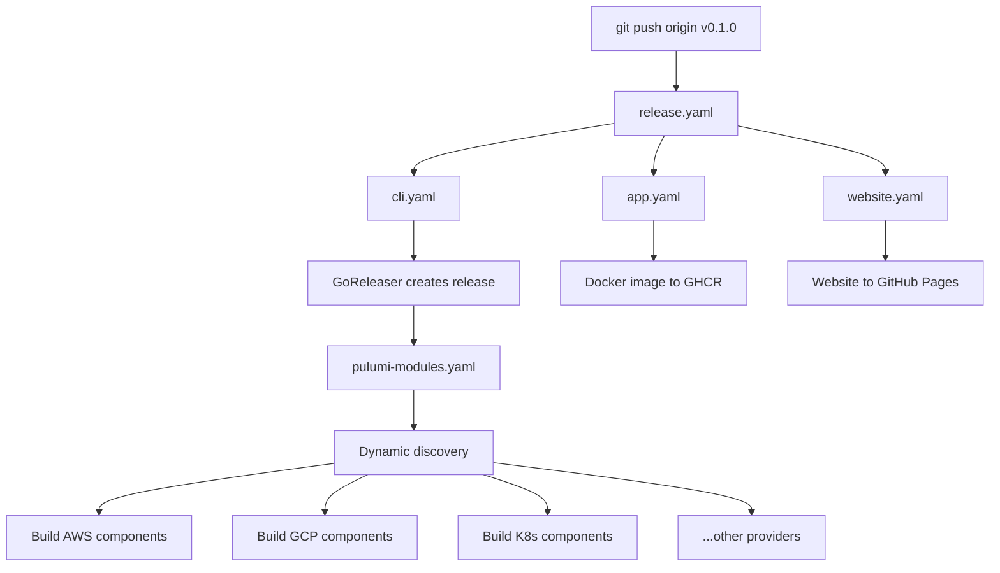

# Reusable Release Workflows with Dynamic Component Discovery

**Date**: January 7, 2026
**Type**: Refactoring
**Components**: Build System, GitHub Actions, Release Management

## Summary

Refactored the GitHub Actions release system to use reusable workflows organized in a `release/` subfolder, with a single orchestrator `release.yaml` that calls all sub-workflows on semantic version tags. The Pulumi modules workflow now uses dynamic component discovery by scanning directories, eliminating hardcoded paths and enabling automatic adaptation when components are added, removed, or renamed.

## Problem Statement / Motivation

The previous release workflow architecture had several issues:

### Pain Points

- **12+ separate workflows**: Each triggered independently on `v*` tags, cluttering the Actions tab
- **Hardcoded component paths**: 860 lines of matrix entries listing every component manually
- **Maintenance burden**: Adding a new Pulumi component required updating workflow files
- **No centralized orchestration**: No single place to understand the full release flow
- **Polling for release**: Provider workflows used retry loops waiting for GoReleaser to create the release

## Solution / What's New

### 1. Reusable Workflow Architecture

Created a `release/` subfolder with modular, reusable workflows:

```
.github/workflows/
├── release.yaml                      # Orchestrator (single entry point)
├── pulumi-module-auto-release.yaml   # Auto-release on push to main
└── release/
    ├── cli.yaml                      # GoReleaser for CLI
    ├── app.yaml                      # Docker image build
    ├── website.yaml                  # GitHub Pages deployment
    └── pulumi-modules.yaml           # All providers (dynamic discovery)
```

### 2. Single Orchestrator with Native Dependencies

The `release.yaml` orchestrator uses `workflow_call` to invoke reusable workflows and `needs:` for native dependency management:

```yaml
jobs:
  cli:
    uses: ./.github/workflows/release/cli.yaml

  app:
    uses: ./.github/workflows/release/app.yaml

  website:
    uses: ./.github/workflows/release/website.yaml

  pulumi-modules:
    needs: cli  # Native dependency - no polling needed
    uses: ./.github/workflows/release/pulumi-modules.yaml
```

### 3. Dynamic Component Discovery

The `pulumi-modules.yaml` workflow now discovers components by scanning directories:

```bash
# Discover all components by listing directories
for component_dir in "$PROVIDER_PATH"/*/; do
  component=$(basename "$component_dir")
  pulumi_path="${component_dir}v1/iac/pulumi"
  if [ -d "$pulumi_path" ]; then
    COMPONENTS+=("$component")
  fi
done
```

**Benefits:**
- No hardcoded paths - works with any new component automatically
- Path pattern: `apis/org/project_planton/provider/{provider}/{component}/v1/iac/pulumi`
- Adding/removing components requires zero workflow changes

### 4. Per-Provider Concurrency Control

Matrix controls provider-level parallelism with custom limits:

| Provider | max_parallel | Reason |
|----------|--------------|--------|
| AWS | 2 | Standard |
| GCP | **1** | Build failures with concurrency |
| Kubernetes | 2 | Standard |
| Azure | 2 | Standard |
| Cloudflare | **1** | Build failures with concurrency |
| Civo | 2 | Standard |
| DigitalOcean | 2 | Standard |
| Atlas | 2 | Standard |
| Auth0 | 2 | Standard |
| Confluent | 2 | Standard |
| Snowflake | 2 | Standard |

### 5. Clear Progress Logging

Each build shows comprehensive progress information:

```
========================================
PROVIDER: aws
TOTAL COMPONENTS FOUND: 22
MAX PARALLEL: 2
========================================

Components to build:
  - awsalb
  - awscertmanagercert
  ...

========================================
BUILDING: awsekscluster
Progress: 10/22 (12 remaining)
Provider: aws
Path: apis/org/project_planton/provider/aws/awsekscluster/v1/iac/pulumi
========================================
...
========================================
COMPLETED: awsekscluster (aws)
Progress: 10/22 completed, 12 remaining
========================================

========================================
PROVIDER SUMMARY: aws
========================================
Total components: 22
Successfully built: 22
Failed: 0
========================================
```

## Implementation Details

### Files Changed

| Action | File | Purpose |
|--------|------|---------|
| Replaced | `.github/workflows/release.yaml` | Orchestrator calling reusable workflows |
| Created | `.github/workflows/release/cli.yaml` | GoReleaser job |
| Created | `.github/workflows/release/app.yaml` | Docker build job |
| Created | `.github/workflows/release/website.yaml` | GitHub Pages job |
| Created | `.github/workflows/release/pulumi-modules.yaml` | Dynamic provider builds |
| Deleted | `.github/workflows/release.pulumi-modules-*.yaml` | 11 old provider workflows |

### Workflow Reduction

| Before | After |
|--------|-------|
| 13 workflow files | 5 workflow files |
| 860 lines (pulumi-modules) | 144 lines |
| Hardcoded 130 component paths | Zero hardcoded paths |
| Polling loops for release | Native `needs:` dependency |

### Release Flow



## Benefits

### For Maintainability

| Aspect | Before | After |
|--------|--------|-------|
| Add new component | Edit workflow + matrix | Just create the directory |
| Remove component | Edit workflow + matrix | Just delete the directory |
| Rename component | Edit workflow + matrix | Just rename the directory |
| Lines of code | ~1200 across 12 files | ~400 across 5 files |

### For Reliability

- **No polling**: Native `needs:` ensures release exists before uploads
- **Fail-fast: false**: One component failure doesn't block others
- **Clear errors**: Progress logging shows exactly what failed

### For Developer Experience

- **Single trigger point**: Only `release.yaml` responds to `v*` tags
- **Organized structure**: Easy to understand and navigate
- **Self-documenting**: Directory structure defines components

## Impact

### On Semantic Version Releases

When you run:
```bash
git tag v0.1.0 && git push origin v0.1.0
```

The orchestrator triggers:
1. CLI release (creates GitHub Release)
2. App and Website (parallel)
3. Pulumi modules (after CLI, auto-discovers all components)

### On Adding New Components

Just create the directory structure:
```bash
mkdir -p apis/org/project_planton/provider/aws/awsnewservice/v1/iac/pulumi
# Add main.go
# Done - next release will include it
```

### On Component Discovery

The workflow dynamically finds:
- ~130 components across 11 providers
- Reports totals and progress in real-time
- Handles any number of components without changes

## Related Work

- **Prior changelogs**:
  - `2026-01-07-161545-unified-release-workflow-architecture.md`
  - `2026-01-07-152159-pulumi-module-auto-release-workflow.md`
  - `2026-01-07-155125-gzip-compression-and-shortened-release-tags.md`
- **Part of**: IaC Runner Distribution Strategy project

---

**Status**: ✅ Production Ready
**Timeline**: ~2 hours implementation

