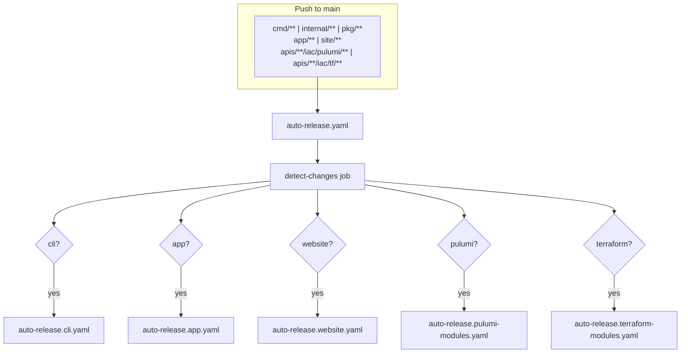

# Unified Auto-Release System for All Components

**Date**: January 7, 2026
**Type**: Feature
**Components**: Build System, GitHub Actions, Release Management

## Summary

Implemented a unified auto-release system that mirrors the semantic release architecture. A single `auto-release.yaml` orchestrator detects changes across all component types (CLI, App, Website, Pulumi modules, Terraform modules) and conditionally triggers reusable workflows for each. This extends the existing Pulumi module auto-release to all components with consistent patterns.

## Problem Statement / Motivation

The existing auto-release mechanism only covered Pulumi modules. Other components (CLI, App, Website, Terraform modules) required manual semantic version releases for any updates, creating friction for incremental improvements.

### Pain Points

- **No incremental CLI releases**: Users had to wait for semantic releases to get CLI fixes via Homebrew
- **Docker image updates required full releases**: Small app changes needed a full `v*` release
- **Website deployments tied to releases**: Content updates required version tags
- **Terraform modules not tracked**: No version tracking for terraform module changes
- **Inconsistent tag formats**: Pulumi used `pulumi-{component}-{semver}-{date}` which put semver in the middle

## Solution / What's New

### 1. Unified Orchestrator Architecture

Single entry point `auto-release.yaml` that:

- Triggers on push to main with changes in monitored paths
- Runs a `detect-changes` job to analyze git diff
- Conditionally calls reusable workflows based on what changed
- Mirrors the `release.yaml` semantic release pattern



### 2. Consistent Tag Format

Standardized tag format with semver prefix for easy filtering and version comparison:

| Component        | Format                                           | Example                                     |
| ---------------- | ------------------------------------------------ | ------------------------------------------- |
| CLI              | `v{semver}.{YYYYMMDD}.{N}`                       | `v0.3.1.20260107.1`                         |
| App              | `v{semver}-app-{YYYYMMDD}.{N}`                   | `v0.3.1-app-20260107.1`                     |
| Website          | `v{semver}-website-{YYYYMMDD}.{N}`               | `v0.3.1-website-20260107.1`                 |
| Pulumi module    | `v{semver}-pulumi-{component}-{YYYYMMDD}.{N}`    | `v0.3.1-pulumi-awsecsservice-20260107.1`    |
| Terraform module | `v{semver}-terraform-{component}-{YYYYMMDD}.{N}` | `v0.3.1-terraform-awsecsservice-20260107.1` |

**Note**: CLI uses dots (not hyphens) for Homebrew version comparison compatibility.

### 3. Component-Specific Behaviors

| Component         | Trigger Paths                                          | Artifact                | GitHub Release                     |
| ----------------- | ------------------------------------------------------ | ----------------------- | ---------------------------------- |
| CLI               | `cmd/**`, `internal/**`, `pkg/**`, `main.go`, `go.mod` | GoReleaser binaries     | ✅ With binaries, updates Homebrew |
| App               | `app/**`                                               | Docker image to GHCR    | ✅ With image reference            |
| Website           | `site/**`                                              | GitHub Pages deployment | ✅ With deployment URL             |
| Pulumi modules    | `apis/**/iac/pulumi/**`                                | Gzipped binary          | ✅ With binary artifact            |
| Terraform modules | `apis/**/iac/tf/**`                                    | Git source reference    | ✅ With usage instructions         |

**All components create GitHub Releases** with appropriate release notes and artifacts.

### 4. Updated Pulumi Module Tag Format

Changed from old format to new:

| Before                                   | After                                    |
| ---------------------------------------- | ---------------------------------------- |
| `pulumi-awsecsservice-v0.3.1-20260107.1` | `v0.3.1-pulumi-awsecsservice-20260107.1` |

Benefits:

- Semver prefix enables easy filtering: `git tag -l 'v0.3.1-*'`
- Consistent with other component types
- Clearer version lineage

## Implementation Details

### Workflow Files

```
.github/workflows/
├── release.yaml                        # Semantic release orchestrator (v* tags)
├── release.cli.yaml                    # Reusable: GoReleaser
├── release.app.yaml                    # Reusable: Docker build
├── release.website.yaml                # Reusable: GitHub Pages
├── release.pulumi-modules.yaml         # Reusable: All Pulumi binaries
│
├── auto-release.yaml                   # Auto-release orchestrator (NEW)
├── auto-release.cli.yaml               # Reusable: CLI with Homebrew (NEW)
├── auto-release.app.yaml               # Reusable: Docker with auto-tag (NEW)
├── auto-release.website.yaml           # Reusable: GitHub Pages (NEW)
├── auto-release.pulumi-modules.yaml    # Updated: new tag format, accepts matrix
└── auto-release.terraform-modules.yaml # Reusable: Tag-only releases (NEW)
```

### Detection Logic

The orchestrator's `detect-changes` job:

1. Gets the latest semantic version tag (`v*.*.*` only, excludes auto-release tags)
2. Analyzes git diff between `${{ github.event.before }}` and `${{ github.sha }}`
3. Categorizes changes by path patterns
4. Computes next version for each component type using `{semver}.{date}.{seq}` or `{semver}-{type}-{date}.{seq}`
5. Outputs flags and matrices for downstream jobs

### Manual Dispatch Support

All workflows support `workflow_dispatch` for manual releases:

- **Orchestrator**: Force flags for each component type
- **Pulumi modules**: Provider/component selection or force-all
- **Terraform modules**: Same as Pulumi

## Benefits

### For Developers

- **Immediate Homebrew updates**: CLI changes available via `brew upgrade` within minutes
- **Incremental app releases**: Docker images for testing without full semantic release
- **Fast website updates**: Content changes deployed automatically
- **Terraform module tracking**: Version history for infrastructure changes

### For Operations

- **Unified release view**: Single workflow in Actions tab for all auto-releases
- **Consistent tagging**: Easy to filter and understand version lineage
- **Audit trail**: Every change to main creates traceable tags

### For Self-Hosted Deployments

- **Pin specific versions**: Use auto-release tags for precise version control
- **Smaller upgrade scope**: Update individual components without full releases

## Impact

### Files Changed

| Action   | File                                                    | Purpose          |
| -------- | ------------------------------------------------------- | ---------------- |
| Created  | `.github/workflows/auto-release.yaml`                   | Orchestrator     |
| Created  | `.github/workflows/auto-release.cli.yaml`               | CLI releases     |
| Created  | `.github/workflows/auto-release.app.yaml`               | Docker releases  |
| Created  | `.github/workflows/auto-release.website.yaml`           | Website releases |
| Created  | `.github/workflows/auto-release.terraform-modules.yaml` | Terraform tags   |
| Modified | `.github/workflows/auto-release.pulumi-modules.yaml`    | Updated format   |
| Modified | `.goreleaser.yaml`                                      | Enhanced notes   |

### Comprehensive Release Notes

All releases now include detailed, actionable release notes:

**Semantic Releases** (via GoReleaser):
- CLI installation instructions for macOS (Homebrew + manual), Linux, and Windows
- Docker image pull commands
- Website URL
- Pulumi module download/extract instructions
- Terraform module clone/checkout and git source reference examples

**Auto-Releases**:
- CLI: Same comprehensive instructions via GoReleaser
- App: Docker pull/run commands with exact tag
- Website: Deployment URL and what's included
- Pulumi modules: Download, extract, and usage with IaC Runner
- Terraform modules: Clone/checkout and HCL source reference

### Comparison with Semantic Releases

| Aspect          | Semantic Release             | Auto-Release                   |
| --------------- | ---------------------------- | ------------------------------ |
| Trigger         | `v*` tag push                | Push to main with path changes |
| Detection       | Static (tag exists)          | Dynamic (git diff analysis)    |
| CLI Homebrew    | Full release, always updates | Auto-release, always updates   |
| Docker `latest` | Updated                      | NOT updated                    |
| Pulumi/TF scope | All components               | Only changed components        |
| Frequency       | Intentional releases         | Every qualifying push          |

## Usage

### Automatic (Default)

Push changes to main - the orchestrator automatically detects and releases:

```bash
# CLI change
vim cmd/project-planton/root.go
git add . && git commit -m "fix(cli): improve error message"
git push origin main
# → Creates v0.3.1.20260107.0, updates Homebrew

# Pulumi module change
vim apis/.../awsecsservice/v1/iac/pulumi/main.go
git add . && git commit -m "feat(aws): add health check config"
git push origin main
# → Creates v0.3.1-pulumi-awsecsservice-20260107.0
```

### Manual Dispatch

Trigger specific releases via GitHub Actions UI or CLI:

```bash
# Force CLI release
gh workflow run auto-release.yaml -f force_cli=true

# Force specific Pulumi provider
gh workflow run auto-release.pulumi-modules.yaml -f provider=aws

# Force all Terraform modules
gh workflow run auto-release.yaml -f force_terraform_all=true
```

## Related Work

- **Prior changelogs**:
  - `2026-01-07-180000-reusable-release-workflow-with-dynamic-component-discovery.md`
  - `2026-01-07-161545-unified-release-workflow-architecture.md`
  - `2026-01-07-155125-gzip-compression-and-shortened-release-tags.md`
  - `2026-01-07-152159-pulumi-module-auto-release-workflow.md`
- **Part of**: IaC Runner Distribution Strategy project

---

**Status**: ✅ Production Ready
**Timeline**: ~2 hours implementation
**Workflows Created/Modified**: 6 files
