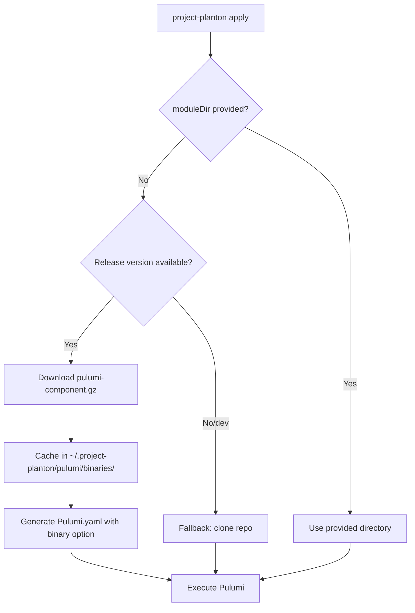
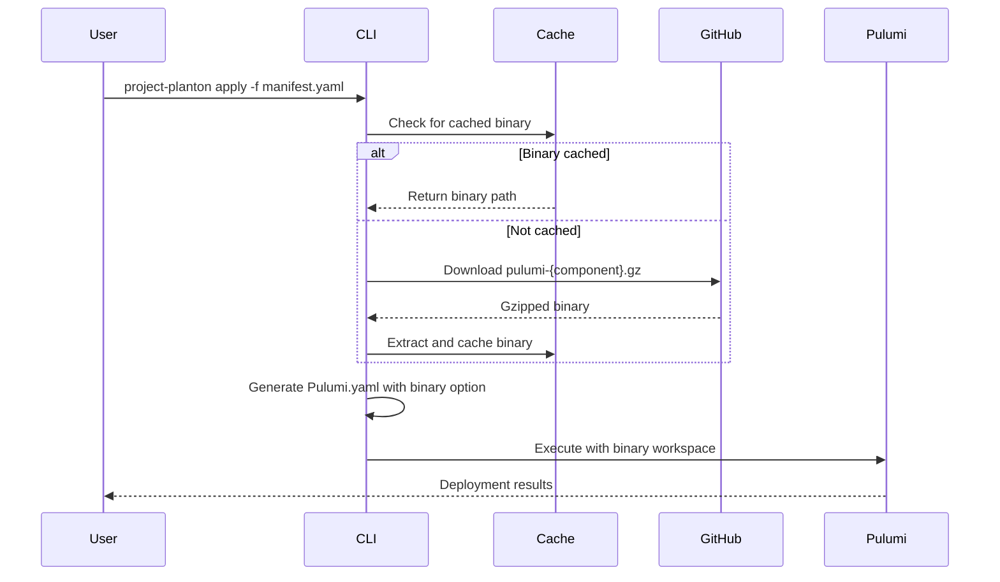

# Pulumi Binary Distribution for IaC Runner

**Date**: January 8, 2026
**Type**: Feature
**Components**: Pulumi CLI Integration, IAC Stack Runner, Binary Distribution

## Summary

Implemented pre-built binary distribution for Pulumi modules, eliminating the need to clone the entire project-planton monorepo and compile Go code at runtime. The CLI now downloads lightweight gzipped binaries (~14MB) from GitHub releases instead of cloning ~3GB of source code, dramatically improving startup time and removing the Go toolchain requirement for end users.

## Problem Statement / Motivation

The existing workflow for executing Pulumi modules required:

1. Cloning the entire project-planton monorepo to a staging area
2. Copying the repo to a workspace directory
3. Compiling Go code on first execution (requires Go toolchain)
4. Waiting for both clone and compilation to complete

### Pain Points

- **Slow startup**: Cloning a large monorepo takes 30-60 seconds
- **Go toolchain dependency**: Users had to have Go installed even for simple deployments
- **First-run compilation**: Initial Pulumi execution took 2-3 minutes for compilation
- **Disk space**: Full repo clone consumed ~3GB of disk space
- **Network overhead**: Downloading entire repo even when only one module was needed

## Solution / What's New

The CLI now uses pre-built binaries distributed via GitHub releases:



### Key Features

1. **Automatic binary download**: Downloads component-specific binaries from GitHub releases
2. **Smart caching**: Binaries cached at `~/.project-planton/pulumi/binaries/{version}/`
3. **Graceful fallback**: Falls back to staging/clone if binary unavailable
4. **Module version support**: Works with `--module-version` for specific releases
5. **Zero compilation**: Binary mode skips Go compilation entirely

## Implementation Details

### New Package: `pkg/iac/pulumi/pulumibinary/`

Created a new package to handle binary distribution:

**`binary.go`** - Core binary download and caching:

- `EnsureBinary()` - Downloads and caches binary if not present
- `GetBinaryPath()` - Returns cached binary path
- `BuildDownloadURL()` - Constructs GitHub release download URL
- `DownloadBinary()` - Downloads and extracts gzipped binary

**`workspace.go`** - Workspace setup with Pulumi.yaml generation:

- `SetupBinaryWorkspace()` - Creates minimal workspace with binary configuration
- `GeneratePulumiYaml()` - Generates Pulumi.yaml with `runtime.options.binary`

### Directory Structure

All Pulumi-related files consolidated under `~/.project-planton/pulumi/`:

```
~/.project-planton/pulumi/
├── binaries/                          # Cached pre-built binaries
│   ├── v0.3.2/                        # Per-version cache
│   │   ├── pulumi-awsecsservice
│   │   └── pulumi-kubernetesdeployment
│   └── v0.3.1-pulumi-awsecsservice-20260107.01/
│       └── pulumi-awsecsservice
├── workspaces/                        # Binary mode workspaces
│   └── org-project-stack/
│       └── Pulumi.yaml
└── staging-workspaces/                # Source mode workspaces (fallback)
```

### Download URL Format

Binaries are downloaded directly from GitHub releases:

```bash
# CLI version v0.3.2 -> downloads from main release
https://github.com/plantonhq/project-planton/releases/download/v0.3.2/pulumi-kubernetesdeployment.gz

# Module version override -> downloads from that specific tag
https://github.com/plantonhq/project-planton/releases/download/v0.3.1-pulumi-awsecsservice-20260107.01/pulumi-awsecsservice.gz
```

### Generated Pulumi.yaml

The binary mode generates a minimal Pulumi.yaml that uses Pulumi's `runtime.options.binary` feature:

```yaml
name: kubernetesdeployment
runtime:
  name: go
  options:
    binary: /Users/user/.project-planton/pulumi/binaries/v0.3.2/pulumi-kubernetesdeployment
description: Auto-generated workspace for KubernetesDeployment binary execution
```

### Execution Flow



### Module Version Support

The implementation supports multiple version scenarios:

| Scenario                                                   | Binary Version Used       |
| ---------------------------------------------------------- | ------------------------- |
| No `--module-version`, CLI v0.3.2                          | `v0.3.2`                  |
| `--module-version v0.3.9`                                  | `v0.3.9`                  |
| `--module-version v0.3.1-pulumi-awsecsservice-20260107.01` | `v0.3.1-pulumi-...`       |
| Dev build (no version)                                     | Falls back to source mode |

## Benefits

### Performance Improvements

| Metric        | Before (Clone)  | After (Binary) | Improvement     |
| ------------- | --------------- | -------------- | --------------- |
| Download size | ~3GB repo       | ~14MB binary   | 99.5% reduction |
| Startup time  | 30-60s          | 2-5s           | 90% faster      |
| First run     | +2-3min compile | 0s             | No compilation  |
| Disk usage    | ~3GB            | ~80MB          | 97% reduction   |

### User Experience

- **No Go toolchain required**: End users don't need Go installed
- **Faster deployments**: Near-instant startup after first download
- **Smaller footprint**: Only download what you need
- **Offline capable**: Once cached, binaries work without network

## Impact

### CLI Users

- Dramatically faster `project-planton apply` execution
- No need to install Go toolchain
- Reduced disk space requirements
- Works on CI/CD environments without Go

### CI/CD Pipelines

- Faster pipeline execution
- Smaller container images (no Go needed)
- Better caching (binary vs full repo)
- More reliable (fewer moving parts)

## Known Limitations

- **Platform-specific binaries**: Current implementation downloads single-platform binary. Multi-platform support (darwin/linux/windows, amd64/arm64) will be added in follow-up work.
- **Requires versioned CLI**: Binary mode only works with released CLI versions, not dev builds

## Related Work

- ADR: Per-Component Binary Releases for Pulumi Modules (`planton/docs/adr/2026-01/2026-01-07-150453-per-component-binary-releases-for-pulumi-modules.md`)
- GitHub Actions workflow: `auto-release.pulumi-modules.yaml` builds and uploads binaries

---

**Status**: ✅ Production Ready (pending multi-platform support)
**Timeline**: 1 day implementation
