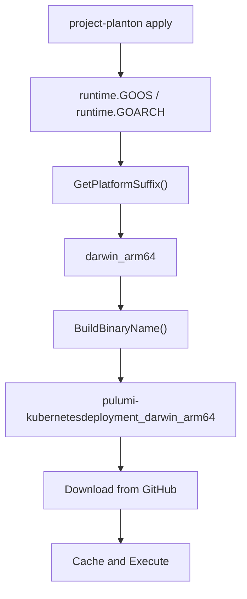

# Platform-Specific Pulumi Binary Downloads

**Date**: January 8, 2026
**Type**: Enhancement
**Components**: Pulumi CLI Integration, IAC Stack Runner, Binary Distribution

## Summary

Updated the Pulumi binary download logic to detect the current platform (OS and architecture) at runtime and download the appropriate platform-specific binary. This fixes the `exec format error` that occurred when macOS users tried to execute Linux binaries downloaded by the CLI.

## Problem Statement / Motivation

After implementing multi-platform binary releases in the GitHub Actions workflows, the CLI was still downloading binaries without platform suffixes (e.g., `pulumi-awsecsservice.gz`), which no longer exist. The release automation now uploads platform-specific binaries:

- `pulumi-{component}_linux_amd64.gz`
- `pulumi-{component}_darwin_arm64.gz`
- `pulumi-{component}_darwin_amd64.gz`
- `pulumi-{component}_windows_amd64.exe.gz`

### Pain Points

- **exec format error**: Users on macOS received "fork/exec: exec format error" when the CLI downloaded a Linux binary
- **Download failures**: The old URL pattern (`pulumi-component.gz`) no longer exists in new releases
- **Platform mismatch**: No mechanism to detect and request the correct platform binary

## Solution / What's New

Added platform detection using Go's `runtime` package to automatically download the correct binary for the user's OS and architecture.



### Key Changes

1. **`GetPlatformSuffix()`**: New function that returns `{os}_{arch}` based on `runtime.GOOS` and `runtime.GOARCH`

2. **`BuildBinaryName()`**: Updated to include platform suffix, with `.exe` extension for Windows:
   - Linux: `pulumi-awsecsservice_linux_amd64`
   - macOS: `pulumi-awsecsservice_darwin_arm64`
   - Windows: `pulumi-awsecsservice_windows_amd64.exe`

3. **Download URL**: Automatically constructed with platform suffix:
   - `https://github.com/plantonhq/project-planton/releases/download/v0.3.2/pulumi-kubernetesdeployment_darwin_arm64.gz`

## Implementation Details

All changes in `pkg/iac/pulumi/pulumibinary/binary.go`:

**New function - Platform detection:**

```go
func GetPlatformSuffix() string {
    return fmt.Sprintf("%s_%s", runtime.GOOS, runtime.GOARCH)
}
```

**Updated function - Binary name construction:**

```go
func BuildBinaryName(componentName string) string {
    baseName := BinaryPrefix + strings.ToLower(componentName)
    suffix := GetPlatformSuffix()

    if runtime.GOOS == "windows" {
        return fmt.Sprintf("%s_%s.exe", baseName, suffix)
    }
    return fmt.Sprintf("%s_%s", baseName, suffix)
}
```

The `BuildDownloadURL()` and `GetBinaryPath()` functions automatically inherit these changes since they call `BuildBinaryName()`.

## Benefits

| Aspect | Before | After |
|--------|--------|-------|
| Platform support | Linux only | Linux, macOS (Intel & ARM), Windows |
| Download URL | `pulumi-{component}.gz` | `pulumi-{component}_{os}_{arch}.gz` |
| Binary naming | Platform-agnostic | Platform-specific with correct extension |
| User experience | exec format errors on macOS/Windows | Works on all supported platforms |

### Developer Experience

- **No manual intervention**: Correct binary downloaded automatically
- **Cross-platform development**: Developers on any OS can use pre-built binaries
- **CI/CD agnostic**: Works in Linux CI environments and local macOS development

## Impact

### CLI Users

- macOS users (Apple Silicon and Intel) can now use pre-built binaries
- Windows users have native binary support
- No more `exec format error` when running `project-planton apply`

### Cache Structure

Binaries now cached with platform-specific names:

```
~/.project-planton/pulumi/binaries/v0.3.2/
├── pulumi-kubernetesdeployment_darwin_arm64
├── pulumi-awsecsservice_darwin_arm64
└── ... (other components)
```

## Related Work

- **Prior**: Multi-Platform Pulumi Binaries and CLI Rename (`2026-01-08-063000`)
- **Prior**: Pulumi Binary Distribution for IaC Runner (`2026-01-08-052417`)
- **Foundation**: Unified Auto-Release System (`2026-01-07-200000`)

---

**Status**: ✅ Production Ready
**Timeline**: 15 minutes implementation

