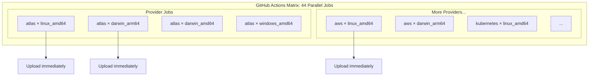

# Multi-Platform Pulumi Binaries and CLI Archive Rename

**Date**: January 8, 2026
**Type**: Enhancement
**Components**: Build System, GitHub Actions, Release Management

## Summary

Extended the Pulumi module release system to build binaries for 4 platforms (linux*amd64, darwin_arm64, darwin_amd64, windows_amd64) instead of just linux_amd64. Additionally, renamed CLI release archives from `project-planton*\_`to`cli\_\_` for cleaner, more consistent naming across all release artifacts.

## Problem Statement / Motivation

### Multi-Platform Support

The initial binary distribution implementation only built for `linux_amd64`, which worked for CI/CD and Docker environments but failed when developers ran the CLI locally:

```
error: an unhandled error occurred: fork/exec /Users/user/.project-planton/pulumi/binaries/v0.3.2/pulumi-kubernetesdeployment: exec format error
```

macOS users (both Apple Silicon and Intel) and Windows users couldn't use pre-built binaries.

### CLI Naming Consistency

The CLI archives used the verbose `project-planton_` prefix:

- `project-planton_v0.3.2_darwin_arm64.tar.gz`

This was inconsistent with the shorter, cleaner naming used for Pulumi modules (`pulumi-*`).

## Solution / What's New

### 1. Multi-Platform Pulumi Binaries

Both release workflows now build for 4 platforms in priority order:

| Platform            | GOOS      | GOARCH  | Use Case                     |
| ------------------- | --------- | ------- | ---------------------------- |
| Linux x86-64        | `linux`   | `amd64` | CI/CD, Docker, cloud servers |
| macOS Apple Silicon | `darwin`  | `arm64` | M1/M2/M3/M4 Macs             |
| macOS Intel         | `darwin`  | `amd64` | Older Intel Macs             |
| Windows x86-64      | `windows` | `amd64` | Windows desktops/servers     |

**Matrix-Based Parallelization**: All 4 platforms build in parallel via GitHub Actions matrix strategy (11 providers × 4 platforms = 44 parallel jobs). This maximizes throughput and minimizes total build time.

### 2. CLI Archive Rename

Changed CLI archive naming from `project-planton_*` to `cli_*`:

| Before                                       | After                            |
| -------------------------------------------- | -------------------------------- |
| `project-planton_v0.3.3_darwin_arm64.tar.gz` | `cli_v0.3.3_darwin_arm64.tar.gz` |
| `project-planton_v0.3.3_linux_amd64.tar.gz`  | `cli_v0.3.3_linux_amd64.tar.gz`  |
| `project-planton_v0.3.3_windows_amd64.zip`   | `cli_v0.3.3_windows_amd64.zip`   |
| `project-planton_v0.3.3_checksums.txt`       | `cli_v0.3.3_checksums.txt`       |

### 3. Pulumi Module Naming Convention

Pulumi binaries now include platform suffix:

| Before                    | After                                       |
| ------------------------- | ------------------------------------------- |
| `pulumi-awsecsservice.gz` | `pulumi-awsecsservice_linux_amd64.gz`       |
| (not available)           | `pulumi-awsecsservice_darwin_arm64.gz`      |
| (not available)           | `pulumi-awsecsservice_darwin_amd64.gz`      |
| (not available)           | `pulumi-awsecsservice_windows_amd64.exe.gz` |

Note: Windows binaries include `.exe` before `.gz` for clarity.

## Implementation Details

### Build Flow



All 44 jobs (11 providers × 4 platforms) run in parallel. Each job builds all components for its provider/platform combination and uploads each binary immediately after building.

### Files Changed

| File                                                 | Changes                                                                                                                           |
| ---------------------------------------------------- | --------------------------------------------------------------------------------------------------------------------------------- |
| `.goreleaser.yaml`                                   | Changed `name_template` from `project-planton_*` to `cli_*`; updated release notes with new naming and multi-platform Pulumi docs |
| `.github/workflows/release.pulumi-modules.yaml`      | Added provider × platform matrix (44 jobs); builds all platforms in parallel                                                      |
| `.github/workflows/auto-release.pulumi-modules.yaml` | Restructured with expand-matrix, create-releases, and build jobs; component × platform matrix for parallel builds                |

### Build Time Impact

| Metric               | Before     | After                           |
| -------------------- | ---------- | ------------------------------- |
| Platforms            | 1          | 4                               |
| Binaries per release | 130        | 520                             |
| Parallel jobs        | 11         | 44 (11 providers × 4 platforms) |
| Total build time     | ~15-20 min | ~15-20 min (parallel)           |

With matrix-based parallelization, build time stays roughly the same despite 4x more binaries.

## Benefits

### For Developers

- **Native execution on macOS**: Both Apple Silicon and Intel Macs now supported
- **Windows support**: Windows developers can use pre-built binaries
- **Fast availability**: All platform binaries available within similar timeframe due to parallel builds

### For Operations

- **Consistent naming**: `cli_*` and `pulumi-*` patterns are clear and concise
- **Platform detection**: Binary suffix makes platform obvious at a glance
- **Incremental downloads**: Binaries become available as they're built, not all at once

## Release Artifact Structure

After this change, each release contains:

```
v0.3.3/
├── cli_v0.3.3_linux_amd64.tar.gz                  # CLI (6 total)
├── cli_v0.3.3_linux_arm64.tar.gz
├── cli_v0.3.3_darwin_arm64.tar.gz
├── cli_v0.3.3_darwin_amd64.tar.gz
├── cli_v0.3.3_windows_amd64.zip
├── cli_v0.3.3_windows_arm64.zip
├── cli_v0.3.3_checksums.txt
├── pulumi-awsecsservice_linux_amd64.gz            # Pulumi (520 total)
├── pulumi-awsecsservice_darwin_arm64.gz
├── pulumi-awsecsservice_darwin_amd64.gz
├── pulumi-awsecsservice_windows_amd64.exe.gz
├── ... (516 more Pulumi binaries)
```

## Usage

### CLI Installation (Updated)

```bash
# macOS Apple Silicon
curl -LO https://github.com/plantonhq/project-planton/releases/download/v0.3.3/cli_v0.3.3_darwin_arm64.tar.gz
tar -xzf cli_v0.3.3_darwin_arm64.tar.gz
chmod +x project-planton
sudo mv project-planton /usr/local/bin/

# Linux x86-64
curl -LO https://github.com/plantonhq/project-planton/releases/download/v0.3.3/cli_v0.3.3_linux_amd64.tar.gz
tar -xzf cli_v0.3.3_linux_amd64.tar.gz
chmod +x project-planton
sudo mv project-planton /usr/local/bin/
```

### Pulumi Module Download (Platform-Specific)

```bash
# Linux
curl -LO https://github.com/plantonhq/project-planton/releases/download/v0.3.3/pulumi-awsecsservice_linux_amd64.gz
gunzip pulumi-awsecsservice_linux_amd64.gz
chmod +x pulumi-awsecsservice_linux_amd64

# macOS Apple Silicon
curl -LO https://github.com/plantonhq/project-planton/releases/download/v0.3.3/pulumi-awsecsservice_darwin_arm64.gz
gunzip pulumi-awsecsservice_darwin_arm64.gz
chmod +x pulumi-awsecsservice_darwin_arm64
```

## Related Work

- **Prior**: Pulumi Binary Distribution for IaC Runner (`2026-01-08-052417`)
- **Prior**: Unified Auto-Release System (`2026-01-07-200000`)
- **Prior**: Gzip Compression and Shortened Release Tags (`2026-01-07-155125`)
- **Follow-up**: Update CLI binary download logic to detect platform automatically

---

**Status**: ✅ Ready for Review
**Timeline**: ~1 hour implementation
