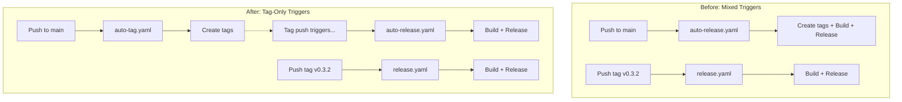
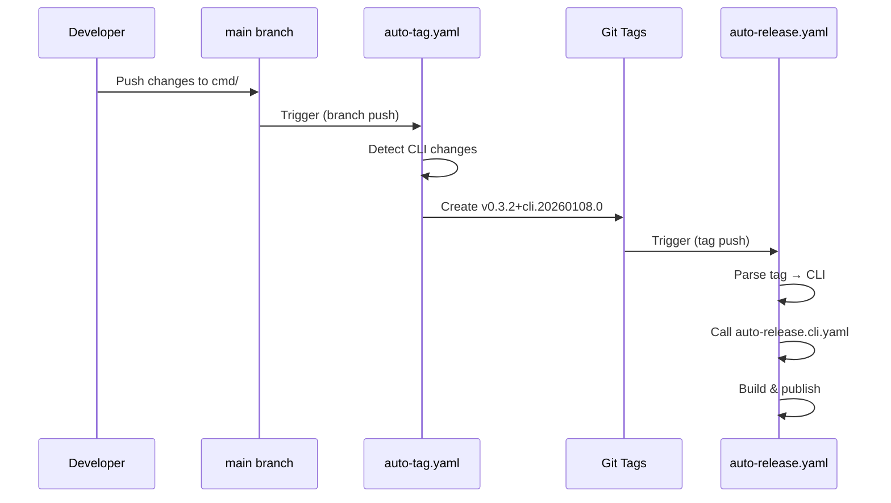
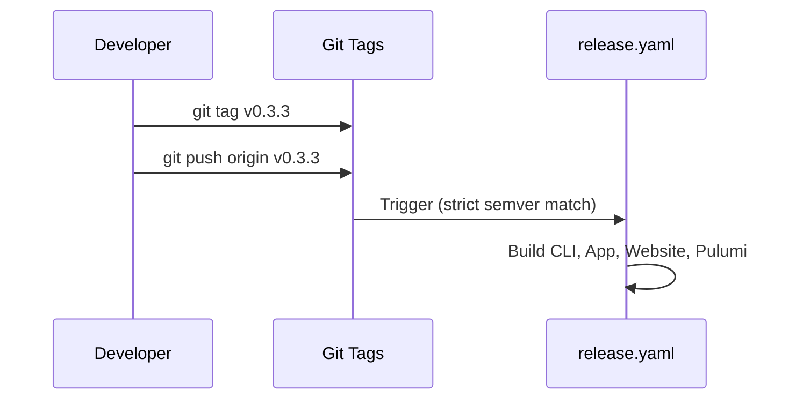

# Tag-Based Release Architecture

**Date**: January 8, 2026
**Type**: Enhancement
**Components**: Build System, GitHub Actions, Release Management

## Summary

Restructured the release system to ensure all releases (both auto and semantic) are triggered exclusively by tags. Split the auto-release workflow into a tag creator (`auto-tag.yaml`) and release executor (`auto-release.yaml`), providing consistent, auditable, and rerunnable release pipelines.

## Problem Statement / Motivation

### Inconsistent Triggers

The release system had inconsistent trigger mechanisms:

| Workflow | Trigger | Issue |
|----------|---------|-------|
| `release.yaml` | Tag push (`v*`) | Correct |
| `auto-release.yaml` | Branch push (main) | Inconsistent |

Auto-releases triggered on branch pushes meant:
- No clear audit trail (commits vs tags)
- Couldn't re-trigger a failed release without re-pushing code
- Different behavior between auto and semantic releases
- Potential for `release.yaml` to match auto-release tags due to loose `v*` pattern

### Pain Points

- **No retry mechanism**: If auto-release failed, had to push a new commit
- **Audit confusion**: Hard to tell what triggered a release (commit or tag)
- **Pattern overlap**: `v*` in release.yaml could match `v0.3.2+cli.20260108.0`
- **Coupled concerns**: Tag creation and release building were intertwined

## Solution / What's New

### Architecture Split



### New Workflow Structure

| Workflow | Trigger | Purpose |
|----------|---------|---------|
| `auto-tag.yaml` | Push to main with path changes | Detects changes, creates and pushes tags |
| `auto-release.yaml` | Tags: `v*+cli.*`, `v*+app.*`, `v*+website.*`, `v*+pulumi.*`, `v*+terraform.*` | Builds and releases auto-release components |
| `release.yaml` | Tags: `v[0-9]+.[0-9]+.[0-9]+` (strict semver) | Builds and releases semantic versions |

### Strict Semver Pattern

Changed `release.yaml` from loose to strict tag matching:

```yaml
# Before (matches auto-release tags too!)
on:
  push:
    tags:
      - 'v*'

# After (strict semver only)
on:
  push:
    tags:
      - 'v[0-9]+.[0-9]+.[0-9]+'
```

This ensures:
- `v0.3.2` → triggers `release.yaml`
- `v0.3.2+cli.20260108.0` → triggers `auto-release.yaml` (not release.yaml)

## Implementation Details

### Files Created

| File | Purpose |
|------|---------|
| `.github/workflows/auto-tag.yaml` | Detects changes on push to main, creates and pushes tags |

### Files Modified

| File | Changes |
|------|---------|
| `.github/workflows/auto-release.yaml` | Changed trigger from branch to tag patterns; parses tag to dispatch to component workflows |
| `.github/workflows/release.yaml` | Changed to strict semver pattern |
| `.github/workflows/auto-release.cli.yaml` | Removed tag creation step |
| `.github/workflows/auto-release.app.yaml` | Removed tag creation step |
| `.github/workflows/auto-release.website.yaml` | Removed tag creation job |
| `.github/workflows/auto-release.pulumi-modules.yaml` | Removed tag creation from orchestrator path |
| `.github/workflows/auto-release.terraform-modules.yaml` | Removed tag creation step |

### Tag Parsing in auto-release.yaml

The new auto-release.yaml parses the tag to determine component type:

```yaml
# Extract component from tag: v0.3.2+cli.20260108.0 → cli
COMPONENT=$(echo "${TAG}" | sed 's/v[0-9]*\.[0-9]*\.[0-9]*+\([^.]*\)\..*/\1/')
```

Then dispatches to the appropriate reusable workflow based on component.

## Benefits

### Visibility

When looking at the Actions tab:
- **`auto-tag` running** → Changes detected, tags being created
- **`auto-release` running** → Something is being released (clear signal)
- **Only `auto-tag` ran** → Changes detected but no releasable components

### Consistency

All releases now follow the same pattern:
1. Tag is pushed (manually or by auto-tag)
2. Release workflow triggers on tag
3. Artifacts are built and published

### Auditability

- Tags exist before releases, providing clear audit trail
- Each release can be traced back to a specific tag
- Tags are immutable records of what was released

### Retry Capability

If a release fails:
1. Delete the failed release (if created)
2. Delete and re-push the tag
3. Release workflow re-runs automatically

No need to push a new commit or create a new tag version.

### Manual Override

Can manually create any tag to trigger releases:

```bash
# Manually trigger a CLI auto-release
git tag v0.3.2+cli.20260108.99
git push origin v0.3.2+cli.20260108.99
```

## Flow Examples

### Automatic Flow (Push to main)



### Semantic Release Flow



## Tag Pattern Summary

| Pattern | Example | Triggered Workflow |
|---------|---------|-------------------|
| Strict semver | `v0.3.2` | `release.yaml` |
| CLI auto | `v0.3.2+cli.20260108.0` | `auto-release.yaml` → CLI |
| App auto | `v0.3.2+app.20260108.0` | `auto-release.yaml` → App |
| Website auto | `v0.3.2+website.20260108.0` | `auto-release.yaml` → Website |
| Pulumi auto | `v0.3.2+pulumi.awsecsservice.20260108.0` | `auto-release.yaml` → Pulumi |
| Terraform auto | `v0.3.2+terraform.awsecsservice.20260108.0` | `auto-release.yaml` → Terraform |

## Related Work

- **Prior**: Semver Build Metadata Tags (`2026-01-08-061943`)
- **Prior**: Unified Auto-Release System (`2026-01-07-200000`)
- **Prior**: Multi-Platform Pulumi Binaries (`2026-01-08-063000`)

---

**Status**: ✅ Ready for Review
**Timeline**: ~45 minutes implementation

