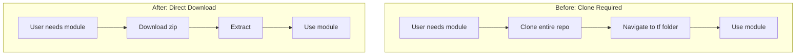
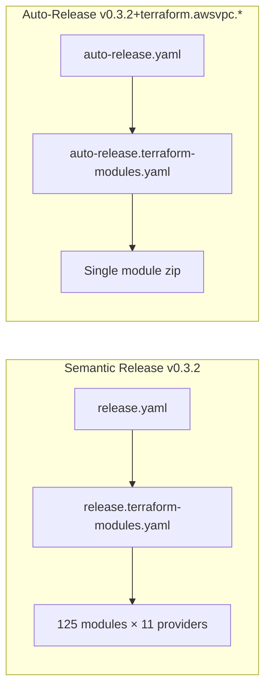

# Terraform Module Zip Artifacts in Release Workflows

**Date**: January 8, 2026
**Type**: Enhancement
**Components**: Build System, GitHub Actions, Release Management

## Summary

Added Terraform module zip artifacts to both semantic releases and auto-releases, bringing Terraform modules to parity with Pulumi binaries. Instead of requiring users to clone the entire monorepo to access Terraform modules, they can now download pre-packaged zip files directly from GitHub Releases.

## Problem Statement / Motivation

### The Efficiency Gap

After implementing pre-built Pulumi binaries in the release workflow, we observed significant efficiency gains:

| Approach | Time to Ready | Network | Disk |
|----------|---------------|---------|------|
| Clone entire monorepo | ~2-5 minutes | ~500MB+ | ~1GB+ |
| Download Pulumi binary | ~5-10 seconds | ~10-50MB | ~50MB |

However, Terraform users still had to clone the entire monorepo to access a single module.

### Pain Points

- **Slow module access**: Cloning a large monorepo just to get a few `.tf` files
- **Wasted bandwidth**: Downloading hundreds of MB when needing only KB
- **Inconsistent user experience**: Pulumi users get fast binary downloads, Terraform users wait for clone
- **CI/CD inefficiency**: Every Terraform deployment starts with a full repo clone

## Solution / What's New

### Zip Artifacts for All Terraform Modules

Each Terraform module's `tf/` folder is now zipped and attached to releases as `terraform-{component}.zip`.



### Two Release Paths

Both semantic releases and auto-releases now produce Terraform zip artifacts:



## Implementation Details

### Files Created

| File | Purpose |
|------|---------|
| `.github/workflows/release.terraform-modules.yaml` | New reusable workflow for semantic releases |

### Files Modified

| File | Changes |
|------|---------|
| `.github/workflows/release.yaml` | Added `terraform-modules` job call |
| `.github/workflows/auto-release.terraform-modules.yaml` | Added zip creation and upload steps |

### Semantic Release Workflow (`release.terraform-modules.yaml`)

The new workflow uses a provider-based matrix strategy:

```yaml
strategy:
  matrix:
    provider:
      - atlas
      - auth0
      - aws
      - azure
      - civo
      - cloudflare
      - confluent
      - digitalocean
      - gcp
      - kubernetes
      - snowflake
```

**Key characteristics:**
- **11 parallel jobs** (one per provider)
- **Dynamic discovery**: Scans each provider for components with `v1/iac/tf` folders
- **No platform matrix needed**: Terraform is platform-agnostic (unlike Pulumi's 4 platforms)
- **Fast execution**: Just zip + upload, no compilation

### Auto-Release Workflow Updates

The `auto-release.terraform-modules.yaml` now includes three new steps:

1. **Zip Terraform module**: Creates `terraform-{component}.zip` from the `tf/` folder
2. **Create GitHub Release**: Enhanced release notes with download instructions
3. **Upload zip to release**: Attaches the zip artifact

### Artifact Naming Convention

| Release Type | Example Tag | Artifact Name |
|--------------|-------------|---------------|
| Semantic | `v0.3.2` | `terraform-awsvpc.zip` |
| Auto | `v0.3.2+terraform.awsvpc.20260108.0` | `terraform-awsvpc.zip` |

### Comparison: Pulumi vs Terraform Release Artifacts

| Aspect | Pulumi | Terraform |
|--------|--------|-----------|
| Build step | Go compilation | None (just zip) |
| Platforms | 4 (linux, darwin arm/amd, windows) | 1 (platform-agnostic) |
| Jobs per provider (semantic) | 4 | 1 |
| Total jobs (semantic) | 44 | 11 |
| Artifact format | `.gz` compressed binary | `.zip` folder contents |
| Artifact naming | `pulumi-{component}_{platform}.gz` | `terraform-{component}.zip` |

## Benefits

### For Users

- **Faster module access**: Download a small zip instead of cloning a large repo
- **Reduced bandwidth**: KB instead of GB for a single module
- **Simpler usage**: `curl + unzip` instead of `git clone + cd`
- **Consistent experience**: Same download pattern as Pulumi binaries

### For CI/CD Pipelines

- **Faster builds**: No git clone overhead
- **Reduced network costs**: Minimal download size
- **Better caching**: Zip artifacts are easily cached by URL

### For Operations

- **Parallel release**: 11 providers zip in parallel during semantic releases
- **Audit trail**: Each release has explicit artifacts attached
- **Retry capability**: Failed uploads can be re-run without rebuilding

## Usage Examples

### Download and Use a Module

```bash
# Download the module
curl -LO https://github.com/plantonhq/project-planton/releases/download/v0.3.2/terraform-awsvpc.zip

# Extract
unzip terraform-awsvpc.zip -d awsvpc
cd awsvpc

# Initialize and apply
terraform init
terraform plan
terraform apply
```

### Reference in Terraform (Alternative)

The git source approach still works for those who prefer it:

```hcl
module "awsvpc" {
  source = "git::https://github.com/plantonhq/project-planton.git//apis/org/project_planton/provider/aws/awsvpc/v1/iac/tf?ref=v0.3.2"
}
```

## Impact

### Module Count

- **125 Terraform modules** across 11 providers now get zip artifacts
- Each semantic release uploads 125 zip files
- Auto-releases upload individual module zips on-demand

### Release Size Impact

Terraform zips are small (typically 5-50KB each), so total release size increase is minimal compared to Pulumi binaries (which are 10-50MB each).

## Related Work

- **Prior**: Tag-Based Release Architecture (`2026-01-08-063453`)
- **Prior**: Multi-Platform Pulumi Binaries (`2026-01-08-063000`)
- **Prior**: Use Pulumi Binary in CLI (`2026-01-08-052417`)
- **Next**: CLI changes to download Terraform zip instead of cloning monorepo

---

**Status**: ✅ Production Ready
**Timeline**: ~30 minutes implementation

