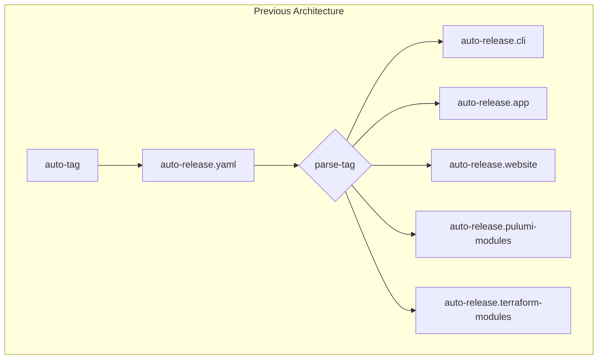
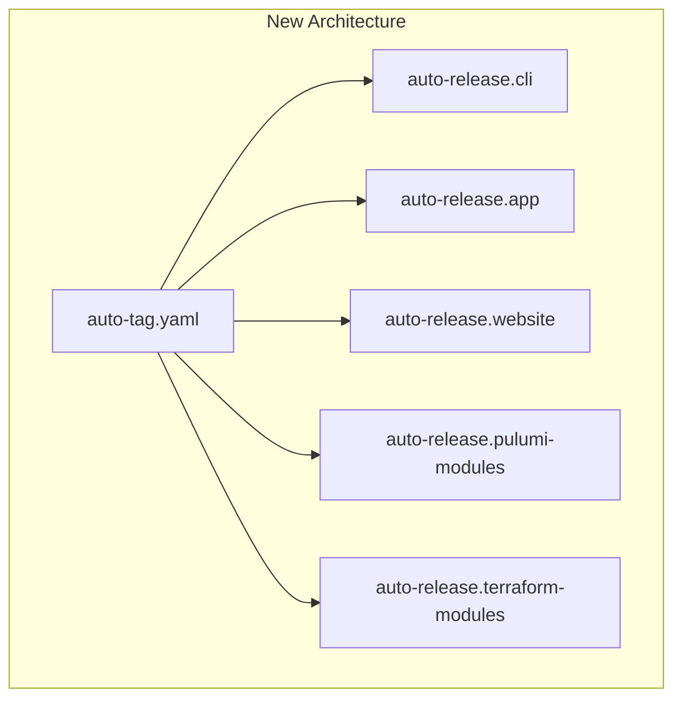

# Direct Component Auto-Release Architecture

**Date**: January 8, 2026
**Type**: Refactoring
**Components**: CI/CD, GitHub Actions, Auto-Release Workflows

## Summary

Eliminated the centralized `auto-release.yaml` orchestrator in favor of direct workflow dispatch from `auto-tag.yaml` to component-specific release workflows. This architectural change provides better visibility in GitHub Actions UI, where each component's release now appears as a distinct workflow run with a descriptive name.

## Problem Statement / Motivation

The previous architecture used a two-tier approach:

1. `auto-tag.yaml` created tags and triggered `auto-release.yaml`
2. `auto-release.yaml` parsed the tag, determined the component type, and called the appropriate reusable workflow

### Pain Points

- **Poor visibility**: All auto-releases appeared under a single "auto-release" workflow name in GitHub Actions
- **Confusing workflow runs**: Couldn't tell at a glance what component was being released
- **Extra layer of indirection**: The orchestrator added complexity without providing value
- **Generic run names**: Workflow runs displayed as "auto-release" with no context about what was being built



All runs appeared as "auto-release" in the Actions UI, making it impossible to quickly see what was being released.

## Solution / What's New

Removed the `auto-release.yaml` orchestrator entirely. Now `auto-tag.yaml` directly triggers each component-specific workflow via `workflow_dispatch`.



### Key Changes

1. **Converted reusable workflows to standalone workflows**: Each `auto-release.*.yaml` now uses `workflow_dispatch` instead of `workflow_call`

2. **Direct workflow triggering**: `auto-tag.yaml` calls each component's workflow directly with all required inputs

3. **Descriptive run names**: Added `run-name` to all workflows for immediate visibility:

   - `CLI Release: v0.3.5-cli.20260108.0`
   - `App Release: v0.3.5-app.20260108.0`
   - `Pulumi: awsecsservice (v0.3.5-pulumi.awsecsservice.20260108.0)`
   - `Terraform: postgres (v0.3.5-terraform.postgres.20260108.0)`

4. **Simplified Pulumi/Terraform workflows**: Removed complex matrix expansion logic since each workflow now receives a single component

## Implementation Details

### Workflow Trigger Changes

**Before (reusable workflow)**:

```yaml
on:
  workflow_call:
    inputs:
      tag:
        required: true
        type: string
```

**After (standalone workflow)**:

```yaml
on:
  workflow_dispatch:
    inputs:
      tag:
        required: true
        type: string
```

### Run Name Configuration

Added `run-name` to each workflow for visibility:

```yaml
name: auto-release.cli
run-name: 'CLI Release: ${{ inputs.tag }}'
```

### Pulumi/Terraform Input Changes

These workflows now receive component details directly instead of parsing them from the tag:

```yaml
on:
  workflow_dispatch:
    inputs:
      tag:
        description: 'Tag to release'
        required: true
        type: string
      component:
        description: 'Component name'
        required: true
        type: string
      provider:
        description: 'Provider name'
        required: true
        type: string
      path:
        description: 'Path to module'
        required: true
        type: string
```

### Auto-Tag Output Changes

`auto-tag.yaml` now outputs JSON for Pulumi and Terraform modules:

```yaml
outputs:
  pulumi_modules: ${{ steps.detect.outputs.pulumi_modules }} # JSON array
  terraform_modules: ${{ steps.detect.outputs.terraform_modules }} # JSON array
```

### Trigger Logic

```javascript
// Trigger Pulumi releases
const modules = JSON.parse('${{ needs.create-tags.outputs.pulumi_modules }}');
for (const mod of modules) {
  await github.rest.actions.createWorkflowDispatch({
    owner: context.repo.owner,
    repo: context.repo.repo,
    workflow_id: 'auto-release.pulumi-modules.yaml',
    ref: 'main',
    inputs: {
      tag: mod.tag,
      component: mod.component,
      provider: mod.provider,
      path: mod.path,
    },
  });
}
```

## Files Changed

| File                                                    | Change                                                    |
| ------------------------------------------------------- | --------------------------------------------------------- |
| `.github/workflows/auto-release.yaml`                   | **Deleted**                                               |
| `.github/workflows/auto-release.cli.yaml`               | `workflow_call` → `workflow_dispatch`, added `run-name`   |
| `.github/workflows/auto-release.app.yaml`               | `workflow_call` → `workflow_dispatch`, added `run-name`   |
| `.github/workflows/auto-release.website.yaml`           | `workflow_call` → `workflow_dispatch`, added `run-name`   |
| `.github/workflows/auto-release.pulumi-modules.yaml`    | Simplified to single-component dispatch, added `run-name` |
| `.github/workflows/auto-release.terraform-modules.yaml` | Simplified to single-component dispatch, added `run-name` |
| `.github/workflows/auto-tag.yaml`                       | Direct workflow dispatch, JSON outputs, added `run-name`  |
| `.github/workflows/docs/auto-tags.md`                   | Updated documentation                                     |

## Benefits

### Immediate Visibility

Before:

```
✅ auto-release - Manually run by github-actions [bot]
✅ auto-release - Manually run by github-actions [bot]
```

After:

```
✅ CLI Release: v0.3.5-cli.20260108.0
✅ Pulumi: awsecsservice (v0.3.5-pulumi.awsecsservice.20260108.0)
✅ Terraform: postgres (v0.3.5-terraform.postgres.20260108.0)
```

### Simplified Architecture

- **One less workflow file**: Removed `auto-release.yaml` (orchestrator)
- **No tag parsing needed**: Component info passed directly as inputs
- **Cleaner workflow definitions**: Each workflow is self-contained

### Easier Debugging

- Failed releases clearly show which component failed
- Can re-run individual component releases without affecting others
- Workflow history provides clear audit trail per component

### Manual Trigger Improvements

Manual re-runs are now component-specific:

```bash
# Re-run CLI release
gh workflow run auto-release.cli.yaml -f tag=v0.3.5-cli.20260108.0

# Re-run Pulumi module release
gh workflow run auto-release.pulumi-modules.yaml \
  -f tag=v0.3.5-pulumi.awsecsservice.20260108.0 \
  -f component=awsecsservice \
  -f provider=aws \
  -f path=apis/org/project_planton/provider/aws/awsecsservice/v1/iac/pulumi
```

## Impact

### GitHub Actions UI

- Each component release appears as a separate workflow run
- Run names immediately convey what's being released
- Easier to filter and find specific releases

### Workflow Maintainability

- Each workflow is independent and can be modified without affecting others
- No central orchestration logic to maintain
- Clear separation of concerns

### Developer Experience

- At-a-glance understanding of what's running
- Faster identification of failed releases
- Simplified manual re-runs

## Related Work

- [Tag-based release architecture](./_changelog/2026-01/2026-01-08-063453-tag-based-release-architecture.md) - Initial implementation of tag-based releases
- [Semver build metadata tags](./_changelog/2026-01/2026-01-08-061943-semver-build-metadata-tags.md) - Tag format standardization

---

**Status**: ✅ Production Ready
**Timeline**: ~1 hour implementation
