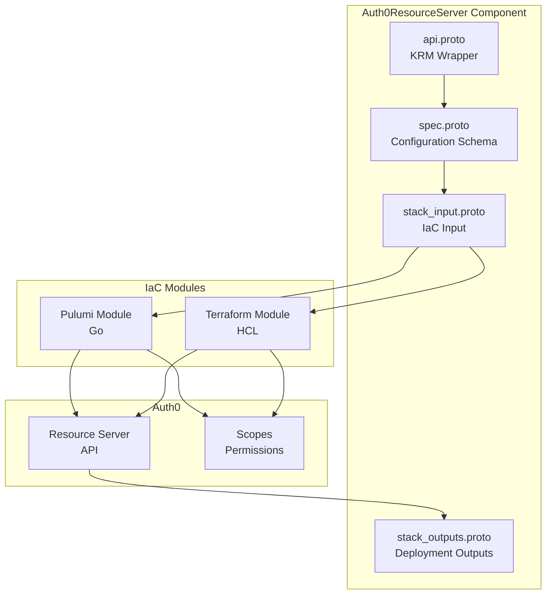
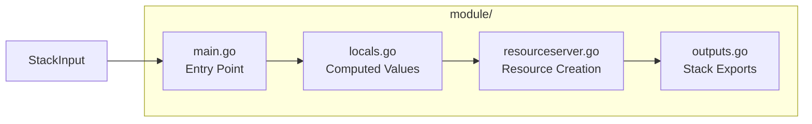

# Auth0 Resource Server Deployment Component

**Date**: January 10, 2026
**Type**: Feature
**Components**: Auth0 Provider, API Definitions, Pulumi Module, Terraform Module, Validation Tests

## Summary

Added a complete Auth0ResourceServer deployment component for managing Auth0 APIs (Resource Servers) with both Pulumi and Terraform IaC modules. Additionally enhanced Auth0EventStream webhook authorization with CEL validations for better input validation. This component enables infrastructure-as-code management of API configurations including scopes (permissions), token settings, and RBAC policies.

## Problem Statement / Motivation

Auth0 Resource Servers represent APIs that applications can request access to. They're fundamental to OAuth 2.0/OIDC authorization flows, defining:
- The `audience` parameter for authorization calls
- Scopes (permissions) for fine-grained access control
- Token signing and lifetime configurations
- RBAC policies for role-based permissions

### Pain Points

- No existing Project Planton component for managing Auth0 Resource Servers
- Manual Auth0 dashboard configuration is error-prone and not auditable
- Token settings (lifetime, dialect, signing algorithm) needed declarative management
- RBAC policy enforcement lacked infrastructure-as-code support
- Auth0EventStream webhook authorization lacked validation for required fields

## Solution / What's New

Implemented a complete Auth0ResourceServer deployment component following Project Planton patterns, with field selection guided by Pareto's principle (80/20) - exposing the most commonly used 20% of features that cover 80% of use cases.

### Component Architecture



### Key Features Exposed

Applied Pareto principle to select the most impactful fields:

| Feature | Field | Description |
|---------|-------|-------------|
| API Identifier | `identifier` | The unique API identifier (audience) |
| Display Name | `name` | Human-readable name |
| Signing Algorithm | `signing_alg` | RS256, HS256, or PS256 |
| Offline Access | `allow_offline_access` | Enable refresh tokens |
| Token Lifetime | `token_lifetime` | Access token TTL (0-2592000s) |
| Web Token Lifetime | `token_lifetime_for_web` | Browser-specific TTL |
| First-Party Consent | `skip_consent_for_verifiable_first_party_clients` | Skip consent for trusted apps |
| RBAC Enforcement | `enforce_policies` | Enable RBAC authorization |
| Token Dialect | `token_dialect` | Token format (access_token, rfc9068_profile, etc.) |
| Scopes | `scopes` | List of permission definitions |

### Intentionally Omitted (Advanced Features)

- `token_encryption` - Rarely used, complex setup
- `proof_of_possession` - Advanced DPoP scenarios
- `authorization_details` - Rich authorization requests
- `consent_policy` / `verification_location` - Custom consent flows

## Implementation Details

### Proto Definitions

**spec.proto** - Configuration schema with buf.validate rules:

```protobuf
message Auth0ResourceServerSpec {
  // Required: Unique API identifier (the "audience" in OAuth)
  string identifier = 1 [(buf.validate.field).required = true];
  
  // Display name for the API
  string name = 2;
  
  // Token signing algorithm with enum validation
  string signing_alg = 3 [(buf.validate.field).string = {
    in: [ "", "RS256", "HS256", "PS256" ]
  }];
  
  // Enable refresh tokens for offline access
  bool allow_offline_access = 4;
  
  // Token lifetime with range validation (0-30 days)
  int32 token_lifetime = 5 [(buf.validate.field).int32 = { gte: 0, lte: 2592000 }];
  
  // Scopes (permissions) for this API
  repeated Auth0ResourceServerScope scopes = 10;
}
```

### Pulumi Module Structure



**Key implementation patterns:**

1. **Provider Configuration**: Supports both explicit credentials and environment variable fallback
2. **Scopes Management**: Uses separate `ResourceServerScopes` resource for better lifecycle management
3. **Output Exports**: Comprehensive outputs including ID, identifier, signing secret, and token settings

### Terraform Module

Feature parity with Pulumi module:

```hcl
resource "auth0_resource_server" "this" {
  identifier                               = var.identifier
  name                                     = local.name
  signing_alg                              = local.signing_alg
  allow_offline_access                     = var.allow_offline_access
  token_lifetime                           = local.token_lifetime
  token_lifetime_for_web                   = local.token_lifetime_for_web
  skip_consent_for_verifiable_first_party_clients = var.skip_consent_for_verifiable_first_party_clients
  enforce_policies                         = var.enforce_policies
  token_dialect                            = local.token_dialect
}

resource "auth0_resource_server_scopes" "this" {
  count              = length(var.scopes) > 0 ? 1 : 0
  resource_server_identifier = auth0_resource_server.this.identifier
  
  dynamic "scopes" {
    for_each = var.scopes
    content {
      name        = scopes.value.name
      description = scopes.value.description
    }
  }
}
```

### Auth0EventStream Webhook Validation Enhancement

Added CEL validations for webhook authorization:

```protobuf
message Auth0WebhookAuthorization {
  // Token required when method is "bearer"
  option (buf.validate.message).cel = {
    id: "webhook_auth_bearer_token_required"
    message: "token is required when authorization method is 'bearer'"
    expression: "this.method != 'bearer' || this.token != ''"
  };

  // Username required when method is "basic"
  option (buf.validate.message).cel = {
    id: "webhook_auth_basic_username_required"
    message: "username is required when authorization method is 'basic'"
    expression: "this.method != 'basic' || this.username != ''"
  };
  
  // Password required when method is "basic"
  option (buf.validate.message).cel = {
    id: "webhook_auth_basic_password_required"
    message: "password is required when authorization method is 'basic'"
    expression: "this.method != 'basic' || this.password != ''"
  };
}
```

### Validation Tests

Comprehensive test coverage with 27 test cases:

```
Auth0ResourceServer Validation
├── spec.proto validations
│   ├── identifier (required)
│   │   ├── ✓ fails when empty
│   │   └── ✓ passes with valid value
│   ├── signing_alg (enum)
│   │   ├── ✓ passes when empty (default)
│   │   ├── ✓ passes with RS256
│   │   ├── ✓ passes with HS256
│   │   ├── ✓ passes with PS256
│   │   └── ✓ fails with invalid value
│   ├── token_lifetime (range 0-2592000)
│   │   ├── ✓ passes with 0
│   │   ├── ✓ passes with max
│   │   └── ✓ fails when exceeds max
│   ├── token_dialect (enum)
│   │   └── ... 5 test cases
│   └── scopes
│       ├── ✓ scope name required
│       └── ✓ description optional
└── api.proto validations
    ├── ✓ metadata.name required
    └── ✓ spec required
```

## Benefits

### For Infrastructure Teams
- **Declarative API Management**: Define Auth0 APIs as YAML manifests
- **Audit Trail**: All API configuration changes tracked in Git
- **Consistency**: Same configuration applied across environments
- **Validation**: Catch configuration errors before deployment

### For Developers
- **Self-Service**: Request API access through familiar YAML workflows
- **Documentation**: Auto-generated examples and usage guides
- **Scope Management**: Define and manage permissions programmatically

### For Security
- **RBAC Support**: Enable role-based access control via `enforce_policies`
- **Token Configuration**: Control token lifetime and format declaratively
- **Compliance**: Auditable infrastructure-as-code for API configurations

## Impact

### Files Changed

| Category | Count | Description |
|----------|-------|-------------|
| Proto definitions | 4 | spec, api, stack_input, stack_outputs |
| Generated Go | 4 | Protobuf Go files |
| Generated TypeScript | 4 | Frontend type definitions |
| Pulumi module | 5 | Go implementation |
| Terraform module | 5 | HCL implementation |
| Documentation | 4 | README, examples, overview, docs |
| Tests | 1 | 27 validation test cases |
| Registry | 2 | cloud_resource_kind.proto update |
| **Total** | **45** | files changed |

### New Component Registration

```protobuf
Auth0ResourceServer = 2103 [(kind_meta) = {
  provider: auth0
  version: v1
  id_prefix: "a0rs"
}];
```

## Usage Examples

### Basic API Configuration

```yaml
apiVersion: auth0.project-planton.io/v1
kind: Auth0ResourceServer
metadata:
  name: my-api
spec:
  identifier: https://api.example.com
  name: My API
  signing_alg: RS256
  token_lifetime: 86400
  scopes:
    - name: read:users
      description: Read user data
    - name: write:users
      description: Create and update users
```

### RBAC-Enabled API

```yaml
apiVersion: auth0.project-planton.io/v1
kind: Auth0ResourceServer
metadata:
  name: rbac-api
spec:
  identifier: https://rbac.example.com
  name: RBAC Protected API
  enforce_policies: true
  token_dialect: access_token_authz
  scopes:
    - name: admin
      description: Full administrative access
    - name: read
      description: Read-only access
```

## Related Work

- **Auth0Client**: Application management (connections, grants)
- **Auth0Connection**: Identity provider configuration
- **Auth0EventStream**: Webhook event streaming
- **Provider Configuration**: Shared `Auth0ProviderConfig` for credentials

## Future Enhancements

- [ ] Add support for `token_encryption` for advanced security scenarios
- [ ] Add support for `proof_of_possession` (DPoP) tokens
- [ ] Add support for `authorization_details` (RAR) for fine-grained authorization
- [ ] Add support for custom consent policies

---

**Status**: ✅ Production Ready
**Timeline**: ~4 hours implementation + testing
