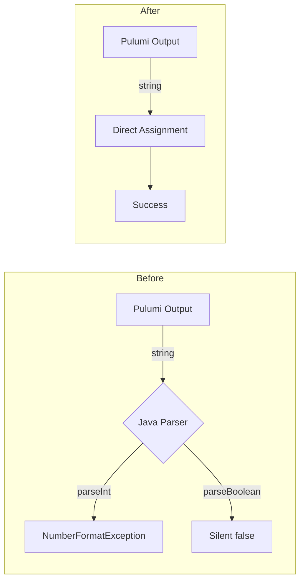

# Auth0 Stack Outputs Standardization to String-Only Fields

**Date**: January 10, 2026
**Type**: Refactoring
**Components**: API Definitions, Auth0 Provider, Proto Schemas

## Summary

Converted all non-string field types (int32, bool) to strings in Auth0 stack_outputs.proto files across all four Auth0 deployment components. This eliminates potential parsing failures when Pulumi outputs contain unexpected values like "unknown" and simplifies the stack output processing in the backend.

## Problem Statement / Motivation

Auth0 deployment component stack jobs were failing in the "update-stack outputs" step with the error:

```
Failed to load stack outputs map to proto: For input string: "unknown"
```

### Pain Points

- Pulumi outputs are serialized as strings, but the Java backend was attempting to parse them as integers
- When Pulumi couldn't resolve a value (API timing, errors), it output "unknown" instead of a number
- `Integer.parseInt("unknown")` throws `NumberFormatException`, causing stack job failures
- Boolean fields silently converted "unknown" to `false` via `Boolean.parseBoolean()`, which could be misleading
- Stack outputs are primarily for display/reference - no computation is performed on them

## Solution / What's New

Standardized all Auth0 stack_outputs.proto files to use only string types, eliminating all integer and boolean parsing:



### Fields Converted

| Component | Field | Old Type | New Type |
|-----------|-------|----------|----------|
| **Auth0Client** | `callback_url_template` | bool | string |
| **Auth0Client** | `global` | bool | string |
| **Auth0Connection** | `is_enabled` | bool | string |
| **Auth0ResourceServer** | `token_lifetime` | int32 | string |
| **Auth0ResourceServer** | `token_lifetime_for_web` | int32 | string |
| **Auth0ResourceServer** | `allow_offline_access` | bool | string |
| **Auth0ResourceServer** | `skip_consent_for_verifiable_first_party_clients` | bool | string |
| **Auth0ResourceServer** | `enforce_policies` | bool | string |
| **Auth0ResourceServer** | `is_system` | bool | string |

**Auth0EventStream** was already all strings - no changes needed.

## Implementation Details

### Proto Changes

Updated 3 stack_outputs.proto files:

**Auth0Client** (`auth0client/v1/stack_outputs.proto`):
```protobuf
// Before
bool callback_url_template = 7;
bool global = 9;

// After
string callback_url_template = 7;
string global = 9;
```

**Auth0Connection** (`auth0connection/v1/stack_outputs.proto`):
```protobuf
// Before
bool is_enabled = 4;

// After
string is_enabled = 4;
```

**Auth0ResourceServer** (`auth0resourceserver/v1/stack_outputs.proto`):
```protobuf
// Before
int32 token_lifetime = 6;
int32 token_lifetime_for_web = 7;
bool allow_offline_access = 8;
bool skip_consent_for_verifiable_first_party_clients = 9;
bool enforce_policies = 10;
bool is_system = 12;

// After
string token_lifetime = 6;
string token_lifetime_for_web = 7;
string allow_offline_access = 8;
string skip_consent_for_verifiable_first_party_clients = 9;
string enforce_policies = 10;
string is_system = 12;
```

### Generated Code Updates

Regenerated stubs for:
- Go: `*.pb.go` files
- TypeScript: `*_pb.ts` files for web console

## Benefits

### For Operations
- **Eliminates parsing failures**: No more `NumberFormatException` on unexpected values
- **Predictable behavior**: All outputs handled uniformly as strings
- **Cleaner error handling**: No silent type coercion

### For Development
- **Simpler mental model**: Stack outputs are always strings
- **Consistent pattern**: Same approach across all deployment components
- **Future-proof**: New Auth0 components should follow this pattern

### For Users
- **Reliable stack jobs**: Auth0 deployments complete successfully
- **Accurate output display**: Values shown as received, not silently converted

## Impact

### Files Changed

| Category | Count | Files |
|----------|-------|-------|
| Proto definitions | 3 | `auth0client`, `auth0connection`, `auth0resourceserver` |
| Generated Go | 3 | `stack_outputs.pb.go` |
| Generated TypeScript | 3 | `stack_outputs_pb.ts` |
| **Total** | **9** | |

### API Compatibility

This is a **backward-compatible change** for consumers:
- Values that were `true`/`false` are now `"true"`/`"false"` strings
- Values that were integers are now string representations
- Consumers displaying outputs see the same information

## Related Work

- Part of Auth0 provider integration (2025-12-30)
- Related to Auth0ResourceServer deployment component (2026-01-10)
- Defensive error handling also added to `StackOutputsMapToProtoLoader.java` in planton monorepo

---

**Status**: ✅ Production Ready
**Timeline**: ~15 minutes implementation
