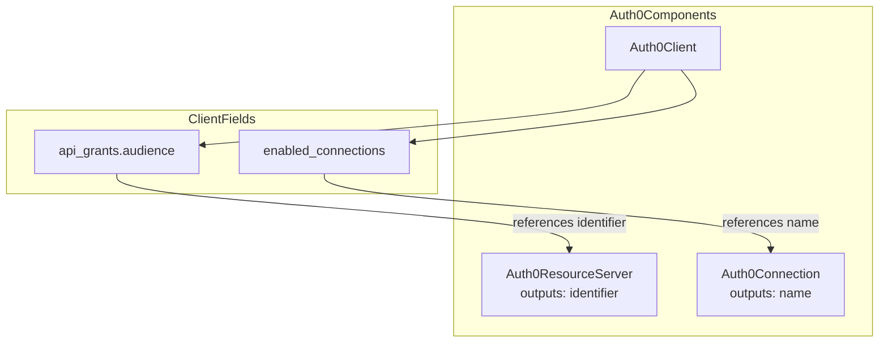

# Auth0Client Cross-Reference Support

**Date**: January 10, 2026
**Type**: Feature Enhancement
**Components**: Auth0Client Proto Spec, IaC Modules (Pulumi/Terraform), Validation Tests, Examples

## Summary

Enhanced Auth0Client deployment component to support cross-references to other Auth0 components using the `StringValueOrRef` pattern. This enables establishing relationships between Auth0Client, Auth0ResourceServer, and Auth0Connection components.

## Problem Statement / Motivation

With the addition of Auth0ResourceServer as a deployment component, there was an opportunity to establish explicit relationships between Auth0 components:

1. **Auth0Client → Auth0ResourceServer**: The `api_grants[].audience` field IS the Resource Server's `identifier`. Previously this was a plain string.
2. **Auth0Client → Auth0Connection**: The `enabled_connections` field limits which connections a client can use. Previously this was `repeated string`.

Without cross-references:
- Users had to manually copy/paste identifiers between components
- No compile-time validation of references
- Hard to track dependencies between components
- Potential for drift when values change

## Solution / What's New

Implemented `StringValueOrRef` pattern for both fields, allowing users to:
- Use direct values: `{value: "https://api.example.com/"}`
- Reference other components: `{value_from: {name: "my-api"}}`

### Relationship Diagram



### Field Changes

| Field | Before | After |
|-------|--------|-------|
| `api_grants[].audience` | `string` | `StringValueOrRef` with `default_kind: Auth0ResourceServer` |
| `enabled_connections` | `repeated string` | `repeated StringValueOrRef` with `default_kind: Auth0Connection` |

## Implementation Details

### Proto Changes (`spec.proto`)

```protobuf
// api_grants[].audience - now supports Auth0ResourceServer references
org.project_planton.shared.foreignkey.v1.StringValueOrRef audience = 1 [
  (buf.validate.field).required = true,
  (org.project_planton.shared.foreignkey.v1.default_kind) = Auth0ResourceServer,
  (org.project_planton.shared.foreignkey.v1.default_kind_field_path) = "status.outputs.identifier"
];

// enabled_connections - now supports Auth0Connection references
repeated org.project_planton.shared.foreignkey.v1.StringValueOrRef enabled_connections = 28 [
  (org.project_planton.shared.foreignkey.v1.default_kind) = Auth0Connection,
  (org.project_planton.shared.foreignkey.v1.default_kind_field_path) = "status.outputs.name"
];
```

### Pulumi Module Updates

Updated `locals.go` to extract values from `StringValueOrRef`:

```go
// Extract enabled_connections values from StringValueOrRef
for _, conn := range spec.EnabledConnections {
    if conn != nil && conn.GetValue() != "" {
        locals.EnabledConnections = append(locals.EnabledConnections, conn.GetValue())
    }
}

// API Grants - extract audience values from StringValueOrRef
for _, grant := range spec.ApiGrants {
    if grant != nil && grant.Audience != nil && grant.Audience.GetValue() != "" {
        locals.ApiGrants = append(locals.ApiGrants, &ApiGrant{
            Audience: grant.Audience.GetValue(),
            // ... other fields
        })
    }
}
```

### Terraform Module Updates

Updated `variables.tf` to use object structure:

```hcl
enabled_connections = optional(list(object({
  value = string
})))

api_grants = optional(list(object({
  audience = object({
    value = string
  })
  // ... other fields
})))
```

## Usage Examples

### M2M Client with Auth0ResourceServer Reference

```yaml
apiVersion: auth0.project-planton.org/v1
kind: Auth0Client
metadata:
  name: backend-service
spec:
  application_type: non_interactive
  grant_types:
    - client_credentials
  api_grants:
    - audience:
        value_from:
          name: my-api  # References Auth0ResourceServer
      scopes:
        - read:resources
```

### SPA with Auth0Connection References

```yaml
apiVersion: auth0.project-planton.org/v1
kind: Auth0Client
metadata:
  name: spa-app
spec:
  application_type: spa
  callbacks:
    - https://app.example.com/callback
  enabled_connections:
    - value_from:
        name: my-database-connection  # References Auth0Connection
    - value_from:
        name: my-google-connection
```

### Mixed Direct Values and References

```yaml
spec:
  enabled_connections:
    - value: "Username-Password-Authentication"  # Direct value
    - value_from:
        name: my-google-connection  # Reference
  api_grants:
    - audience:
        value: "https://tenant.auth0.com/api/v2/"  # Direct Management API
      scopes: [read:users]
    - audience:
        value_from:
          name: my-custom-api  # Reference to Auth0ResourceServer
      scopes: [read:resources]
```

## Benefits

### For Infrastructure Teams
- **Explicit Dependencies**: Clear relationship between Auth0 components
- **Reduced Errors**: No manual copy/paste of identifiers
- **Better Traceability**: Easy to track which clients use which APIs/connections

### For Developers
- **Simpler Configuration**: Reference by name instead of looking up identifiers
- **Consistency**: Same pattern used across Auth0 components (Auth0Connection already uses this for `enabled_clients`)

### For Operations
- **Dependency Graph**: Platform can understand component relationships
- **Validation**: References can be validated before deployment

## Impact

### Files Changed

| Category | Count | Description |
|----------|-------|-------------|
| Proto definition | 1 | spec.proto updated with StringValueOrRef |
| Generated Go | 1 | spec.pb.go regenerated |
| Generated TypeScript | 1 | Frontend types regenerated |
| Pulumi module | 2 | locals.go and client.go updated |
| Terraform module | 2 | variables.tf and locals.tf updated |
| Tests | 1 | spec_test.go with 7 new test cases |
| Documentation | 1 | examples.md with cross-reference section |
| **Total** | **9** | files changed |

### Test Coverage

Added 7 new test cases covering:
- api_grants with direct value
- api_grants with Auth0ResourceServer reference
- enabled_connections with direct value
- enabled_connections with Auth0Connection reference
- Multiple api_grants with mixed references
- Missing required audience validation
- Reference with missing required name validation

## Backward Compatibility

This is a **breaking change** for YAML manifests. The format changes from:

```yaml
# Old format
api_grants:
  - audience: "https://api.example.com/"
enabled_connections:
  - "Username-Password-Authentication"
```

To:

```yaml
# New format
api_grants:
  - audience:
      value: "https://api.example.com/"
enabled_connections:
  - value: "Username-Password-Authentication"
```

Users must update their manifests to use the new structure.

## Related Work

- **Auth0ResourceServer Component**: `2026-01-10-065012-auth0-resource-server-component.md` - Added the component that can now be referenced
- **Auth0Connection.enabled_clients**: Already uses `StringValueOrRef` pattern (established pattern)

---

**Status**: ✅ Production Ready
**Timeline**: ~2 hours implementation + testing
