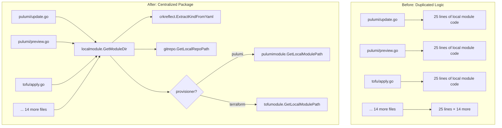

# Local Module Flag Centralization and Kind Name Fallback Fix

**Date**: January 11, 2026
**Type**: Refactoring / Bug Fix
**Components**: CLI Flags, IAC Module Resolution, Error Handling, Kind Reflection

## Summary

Refactored the `--local-module` flag implementation from duplicated code blocks across 17 command handlers into a centralized `localmodule` package. Added a custom error type with actionable hints for better UX. Fixed a critical bug where `ExtractKindNameByKind` returned empty strings for resource kinds without explicit `name` fields in their proto `kind_meta` extension.

## Problem Statement / Motivation

After implementing the initial `--local-module` flag (which auto-detects and uses IaC modules from a locally cloned project-planton repo), we identified two significant issues:

### Pain Points

- **Code Duplication**: The same ~25-line code block was duplicated across 17 command handlers (`pulumi/{update,preview,destroy,refresh,init,cancel,delete}`, `tofu/{apply,destroy,plan,refresh,init}`, and root `{apply,destroy,plan,refresh,init}`)
- **Build Error**: The duplicated code called `manifestObject.GetKind()` on `proto.Message`, which doesn't have this method
- **Poor Error Messages**: Generic errors like "failed to resolve module" with no guidance for users
- **Runtime Bug**: After refactoring, `--local-module` failed with "kind: " (empty) because some resource kinds don't have explicit `name` fields in their proto definitions

## Solution / What's New

### Architecture Overview



### Key Changes

1. **New `localmodule` Package**: Created `pkg/iac/localmodule/local_module.go` with a single `GetModuleDir()` function
2. **YAML-Based Kind Detection**: Uses `crkreflect.ExtractKindFromYaml()` instead of proto reflection, avoiding the `GetKind()` build error
3. **Custom Error Type**: `localmodule.Error` with `Stage`, `Cause`, `Context`, and `Hint` fields
4. **Kind Name Fallback**: Fixed `ExtractKindNameByKind` to return `kind.String()` when `kindMeta.Name` is empty

## Implementation Details

### New `GetModuleDir` Function

The centralized function handles all local module resolution:

```go
func GetModuleDir(targetManifestPath string, cmd *cobra.Command, prov shared.IacProvisioner) (string, error) {
    // 1. Get repo path from flag/env/default
    repoPath := gitrepo.GetLocalRepoPath(cmd)
    
    // 2. Read and parse manifest to extract kind (from YAML, not proto)
    manifestBytes, _ := os.ReadFile(targetManifestPath)
    cloudResourceKind, _ := crkreflect.ExtractKindFromYaml(manifestBytes)
    kindName := crkreflect.ExtractKindNameByKind(cloudResourceKind)
    
    // 3. Verify repo exists
    // 4. Get module path based on provisioner
    // 5. Return path or structured error with hints
}
```

### Custom Error Type for Better UX

```go
type Error struct {
    Stage   string // What step failed (e.g., "reading manifest", "resolving module path")
    Cause   error  // Underlying error
    Context string // Additional context (e.g., "manifest: /path/to/file.yaml")
    Hint    string // Actionable suggestion with multiple options
}
```

**Example error output:**

```
✖ Failed to resolve local module (locating local repository)
  Context: repo path: ~/scm/github.com/plantonhq/project-planton

  The project-planton repository was not found at '~/scm/github.com/plantonhq/project-planton'.
  Options:
  1. Clone the repo: git clone https://github.com/plantonhq/project-planton ~/scm/github.com/plantonhq/project-planton
  2. Set a different path: --project-planton-git-repo /your/path
  3. Use environment variable: export PROJECT_PLANTON_GIT_REPO=/your/path
```

### Kind Name Fallback Fix

The proto `kind_meta` extension for some resource kinds (like `KubernetesNats`) doesn't have an explicit `name` field set. The fix adds a simple fallback:

```go
func ExtractKindNameByKind(kind cloudresourcekind.CloudResourceKind) string {
    kindMeta, err := KindMeta(kind)
    if err != nil {
        return ""
    }
    // Fall back to enum string if Name is not set in proto
    if kindMeta.Name == "" {
        return kind.String()
    }
    return kindMeta.Name
}
```

### Command Handler Refactoring

**Before** (each of 17 handlers):
```go
localModule, _ := cmd.Flags().GetBool(string(flag.LocalModule))
if localModule {
    repoPath := gitrepo.GetLocalRepoPath(cmd)
    // ... 20 more lines of duplicated code ...
}
```

**After** (each handler):
```go
localModule, _ := cmd.Flags().GetBool(string(flag.LocalModule))
if localModule {
    moduleDir, err = localmodule.GetModuleDir(targetManifestPath, cmd, shared.IacProvisioner_pulumi)
    if err != nil {
        if lmErr, ok := err.(*localmodule.Error); ok {
            lmErr.PrintError()
        } else {
            cliprint.PrintError(err.Error())
        }
        os.Exit(1)
    }
}
```

## Benefits

### Code Quality
- **425+ lines removed** across 17 command handlers
- **Single source of truth** for local module resolution
- **Type-safe provisioner selection** using existing `shared.IacProvisioner` enum

### User Experience
- **Actionable error messages** with specific hints
- **Context-aware suggestions** (shows paths, commands to run)
- **Graceful degradation** with clear guidance

### Maintainability
- **One place to update** local module logic
- **Consistent behavior** across all commands
- **Easier testing** (single function to test)

## Impact

### CLI Users
- `--local-module` now works with all resource kinds (including those without explicit `kind_meta.name`)
- Better error messages guide users to solutions
- Consistent behavior across `pulumi`, `tofu`, and root commands

### Developers
- Simpler command handlers
- Clear separation of concerns
- Easy to add new provisioners in the future

## Files Changed

| File | Change |
|------|--------|
| `pkg/iac/localmodule/local_module.go` | **New** - Centralized GetModuleDir function |
| `pkg/iac/localmodule/BUILD.bazel` | **New** - Bazel build file |
| `pkg/crkreflect/kind_name_by_kind.go` | **Modified** - Added fallback to `kind.String()` |
| `cmd/project-planton/root/pulumi/*.go` | **Modified** - 7 files refactored to use localmodule |
| `cmd/project-planton/root/tofu/*.go` | **Modified** - 5 files refactored to use localmodule |
| `cmd/project-planton/root/*.go` | **Modified** - 5 files refactored to use localmodule |

## Usage Example

```bash
# Use local module from default repo path (~/.../project-planton)
project-planton pulumi up --manifest nats.yaml --local-module

# Use local module with custom repo path
project-planton pulumi up --manifest nats.yaml --local-module --project-planton-git-repo /custom/path

# Environment variable also works
export PROJECT_PLANTON_GIT_REPO=/custom/path
project-planton tofu apply --manifest nats.yaml --local-module
```

## Related Work

- **Prior**: `--local-module` flag initial implementation (session before this refactoring)
- **Related**: `pkg/iac/gitrepo/local_repo.go` - GetLocalRepoPath utility
- **Related**: `pkg/crkreflect/kind_from_yaml.go` - ExtractKindFromYaml function

---

**Status**: ✅ Production Ready
**Timeline**: ~2 hours (including debugging the kindName bug)
