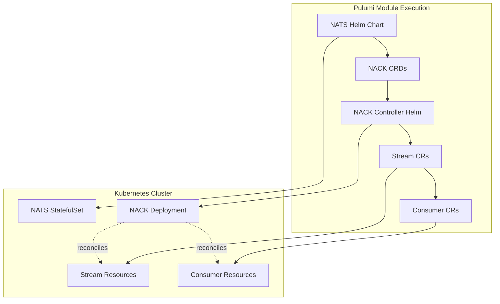
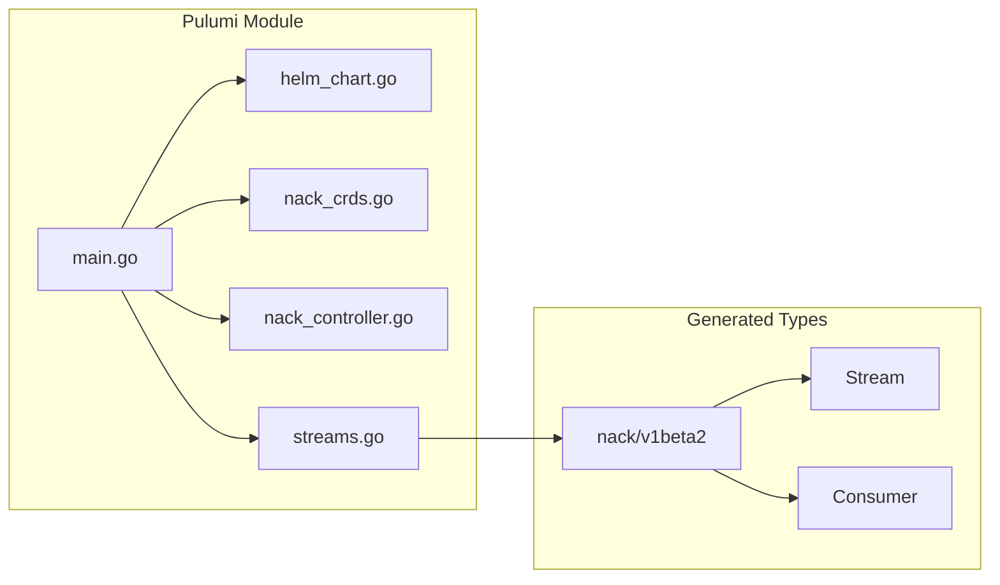
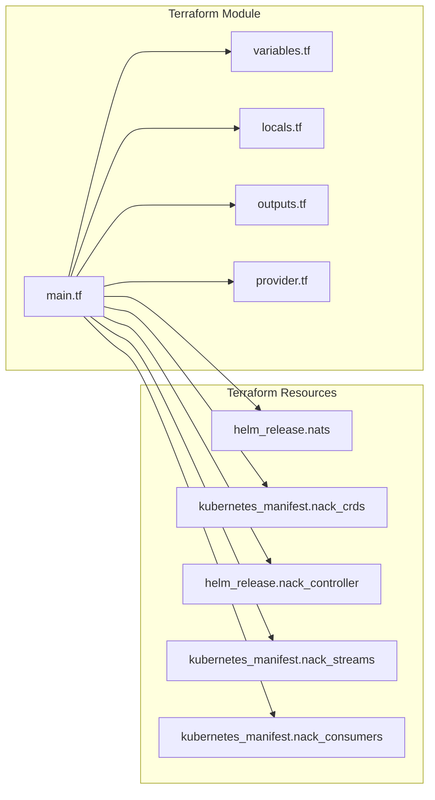
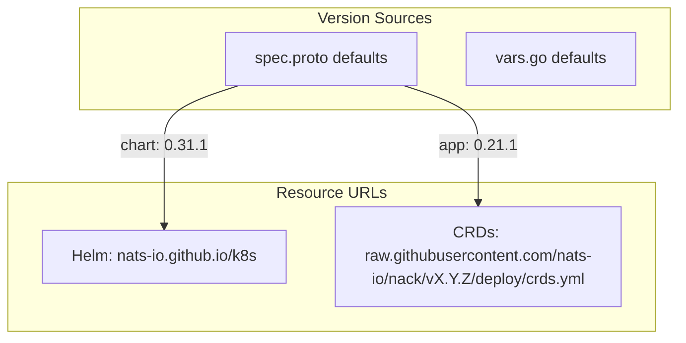
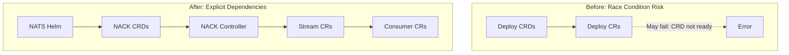

# KubernetesNats JetStream Streams Support with NACK Controller

**Date**: January 11, 2026
**Type**: Feature
**Components**: Kubernetes Provider, API Definitions, Pulumi Module, Terraform Module, IAC Stack Runner

## Summary

Extended the KubernetesNats deployment component to support NACK (NATS Controllers for Kubernetes) and declarative JetStream stream creation. Users can now opt-in to deploy the NACK controller alongside NATS and define streams directly in their YAML manifests, which are reconciled as Kubernetes custom resources.

**Both Pulumi and Terraform modules now have feature parity** for NACK controller and JetStream streams support.

## Problem Statement / Motivation

NATS JetStream provides powerful streaming capabilities, but managing streams required either:
1. Manual stream creation via NATS CLI after deployment
2. Custom scripts or external tooling
3. Separate Kubernetes manifests for NACK CRs

This created operational friction and prevented infrastructure-as-code for the complete NATS ecosystem.

### Pain Points

- No declarative way to define JetStream streams in KubernetesNats manifests
- Stream configuration scattered across multiple tools and workflows
- NACK controller deployment was a separate manual process
- No type safety or validation for stream/consumer configurations
- Race conditions when deploying CRDs and CRs in the same module

## Solution / What's New

Integrated NACK controller deployment and JetStream stream management directly into the KubernetesNats Pulumi module with a clean API.

### Key Features

1. **Opt-in NACK Controller**: Deploy NACK alongside NATS with a simple `nack_controller.enabled: true`
2. **Declarative Streams**: Define streams with subjects, retention, storage, and limits in YAML
3. **Nested Consumers**: Attach consumers to streams for complete JetStream configuration
4. **Strongly-typed Resources**: Generated Go types from NACK CRDs for type-safe Pulumi code
5. **Configurable Versions**: Both Helm chart version and app version exposed for flexibility

### Deployment Flow



## Implementation Details

### API Design (spec.proto)

Extended `KubernetesNatsSpec` with:

```protobuf
// NACK controller configuration
KubernetesNatsNackController nack_controller = 10;

// JetStream streams
repeated KubernetesNatsStream streams = 11;

// NATS Helm chart version
optional string nats_helm_chart_version = 12;
```

**NACK Controller Message**:
```protobuf
message KubernetesNatsNackController {
  bool enabled = 1;
  bool enable_control_loop = 2;
  optional string helm_chart_version = 3;  // Default: "0.31.1"
  optional string app_version = 4;          // Default: "0.21.1"
}
```

**Key Design Decision**: Chart version (`0.31.1`) differs from app version (`0.21.1`). The app version maps to GitHub tags and CRD schemas, while chart version is for Helm. Both are exposed to users.

### Enum Wrapper Pattern

Protobuf enum scoping conflicts required a wrapper message pattern:

```protobuf
message StreamStorageEnum {
  enum Value {
    unspecified = 0;
    file = 1;
    memory = 2;
  }
}
```

This preserves NATS-native values (`file`, `memory`) in YAML output while avoiding C++ scoping collisions.

### Pulumi Module Architecture



**New Files**:
- `nack_crds.go` - Deploys CRDs from versioned GitHub URL
- `nack_controller.go` - Deploys NACK Helm chart with NATS connection config
- `streams.go` - Creates Stream/Consumer CRs using strongly-typed resources

### Strongly-Typed Resources (Pulumi)

Generated Go types from NACK CRDs using `crd2pulumi`:

```go
// Instead of generic apiextensions.CustomResource
stream, err := nackv1beta2.NewStream(ctx, resourceName,
    &nackv1beta2.StreamArgs{
        Metadata: &kubernetesmeta.ObjectMetaArgs{...},
        Spec: &nackv1beta2.StreamSpecArgs{
            Name:      pulumi.StringPtr(stream.Name),
            Subjects:  pulumi.ToStringArray(stream.Subjects),
            Storage:   pulumi.StringPtr("file"),
            Replicas:  pulumi.IntPtr(1),
        },
    },
    pulumi.DependsOn([]pulumi.Resource{nackController}),
)
```

### Terraform Module Architecture



**Terraform Files Modified/Created**:
- `variables.tf` - Added `nack_controller` and `streams` configuration objects
- `locals.tf` - Added NACK versions, CRD URL, consumer flattening logic
- `provider.tf` - Added `helm`, `random`, `tls`, `http` providers
- `main.tf` - Added NACK CRDs, controller, streams, and consumers resources
- `outputs.tf` - Added NACK-related outputs (enabled, version, streams_created)
- `README.md` - Updated with NACK and streams documentation
- `examples.md` - Added 3 new examples for NACK/streams configurations

### Terraform Implementation Details

The Terraform module uses `kubernetes_manifest` for CRDs and custom resources:

```hcl
# Fetch NACK CRDs from GitHub
data "http" "nack_crds" {
  count = local.nack_controller_enabled ? 1 : 0
  url   = local.nack_crds_url
}

# Apply NACK CRDs
resource "kubernetes_manifest" "nack_crds" {
  for_each = local.nack_controller_enabled ? {
    for idx, doc in [
      for d in split("---", data.http.nack_crds[0].response_body) :
      yamldecode(d) if trimspace(d) != "" && can(yamldecode(d))
    ] : "${doc.metadata.name}" => doc
  } : {}
  
  manifest   = each.value
  depends_on = [helm_release.nats]
}

# Create Stream custom resources
resource "kubernetes_manifest" "nack_streams" {
  for_each = local.nack_controller_enabled ? {
    for stream in local.streams : stream.name => stream
  } : {}
  
  manifest = {
    apiVersion = "jetstream.nats.io/v1beta2"
    kind       = "Stream"
    metadata   = { name = lower(each.value.name), namespace = local.namespace }
    spec       = { name = each.value.name, subjects = each.value.subjects, ... }
  }
  
  depends_on = [helm_release.nack_controller]
}
```

### Version Management



**Critical Fix**: Initial implementation used chart version for CRD URL, but CRDs are tagged by app version. This caused silent failures since `v0.31.1` doesn't exist as a GitHub tag.

## YAML Example

```yaml
apiVersion: kubernetes.project-planton.org/v1
kind: KubernetesNats
metadata:
  name: nats-gcp-dev
spec:
  namespace:
    value: planton-gcp-dev
  nack_controller:
    enabled: true
    enable_control_loop: true
  streams:
    - name: api-resources
      subjects:
        - "api.resources.>"
      replicas: 1
      max_age: 5m
      storage: file
      retention: limits
    - name: webhooks
      subjects:
        - "webhooks.>"
      replicas: 1
      storage: file
```

## Terraform Example

```hcl
module "nats_with_streams" {
  source = "./path/to/kubernetesnats/v1/iac/tf"

  metadata = {
    name = "nats-with-streams"
    org  = "my-org"
    env  = "production"
  }

  spec = {
    namespace        = "nats-streams"
    create_namespace = true

    server_container = {
      replicas  = 3
      disk_size = "10Gi"
      resources = {
        limits   = { cpu = "1000m", memory = "2Gi" }
        requests = { cpu = "100m", memory = "256Mi" }
      }
    }

    auth = {
      enabled = true
      scheme  = "basic_auth"
    }

    # Enable NACK controller
    nack_controller = {
      enabled             = true
      enable_control_loop = true
    }

    # Define JetStream streams
    streams = [
      {
        name      = "orders"
        subjects  = ["orders.*", "orders.>"]
        storage   = "file"
        replicas  = 3
        retention = "limits"
        max_age   = "7d"
        consumers = [
          {
            durable_name    = "orders-processor"
            ack_policy      = "explicit"
            max_ack_pending = 1000
          }
        ]
      }
    ]
  }
}

output "streams_created" {
  value = module.nats_with_streams.streams_created
}
```

## Benefits

### For Users

- **Single manifest**: Define NATS + NACK + Streams in one YAML file
- **Validated configuration**: Proto validation catches errors before deployment
- **Version control**: Infrastructure-as-code for complete NATS ecosystem
- **Clean YAML**: Enum values like `file`, `memory`, `limits` map naturally

### For Developers

- **Type-safe Pulumi code**: Compile-time checks via generated Go types
- **Clear dependency chain**: Explicit ordering prevents race conditions
- **Configurable versions**: Users can pin chart/app versions as needed

### Deployment Reliability



## Impact

### Components Affected

**Pulumi Module** (`iac/pulumi/module/`):

| Component | Changes |
|-----------|---------|
| `spec.proto` | +70 lines (NACK, Stream, Consumer messages, enums) |
| `vars.go` | +10 lines (NACK constants, CRD URL template) |
| `locals.go` | +15 lines (version management, URL derivation) |
| `nack_crds.go` | New file (~45 lines) |
| `nack_controller.go` | New file (~60 lines) |
| `streams.go` | New file (~280 lines) |
| `outputs.go` | +5 lines (new output constants) |
| `main.go` | +20 lines (4-step deployment orchestration) |
| `kubernetestypes/Makefile` | +5 lines (gen-nack target) |

**Terraform Module** (`iac/tf/`):

| Component | Changes |
|-----------|---------|
| `variables.tf` | +80 lines (nack_controller, streams, consumers config) |
| `locals.tf` | +40 lines (NACK versions, CRD URL, consumer flattening) |
| `provider.tf` | +20 lines (helm, random, tls, http providers) |
| `main.tf` | +200 lines (CRDs, controller, streams, consumers) |
| `outputs.tf` | +30 lines (NACK-related outputs) |
| `README.md` | +50 lines (NACK documentation, architecture diagram) |
| `examples.md` | +200 lines (3 new NACK/streams examples) |
| `hack/manifest.yaml` | Updated with NACK and streams test config |

**Tests** (`v1/spec_test.go`):

| Component | Changes |
|-----------|---------|
| `spec_test.go` | +300 lines (24 test cases for NACK/streams validation) |

### Generated Code

- `nack/kubernetes/jetstream/v1beta2/` - ~19K lines of generated Go types
- Proto-generated Go: Updated with new messages and enums

## Related Work

- **ChatGPT Consultation**: Recommendations on CRD/CR deployment ordering to avoid race conditions
- **NACK Repository**: `https://github.com/nats-io/nack` - Official NATS Kubernetes controller
- **Helm Charts**: `https://nats-io.github.io/k8s/` - NATS and NACK Helm charts
- **NACK Examples**: `https://github.com/nats-io/nack/tree/main/examples` - Reference configurations

## Testing

### Pulumi Module - Production Deployment

Validated deployment on GKE cluster:

```
Resources:
    + 14 created (6 CRDs + 8 Streams)
    15 unchanged (existing NATS resources)

Duration: 29s
```

All 8 streams successfully created and managed by NACK controller.

### Terraform Module - Unit Tests

Validated spec tests (24 test cases):

```
=== RUN   TestKubernetesNats
Running Suite: KubernetesNats Suite
Will run 24 of 24 specs
••••••••••••••••••••••••

Ran 24 of 24 Specs in 0.012 seconds
SUCCESS! -- 24 Passed | 0 Failed | 0 Pending | 0 Skipped
--- PASS: TestKubernetesNats (0.01s)
PASS
```

### Build Verification

```
✅ make protos  - Proto regeneration successful
✅ make build   - Full build passed (Pulumi modules, Frontend, CLI)
✅ make test    - All tests passed
```

### Test Coverage

| Test Category | Tests |
|---------------|-------|
| Valid NACK controller configuration | 2 |
| Valid streams with consumers | 3 |
| Ingress validation | 2 |
| Stream name validation (length, required) | 3 |
| Stream subjects validation | 2 |
| Stream replicas range validation | 2 |
| Consumer durable_name validation | 2 |
| Real-world GCP dev configuration | 1 |
| Proto message cloning | 1 |
| Default values verification | 2 |
| Storage/retention policy combinations | 4 |

---

**Status**: ✅ Production Ready (Both Pulumi and Terraform)
**Timeline**: 
- Pulumi Module: ~3 hours implementation + debugging
- Terraform Module: ~2 hours implementation + tests
