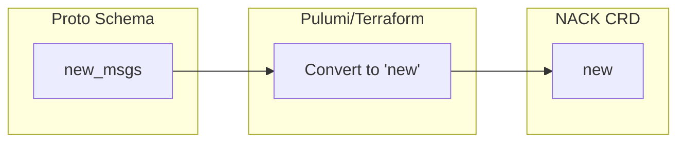

# Fix Java Reserved Keyword in NATS Stream/Consumer Enums

**Date**: January 11, 2026
**Type**: Bug Fix
**Components**: API Definitions, Pulumi Module, Terraform Module

## Summary

Renamed `new` enum values to `new_msgs` in `StreamDiscardEnum` and `ConsumerDeliverPolicyEnum` to avoid Java compilation errors. The word "new" is a reserved keyword in Java and cannot be used as an enum constant.

## Problem Statement / Motivation

The KubernetesNats proto schema defined enum values using `new` for:
- `StreamDiscardEnum.Value.new` - Reject new messages when limits reached
- `ConsumerDeliverPolicyEnum.Value.new` - Deliver only new messages

This caused Java stub generation to fail during build:

```
apis/stubs/java/.../ConsumerDeliverPolicyEnum.java:81: error: enum constant expected here
    new(3),
    ^
apis/stubs/java/.../StreamDiscardEnum.java:73: error: enum constant expected here
    new(2),
    ^
```

### Pain Points

- Java build (`//apis/stubs/java:cloudresource_validation_test`) failed completely
- Blocked all Java-dependent builds and tests
- Reserved keyword collision is a common protobuf pitfall across languages

## Solution / What's New

Renamed the problematic enum values with a `_msgs` suffix:
- `new` → `new_msgs` in both enums
- Added comments explaining why the suffix is needed
- Updated IaC modules to convert `new_msgs` back to `"new"` when sending to NACK CRDs



## Implementation Details

### Proto Schema Changes (`spec.proto`)

```protobuf
message StreamDiscardEnum {
  enum Value {
    unspecified = 0;
    old = 1;
    // Note: Named "new_msgs" instead of "new" because "new" is a reserved keyword in Java.
    // IaC modules convert this to "new" when sending to NACK CRDs.
    new_msgs = 2;
  }
}

message ConsumerDeliverPolicyEnum {
  enum Value {
    unspecified = 0;
    all = 1;
    last = 2;
    // Note: Named "new_msgs" instead of "new" because "new" is a reserved keyword in Java.
    // IaC modules convert this to "new" when sending to NACK CRDs.
    new_msgs = 3;
  }
}
```

### Pulumi Module (`streams.go`)

```go
func discardEnumToString(d kubernetesnatsv1.StreamDiscardEnum_Value) string {
    switch d {
    case kubernetesnatsv1.StreamDiscardEnum_old:
        return "old"
    // Note: Proto enum is "new_msgs" because "new" is a reserved keyword in Java.
    // We convert it back to "new" for NACK CRDs.
    case kubernetesnatsv1.StreamDiscardEnum_new_msgs:
        return "new"
    default:
        return "old"
    }
}
```

### Terraform Module (`main.tf`)

```hcl
# Discard policy
# Note: Convert "new_msgs" to "new" because "new" is a reserved keyword in Java.
# Proto uses "new_msgs" but NACK CRDs expect "new".
discard = each.value.discard == "new_msgs" ? "new" : each.value.discard
```

## Benefits

- **Build restored**: Java stubs now compile successfully
- **API consistency**: NACK CRDs still receive the correct `"new"` value
- **Documentation**: Comments explain the naming decision for future maintainers
- **Cross-language safety**: Pattern can be applied to other reserved keyword conflicts

## Impact

| Component | Changes |
|-----------|---------|
| `spec.proto` | 2 enum values renamed with explanatory comments |
| `streams.go` (Pulumi) | 2 conversion functions updated |
| `main.tf` (Terraform) | 2 conversion expressions added |
| `variables.tf` (Terraform) | Comments updated for documentation |
| `spec_test.go` | 1 test case updated to use new enum name |

## Related Work

- [KubernetesNats JetStream Streams Support](./2026-01-11-150028-kubernetes-nats-jetstream-streams-support.md) - Parent feature that introduced these enums

---

**Status**: ✅ Production Ready
**Timeline**: ~15 minutes fix
