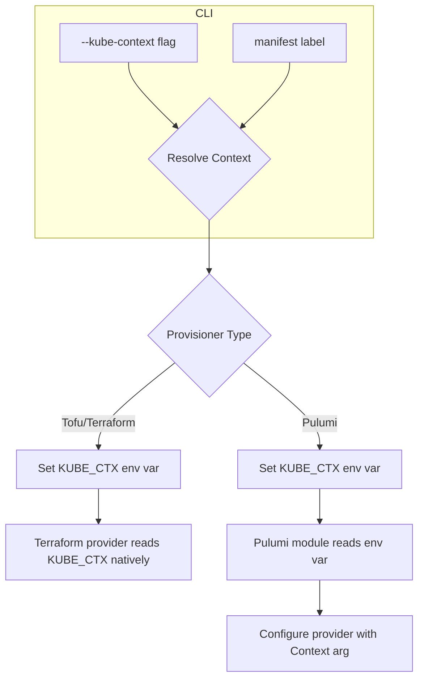

# Kubernetes Context Support via CLI Flag and Manifest Labels

**Date**: January 12, 2026
**Type**: Feature
**Components**: CLI Flags, Kubernetes Provider, Pulumi CLI Integration, IAC Stack Runner, Command Handlers

## Summary

Added support for specifying the kubectl context when running Terraform/OpenTofu and Pulumi modules. The context can be specified via the `--kube-context` CLI flag (highest priority) or through the `kubernetes.project-planton.org/context` manifest label. This enables deploying to specific Kubernetes clusters without modifying the kubeconfig's current context.

## Problem Statement / Motivation

When deploying Kubernetes resources using project-planton, users often need to target specific clusters in multi-cluster environments. Previously, users had to manually switch their kubectl context before running deployments, which was error-prone and didn't allow for declarative context specification in manifests.

### Pain Points

- No way to specify kubectl context via CLI flag
- No way to embed target cluster context in deployment manifests
- Risk of deploying to wrong cluster when managing multiple environments
- Manual context switching required before each deployment
- No parity with how provisioner type is read from labels

## Solution / What's New

Implemented a two-tier context resolution system that mirrors the existing provisioner label pattern:



### Priority Order

1. `--kube-context` CLI flag (if provided)
2. `kubernetes.project-planton.org/context` manifest label (if present)
3. Default context from kubeconfig (if neither specified)

## Implementation Details

### New Package: `pkg/kubernetes/kubecontext`

Created a new package to extract the kubectl context from manifest labels:

```go
// ExtractFromManifest extracts the kubectl context from manifest labels.
func ExtractFromManifest(manifest proto.Message) string {
    labels := metadatareflect.ExtractLabels(manifest)
    if labels == nil {
        return ""
    }
    return labels[kuberneteslabels.KubeContextLabelKey]
}
```

### CLI Flag Addition

Added `--kube-context` flag to all relevant commands:

- `project-planton apply`
- `project-planton plan`
- `project-planton destroy`
- `project-planton init`
- `project-planton refresh`
- `project-planton pulumi update/preview/destroy/refresh`
- `project-planton tofu apply/plan/destroy/init/refresh`

### Terraform/OpenTofu Integration

For Terraform/OpenTofu, the `KUBE_CTX` environment variable is set, which the Kubernetes provider reads natively:

```go
// In providers.go
if kubeContext != "" {
    providerConfigEnvVars["KUBE_CTX"] = kubeContext
}
```

### Pulumi Integration

For Pulumi, the approach involves two steps:

1. Set `KUBE_CTX` env var when executing Pulumi commands:

```go
// In pulumistack/run.go
if kubeContext != "" {
    pulumiCmd.Env = append(pulumiCmd.Env, "KUBE_CTX="+kubeContext)
}
```

2. Read the env var in the Kubernetes provider and configure the `Context` argument:

```go
// In pulumikubernetesprovider/provider.go
if kubernetesProviderConfig == nil {
    kubeContext := os.Getenv("KUBE_CTX")
    providerArgs := &kubernetes.ProviderArgs{
        EnableServerSideApply: pulumi.Bool(true),
    }
    if kubeContext != "" {
        providerArgs.Context = pulumi.String(kubeContext)
    }
    // ...
}
```

## Files Changed

| File | Change |
|------|--------|
| `pkg/kubernetes/kuberneteslabels/labels.go` | Added `KubeContextLabelKey` constant |
| `internal/cli/flag/flag.go` | Added `KubeContext` flag constant |
| `pkg/kubernetes/kubecontext/context.go` | New file - context extraction from labels |
| `cmd/project-planton/root/*.go` | Added flag, context resolution, passing to handlers |
| `cmd/project-planton/root/pulumi/*.go` | Added context resolution and passing |
| `cmd/project-planton/root/tofu/*.go` | Added context resolution and passing |
| `pkg/iac/tofu/tofumodule/providers.go` | Added `kubeContext` param, sets `KUBE_CTX` |
| `pkg/iac/tofu/tofumodule/run_command.go` | Added `kubeContext` param |
| `pkg/iac/pulumi/pulumistack/run.go` | Added `kubeContext` param, sets `KUBE_CTX` |
| `pkg/iac/pulumi/pulumimodule/provider/kubernetes/pulumikubernetesprovider/provider.go` | Reads `KUBE_CTX`, configures provider |

## Usage Examples

### Via CLI Flag

```bash
# Deploy to a specific context
project-planton apply -f manifest.yaml --kube-context my-prod-cluster

# Preview with specific context
project-planton plan -f manifest.yaml --kube-context my-staging-cluster
```

### Via Manifest Label

```yaml
apiVersion: kubernetes.project.planton.org/v1
kind: PostgresKubernetes
metadata:
  name: my-postgres
  labels:
    kubernetes.project-planton.org/context: my-prod-cluster
spec:
  # ...
```

### Combined (Flag Takes Priority)

```bash
# Flag overrides the label in manifest
project-planton apply -f manifest.yaml --kube-context override-context
```

## Benefits

- **Declarative Context Specification**: Embed target cluster in manifests for GitOps workflows
- **CLI Override Capability**: Override manifest context for testing or ad-hoc deployments
- **Consistent Pattern**: Follows existing provisioner label pattern for familiarity
- **Multi-Cluster Safety**: Reduces risk of deploying to wrong cluster
- **Both Provisioners Supported**: Works with Pulumi and Terraform/OpenTofu

## Impact

### For CLI Users

- New `--kube-context` flag available on all deployment commands
- Can specify target cluster declaratively in manifests
- Safer multi-cluster deployments

### For Manifest Authors

- New label `kubernetes.project-planton.org/context` for specifying target cluster
- Manifests become self-contained with deployment target information

### For Developers

- New `kubecontext` package for extracting context from manifests
- Updated function signatures across CLI and IAC execution layers
- Pattern established for future label-based configuration

## Related Work

- Provisioner label extraction (`pkg/iac/provisioner`) - served as pattern for this implementation
- Backend configuration from labels - similar label-based configuration approach

---

**Status**: ✅ Production Ready
**Timeline**: Single session implementation
