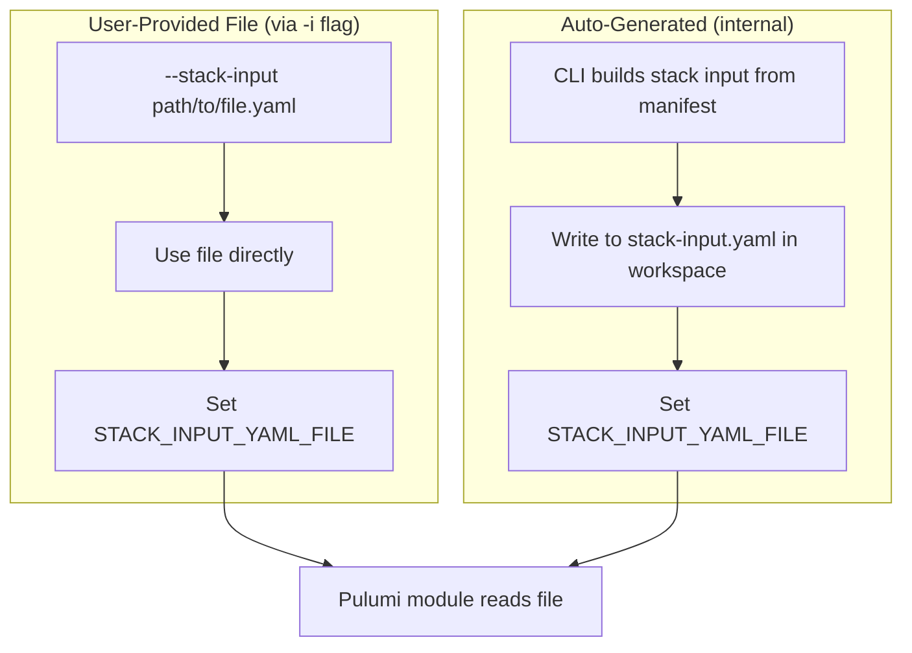

# Stack Input File Support with CLI Flag

**Date**: January 12, 2026
**Type**: Feature
**Components**: CLI Flags, Pulumi CLI Integration, IAC Stack Runner, Command Handlers

## Summary

Added support for passing stack input YAML via file path using the new `--stack-input` / `-i` CLI flag, and changed the internal mechanism to write stack input to a file instead of passing it through environment variable content. This avoids issues with large manifests hitting environment variable size limits.

## Problem Statement / Motivation

When deploying infrastructure with large manifests, the stack input YAML content was passed directly via the `STACK_INPUT_YAML` environment variable. For complex deployments with extensive configurations, this could hit OS environment variable size limits or cause other issues.

### Pain Points

- Environment variable size limits could be exceeded with large stack inputs
- No way to provide a pre-built stack input file directly
- Users debugging Pulumi modules had to manually construct stack input files

## Solution / What's New

Implemented a two-part enhancement:

1. **CLI Flag (`--stack-input` / `-i`)**: Users can provide a pre-built stack input YAML file directly
2. **Internal File-Based Passing**: CLI now writes stack input to a temp file and passes the path via `STACK_INPUT_YAML_FILE` environment variable



### Priority Order

When loading stack input, the Pulumi module checks sources in this order:

1. Pulumi config `planton-cloud:stack-input`
2. `STACK_INPUT_YAML` env var (direct content) - for backward compatibility
3. `STACK_INPUT_YAML_FILE` env var (file path) - new primary mechanism

## Implementation Details

### New Flag Constant

**File**: `internal/cli/flag/flag.go`

```go
StackInput Flag = "stack-input"
```

### Environment Variable Renamed

**File**: `pkg/iac/pulumi/pulumimodule/stackinput/load_stack_input.go`

```go
const (
    PulumiConfigKey   = "planton-cloud:stack-input"
    FilePathEnvVar    = "STACK_INPUT_YAML_FILE"  // Renamed from STACK_INPUT_FILE_PATH
    YamlContentEnvVar = "STACK_INPUT_YAML"
)
```

### Updated Stack Runner

**File**: `pkg/iac/pulumi/pulumistack/run.go`

The `Run()` function now:
- Accepts `stackInputFilePath` parameter
- If user provides `--stack-input`, uses that file directly
- Otherwise, builds stack input from manifest and writes to `stack-input.yaml` in workspace
- Sets `STACK_INPUT_YAML_FILE` env var with the file path

```go
// Determine stack input file path:
// - If user provided --stack-input flag, use that file directly
// - Otherwise, build stack input from manifest and write to temp file
var finalStackInputFilePath string
if stackInputFilePath != "" {
    finalStackInputFilePath = stackInputFilePath
} else {
    stackInputYamlContent, err := stackinput.BuildStackInputYaml(manifestObject, opts)
    // ... write to file
    finalStackInputFilePath = filepath.Join(pulumiModuleRepoPath, "stack-input.yaml")
}

pulumiCmd.Env = append(os.Environ(), 
    pulumimodulestackinput.FilePathEnvVar+"="+finalStackInputFilePath)
```

### Commands Updated

The `--stack-input` / `-i` flag was added to:

- `project-planton apply`
- `project-planton plan`
- `project-planton destroy`
- `project-planton refresh`
- `project-planton pulumi update`
- `project-planton pulumi preview`
- `project-planton pulumi destroy`
- `project-planton pulumi refresh`

## Files Changed

| File | Change |
|------|--------|
| `internal/cli/flag/flag.go` | Added `StackInput` flag constant |
| `pkg/iac/pulumi/pulumimodule/stackinput/load_stack_input.go` | Renamed `FilePathEnvVar` to `STACK_INPUT_YAML_FILE` |
| `pkg/iac/pulumi/pulumistack/run.go` | Added `stackInputFilePath` param, file-based passing |
| `cmd/project-planton/root/apply.go` | Added flag, updated handler |
| `cmd/project-planton/root/plan.go` | Added flag, updated handler |
| `cmd/project-planton/root/destroy.go` | Added flag, updated handler |
| `cmd/project-planton/root/refresh.go` | Added flag, updated handler |
| `cmd/project-planton/root/pulumi.go` | Added flag to parent command |
| `cmd/project-planton/root/pulumi/*.go` | Updated `pulumistack.Run()` calls |

## Usage Examples

### With Pre-Built Stack Input File

```bash
# Apply using a pre-built stack input file
project-planton apply -f manifest.yaml -i stack-input.yaml --stack org/project/stack

# Preview with stack input file (short form)
project-planton plan -f manifest.yaml -i /path/to/stack-input.yaml --stack org/project/stack
```

### Traditional Approach (Still Works)

```bash
# CLI automatically builds stack input from manifest
project-planton apply -f manifest.yaml --stack org/project/stack
```

## Benefits

- **No Size Limits**: File-based passing eliminates environment variable size constraints
- **Debugging Support**: Users can inspect the `stack-input.yaml` file in the workspace with `--no-cleanup`
- **Pre-Built Files**: Advanced users can provide custom stack input files directly
- **Backward Compatible**: Existing workflows continue to work unchanged

## Impact

### For CLI Users

- New `--stack-input` / `-i` flag available on all deployment commands
- Large manifests no longer hit env var size limits
- Easier debugging with inspectable stack input files

### For Pulumi Module Authors

- `STACK_INPUT_YAML_FILE` is now the primary env var for file paths
- `STACK_INPUT_YAML` still supported for backward compatibility
- Modules should prefer reading from file when available

## Related Work

- Follows pattern established by `--kube-context` flag implementation
- Complements the kubernetes context support via labels added earlier today

---

**Status**: ✅ Production Ready
**Timeline**: Single session implementation
