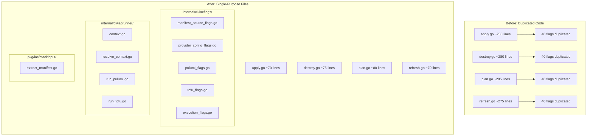
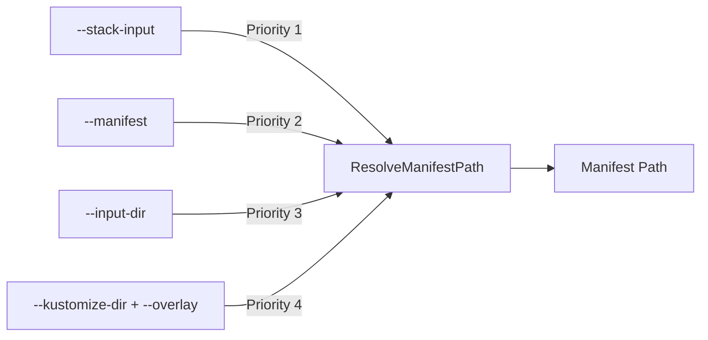

# Stack Input CLI Support and Command Handler Refactoring

**Date**: January 13, 2026
**Type**: Feature / Refactoring
**Components**: CLI Flags, Command Handlers, Stack Input, Manifest Processing

## Summary

Added `--stack-input` / `-i` as a first-class alternative to `--manifest` for IaC commands, enabling users to provide a complete stack input file from which the manifest is automatically extracted. Simultaneously refactored all IaC command handlers (apply, destroy, plan, refresh) to eliminate ~600 lines of duplicated code by introducing focused `iacflags` and `iacrunner` packages following single-responsibility file patterns.

## Problem Statement / Motivation

When running `project-planton destroy --stack-input file.yaml --local-module`, the CLI failed with:
```
Failed to resolve manifest: must provide one of: --manifest, --input-dir, or (--kustomize-dir + --overlay)
```

The `--stack-input` flag existed but was only passed through to Pulumi modules. It wasn't recognized as a valid source for the manifest (via the `target` field).

Additionally, the command handlers contained significant code duplication:

### Pain Points

- ~200 lines of identical flag definitions repeated in each `init()` function across 4 commands
- ~100 lines of identical handler logic for manifest loading, validation, and provisioner detection
- Copy-paste helper functions with only operation type differing
- Difficult to maintain: any flag change required 4 file edits
- Code style didn't follow single-function-per-file Go patterns

## Solution / What's New



### Stack Input as Manifest Source

The manifest resolver now recognizes `--stack-input` as the highest priority source:



When `--stack-input` is provided, the CLI:
1. Reads the stack input YAML file
2. Extracts the `target` field (which is the manifest)
3. Writes it to a temporary file
4. Uses that as the manifest path for further processing

## Implementation Details

### New Package: `pkg/iac/stackinput/extract_manifest.go`

```go
// ExtractManifestFromStackInput reads a stack input YAML file, extracts
// the "target" field, and writes it to a temporary file.
func ExtractManifestFromStackInput(stackInputPath string) (manifestPath string, err error)
```

### New Package: `internal/cli/iacflags/`

Single-purpose files for flag definitions:

| File | Function | Description |
|------|----------|-------------|
| `manifest_source_flags.go` | `AddManifestSourceFlags()` | --manifest, --stack-input, --input-dir, --kustomize-dir, --overlay |
| `provider_config_flags.go` | `AddProviderConfigFlags()` | All 9 provider credential flags |
| `pulumi_flags.go` | `AddPulumiFlags()` | --stack, --yes, --diff |
| `tofu_flags.go` | `AddTofuApplyFlags()`, `AddTofuPlanFlags()` | --auto-approve, --destroy |
| `execution_flags.go` | `AddExecutionFlags()` | --module-dir, --module-version, --no-cleanup, --kube-context, --set, --local-module |

### New Package: `internal/cli/iacrunner/`

Single-purpose files for execution logic:

| File | Function | Description |
|------|----------|-------------|
| `context.go` | `Context` struct | Holds all resolved inputs for execution |
| `resolve_context.go` | `ResolveContext()` | Resolves manifest, validates, detects provisioner |
| `run_pulumi.go` | `RunPulumi()` | Executes Pulumi operations |
| `run_tofu.go` | `RunTofu()` | Executes Tofu operations |

### Simplified Command Files

Each command file now follows a clean pattern:

```go
func init() {
    iacflags.AddManifestSourceFlags(Apply)
    iacflags.AddProviderConfigFlags(Apply)
    iacflags.AddExecutionFlags(Apply)
    iacflags.AddPulumiFlags(Apply)
    iacflags.AddTofuApplyFlags(Apply)
}

func applyHandler(cmd *cobra.Command, args []string) {
    ctx, err := iacrunner.ResolveContext(cmd)
    if err != nil {
        cliprint.PrintError(err.Error())
        os.Exit(1)
    }
    defer ctx.Cleanup()

    switch ctx.ProvisionerType {
    case provisioner.ProvisionerTypePulumi:
        iacrunner.RunPulumi(ctx, cmd, pulumi.PulumiOperationType_update, false)
    case provisioner.ProvisionerTypeTofu:
        iacrunner.RunTofu(ctx, cmd, terraform.TerraformOperationType_apply)
    }
}
```

## Files Changed

### New Files (11 files)

| File | Lines | Purpose |
|------|-------|---------|
| `pkg/iac/stackinput/extract_manifest.go` | ~45 | Extract manifest from stack input |
| `internal/cli/manifest/resolve_from_stack_input.go` | ~30 | Stack input resolver helper |
| `internal/cli/iacflags/manifest_source_flags.go` | ~25 | Manifest source flags |
| `internal/cli/iacflags/provider_config_flags.go` | ~35 | Provider config flags |
| `internal/cli/iacflags/pulumi_flags.go` | ~18 | Pulumi-specific flags |
| `internal/cli/iacflags/tofu_flags.go` | ~22 | Tofu-specific flags |
| `internal/cli/iacflags/execution_flags.go` | ~35 | Execution flags |
| `internal/cli/iacrunner/context.go` | ~55 | Execution context struct |
| `internal/cli/iacrunner/resolve_context.go` | ~155 | Context resolution |
| `internal/cli/iacrunner/run_pulumi.go` | ~45 | Pulumi execution |
| `internal/cli/iacrunner/run_tofu.go` | ~45 | Tofu execution |

### Modified Files (5 files)

| File | Change |
|------|--------|
| `internal/cli/manifest/resolver.go` | Added stack input as priority 1 source |
| `cmd/project-planton/root/apply.go` | Simplified from ~280 to ~70 lines |
| `cmd/project-planton/root/destroy.go` | Simplified from ~280 to ~75 lines |
| `cmd/project-planton/root/plan.go` | Simplified from ~285 to ~80 lines |
| `cmd/project-planton/root/refresh.go` | Simplified from ~275 to ~70 lines |

## Usage Examples

### Using Stack Input File

```bash
# Apply using stack input (extracts manifest from target field)
project-planton apply -i stack-input.yaml --local-module

# Destroy using stack input
project-planton destroy -i stack-input.yaml --local-module

# Preview using stack input
project-planton plan -i stack-input.yaml --local-module
```

### Stack Input File Structure

```yaml
target:
  api_version: kubernetes.project-planton.org/v1
  kind: KubernetesRedis
  metadata:
    name: redis-test
    labels:
      project-planton.org/provisioner: pulumi
      pulumi.project-planton.org/stack.name: org/project/stack
  spec:
    namespace:
      value: redis-namespace
    container:
      replicas: 1
provider_config:
  provider: gcp_gke
  gcp_gke:
    cluster_endpoint: 34.93.43.54
    cluster_ca_data: LS0tLS1C...
    service_account_key_base64: ewog...
```

## Benefits

### For CLI Users
- New `--stack-input` / `-i` flag on all IaC commands
- Can provide complete stack input file directly
- Manifest automatically extracted from `target` field
- Simpler workflow for users who already have stack input files

### For Developers
- ~55% code reduction in command handlers
- Single-responsibility files (~35 lines average)
- Clear package boundaries (`iacflags`, `iacrunner`, `stackinput`)
- Adding new flags requires editing 1 file instead of 4
- Consistent patterns across all IaC commands

## Code Metrics

| Metric | Before | After | Change |
|--------|--------|-------|--------|
| Command handler lines | ~1,100 | ~295 | -73% |
| Flag definition locations | 4 files | 5 files (shared) | Centralized |
| Handler logic locations | 4 files | 1 file (`resolve_context.go`) | Centralized |
| Average file size | ~275 lines | ~35 lines | -87% |
| New files created | - | 11 | - |
| Total lines (new + modified) | - | ~510 | - |

## Impact

### For CLI Users
- Existing workflows continue unchanged
- New `--stack-input` option available on apply, destroy, plan, refresh
- Help text updated to show stack input examples

### For Developers
- Much easier to add new flags (one place)
- Clear separation between flag definitions and execution logic
- Follows Go single-function-per-file patterns
- Package names are descriptive: `iacflags`, `iacrunner`

## Related Work

- Builds on stack input file support added in [2026-01-12-180614-stack-input-file-support-with-cli-flag.md](2026-01-12-180614-stack-input-file-support-with-cli-flag.md)
- Follows Go style guidelines for small, focused files

---

**Status**: ✅ Production Ready
**Timeline**: Single session implementation
