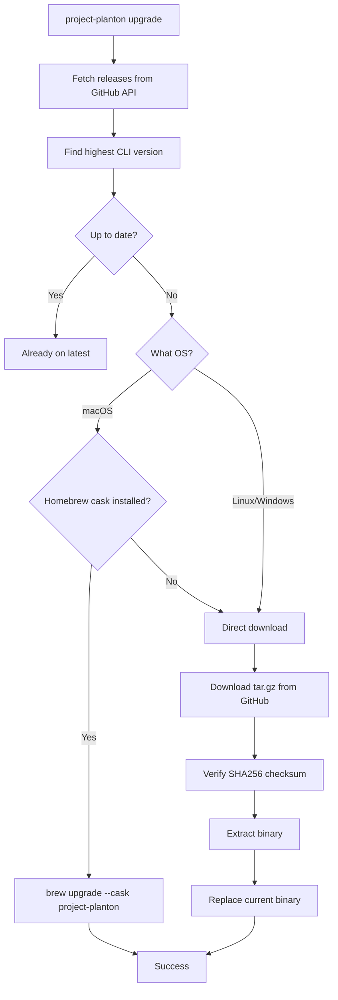

# CLI Self-Upgrade Command

**Date**: January 13, 2026
**Type**: Feature
**Components**: CLI Commands, User Experience

## Summary

Implemented `project-planton upgrade` command that allows the CLI to update itself to the latest version. On macOS with Homebrew, it uses `brew upgrade --cask`. On all other platforms, it downloads the binary directly from GitHub releases. This eliminates the need for users to manually check for updates and run platform-specific commands.

## Problem Statement

Previously, upgrading the CLI required:
- Knowing your installation method (Homebrew vs direct download)
- Running different commands per platform
- Manually checking GitHub releases for new versions
- Remembering download URLs and extraction steps for tar.gz archives

This friction meant users often ran outdated versions and missed important updates.

### Pain Points

- No built-in way to check for updates
- Platform-specific upgrade procedures
- Manual version comparison required
- Complex download and extraction process for non-Homebrew users

## Solution

A single `project-planton upgrade` command that:
1. Fetches the latest CLI release from GitHub API
2. Compares versions using the CLI-specific version format (`v{semver}-cli.{YYYYMMDD}.{N}`)
3. Detects the appropriate upgrade method based on platform and installation
4. Performs the upgrade with clear progress feedback
5. Handles errors gracefully with helpful suggestions



## Implementation Details

### Version Source: GitHub Releases API

Unlike the closed-source planton CLI which uses R2 for version files, project-planton fetches releases directly from GitHub:

```
GET https://api.github.com/repos/plantonhq/project-planton/releases
```

The version selection logic:
1. Fetches all releases (not tags, not drafts)
2. Filters for CLI-specific releases (tags containing `-cli.`)
3. Parses version components: `v{major}.{minor}.{patch}-cli.{YYYYMMDD}.{revision}`
4. Compares versions by semver first, then date, then revision
5. Returns the highest version

This approach ensures we only upgrade to actual CLI releases, not Pulumi module releases or other artifacts attached to the same repository.

**File**: `internal/cli/upgrade/version.go`

### Platform Detection

```go
func DetectUpgradeMethod() UpgradeMethod {
    // Only macOS uses Homebrew
    if runtime.GOOS != "darwin" {
        return MethodDirectDownload
    }
    
    // Check if brew is available
    if _, err := exec.LookPath("brew"); err != nil {
        return MethodDirectDownload
    }
    
    // Check if project-planton was installed via Homebrew cask
    cmd := exec.Command("brew", "list", "--cask", "project-planton")
    if err := cmd.Run(); err != nil {
        return MethodDirectDownload
    }
    
    return MethodHomebrew
}
```

**File**: `internal/cli/upgrade/platform.go`

### Direct Download Flow

For non-Homebrew installations:
1. Download tar.gz archive to temp file
2. Verify SHA256 checksum against `cli_{version}_checksums.txt`
3. Extract binary from tar.gz (or zip on Windows)
4. Replace current binary
5. On macOS: remove quarantine attribute

**File**: `internal/cli/upgrade/direct.go`

### Error Handling

Permission errors provide actionable suggestions:

```
✗ Permission denied: cannot write to /usr/local/bin/project-planton

Try running with sudo:
  sudo project-planton upgrade

Or download manually to a user directory:
  curl -LO https://github.com/plantonhq/project-planton/releases/download/v0.3.15-cli.20260113.0/cli_0.3.15-cli.20260113.0_darwin_arm64.tar.gz
  tar -xzf cli_*.tar.gz
  chmod +x project-planton
  mv project-planton ~/.local/bin/
```

## Usage

```bash
# Upgrade to latest version
project-planton upgrade

# Check for updates without installing
project-planton upgrade --check

# Force upgrade even if already on latest
project-planton upgrade --force
```

### Example Output: Check for Updates

```
● Checking for updates...

Current version: v0.3.5-cli.20260108.3
Latest version:  v0.3.15-cli.20260113.0

⚡ A new version is available!

Run project-planton upgrade to update.
```

### Example Output: Upgrade via Homebrew

```
● Checking for updates...

Current version: v0.3.5-cli.20260108.3
Latest version:  v0.3.15-cli.20260113.0

● Upgrade method: Homebrew

● Updating Homebrew...
Already up-to-date.

● Upgrading project-planton...
🍺  project-planton was successfully upgraded!

✔ Successfully upgraded to v0.3.15-cli.20260113.0
```

## Files Changed

### New Files

| File | Purpose |
|------|---------|
| `cmd/project-planton/root/upgrade.go` | Cobra command definition with `--check` and `--force` flags |
| `internal/cli/upgrade/upgrade.go` | Main orchestration logic |
| `internal/cli/upgrade/version.go` | GitHub API integration and CLI version parsing |
| `internal/cli/upgrade/platform.go` | Platform detection and URL building |
| `internal/cli/upgrade/homebrew.go` | Homebrew cask upgrade path |
| `internal/cli/upgrade/direct.go` | Direct download with tar.gz/zip extraction |

### Modified Files

| File | Change |
|------|--------|
| `cmd/project-planton/root.go` | Added `Upgrade` command to root |

## Benefits

- **One command**: `project-planton upgrade` works everywhere
- **Auto-detection**: Knows whether to use Homebrew cask or direct download
- **Secure**: Verifies SHA256 checksums before installing
- **Smart version detection**: Filters for CLI releases, ignores Pulumi module releases
- **Clear feedback**: Color-coded output shows current vs latest version
- **Helpful errors**: Permission issues include exact commands to fix

## Impact

**CLI Users**:
- Can upgrade with a single command instead of checking GitHub manually
- Get clear feedback on whether they're up to date
- Receive platform-appropriate upgrade instructions

**Developers**:
- Consistent upgrade experience across all platforms
- Reduced support burden for "how do I upgrade?" questions

## Related Work

This mirrors the self-upgrade functionality implemented for the closed-source `planton` CLI, adapted for GitHub-hosted releases instead of R2-hosted binaries. Key differences:
- Uses GitHub Releases API instead of R2 version.txt
- Downloads tar.gz archives instead of raw binaries
- Uses Homebrew cask instead of formula
- Parses CLI-specific version format (`-cli.YYYYMMDD.N`)

---

**Status**: ✅ Production Ready
