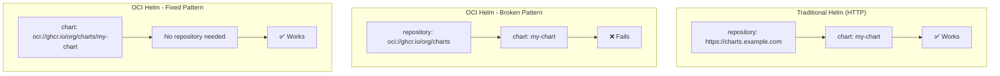
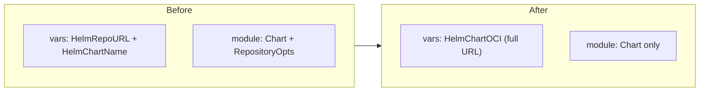

# Fix OCI Helm Chart Support for GitHub Actions Runners

**Date**: January 13, 2026
**Type**: Bug Fix
**Components**: Kubernetes Provider, IAC Stack Runner, Pulumi CLI Integration

## Summary

Fixed OCI Helm chart deployment for both `KubernetesGhaRunnerScaleSetController` and `KubernetesGhaRunnerScaleSet` components. The Pulumi and Terraform modules were incorrectly splitting the OCI registry URL into `repository` and `chart` parameters, which doesn't work with OCI-based Helm charts.

## Problem Statement

When deploying GitHub Actions Runner infrastructure using the `KubernetesGhaRunnerScaleSetController` component, the Helm chart deployment failed with:

```
error: kubernetes:helm.sh/v3:Release resource 'arc': property chart value 
{gha-runner-scale-set-controller} has a problem: looks like 
"oci://ghcr.io/actions/actions-runner-controller-charts" is not a valid 
chart repository or cannot be reached
```

### Root Cause

Both Pulumi and Terraform Helm providers handle OCI-based charts differently than traditional HTTP-based chart repositories:



For OCI charts, the **full URL must be passed as the `chart` parameter**, not split between `repository` and `chart`.

## Solution

Updated both Pulumi and Terraform modules for both GHA runner components to use the correct OCI chart URL pattern.

### KubernetesGhaRunnerScaleSetController

**Pulumi (`vars.go`):**
```go
// Before (broken)
HelmRepoURL:   "oci://ghcr.io/actions/actions-runner-controller-charts",
HelmChartName: "gha-runner-scale-set-controller",

// After (fixed)
HelmChartOCI: "oci://ghcr.io/actions/actions-runner-controller-charts/gha-runner-scale-set-controller",
```

**Pulumi (`controller.go`):**
```go
// Before (broken)
Chart:           pulumi.String(vars.HelmChartName),
RepositoryOpts: &helmv3.RepositoryOptsArgs{
    Repo: pulumi.String(vars.HelmRepoURL),
},

// After (fixed)
Chart: pulumi.String(vars.HelmChartOCI),
// No RepositoryOpts for OCI charts
```

**Terraform (`locals.tf` and `main.tf`):**
Same pattern - combined `chart_repo` + `chart_name` into single `chart_oci` and removed `repository` from helm_release.

### KubernetesGhaRunnerScaleSet

Applied identical fix pattern to the runner scale set component.

## Implementation Details

### Files Changed

| Component | File | Change |
|-----------|------|--------|
| Controller Pulumi | `kubernetesgharunnerscalesetcontroller/v1/iac/pulumi/module/vars.go` | Combined URL into `HelmChartOCI` |
| Controller Pulumi | `kubernetesgharunnerscalesetcontroller/v1/iac/pulumi/module/controller.go` | Removed `RepositoryOpts` |
| Controller Terraform | `kubernetesgharunnerscalesetcontroller/v1/iac/tf/locals.tf` | Combined URL into `chart_oci` |
| Controller Terraform | `kubernetesgharunnerscalesetcontroller/v1/iac/tf/main.tf` | Removed `repository` |
| Scale Set Pulumi | `kubernetesgharunnerscaleset/v1/iac/pulumi/module/vars.go` | Combined URL into `HelmChartOCI` |
| Scale Set Pulumi | `kubernetesgharunnerscaleset/v1/iac/pulumi/module/runner.go` | Removed `RepositoryOpts` |
| Scale Set Terraform | `kubernetesgharunnerscaleset/v1/iac/tf/locals.tf` | Combined URL into `chart_oci` |
| Scale Set Terraform | `kubernetesgharunnerscaleset/v1/iac/tf/main.tf` | Removed `repository` |

### Code Changes

The fix follows a consistent pattern across all modules:



## Benefits

1. **Deployment works**: GHA runner infrastructure can now be deployed successfully
2. **Feature parity**: Both Pulumi and Terraform modules work identically
3. **Clear documentation**: Added comments explaining the OCI chart requirement
4. **Future-proof**: Pattern is documented for other OCI-based Helm charts

## Impact

### Users Affected
- Anyone deploying self-hosted GitHub Actions runners using project-planton
- Both Pulumi and Terraform users

### Unblocks
- Planton Cloud dev environment setup (web console builds require self-hosted runners with more RAM than GitHub-hosted runners provide)

## Related Work

- Planton Cloud project: `_projects/2025-12/20251220.01.planton-dev-env-setup/`
- InfraChart: `planton-gha-runners` (uses these deployment components)
- Design decision: `design-decisions/self-hosted-gha-runners.md`

---

**Status**: ✅ Production Ready
**Timeline**: ~30 minutes
