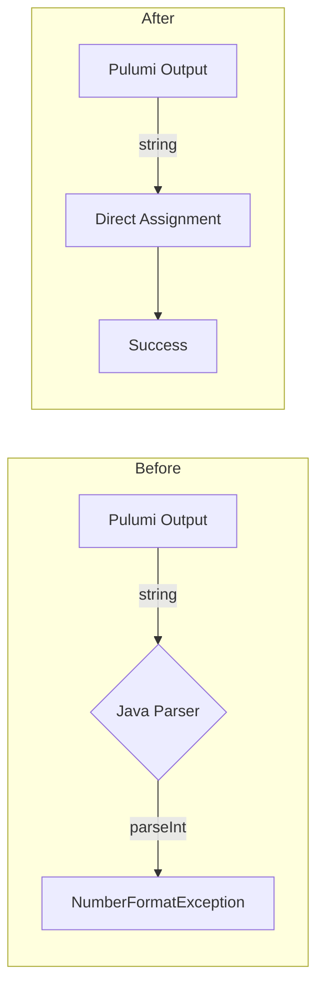

# KubernetesGhaRunnerScaleSet Stack Outputs Standardization to String-Only Fields

**Date**: January 13, 2026
**Type**: Refactoring
**Components**: API Definitions, Kubernetes Provider, Proto Schemas

## Summary

Converted all non-string field types (int32) to strings in the KubernetesGhaRunnerScaleSet stack_outputs.proto file. This eliminates potential parsing failures when Pulumi outputs contain unexpected values like "unknown" and simplifies stack output processing in the backend.

## Problem Statement / Motivation

Deployment component stack jobs were failing in the "update-stack outputs" step with the error:

```
Failed to parse value as integer for field 'min_runners'. Value received: 'unknown'
```

### Pain Points

- Pulumi outputs are serialized as strings, but the Java backend was attempting to parse them as integers
- When Pulumi couldn't resolve a value (API timing, errors), it output "unknown" instead of a number
- `Integer.parseInt("unknown")` throws `NumberFormatException`, causing stack job failures
- Stack outputs are primarily for display/reference - no computation is performed on them

## Solution / What's New

Standardized the KubernetesGhaRunnerScaleSet stack_outputs.proto to use only string types for runner count fields:



### Fields Converted

| Component | Field | Old Type | New Type |
|-----------|-------|----------|----------|
| **KubernetesGhaRunnerScaleSet** | `min_runners` | int32 | string |
| **KubernetesGhaRunnerScaleSet** | `max_runners` | int32 | string |

## Implementation Details

### Proto Changes

Updated `kubernetesgharunnerscaleset/v1/stack_outputs.proto`:

```protobuf
// Before
int32 min_runners = 8;
int32 max_runners = 9;

// After
string min_runners = 8;
string max_runners = 9;
```

### Generated Code Updates

Regenerated stubs for:
- Go: `stack_outputs.pb.go`
- TypeScript: `stack_outputs_pb.ts` for web console

## Benefits

### For Operations
- **Eliminates parsing failures**: No more `NumberFormatException` on unexpected values
- **Predictable behavior**: All outputs handled uniformly as strings
- **Cleaner error handling**: No silent type coercion

### For Development
- **Simpler mental model**: Stack outputs are always strings
- **Consistent pattern**: Same approach as Auth0 components and other deployment components
- **Future-proof**: New components should follow this string-only pattern

### For Users
- **Reliable stack jobs**: GHA Runner Scale Set deployments complete successfully
- **Accurate output display**: Values shown as received, not silently converted

## Impact

### Files Changed

| Category | Count | Files |
|----------|-------|-------|
| Proto definitions | 1 | `kubernetesgharunnerscaleset/v1/stack_outputs.proto` |
| Generated Go | 1 | `stack_outputs.pb.go` |
| Generated TypeScript | 1 | `stack_outputs_pb.ts` |
| **Total** | **3** | |

### API Compatibility

This is a **backward-compatible change** for consumers:
- Values that were integers are now string representations
- Consumers displaying outputs see the same information

## Related Work

- Auth0 stack outputs standardization (2026-01-10)
- Part of the pattern established for all deployment components

---

**Status**: ✅ Production Ready
**Timeline**: ~5 minutes implementation
