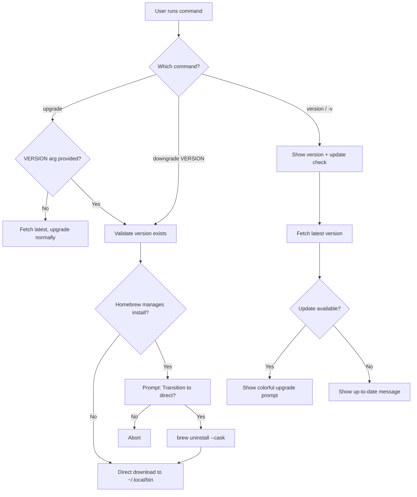

# CLI Version-Specific Upgrade and Downgrade Commands

**Date**: January 14, 2026
**Type**: Feature
**Components**: CLI Commands, User Experience, Version Management

## Summary

Added `upgrade VERSION` and `downgrade VERSION` commands that allow users to install specific CLI versions. Enhanced the `version` command to show colorful output with update availability check. Implemented intelligent installation path detection using `~/.local/bin` as the XDG-standard default, with Homebrew transition support for users switching from cask-managed installations.

## Problem Statement

Previously, the CLI only supported upgrading to the latest version. Users had no way to:
- Install a specific version for testing or compatibility
- Downgrade to a previous version if a new release introduced issues
- See at a glance whether updates were available
- Understand where the CLI binary was installed

### Pain Points

- No version pinning capability for CI/CD pipelines
- No rollback mechanism when new versions had regressions
- Boring version output (`v0.3.17`) with no context
- Homebrew users couldn't install specific versions (casks don't support `@version` syntax)
- Unclear where direct-download binaries were installed

## Solution



### Key Features

**1. Version-Specific Installation**
```bash
# Upgrade to specific version
project-planton upgrade v0.3.15-cli.20260113.1

# Downgrade to previous version
project-planton downgrade v0.3.10-cli.20260110.0

# Force reinstall even if already on version
project-planton upgrade v0.3.15-cli.20260113.1 --force
```

**2. Enhanced Version Output**
```
Current version: v0.3.15
Latest version:  v0.3.16

⚡ A new version is available!

Run project-planton upgrade to update.
```

**3. Homebrew Transition Flow**
```
⚠ Homebrew manages this installation.

Installing a specific version requires switching to direct-download management.

This will:
  1. Run: brew uninstall --cask project-planton
  2. Download and install v0.3.10-cli.20260110.0

Future 'project-planton upgrade' commands will use direct download.

Proceed? [y/N]
```

**4. Transparent Download Info**
```
● Downloading project-planton v0.3.15-cli.20260113.1...
  https://github.com/plantonhq/project-planton/releases/download/v0.3.15-cli.20260113.1/cli_0.3.15-cli.20260113.1_darwin_arm64.tar.gz
✔ Downloaded project-planton v0.3.15-cli.20260113.1
● Installing...
  /Users/username/.local/bin/project-planton
✔ Installed new binary
```

## Implementation Details

### New Commands

**File**: `cmd/project-planton/root/upgrade.go`
- Changed `--version` flag to positional `VERSION` argument
- Added `cobra.MaximumNArgs(1)` for optional version
- Updated help text with clear argument documentation

**File**: `cmd/project-planton/root/downgrade.go` (new)
- Created `downgrade VERSION` command with required argument
- Uses `cobra.ExactArgs(1)` to enforce version requirement
- Reuses `upgrade.Run()` internally (same logic, different UX)

### Version Comparison Logic

**File**: `internal/cli/upgrade/version.go`

Fixed comparison to handle mixed version formats:

```go
// semverInfo for comparing any version
type semverInfo struct {
    Major int
    Minor int
    Patch int
}

func CompareVersions(currentVersion, latestVersion string) bool {
    // Try CLI format first (v0.3.15-cli.20260113.1)
    // Fall back to semver-only comparison
    // Handles: v0.3.17 vs v0.3.15-cli.20260113.1 correctly
}
```

**Test coverage added**: `internal/cli/upgrade/version_test.go`

### Release Detection

**File**: `internal/cli/upgrade/version.go`

Added `isCliRelease()` to filter release types:

```go
func isCliRelease(tag string) bool {
    // Include: -cli. suffix OR plain semver (v0.3.16)
    // Exclude: -app., -website., -pulumi.*, -terraform.*
}
```

This correctly identifies CLI releases from the multi-artifact repository:
- ✅ `v0.3.16` (unified release)
- ✅ `v0.3.15-cli.20260113.1` (CLI auto-release)
- ❌ `v0.3.16-app.20260113.0` (Docker image)
- ❌ `v0.3.16-pulumi.awsecsservice.20260113.0` (Pulumi module)
- ❌ `v0.3.16-terraform.awsecsservice.20260113.0` (Terraform module)

### Installation Path Logic

**File**: `internal/cli/upgrade/direct.go`

```go
func getInstallPath(goos string) (string, string) {
    // 1. Try current binary location if writable
    // 2. Fall back to ~/.local/bin (XDG standard)
    // 3. Warn if ~/.local/bin not in PATH
}
```

For macOS/Linux:
- Default: `~/.local/bin/project-planton`
- Creates directory if needed
- Shows PATH setup instructions if not configured

### Homebrew Transition

**File**: `internal/cli/upgrade/homebrew.go`

Added `UninstallHomebrew()` for clean transition:
```go
func UninstallHomebrew() error {
    // Runs: brew uninstall --cask project-planton
    // Shows progress output
}
```

**File**: `internal/cli/upgrade/upgrade.go`

Added `confirmHomebrewTransition()` for user consent:
- Clear explanation of what will happen
- Shows exact commands to be run
- Explains future behavior change
- Requires explicit `y` confirmation

### Root Version Flag

**File**: `cmd/project-planton/root.go`

Added `-v`/`--version` flag at root level:
```go
rootCmd.Flags().BoolP("version", "v", false, "show version information")
```

Handled in custom `Run` function to show colorful output.

## Files Changed

| File | Change |
|------|--------|
| `cmd/project-planton/root/upgrade.go` | VERSION arg, updated help |
| `cmd/project-planton/root/downgrade.go` | New command |
| `cmd/project-planton/root/version.go` | Colorful output with update check |
| `cmd/project-planton/root.go` | -v flag, downgrade registration |
| `internal/cli/upgrade/upgrade.go` | Target version flow, Homebrew transition |
| `internal/cli/upgrade/version.go` | ValidateVersion, isCliRelease, semver comparison |
| `internal/cli/upgrade/version_test.go` | New test file |
| `internal/cli/upgrade/direct.go` | getInstallPath, download URL display |
| `internal/cli/upgrade/homebrew.go` | UninstallHomebrew |

## Benefits

**For CLI Users:**
- Pin specific versions in CI/CD for reproducibility
- Quick rollback if new version has issues
- At-a-glance update availability
- Transparent installation process

**For Developers:**
- Test against specific CLI versions
- Clear installation location
- No more "where did this binary come from?"

**For Homebrew Users:**
- Clean transition path to direct-download management
- No Homebrew/direct-download conflicts
- Explicit consent before any changes

## Usage

```bash
# Check current version and update availability
project-planton version
project-planton -v
project-planton --version

# Upgrade to latest
project-planton upgrade

# Upgrade to specific version
project-planton upgrade v0.3.15-cli.20260113.1

# Downgrade to previous version
project-planton downgrade v0.3.10-cli.20260110.0

# Check for updates without installing
project-planton upgrade --check

# Force reinstall
project-planton upgrade v0.3.15-cli.20260113.1 --force
```

## Impact

**CLI Users**: Can now manage CLI versions like any other development tool - pin versions, rollback when needed, see update status at a glance.

**CI/CD Pipelines**: Can specify exact CLI versions for reproducible infrastructure deployments.

**Homebrew Users**: Have a clear upgrade path when version pinning is needed, with no hidden conflicts or unexpected behavior.

## Related Work

This builds on the self-upgrade command implemented in `2026-01-13-171706-cli-self-upgrade-command.md`, extending it with:
- Version-specific installation
- Downgrade capability
- Enhanced version display
- Homebrew transition support

---

**Status**: ✅ Production Ready
