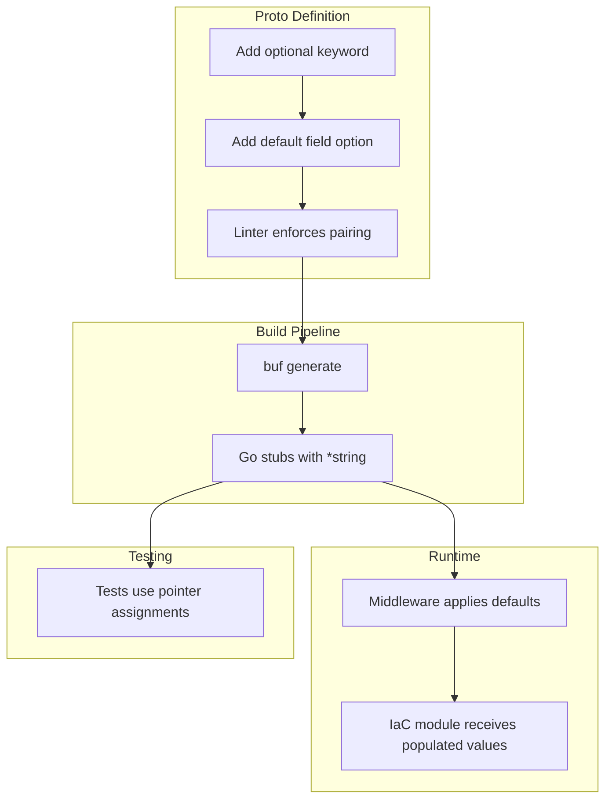
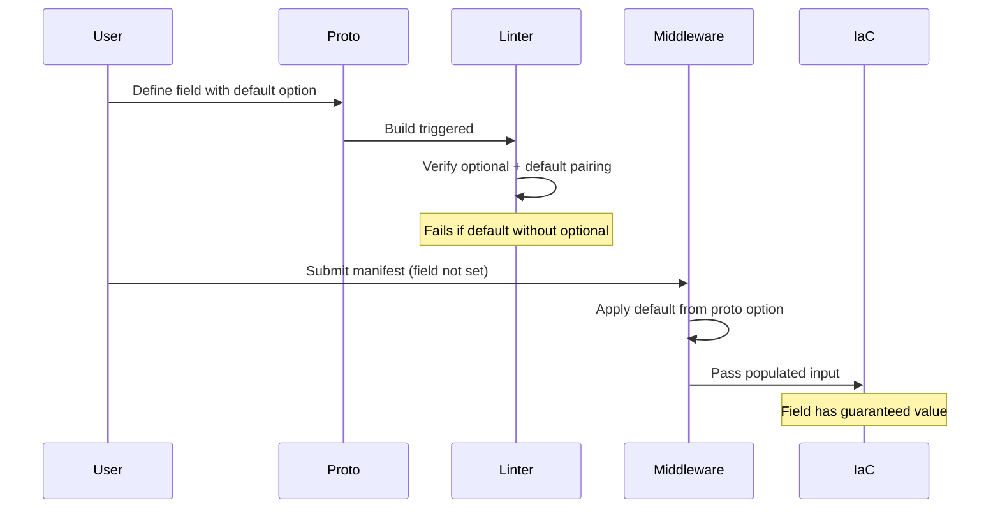

# Default Field Option Semantics: Rule Creation and Forge Pipeline Updates

**Date**: January 14, 2026
**Type**: Enhancement
**Components**: API Definitions, Protobuf Schemas, Forge Pipeline, Coding Guidelines, Pulumi Integration

## Summary

Created a comprehensive action rule and updated the entire forge/update/fix pipeline to properly handle proto field default values using `(org.project_planton.shared.options.default)` field options. This ensures default values are enforced at build time via the `DEFAULT_REQUIRES_OPTIONAL` linter, applied automatically by Project Planton middleware, and handled correctly in tests and IaC modules.

## Problem Statement / Motivation

Default values for proto fields were being documented only in comments, without technical enforcement. This created several problems:

### Pain Points

- **No build-time enforcement**: Defaults in comments are just documentation, not enforced by tooling
- **Presence tracking issues**: Without `optional` keyword, can't distinguish "user set empty string" from "user didn't set anything"
- **IaC module bugs**: Modules couldn't properly detect when to apply defaults
- **Test failures**: When fields became `optional`, tests broke due to pointer type changes
- **Knowledge loss**: The correct pattern wasn't documented in forge rules, so new components repeated the mistake

### Example of the Problem

```protobuf
// BEFORE: Default only in comment - no enforcement!
// Runner group name in GitHub.
// Defaults to "default" if not specified.
string runner_group = 7;
```

## Solution / What's New

Implemented a comprehensive solution that spans the entire deployment component lifecycle:



### Key Components

1. **Action Rule**: `apis/_rules/apply-project-planton-default-option-semantics.mdc`
   - Comprehensive guide for applying default semantics to any component
   - Documents the full workflow from proto to IaC

2. **Info File Updates**: 
   - `spec_proto.md` - When and how to use default field options
   - `spec_validate.md` - Combining defaults with validation rules
   - `spec_tests.md` - Testing optional fields with pointers
   - `pulumi_module.md` - Using getter methods, no defensive coding

3. **Forge Pipeline Updates**:
   - `001-spec-proto.mdc` - Default field options in schema design
   - `002-spec-validate.mdc` - Defaults separate from validation
   - `003-spec-tests.mdc` - Testing optional fields
   - `009-pulumi-module.mdc` - Getter methods for optional fields

4. **Update/Fix Rule Enhancements**:
   - New scenario: `apply-default-semantics`
   - Handles full migration from comment-only to enforced defaults

## Implementation Details

### The Correct Pattern

```protobuf
// Import the options
import "org/project_planton/shared/options/options.proto";

// CORRECT: Both optional keyword AND default option
optional string runner_group = 7 [(org.project_planton.shared.options.default) = "default"];

optional string repository = 1 [(org.project_planton.shared.options.default) = "ghcr.io/actions/actions-runner"];
```

### Generated Go Code Changes

```go
// Non-optional field (before)
type Spec struct {
    RunnerGroup string  // Direct string type
}

// Optional field (after)
type Spec struct {
    RunnerGroup *string  // Pointer type with presence tracking
}
```

### Test Code Changes

```go
// BEFORE: Direct assignment (won't compile after proto change)
spec.RunnerGroup = "production"

// AFTER: Pointer assignment
runnerGroup := "production"
spec.RunnerGroup = &runnerGroup
```

### IaC Module Changes

```go
// BEFORE: Direct field access
l.RunnerGroup = in.Target.Spec.RunnerGroup

// AFTER: Use getter method (nil-safe, returns zero value if nil)
l.RunnerGroup = in.Target.Spec.GetRunnerGroup()

// NO defensive coding needed - middleware guarantees defaults!
```

### System Guarantees



## Files Changed

### New Files
- `apis/_rules/apply-project-planton-default-option-semantics.mdc` - Comprehensive action rule

### Updated Info Files
- `.cursor/info/spec_proto.md` - Default Field Options section
- `.cursor/info/spec_validate.md` - Default options with validation
- `.cursor/info/spec_tests.md` - Testing optional fields
- `.cursor/info/pulumi_module.md` - Getter methods guide

### Updated Rules
- `.cursor/rules/coding-guidelines/protobuf-validations.mdc` - Default options section
- `.cursor/rules/deployment-component/forge/flow/001-spec-proto.mdc`
- `.cursor/rules/deployment-component/forge/flow/002-spec-validate.mdc`
- `.cursor/rules/deployment-component/forge/flow/003-spec-tests.mdc`
- `.cursor/rules/deployment-component/forge/flow/009-pulumi-module.mdc`
- `.cursor/rules/deployment-component/update/update-project-planton-component.mdc`
- `.cursor/rules/deployment-component/fix/fix-project-planton-component.mdc`

### Fixed Tests
- `apis/org/project_planton/provider/kubernetes/kubernetesgharunnerscaleset/v1/spec_test.go`

## Benefits

### For Component Authors

- **Clear guidance**: Know exactly when and how to use default field options
- **Build-time feedback**: `DEFAULT_REQUIRES_OPTIONAL` linter catches mistakes early
- **No guesswork**: Pattern is documented and enforced

### For IaC Module Development

- **Simpler code**: No defensive default checks needed
- **Framework guarantee**: Middleware always applies defaults before IaC runs
- **Consistent patterns**: All modules follow the same approach

### For Testing

- **Clear patterns**: Know to use pointer assignments for optional fields
- **Working examples**: Updated tests serve as reference

### For Future Maintenance

- **Invoke rule**: `@apply-project-planton-default-option-semantics` handles migration
- **Self-documenting**: Proto options show defaults in schema, not just comments

## Impact

### Who Benefits

| Audience | Impact |
|----------|--------|
| Component authors | Clear guidelines for default values |
| IaC developers | No defensive coding, trust framework |
| Test writers | Know to use pointers for optional fields |
| Code reviewers | Can verify defaults are properly enforced |
| Future AI sessions | Rule captures complete knowledge |

### Breaking Changes

None. Existing components continue to work. New components and migrations benefit from the improved patterns.

## Related Work

- **Custom Linter**: `buf/lint/optional-linter` - Enforces the optional + default pairing
- **Proto Field Presence**: Previous work on proto3 presence tracking
- **KubernetesGhaRunnerScaleSet**: Component where this issue was discovered and fixed

## Usage Example

When you encounter a component with comment-only defaults:

```bash
@apply-project-planton-default-option-semantics KubernetesGhaRunnerScaleSet
```

Or use the update rule:

```bash
@update-project-planton-component KubernetesGhaRunnerScaleSet --scenario apply-default-semantics
```

---

**Status**: ✅ Production Ready
**Timeline**: ~2 hours (analysis, implementation, documentation)
