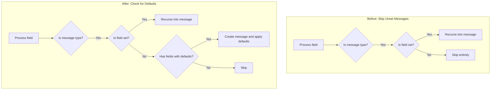

# Proto Field Defaults: Initialize Unset Nested Messages and Add Load Alias

**Date**: January 14, 2026
**Type**: Enhancement
**Components**: Manifest Processing, CLI Commands, Proto Defaults

## Summary

Enhanced the `protodefaults` package to automatically initialize unset nested message fields when they contain fields with default values. Also added a "load" alias for the `load-manifest` command for quicker CLI usage.

## Problem Statement / Motivation

When loading manifests, the CLI applies default values from proto field options. However, the previous implementation only applied defaults to nested messages that were already set in the manifest.

### Pain Points

- **Nested defaults not applied**: If a manifest had `spec.runner.resources` set but not `spec.runner.image`, the `image` message was never created, so its defaults (repository, tag, pull_policy) weren't applied
- **Verbose manifests required**: Users had to explicitly include empty nested objects to trigger default application
- **Inconsistent behavior**: Top-level fields got defaults, but nested message fields did not

### Example of the Problem

```yaml
# User provides minimal manifest:
spec:
  runner:
    resources:
      limits:
        cpu: 4000m
        memory: 8Gi
  # spec.runner.image is NOT set

# Expected: image should get defaults (repository, tag, pullPolicy)
# Actual (before): image remained nil, no defaults applied
```

## Solution / What's New

### Fix 1: Initialize Unset Nested Messages with Defaults

Modified `applyDefaultsToMessage` in the protodefaults package to detect and initialize unset nested messages that have fields with defaults.



### Fix 2: Add "load" Alias

Added `Aliases: []string{"load"}` to the `load-manifest` command for quicker CLI usage:

```bash
# Before: only this worked
project-planton load-manifest manifest.yaml

# After: both work
project-planton load-manifest manifest.yaml
project-planton load manifest.yaml
```

## Implementation Details

### New Helper Function: `hasFieldsWithDefaults`

Added a recursive function that checks if a message descriptor has any fields with default values:

```go
func hasFieldsWithDefaults(msgDesc protoreflect.MessageDescriptor) bool {
    fields := msgDesc.Fields()
    for i := 0; i < fields.Len(); i++ {
        field := fields.Get(i)
        if field.IsList() || field.IsMap() {
            continue
        }
        if field.Kind() == protoreflect.MessageKind {
            if hasFieldsWithDefaults(field.Message()) {
                return true
            }
            continue
        }
        options := field.Options()
        if options != nil && proto.HasExtension(options, options_pb.E_Default) {
            return true
        }
    }
    return false
}
```

### Modified Message Processing Logic

The key change in `applyDefaultsToMessage`:

```go
if field.Kind() == protoreflect.MessageKind {
    if msgReflect.Has(field) {
        // Field is set - recurse as before
        nestedMsg := msgReflect.Get(field).Message()
        applyDefaultsToMessage(nestedMsg)
    } else {
        // NEW: Field is NOT set - check if it has defaults
        if hasFieldsWithDefaults(field.Message()) {
            // Create message using Mutable (sets it on parent)
            newMsg := msgReflect.Mutable(field).Message()
            applyDefaultsToMessage(newMsg)
        }
    }
}
```

### Test Coverage

Added new test function `TestApplyDefaults_UnsetNestedMessageWithDefaults` with two test cases:

1. **Initializes unset nested message when it has fields with defaults** - Verifies that `spec.nested` is created and populated when left nil
2. **Does not create nested message without fields with defaults** - Ensures we don't create empty messages unnecessarily

## Files Changed

| File | Change |
|------|--------|
| `internal/manifest/protodefaults/applier.go` | Added `hasFieldsWithDefaults()` helper and modified message processing |
| `internal/manifest/protodefaults/applier_test.go` | Added tests for unset nested message initialization |
| `cmd/project-planton/root/load_manifest.go` | Added "load" alias |

## Benefits

### For CLI Users

- **Cleaner manifests**: No need to include empty nested objects to trigger defaults
- **Shorter command**: `project-planton load` instead of `project-planton load-manifest`
- **Consistent behavior**: All fields with defaults are populated, regardless of nesting depth

### For Developers

- **Predictable defaults**: Nested message defaults work identically to top-level defaults
- **Better testing**: Can verify default application without manually creating every nested structure

## Impact

### Who Benefits

| Audience | Impact |
|----------|--------|
| CLI users | Simpler manifests, shorter command |
| IaC module developers | Can rely on defaults being populated for nested config |
| New users | Less boilerplate to write |

### Example Result

```yaml
# Input (minimal manifest):
spec:
  runner:
    resources:
      limits:
        cpu: 4000m

# Output (after load with defaults):
spec:
  runner:
    image:
      repository: ghcr.io/actions/actions-runner
      tag: "2.331.0"
      pullPolicy: IfNotPresent
    resources:
      limits:
        cpu: 4000m
```

## Related Work

- **Proto Field Defaults Framework**: `2026-01-14-113510-default-field-option-semantics-rule-and-forge-updates.md`
- **KubernetesGhaRunnerScaleSet**: Component where this issue was discovered during testing

---

**Status**: ✅ Production Ready
**Timeline**: ~30 minutes
