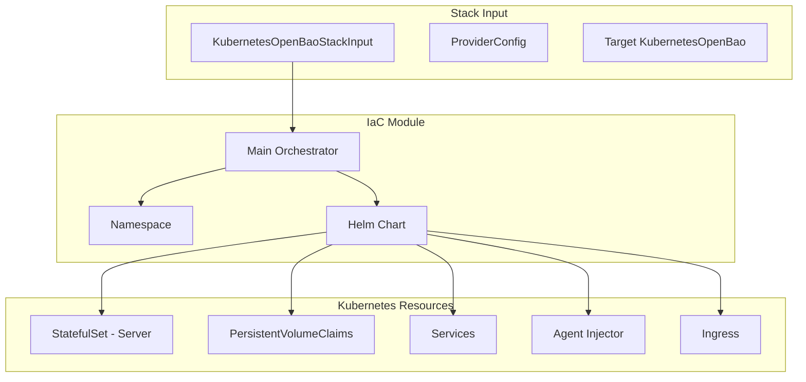
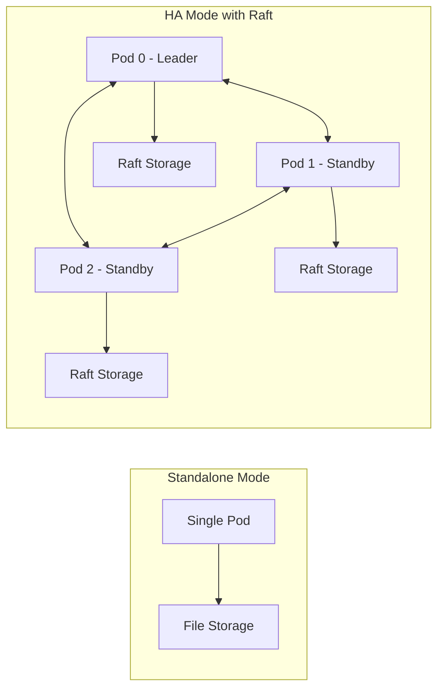

# KubernetesOpenBao Deployment Component

**Date**: January 15, 2026
**Type**: Feature
**Components**: API Definitions, Kubernetes Provider, Provider Framework, IAC Stack Runner

## Summary

Added complete `KubernetesOpenBao` deployment component for deploying OpenBao (HashiCorp Vault fork) on Kubernetes clusters. The component supports standalone and high-availability deployment modes, Agent Injector for automatic secret injection, and full Pulumi/Terraform IaC implementations following Project Planton conventions.

## Problem Statement / Motivation

Organizations need enterprise-grade secrets management in Kubernetes environments. OpenBao, an open-source fork of HashiCorp Vault under the OpenSSF umbrella, provides this capability but deploying it properly requires significant Kubernetes and Helm expertise.

### Pain Points

- Complex Helm chart configuration with 1400+ lines of values
- Understanding standalone vs HA deployment trade-offs
- Configuring Raft integrated storage for HA mode
- Setting up Agent Injector for automatic secret injection
- Managing ingress, TLS, and external access
- No standardized Project Planton component for secrets management

## Solution / What's New

Created a complete `KubernetesOpenBao` deployment component that wraps the official OpenBao Helm chart with sensible defaults and Project Planton conventions.

### Architecture Overview



### Deployment Modes



## Implementation Details

### Proto API Structure

Created 4 proto files following Project Planton conventions:

| File | Purpose |
|------|---------|
| `spec.proto` | Configuration schema with validations |
| `api.proto` | KRM envelope (metadata/spec/status) |
| `stack_outputs.proto` | Deployment outputs |
| `stack_input.proto` | IaC module inputs |

### Key Spec Fields

```proto
message KubernetesOpenBaoSpec {
  KubernetesClusterSelector target_cluster = 1;
  StringValueOrRef namespace = 2;
  bool create_namespace = 3;
  optional string helm_chart_version = 4;  // Default: 0.23.3
  KubernetesOpenBaoServerContainer server_container = 5;
  KubernetesOpenBaoHighAvailability high_availability = 6;
  KubernetesOpenBaoIngress ingress = 7;
  optional bool ui_enabled = 8;  // Default: true
  KubernetesOpenBaoInjector injector = 9;
  bool tls_enabled = 10;
}
```

### Validation Rules

- Namespace: Required field
- Server replicas: 1-10 range
- HA replicas: 3-10 range (minimum 3 for Raft consensus)
- Injector replicas: 1-5 range
- Data storage size: Kubernetes storage format pattern
- Ingress hostname: Required when ingress enabled

### Pulumi Module Structure

```
iac/pulumi/module/
├── main.go       # Resource orchestration
├── locals.go     # Computed values
├── vars.go       # Helm chart config
├── outputs.go    # Output constants
├── namespace.go  # Namespace creation
└── helm_chart.go # Helm installation
```

### Helm Values Mapping

| Spec Field | Helm Value |
|------------|------------|
| `server_container.replicas` | `server.ha.replicas` |
| `server_container.resources` | `server.resources` |
| `server_container.data_storage_size` | `server.dataStorage.size` |
| `high_availability.enabled` | `server.ha.enabled` |
| `ingress.enabled` | `server.ingress.enabled` |
| `ui_enabled` | `ui.enabled` |
| `injector.enabled` | `injector.enabled` |

### Terraform Module

Complete Terraform implementation with feature parity:

```
iac/tf/
├── variables.tf   # Input variables
├── locals.tf      # Local values
├── main.tf        # Namespace resource
├── helm_chart.tf  # Helm release
├── outputs.tf     # Module outputs
└── provider.tf    # Provider config
```

## Benefits

### For Platform Engineers
- **Standardized deployment**: Consistent patterns across all Project Planton components
- **Sensible defaults**: Production-ready configuration out of the box
- **Dual IaC support**: Both Pulumi and Terraform implementations

### For Developers
- **Simple YAML manifests**: Declare what you need, not how to configure it
- **Validated inputs**: Catch misconfigurations before deployment
- **Comprehensive outputs**: Service endpoints, port-forward commands, secret references

### For Operations
- **HA support**: Production-ready with Raft consensus
- **Monitoring ready**: Prometheus/Grafana integration via Helm
- **Ingress support**: External access with TLS termination

## Impact

### Files Created

| Category | Count | Key Files |
|----------|-------|-----------|
| Proto definitions | 4 | spec.proto, api.proto, stack_outputs.proto, stack_input.proto |
| Generated Go | 4 | *.pb.go files |
| Generated TypeScript | 4 | *_pb.ts files |
| Pulumi module | 6 | main.go, locals.go, vars.go, outputs.go, namespace.go, helm_chart.go |
| Terraform module | 6 | variables.tf, locals.tf, main.tf, helm_chart.tf, outputs.tf, provider.tf |
| Documentation | 8 | README.md, examples.md, overview.md, docs/README.md |
| Test files | 1 | spec_test.go (11 test cases) |

### Registry Addition

Added `KubernetesOpenBao = 845` to `cloud_resource_kind.proto` with:
- Provider: `kubernetes`
- Version: `v1`
- ID Prefix: `k8sbao`

## Testing

### Validation Tests (11 cases)

```
✅ Valid standalone deployment
✅ Valid deployment with ingress
✅ Valid HA mode deployment
✅ Valid deployment with injector
❌ Missing namespace → validation error
❌ Invalid storage size format → validation error
❌ Server replicas below minimum → validation error
❌ Server replicas above maximum → validation error
❌ HA replicas below minimum → validation error
❌ Ingress enabled without hostname → validation error
❌ Injector replicas above maximum → validation error
```

### Build Verification

```bash
$ make build
✅ Proto generation successful
✅ Go code compiles
✅ All tests pass
```

## Usage Examples

### Basic Standalone Deployment

```yaml
apiVersion: kubernetes.project-planton.org/v1
kind: KubernetesOpenBao
metadata:
  name: dev-openbao
spec:
  namespace:
    value: openbao
  create_namespace: true
  server_container:
    replicas: 1
    data_storage_size: "10Gi"
    resources:
      requests:
        cpu: "100m"
        memory: "128Mi"
      limits:
        cpu: "500m"
        memory: "256Mi"
  ui_enabled: true
```

### Production HA Deployment

```yaml
apiVersion: kubernetes.project-planton.org/v1
kind: KubernetesOpenBao
metadata:
  name: prod-openbao
spec:
  namespace:
    value: openbao-prod
  create_namespace: true
  server_container:
    replicas: 5
    data_storage_size: "100Gi"
    resources:
      requests:
        cpu: "500m"
        memory: "512Mi"
      limits:
        cpu: "2000m"
        memory: "1Gi"
  high_availability:
    enabled: true
    replicas: 5
  ingress:
    enabled: true
    hostname: "secrets.company.com"
    tls_enabled: true
  injector:
    enabled: true
    replicas: 2
  ui_enabled: true
```

## Related Work

- **OpenBao Helm Chart**: https://github.com/openbao/openbao-helm (v0.23.3)
- **OpenBao**: https://github.com/openbao/openbao (v2.4.4)
- **Similar Components**: KubernetesRedis, KubernetesPostgres patterns

## Future Enhancements

- Auto-unseal configuration with cloud KMS integration
- Audit storage configuration
- CSI Provider support
- Snapshot agent configuration
- TLS certificate auto-generation with cert-manager

---

**Status**: ✅ Production Ready
**Timeline**: Single session implementation
