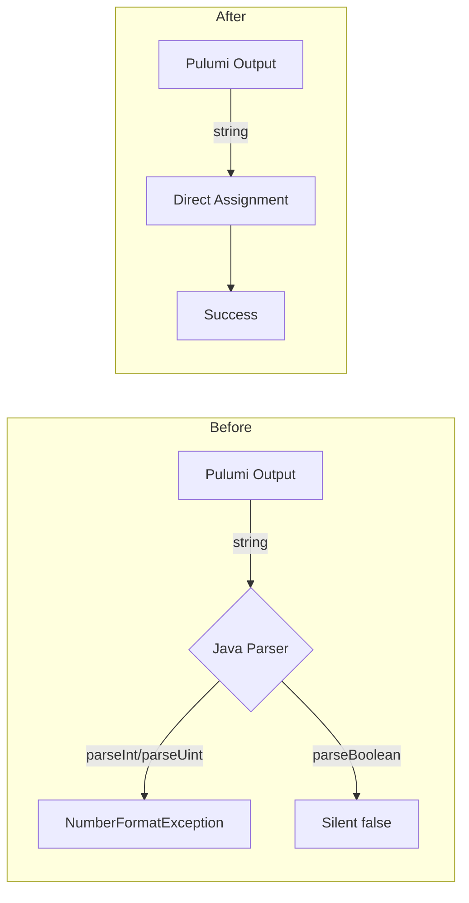

# Stack Outputs String-Only Standardization

**Date**: January 15, 2026
**Type**: Refactoring
**Components**: API Definitions, Multiple Providers, Proto Schemas

## Summary

Converted all remaining non-string field types (uint32, int32, bool) to strings in 6 deployment component `stack_outputs.proto` files. This extends the Auth0 standardization (2026-01-10) to cover all deployment components, ensuring consistent string-only stack outputs across the entire platform.

## Problem Statement / Motivation

Following the Auth0 stack outputs fix, we discovered additional deployment components with non-string fields that could cause the same `NumberFormatException` failures:

```
Failed to load stack outputs map to proto: For input string: "unknown"
```

### Pain Points

- Pulumi outputs are serialized as strings, but the Java backend attempts to parse them as integers/booleans
- When Pulumi can't resolve a value (API timing, errors), it outputs "unknown" instead of a number
- `Integer.parseInt("unknown")` throws `NumberFormatException`, causing stack job failures
- Boolean fields silently convert "unknown" to `false` via `Boolean.parseBoolean()`, which is misleading
- Stack outputs are for display/reference only - no computation is performed on them

## Solution / What's New

Standardized all remaining `stack_outputs.proto` files to use only string types, matching the Auth0 pattern.



### Components Updated

| Component | Provider | Fields Converted |
|-----------|----------|------------------|
| **GcpGkeNodePool** | GCP | `min_nodes`, `max_nodes`, `current_node_count` (uint32 → string) |
| **KubernetesDaemonSet** | Kubernetes | `desired_number_scheduled`, `current_number_scheduled`, `number_ready` (int32 → string) |
| **KubernetesNamespace** | Kubernetes | `resource_quotas_applied`, `limit_ranges_applied`, `network_policies_applied`, `service_mesh_enabled` (bool → string) |
| **KubernetesOpenBao** | Kubernetes | `ha_enabled` (bool → string) |
| **SnowflakeDatabase** | Snowflake | `is_transient` (bool → string), `data_retention_time_in_days` (int32 → string) |
| **GcpCloudCdn** | GCP | `cdn_enabled` (bool → string) |

### Field Conversion Summary

| Old Type | Count | New Type |
|----------|-------|----------|
| uint32 | 3 | string |
| int32 | 4 | string |
| bool | 7 | string |
| **Total** | **14** | string |

## Implementation Details

### Proto Changes

**GcpGkeNodePool** (`gcp/gcpgkenodepool/v1/stack_outputs.proto`):
```protobuf
// Before
uint32 min_nodes = 3;
uint32 max_nodes = 4;
uint32 current_node_count = 5;

// After
string min_nodes = 3;
string max_nodes = 4;
string current_node_count = 5;
```

**KubernetesDaemonSet** (`kubernetes/kubernetesdaemonset/v1/stack_outputs.proto`):
```protobuf
// Before
int32 desired_number_scheduled = 3;
int32 current_number_scheduled = 4;
int32 number_ready = 5;

// After
string desired_number_scheduled = 3;
string current_number_scheduled = 4;
string number_ready = 5;
```

**KubernetesNamespace** (`kubernetes/kubernetesnamespace/v1/stack_outputs.proto`):
```protobuf
// Before
bool resource_quotas_applied = 3;
bool limit_ranges_applied = 4;
bool network_policies_applied = 5;
bool service_mesh_enabled = 6;

// After
string resource_quotas_applied = 3;
string limit_ranges_applied = 4;
string network_policies_applied = 5;
string service_mesh_enabled = 6;
```

**KubernetesOpenBao** (`kubernetes/kubernetesopenbao/v1/stack_outputs.proto`):
```protobuf
// Before
bool ha_enabled = 10;

// After
string ha_enabled = 10;
```

**SnowflakeDatabase** (`snowflake/snowflakedatabase/v1/stack_outputs.proto`):
```protobuf
// Before
bool is_transient = 5;
int32 data_retention_time_in_days = 6;

// After
string is_transient = 5;
string data_retention_time_in_days = 6;
```

**GcpCloudCdn** (`gcp/gcpcloudcdn/v1/stack_outputs.proto`):
```protobuf
// Before
bool cdn_enabled = 5;

// After
string cdn_enabled = 5;
```

### Generated Code Updates

Regenerated stubs for:
- Go: `*.pb.go` files (6 components)
- TypeScript: `*_pb.ts` files for web console (6 components)

## Benefits

### For Operations
- **Eliminates parsing failures**: No more `NumberFormatException` on unexpected values
- **Predictable behavior**: All outputs handled uniformly as strings
- **Cleaner error handling**: No silent type coercion

### For Development
- **Simpler mental model**: Stack outputs are always strings
- **Consistent pattern**: Same approach across all deployment components
- **Future-proof**: New components should follow this pattern

### For Users
- **Reliable stack jobs**: Deployments complete successfully
- **Accurate output display**: Values shown as received, not silently converted

## Impact

### Files Changed

| Category | Count |
|----------|-------|
| Proto definitions | 6 |
| Generated Go | 6 |
| Generated TypeScript | 6 |
| **Total** | **18** |

### API Compatibility

This is a **backward-compatible change** for consumers:
- Values that were `true`/`false` are now `"true"`/`"false"` strings
- Values that were integers are now string representations
- Consumers displaying outputs see the same information

## Related Work

- Auth0 Stack Outputs Standardization (2026-01-10) - established the pattern
- Defensive error handling in `StackOutputsMapToProtoLoader.java` in planton monorepo

## Verification

All validation steps passed:
- `make protos` - Proto stubs regenerated successfully
- `make build` - Build completed for all platforms
- `make test` - All tests passed

---

**Status**: Production Ready
