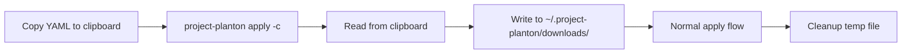
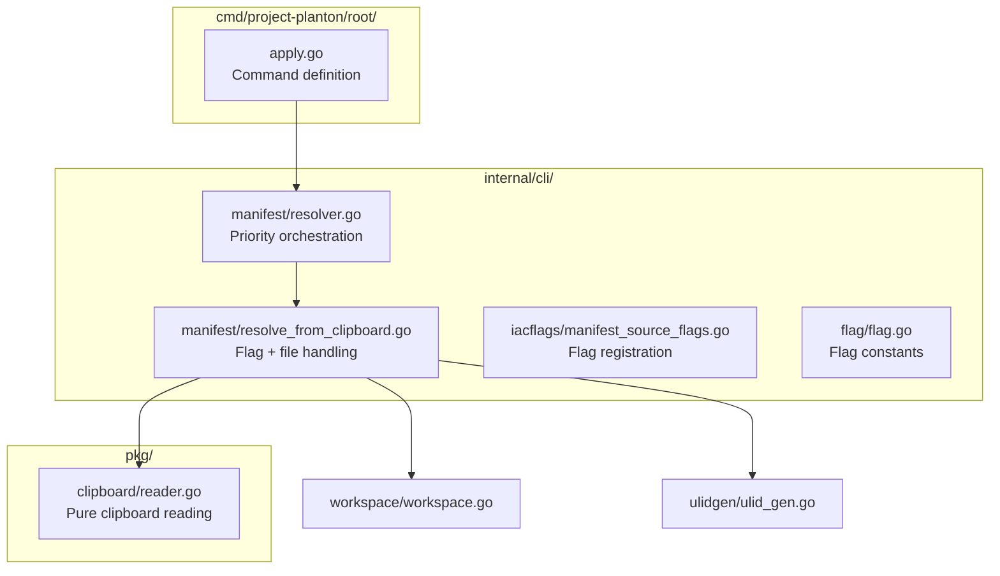
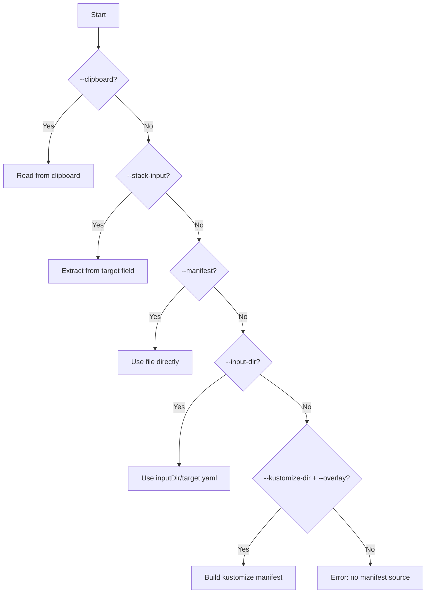

# Clipboard Manifest Input Support

**Date**: January 15, 2026
**Type**: Feature
**Components**: CLI Flags, Manifest Processing, User Experience

## Summary

Added `--clipboard` / `-c` flag to `project-planton apply` that reads YAML manifest content directly from the system clipboard, eliminating the need to create intermediate files. This enables a zero-friction workflow for demos, quick iterations, and applying manifests copied from documentation or AI assistants.

## Problem Statement

Deploying infrastructure with `project-planton apply` required a multi-step process:

1. Copy a YAML manifest to clipboard (from docs, ChatGPT, etc.)
2. Create a file on disk
3. Paste the content into the file
4. Run `project-planton apply -f <file>`

### Pain Points

- **Friction in demos**: Showing off capabilities required file system juggling
- **Slow iteration**: Quick tests meant creating throwaway files
- **Unnecessary steps**: The CLI already reads content as a string - why require a file?
- **Poor UX for AI-assisted workflows**: Copy-paste from AI → create file → apply was tedious

## Solution

Added clipboard as the highest-priority manifest source, enabling direct application from clipboard content.



### New Command Syntax

```bash
# Apply manifest directly from clipboard
project-planton apply --clipboard
project-planton apply -c

# Combine with other flags
project-planton apply -c --set spec.replicas=3
```

## Implementation Details

### Architecture: Three-Layer Separation

Following strict single responsibility principle, the implementation spans three layers:



### New Files Created

**`pkg/clipboard/reader.go`** (19 lines)

Pure clipboard reading with no CLI dependencies - reusable across the codebase:

```go
package clipboard

import (
    "github.com/pkg/errors"
    "golang.design/x/clipboard"
)

// Read returns the current text content from the system clipboard.
// Returns an error if the clipboard cannot be accessed or is empty.
func Read() ([]byte, error) {
    if err := clipboard.Init(); err != nil {
        return nil, errors.Wrap(err, "failed to initialize clipboard access")
    }

    content := clipboard.Read(clipboard.FmtText)
    if len(content) == 0 {
        return nil, errors.New("clipboard is empty")
    }

    return content, nil
}
```

**`internal/cli/manifest/resolve_from_clipboard.go`** (53 lines)

CLI-layer handling for flag parsing and temp file writing:

```go
// resolveFromClipboard checks for --clipboard flag and reads manifest from clipboard.
// Returns empty string if flag not provided.
func resolveFromClipboard(cmd *cobra.Command) (manifestPath string, isTemp bool, err error) {
    useClipboard, err := cmd.Flags().GetBool(string(flag.Clipboard))
    if err != nil {
        return "", false, errors.Wrap(err, "failed to get clipboard flag")
    }
    if !useClipboard {
        return "", false, nil
    }

    content, err := clipboard.Read()
    if err != nil {
        return "", false, err
    }

    manifestPath, err = writeClipboardContent(content)
    if err != nil {
        return "", false, err
    }

    return manifestPath, true, nil
}
```

### Files Modified

| File | Change |
|------|--------|
| `go.mod` | Added `golang.design/x/clipboard` dependency |
| `internal/cli/flag/flag.go` | Added `Clipboard` constant |
| `internal/cli/iacflags/manifest_source_flags.go` | Registered `--clipboard` / `-c` flag |
| `internal/cli/manifest/resolver.go` | Added clipboard as priority 1 |
| `cmd/project-planton/root/apply.go` | Updated examples in help text |

### Priority Order Update



### Temporary File Handling

Follows existing pattern from `extract_manifest.go`:

- Files written to `~/.project-planton/downloads/`
- ULID-based unique filenames for chronological sorting
- Automatic cleanup after apply completes

```
~/.project-planton/downloads/01JHRX5N4KWMR8P6VZXC3QJ7TM-clipboard-manifest.yaml
```

## Benefits

### For Demos and Presentations

```bash
# Before: 3 commands, file management
pbpaste > /tmp/manifest.yaml
project-planton apply -f /tmp/manifest.yaml
rm /tmp/manifest.yaml

# After: 1 command, zero friction
project-planton apply -c
```

### For AI-Assisted Workflows

Copy manifest from ChatGPT/Claude → `project-planton apply -c` → Done.

### For Quick Iterations

Test a manifest modification without touching the original file.

## Impact

### User Experience

- **Zero-friction demos**: Copy → Apply in one command
- **Faster iteration**: No intermediate file management
- **AI-friendly**: Seamless workflow with AI assistants

### Developer Experience

- **Clean architecture**: Reusable `pkg/clipboard` for future features
- **Consistent patterns**: Follows existing resolver pattern exactly
- **Well-documented**: Comprehensive cursor rule for future CLI work

### Platform Support

Cross-platform via `golang.design/x/clipboard`:
- macOS (NSPasteboard)
- Linux (X11 or Wayland)
- Windows (Win32 API)

## Related Work

This feature was implemented alongside the creation of comprehensive CLI coding guidelines (`project-planton-cli-coding-guidelines.mdc`) that document the architectural patterns used here.

The implementation serves as a reference example for:
- Single responsibility file organization (30-50 lines per file)
- Three-layer architecture (`cmd/` → `internal/cli/` → `pkg/`)
- Resolver pattern for flag-based inputs
- Proper temp file handling via workspace directory

---

**Status**: ✅ Production Ready
**Timeline**: ~1 hour implementation
