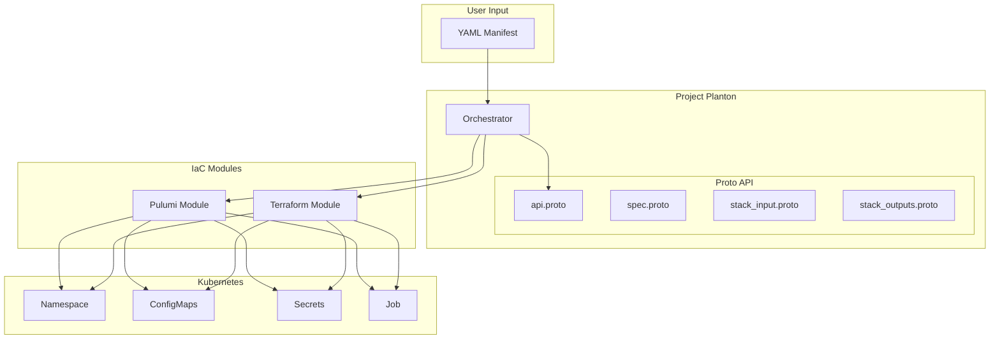
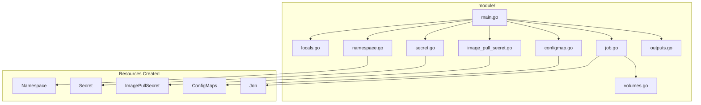

# KubernetesJob Deployment Component

**Date**: January 17, 2026
**Type**: Feature
**Components**: API Definitions, Kubernetes Provider, Pulumi Module, Terraform Module, Provider Framework

## Summary

Added the KubernetesJob deployment component to Project Planton, enabling declarative deployment of one-shot batch workloads to Kubernetes clusters. This component provides a complete, production-ready solution for running Jobs with both Pulumi and Terraform IaC modules, comprehensive validation, and thorough documentation.

## Problem Statement / Motivation

Project Planton already supports KubernetesCronJob for scheduled tasks and KubernetesDeployment for long-running services, but lacked support for one-shot batch workloads that run immediately to completion. Users needed a way to declaratively deploy:

### Pain Points

- Database migrations during deployments
- Data processing and ETL jobs
- Backup operations and one-time setup tasks
- Parallel batch processing with completion tracking
- Indexed jobs for partitioned data processing

Without a dedicated Job component, users had to either manually create Kubernetes Jobs or misuse CronJobs with immediate schedules.

## Solution / What's New

Implemented a complete `KubernetesJob` deployment component following the Project Planton forge process. The component provides full lifecycle management for Kubernetes Jobs with support for parallelism, indexed execution, automatic cleanup, and deadline enforcement.

### Component Architecture



### Key Features

| Feature | Description |
|---------|-------------|
| **Parallelism** | Run multiple pods simultaneously for faster batch processing |
| **Completions** | Configure required successful completions |
| **Indexed Mode** | Assign unique indexes to pods for partitioned data |
| **Deadline Enforcement** | Set maximum runtime with `activeDeadlineSeconds` |
| **TTL Cleanup** | Automatic deletion after completion |
| **Environment Variables** | Direct values and Kubernetes Secret references |
| **Volume Mounts** | ConfigMaps, Secrets, PVCs, HostPaths, EmptyDirs |

## Implementation Details

### Proto API Definitions

Created four proto files following KRM conventions:

**spec.proto** - Core configuration with validations:
```protobuf
message KubernetesJobSpec {
  KubernetesClusterSelector target_cluster = 1;
  StringValueOrRef namespace = 2 [(buf.validate.field).required = true];
  bool create_namespace = 3;
  ContainerImage image = 4;
  ContainerResources resources = 5;
  KubernetesJobContainerAppEnv env = 6;
  optional uint32 parallelism = 7;
  optional uint32 completions = 8;
  optional uint32 backoff_limit = 9;
  optional uint64 active_deadline_seconds = 10;
  optional uint32 ttl_seconds_after_finished = 11;
  optional string completion_mode = 12;  // "NonIndexed" | "Indexed"
  optional string restart_policy = 13;   // "OnFailure" | "Never"
  repeated string command = 14;
  repeated string args = 15;
  map<string, string> config_maps = 16;
  repeated VolumeMount volume_mounts = 17;
  optional bool suspend = 18;
}
```

**Validation rules include:**
- `completion_mode` restricted to "NonIndexed" or "Indexed"
- `restart_policy` restricted to "OnFailure" or "Never" (no "Always" for Jobs)
- Proper default values with `(org.project_planton.shared.options.default)`

### Registry Entry

Added to `cloud_resource_kind.proto`:
```protobuf
KubernetesJob = 846 [(kind_meta) = {
  provider: kubernetes
  version: v1
  id_prefix: "k8sjob"
}];
```

### Pulumi Module Structure



### Terraform Module Structure

```
tf/
├── variables.tf    # Input variables matching spec.proto
├── provider.tf     # Kubernetes provider configuration
├── locals.tf       # Computed values and labels
├── main.tf         # Namespace creation
├── secret.tf       # Environment secrets
├── configmap.tf    # ConfigMap resources
├── job.tf          # Job resource with volumes
└── outputs.tf      # Stack outputs
```

### Test Coverage

Created comprehensive validation tests in `spec_test.go`:
- Valid configurations (create_namespace, restart_policy, completion_mode)
- Invalid configurations (wrong restart_policy, wrong completion_mode)
- Environment variables (direct values, valueFrom references)
- Secrets (direct values, secret references, mixed types)
- **Result**: 18/18 tests passing

## Benefits

### For Platform Engineers

- **Declarative Job Management**: Define Jobs as YAML manifests with full validation
- **Dual IaC Support**: Choose Pulumi or Terraform based on preference
- **Consistent Patterns**: Same UX as other Kubernetes workload components

### For Developers

- **Simple Configuration**: Sensible defaults for common use cases
- **Flexible Parallelism**: Easy scaling for batch processing
- **Built-in Cleanup**: TTL-based automatic job cleanup

### For Operations

- **Deadline Enforcement**: Prevent runaway jobs
- **Resource Limits**: CPU/memory constraints out of the box
- **Observability**: Standard labels for monitoring and tracking

## Impact

### Files Created

| Category | Count | Description |
|----------|-------|-------------|
| Proto definitions | 4 | API, spec, stack_input, stack_outputs |
| Generated stubs | 4 | .pb.go files |
| Tests | 1 | 18 validation tests |
| Pulumi module | 11 | Go implementation files |
| Terraform module | 10 | HCL configuration files |
| Documentation | 6 | README, examples, research docs |
| Supporting files | 2 | Manifest, Makefile |

### Validation Results

- **Build**: ✅ Passed (`make build`)
- **Tests**: ✅ 18/18 passed
- **Terraform Validate**: ✅ Configuration valid

## Related Work

- **KubernetesCronJob**: Scheduled jobs - this component shares container configuration patterns
- **KubernetesDeployment**: Long-running workloads - consistent env/volume interfaces
- **KubernetesStatefulSet**: Stateful workloads - similar resource management

## Usage Example

```yaml
apiVersion: kubernetes.project-planton.org/v1
kind: KubernetesJob
metadata:
  name: data-migration
spec:
  namespace:
    value: batch-jobs
  createNamespace: true
  image:
    repo: myregistry/migration-runner
    tag: v1.2.0
  resources:
    limits:
      cpu: 2000m
      memory: 4Gi
    requests:
      cpu: 500m
      memory: 1Gi
  env:
    variables:
      DATABASE_URL:
        value: postgres://localhost:5432/mydb
    secrets:
      DATABASE_PASSWORD:
        secretRef:
          name: db-credentials
          key: password
  backoffLimit: 3
  activeDeadlineSeconds: 3600
  ttlSecondsAfterFinished: 86400
  command:
    - python
    - /app/migrate.py
```

Deploy with:
```bash
project-planton pulumi up --manifest job.yaml
```

---

**Status**: ✅ Production Ready
**Timeline**: Single session implementation following forge process
