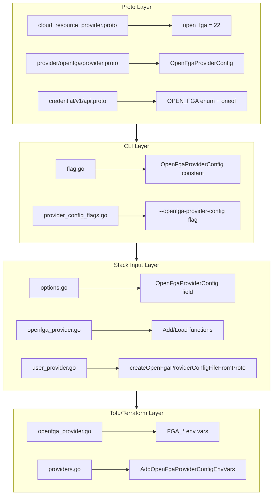
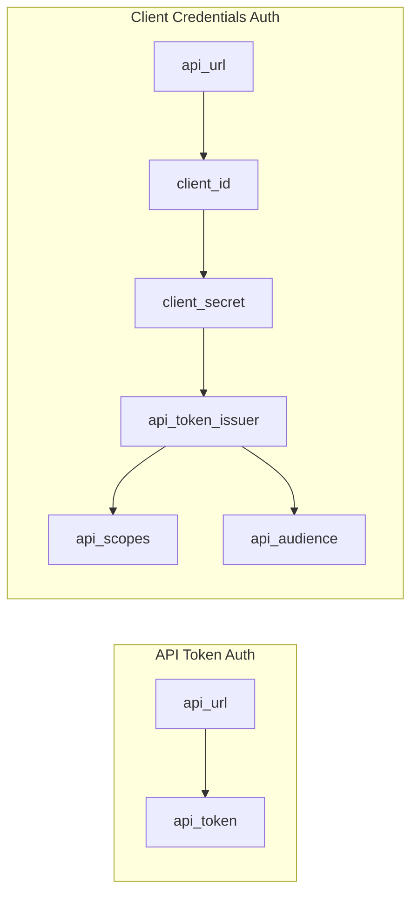

# OpenFGA Provider Integration

**Date**: January 17, 2026
**Type**: Feature
**Components**: Provider Framework, CLI Flags, API Definitions, Stack Input Processing, Tofu Integration

## Summary

Added OpenFGA as a new cloud provider to Project Planton, enabling users to manage OpenFGA authorization resources through the CLI. This implementation spans proto definitions, CLI flags, stack input processing, and Tofu/Terraform environment variable configuration. Notably, OpenFGA is Terraform-only - there is no Pulumi provider available.

## Problem Statement / Motivation

Project Planton needed to expand its provider ecosystem to include OpenFGA, a popular open-source authorization system used for fine-grained access control. Without OpenFGA support, users could not:

- Store and manage OpenFGA credentials through the platform
- Use OpenFGA credentials for infrastructure deployments
- Leverage the consistent provider credential workflow for OpenFGA resources

### Pain Points

- No OpenFGA provider in the `CloudResourceProvider` enum
- No credential storage or management for OpenFGA
- No CLI flags to pass OpenFGA credentials during deployments
- No Tofu/Terraform environment variable configuration for OpenFGA

## Solution / What's New

Implemented comprehensive OpenFGA provider support across all system layers, following the established patterns for existing providers (Auth0, AWS, GCP, Azure, etc.).

### Architecture Overview



### Terraform-Only Provider

OpenFGA is unique among Project Planton providers - it only has a Terraform provider, with no Pulumi equivalent. This means:

- All OpenFGA deployment components must use `tofu` as the provisioner
- Pulumi modules for OpenFGA resources will be empty placeholder modules
- The provider proto includes documentation warning about this constraint

### Authentication Methods

OpenFGA supports two authentication methods:



## Implementation Details

### 1. Proto Definitions

**CloudResourceProvider enum** (`cloud_resource_provider.proto`):

```protobuf
open_fga = 22 [(provider_meta) = {
  group: "openfga.project-planton.org"
  display_name: "OpenFGA"
}];
```

**OpenFgaProviderConfig message** (`provider/openfga/provider.proto`):

```protobuf
message OpenFgaProviderConfig {
  string api_url = 1 [(buf.validate.field).required = true];
  string api_token = 2;
  string client_id = 3;
  string client_secret = 4;
  string api_token_issuer = 5;
  string api_scopes = 6;
  string api_audience = 7;
}
```

The proto includes comprehensive documentation about:
- Terraform-only support (no Pulumi provider)
- Both authentication methods
- Environment variable mappings
- Links to OpenFGA docs and terraform-provider-openfga GitHub

### 2. CLI Flag Registration

Added `--openfga-provider-config` flag to all deployment commands:

```go
// internal/cli/flag/flag.go
OpenFgaProviderConfig Flag = "openfga-provider-config"

// internal/cli/iacflags/provider_config_flags.go
cmd.PersistentFlags().String(string(flag.OpenFgaProviderConfig), "",
    "path of the openfga-credential file")
```

### 3. Stack Input Processing

**StackInputProviderConfigOptions** now includes OpenFGA:

```go
type StackInputProviderConfigOptions struct {
    // ... other providers
    OpenFgaProviderConfig string
    // ...
}
```

**New openfga_provider.go**:
- `AddOpenFgaProviderConfig()` - Reads and adds OpenFGA config to stack input
- `LoadOpenFgaProviderConfig()` - Loads OpenFGA config from input directory

### 4. Tofu Environment Variables

**New openfga_provider.go** in tofumodule/providerconfig:

```go
func AddOpenFgaProviderConfigEnvVars(stackInputContentMap map[string]interface{},
    providerConfigEnvVars map[string]string) (map[string]string, error) {
    // Sets FGA_API_URL (required)
    // Sets FGA_API_TOKEN, FGA_CLIENT_ID, FGA_CLIENT_SECRET,
    // FGA_API_TOKEN_ISSUER, FGA_API_SCOPES, FGA_API_AUDIENCE (optional)
}
```

Environment variable mapping follows the terraform-provider-openfga conventions:

| Proto Field | Environment Variable |
|-------------|---------------------|
| api_url | FGA_API_URL |
| api_token | FGA_API_TOKEN |
| client_id | FGA_CLIENT_ID |
| client_secret | FGA_CLIENT_SECRET |
| api_token_issuer | FGA_API_TOKEN_ISSUER |
| api_scopes | FGA_API_SCOPES |
| api_audience | FGA_API_AUDIENCE |

## Files Changed

| Layer | Files | Action |
|-------|-------|--------|
| Proto | `cloud_resource_provider.proto` | Add enum value |
| Proto | `provider/openfga/provider.proto` | **Create** |
| Proto | `credential/v1/api.proto` | Add enum + oneof |
| CLI | `flag.go` | Add flag constant |
| CLI | `provider_config_flags.go` | Add flag registration |
| Stack Input | `options.go` | Add struct + functions |
| Stack Input | `openfga_provider.go` | **Create** |
| Stack Input | `providers.go` | Add aggregation |
| Stack Input | `user_provider.go` | Add user provider support |
| Tofu | `openfga_provider.go` | **Create** |
| Tofu | `providers.go` | Add env var call |

**Total**: 11 files across 4 system layers (3 new files created)

## Benefits

### For Users

- **Credential Management**: Store OpenFGA credentials via CLI flags
- **CLI Integration**: Pass OpenFGA credentials via `--openfga-provider-config` flag
- **Consistent Workflow**: Same credential flow as AWS, GCP, Azure, Auth0, etc.

### For Developers

- **Pattern Consistency**: OpenFGA implementation follows established provider patterns
- **Full Stack Coverage**: All layers updated consistently
- **Ready for Resources**: Foundation laid for OpenFgaStore, OpenFgaAuthorizationModel, etc.

### For Operations

- **Tofu/Terraform Support**: Environment variables automatically configured
- **Clear Documentation**: Proto comments document Terraform-only constraint

## Usage Examples

### CLI Usage

```bash
# Create OpenFGA credential file (client credentials)
cat > openfga-creds.yaml << EOF
apiUrl: https://api.us1.fga.dev
clientId: your-client-id
clientSecret: your-client-secret
apiTokenIssuer: https://fga.us.auth0.com/oauth/token
apiAudience: https://api.us1.fga.dev/
EOF

# Alternative: API token authentication
cat > openfga-creds.yaml << EOF
apiUrl: https://api.us1.fga.dev
apiToken: your-api-token
EOF

# Use with deployment (must use tofu provisioner)
project-planton apply --manifest openfga-store.yaml \
  --openfga-provider-config openfga-creds.yaml
```

## Impact

### Direct Impact

- CLI supports `--openfga-provider-config` flag on all deployment commands
- Proto stubs generated for Go (and TypeScript for frontend)
- Tofu environment variables automatically set from credentials

### Future Work Enabled

- OpenFgaStore deployment component
- OpenFgaAuthorizationModel deployment component
- OpenFga relationship tuple management
- Integration with Planton Cloud credential management

## Related Work

- Follows the same pattern established by Auth0 provider integration (December 2025)
- Uses terraform-provider-openfga schema as reference: https://github.com/openfga/terraform-provider-openfga
- Integrates with the credential resolution system for automated deployments

---

**Status**: ✅ Production Ready
**Build**: Proto generation and Go compilation successful
