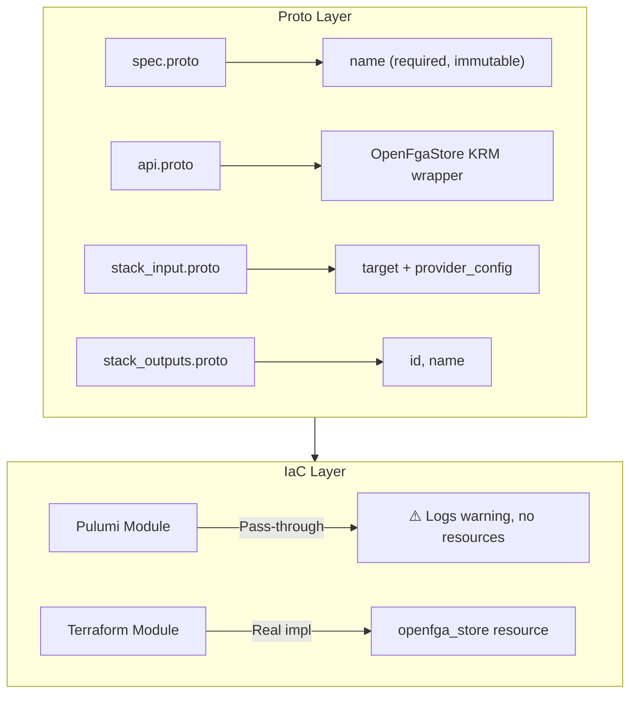

# OpenFgaStore Deployment Component

**Date**: January 17, 2026
**Type**: Feature
**Components**: Provider Framework, API Definitions, Pulumi IaC Module (placeholder), Terraform IaC Module

## Summary

Implemented `OpenFgaStore` as the first deployment component for the OpenFGA provider. This component enables declarative management of OpenFGA stores (authorization data containers) through Terraform/Tofu. Notably, this is the first component in Project Planton where the Pulumi module is a pass-through placeholder because **OpenFGA has no Pulumi provider**.

## Problem Statement / Motivation

With the OpenFGA provider recently integrated into Project Planton, there was no way to manage OpenFGA resources. Users needed a deployment component to:

- Create and manage OpenFGA stores declaratively via YAML manifests
- Enable infrastructure-as-code workflows for authorization infrastructure
- Integrate with the existing CLI credential flow for OpenFGA

### Unique Constraint: Terraform-Only

OpenFGA only has a Terraform provider ([terraform-provider-openfga](https://github.com/openfga/terraform-provider-openfga)). There is no Pulumi provider available. This required a different approach:

- Pulumi module exists for structural consistency but is a **pass-through placeholder**
- Users **must** use `--provisioner tofu` when deploying OpenFGA components
- The Pulumi module logs warnings and exits without creating resources

## Solution / What's New

Created a complete OpenFgaStore deployment component following established patterns with Terraform as the primary IaC implementation.

### Registry Allocation

Allocated OpenFGA provider block **2300–2499** (200 numbers) for future OpenFGA components:

```protobuf
// 2300–2499: OpenFGA resources
// Note: OpenFGA is Terraform-only - there is no Pulumi provider available.
OpenFgaStore = 2300 [(kind_meta) = {
  provider: open_fga
  version: v1
  id_prefix: "fgastore"
}];
```

### Architecture



## Implementation Details

### Proto API (4 files)

**spec.proto** - Minimal store specification:
```protobuf
message OpenFgaStoreSpec {
  // name is the display name of the OpenFGA store.
  // Note: The store name is immutable - changing it requires replacing the store.
  string name = 1 [(buf.validate.field).required = true];
}
```

**stack_outputs.proto** - Deployment outputs:
```protobuf
message OpenFgaStoreStackOutputs {
  string id = 1;    // Unique store identifier
  string name = 2;  // Display name
}
```

**api.proto** - KRM envelope:
- apiVersion: `openfga.project-planton.org/v1`
- kind: `OpenFgaStore`
- Standard metadata, spec, status structure

**stack_input.proto** - IaC module inputs:
- Target OpenFgaStore resource
- OpenFgaProviderConfig credentials

### Pulumi Module (Pass-through Placeholder)

```go
// Resources is a pass-through placeholder for OpenFGA Store.
// IMPORTANT: OpenFGA does not have a Pulumi provider.
func Resources(ctx *pulumi.Context, stackInput *openfgastorev1.OpenFgaStoreStackInput) error {
    ctx.Log.Warn("OpenFGA does not have a Pulumi provider.", nil)
    ctx.Log.Warn("Use Terraform/Tofu as the provisioner.", nil)
    ctx.Export("notice", pulumi.String("No Pulumi provider. Use --provisioner tofu"))
    return nil
}
```

### Terraform Module (Real Implementation)

```hcl
# provider.tf - Configured via FGA_* environment variables
provider "openfga" {}

# main.tf - Creates the store
resource "openfga_store" "this" {
  name = local.store_name
}

# outputs.tf - Exports id and name
output "id" { value = openfga_store.this.id }
output "name" { value = openfga_store.this.name }
```

### Frontend Fix

Added OpenFGA to the credential provider configuration to fix build:

```typescript
[Credential_CredentialProvider.OPEN_FGA]: {
  label: 'OpenFGA',
  description: 'Link your OpenFGA server to manage authorization resources',
  icon: undefined,
},
```

## Files Changed

| Category | Files |
|----------|-------|
| Registry | `cloud_resource_kind.proto` |
| Proto API | `spec.proto`, `api.proto`, `stack_input.proto`, `stack_outputs.proto` |
| Generated | `*.pb.go` (4 files), `BUILD.bazel` (3 files) |
| Pulumi | `main.go`, `module/*.go`, `Makefile`, `Pulumi.yaml`, `debug.sh` |
| Terraform | `provider.tf`, `variables.tf`, `locals.tf`, `main.tf`, `outputs.tf` |
| Docs | `README.md`, `examples.md`, `overview.md`, IaC READMEs |
| Supporting | `iac/hack/manifest.yaml` |
| Frontend | `credentials/_components/utils.ts` |

**Total**: ~25 files created/modified

## Benefits

### For Users

- **Declarative Authorization Infrastructure**: Configure OpenFGA stores via YAML
- **Credential Integration**: Uses existing `--openfga-provider-config` CLI flag
- **Environment Isolation**: Easily create separate stores for dev/staging/prod

### For Developers

- **Pattern Consistency**: Follows established deployment component patterns
- **Clear Documentation**: Explicit warnings about Terraform-only requirement
- **Full Structure**: Maintains both Pulumi and Terraform for consistency

### For Platform Teams

- **Version Control**: OpenFGA configuration as code
- **Infrastructure as Code**: Automated store provisioning
- **Audit Trail**: Changes tracked in git history

## Impact

### Direct

- Users can now manage OpenFGA stores through Project Planton
- CLI supports OpenFgaStore manifests with `--openfga-provider-config` flag
- OpenFGA provider now has its first deployment component

### Registry

- OpenFGA range established: 2300–2499 (199 slots remaining)
- First Terraform-only provider in the platform

### Future Work Enabled

- `OpenFgaAuthorizationModel` component (define types and relations)
- `OpenFgaTuple` component (manage relationship tuples)
- Integration with Planton Cloud's authorization system

## Usage Examples

### Create Store

```yaml
apiVersion: open-fga.project-planton.org/v1
kind: OpenFgaStore
metadata:
  name: production-authz
  org: my-company
  env: production
spec:
  name: production-authorization-store
```

### Deploy

```bash
# Create credentials file
cat > openfga-creds.yaml << EOF
apiUrl: http://localhost:8080
apiToken: your-api-token
EOF

# Deploy using Terraform/Tofu (required - no Pulumi provider)
project-planton apply --manifest openfga-store.yaml \
  --openfga-provider-config openfga-creds.yaml \
  --provisioner tofu
```

## Related Work

- Builds on OpenFGA provider integration (2026-01-17-openfga-provider-integration.md)
- Follows patterns from Auth0Connection component
- Uses terraform-provider-openfga: https://github.com/openfga/terraform-provider-openfga

---

**Status**: ✅ Production Ready
**Build**: CLI compiles, Terraform validates, Frontend builds
