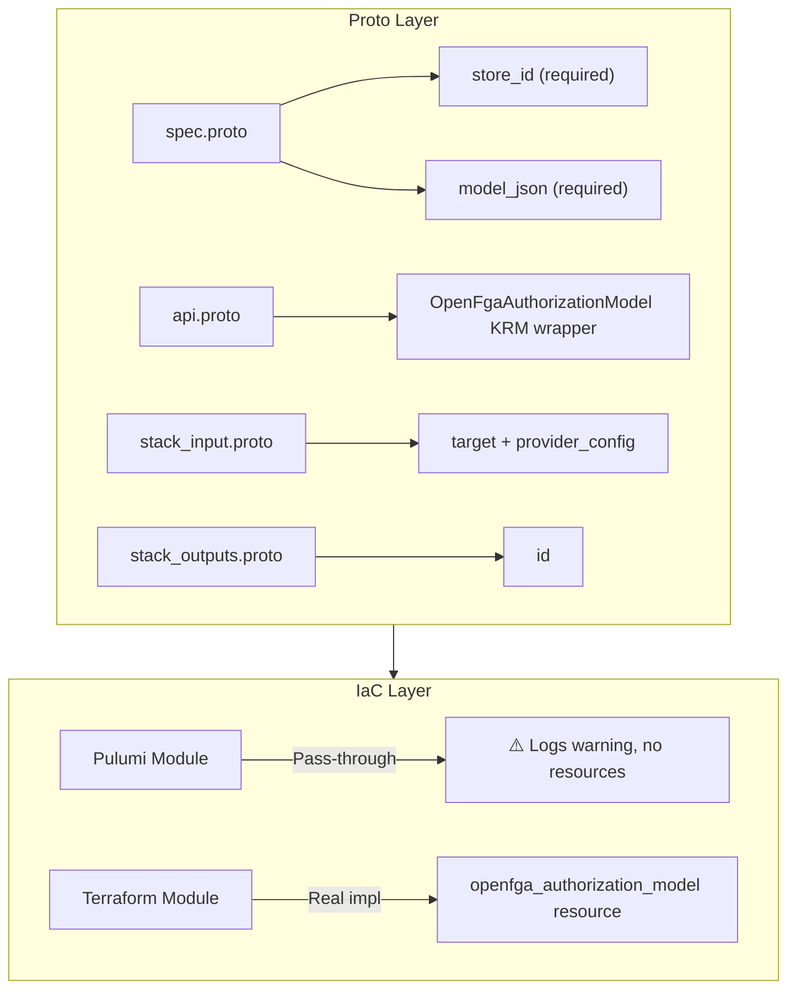

# OpenFgaAuthorizationModel Deployment Component

**Date**: January 17, 2026
**Type**: Feature
**Components**: Provider Framework, API Definitions, Pulumi IaC Module (placeholder), Terraform IaC Module

## Summary

Implemented `OpenFgaAuthorizationModel` as the second deployment component for the OpenFGA provider. This component enables declarative management of OpenFGA authorization models (type definitions and relations) through Terraform/Tofu. Like OpenFgaStore, the Pulumi module is a pass-through placeholder because **OpenFGA has no Pulumi provider**.

## Problem Statement / Motivation

With OpenFgaStore deployed, users needed a way to define the authorization schema for their stores. An authorization model defines:

- **Types**: Object types in the system (user, document, folder, etc.)
- **Relations**: Relationships between types (viewer, editor, owner, member, etc.)
- **Rewrites**: How relations are computed (direct, computed, union, intersection)
- **Conditions**: Dynamic rules for access decisions

Without this component, users would need to manually manage authorization models outside of the Project Planton workflow.

## Solution / What's New

Created a complete OpenFgaAuthorizationModel deployment component following the patterns established by OpenFgaStore.

### Registry Entry

```protobuf
OpenFgaAuthorizationModel = 2301 [(kind_meta) = {
  provider: open_fga
  version: v1
  id_prefix: "fgamodel"
}];
```

### Architecture



## Implementation Details

### Proto API (4 files)

**spec.proto** - Authorization model specification:
```protobuf
message OpenFgaAuthorizationModelSpec {
  // store_id is the unique identifier of the OpenFGA store
  string store_id = 1 [(buf.validate.field).required = true];
  
  // model_json is the authorization model definition in JSON format
  string model_json = 2 [(buf.validate.field).required = true];
}
```

**stack_outputs.proto** - Deployment outputs:
```protobuf
message OpenFgaAuthorizationModelStackOutputs {
  string id = 1;  // Unique model identifier (version-specific)
}
```

**api.proto** - KRM envelope:
- apiVersion: `open-fga.project-planton.org/v1`
- kind: `OpenFgaAuthorizationModel`
- Standard metadata, spec, status structure

**stack_input.proto** - IaC module inputs:
- Target OpenFgaAuthorizationModel resource
- OpenFgaProviderConfig credentials

### Pulumi Module (Pass-through Placeholder)

```go
func Resources(ctx *pulumi.Context, stackInput *openfgaauthorizationmodelv1.OpenFgaAuthorizationModelStackInput) error {
    ctx.Log.Warn("OpenFGA does not have a Pulumi provider.", nil)
    ctx.Log.Warn("Use Terraform/Tofu as the provisioner.", nil)
    ctx.Export("notice", pulumi.String("No Pulumi provider. Use --provisioner tofu"))
    return nil
}
```

### Terraform Module (Real Implementation)

```hcl
# main.tf
resource "openfga_authorization_model" "this" {
  store_id   = local.store_id
  model_json = local.model_json
}

# outputs.tf
output "id" { value = openfga_authorization_model.this.id }
```

## Files Changed

| Category | Files |
|----------|-------|
| Registry | `cloud_resource_kind.proto` |
| Proto API | `spec.proto`, `api.proto`, `stack_input.proto`, `stack_outputs.proto` |
| Generated | `*.pb.go` (4 files), `BUILD.bazel` (3 files) |
| Pulumi | `main.go`, `module/*.go`, `Makefile`, `Pulumi.yaml`, `overview.md` |
| Terraform | `provider.tf`, `variables.tf`, `locals.tf`, `main.tf`, `outputs.tf` |
| Docs | `README.md`, `examples.md`, IaC READMEs |
| Supporting | `iac/hack/manifest.yaml` |

**Total**: ~25 files created/modified

## Benefits

### For Users

- **Declarative Authorization Schema**: Define authorization models via YAML manifests
- **Version Tracking**: Each model change creates a new version with a new ID
- **Store Integration**: Works seamlessly with OpenFgaStore component

### For Developers

- **Pattern Consistency**: Follows established OpenFgaStore patterns
- **Clear Documentation**: Explicit warnings about Terraform-only requirement
- **Full Structure**: Maintains both Pulumi and Terraform for consistency

### For Platform Teams

- **Schema as Code**: Authorization models tracked in version control
- **Model Versioning**: Built-in immutability enables safe evolution
- **Audit Trail**: Changes tracked in git history

## Impact

### Direct

- Users can now manage OpenFGA authorization models through Project Planton
- Complete OpenFGA workflow: Store → Model → (future: Tuples)
- CLI supports OpenFgaAuthorizationModel manifests with `--openfga-provider-config` flag

### Registry

- OpenFGA enum 2301 allocated for OpenFgaAuthorizationModel
- 198 slots remaining in OpenFGA range (2302-2499)

### Future Work Enabled

- `OpenFgaTuple` component (manage relationship tuples)
- Direct integration with application authorization flows
- Policy-as-code for Planton Cloud's own authorization

## Usage Examples

### Create Authorization Model

```yaml
apiVersion: open-fga.project-planton.org/v1
kind: OpenFgaAuthorizationModel
metadata:
  name: document-authz-v1
  org: my-company
  env: production
spec:
  storeId: "01HXYZ..."  # From OpenFgaStore deployment
  modelJson: |
    {
      "schema_version": "1.1",
      "type_definitions": [
        {"type": "user", "relations": {}},
        {
          "type": "document",
          "relations": {
            "viewer": {"this": {}},
            "editor": {"this": {}},
            "owner": {"this": {}}
          },
          "metadata": {
            "relations": {
              "viewer": {"directly_related_user_types": [{"type": "user"}]},
              "editor": {"directly_related_user_types": [{"type": "user"}]},
              "owner": {"directly_related_user_types": [{"type": "user"}]}
            }
          }
        }
      ]
    }
```

### Deploy

```bash
# Deploy using Terraform/Tofu (required - no Pulumi provider)
project-planton apply --manifest authorization-model.yaml \
  --openfga-provider-config openfga-creds.yaml \
  --provisioner tofu
```

## Key Design Decisions

### Immutable Models

Authorization models in OpenFGA are immutable by design. Each `model_json` change creates a new model with a new ID. This enables:
- Safe schema evolution
- Easy rollback to previous versions
- A/B testing of authorization models

### JSON Format

The `model_json` field uses JSON format (not DSL) because:
- Terraform provider requires JSON input
- JSON is unambiguous and machine-readable
- Users can convert from DSL using the OpenFGA CLI

## Related Work

- Builds on OpenFGA provider integration (2026-01-17-openfga-provider-integration.md)
- Follows patterns from OpenFgaStore component (2026-01-17-openfgastore-deployment-component.md)
- Uses terraform-provider-openfga: https://github.com/openfga/terraform-provider-openfga

---

**Status**: ✅ Production Ready
**Build**: CLI compiles, Terraform validates
