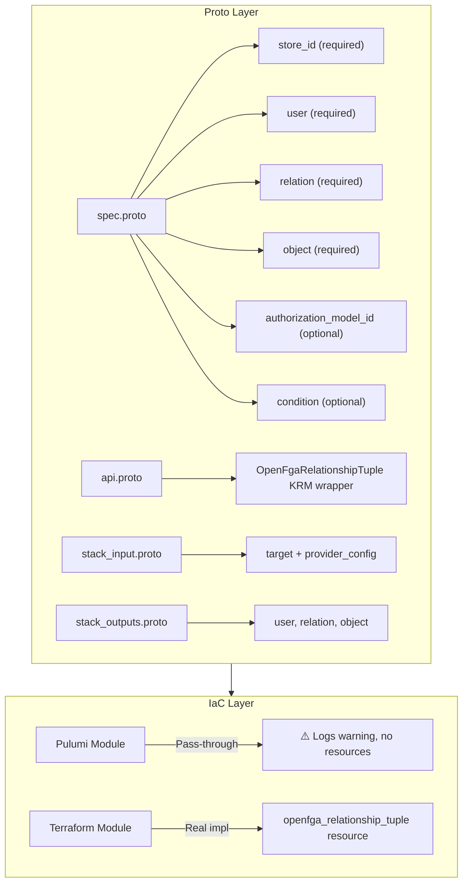

# OpenFgaRelationshipTuple Deployment Component

**Date**: January 17, 2026
**Type**: Feature
**Components**: Provider Framework, API Definitions, Pulumi IaC Module (placeholder), Terraform IaC Module

## Summary

Implemented `OpenFgaRelationshipTuple` as the third deployment component for the OpenFGA provider. This component enables declarative management of OpenFGA relationship tuples (authorization data) through Terraform/Tofu. Like the other OpenFGA components, the Pulumi module is a pass-through placeholder because **OpenFGA has no Pulumi provider**.

## Problem Statement / Motivation

With OpenFgaStore and OpenFgaAuthorizationModel deployed, users needed a way to create the actual authorization data - the relationship tuples that define who has what access to which resources.

Relationship tuples are the core data structure in OpenFGA:

- **User**: The subject being granted access (e.g., `user:anne`, `group:engineering#member`)
- **Relation**: The type of access (e.g., `viewer`, `editor`, `owner`)
- **Object**: The resource being accessed (e.g., `document:budget-2024`)
- **Condition** (optional): Dynamic rules evaluated at check time

Without this component, users would need to manually create tuples outside of the Project Planton workflow.

## Solution / What's New

Created a complete OpenFgaRelationshipTuple deployment component following the patterns established by OpenFgaStore and OpenFgaAuthorizationModel.

### Registry Entry

```protobuf
OpenFgaRelationshipTuple = 2302 [(kind_meta) = {
  provider: open_fga
  version: v1
  id_prefix: "fgatuple"
}];
```

### Architecture



## Implementation Details

### Proto API (4 files)

**spec.proto** - Relationship tuple specification:
```protobuf
message OpenFgaRelationshipTupleSpec {
  string store_id = 1 [(buf.validate.field).required = true];
  string authorization_model_id = 2;  // Optional, uses latest if not specified
  string user = 3 [(buf.validate.field).required = true];
  string relation = 4 [(buf.validate.field).required = true];
  string object = 5 [(buf.validate.field).required = true];
  OpenFgaRelationshipTupleCondition condition = 6;  // Optional
}

message OpenFgaRelationshipTupleCondition {
  string name = 1 [(buf.validate.field).required = true];
  string context_json = 2;
}
```

**stack_outputs.proto** - Deployment outputs:
```protobuf
message OpenFgaRelationshipTupleStackOutputs {
  string user = 1;
  string relation = 2;
  string object = 3;
}
```

**api.proto** - KRM envelope:
- apiVersion: `open-fga.project-planton.org/v1`
- kind: `OpenFgaRelationshipTuple`
- Standard metadata, spec, status structure

**stack_input.proto** - IaC module inputs:
- Target OpenFgaRelationshipTuple resource
- OpenFgaProviderConfig credentials

### Pulumi Module (Pass-through Placeholder)

```go
func Resources(ctx *pulumi.Context, stackInput *openfgarelationshiptuplev1.OpenFgaRelationshipTupleStackInput) error {
    ctx.Log.Warn("OpenFGA does not have a Pulumi provider.", nil)
    ctx.Log.Warn("Use Terraform/Tofu as the provisioner.", nil)
    ctx.Export("notice", pulumi.String("No Pulumi provider. Use --provisioner tofu"))
    return nil
}
```

### Terraform Module (Real Implementation)

```hcl
# main.tf
resource "openfga_relationship_tuple" "this" {
  store_id               = local.store_id
  authorization_model_id = local.authorization_model_id
  user                   = local.user
  relation               = local.relation
  object                 = local.object

  dynamic "condition" {
    for_each = local.condition != null ? [local.condition] : []
    content {
      name         = condition.value.name
      context_json = condition.value.context_json
    }
  }
}

# outputs.tf
output "user" { value = openfga_relationship_tuple.this.user }
output "relation" { value = openfga_relationship_tuple.this.relation }
output "object" { value = openfga_relationship_tuple.this.object }
```

## Files Changed

| Category | Files |
|----------|-------|
| Registry | `cloud_resource_kind.proto` |
| Proto API | `spec.proto`, `api.proto`, `stack_input.proto`, `stack_outputs.proto` |
| Generated | `*.pb.go` (4 files), `BUILD.bazel` (3 files) |
| Pulumi | `main.go`, `module/*.go`, `Makefile`, `Pulumi.yaml`, `overview.md` |
| Terraform | `provider.tf`, `variables.tf`, `locals.tf`, `main.tf`, `outputs.tf` |
| Docs | `README.md`, `examples.md`, IaC READMEs |
| Supporting | `iac/hack/manifest.yaml` |

**Total**: ~25 files created/modified

## Benefits

### For Users

- **Declarative Authorization Data**: Define relationship tuples via YAML manifests
- **Full OpenFGA Workflow**: Complete Store → Model → Tuple pipeline
- **Optional Conditions**: Support for dynamic access rules
- **Model Pinning**: Optionally pin tuples to specific model versions

### For Developers

- **Pattern Consistency**: Follows established OpenFGA component patterns
- **Clear Documentation**: Explicit warnings about Terraform-only requirement
- **Full Structure**: Maintains both Pulumi and Terraform for consistency

### For Platform Teams

- **Authorization as Code**: Relationship tuples tracked in version control
- **Audit Trail**: Changes tracked in git history
- **Infrastructure Integration**: Authorization data managed alongside infrastructure

## Impact

### Direct

- Users can now manage OpenFGA relationship tuples through Project Planton
- Complete OpenFGA workflow: Store → Model → Tuple
- CLI supports OpenFgaRelationshipTuple manifests with `--openfga-provider-config` flag

### Registry

- OpenFGA enum 2302 allocated for OpenFgaRelationshipTuple
- 197 slots remaining in OpenFGA range (2303-2499)

### Future Work Enabled

- Bulk tuple management
- Integration with application authorization flows
- Policy-as-code for Planton Cloud's own authorization

## Usage Examples

### Basic Tuple

```yaml
apiVersion: open-fga.project-planton.org/v1
kind: OpenFgaRelationshipTuple
metadata:
  name: anne-views-budget
  org: my-company
  env: production
spec:
  storeId: "01HXYZ..."
  user: "user:anne"
  relation: "viewer"
  object: "document:budget-2024"
```

### With Condition

```yaml
apiVersion: open-fga.project-planton.org/v1
kind: OpenFgaRelationshipTuple
metadata:
  name: anne-conditional-access
  org: my-company
  env: production
spec:
  storeId: "01HXYZ..."
  user: "user:anne"
  relation: "viewer"
  object: "document:sensitive-report"
  condition:
    name: "in_allowed_ip_range"
    contextJson: |
      {"allowed_ips": ["192.168.1.0/24", "10.0.0.0/8"]}
```

### Deploy

```bash
# Deploy using Terraform/Tofu (required - no Pulumi provider)
project-planton apply --manifest relationship-tuple.yaml \
  --openfga-provider-config openfga-creds.yaml \
  --provisioner tofu
```

## Key Design Decisions

### Immutable Tuples

Relationship tuples in OpenFGA are immutable by design. Changing any field (user, relation, object, or condition) results in:
1. Deletion of the old tuple
2. Creation of a new tuple

Terraform handles this automatically via `RequiresReplace()` plan modifiers.

### Optional Authorization Model ID

The `authorizationModelId` field is optional. When not specified:
- The tuple is validated against the latest model in the store
- This is useful for development and simpler deployments

When specified:
- The tuple is validated against that specific model version
- This is recommended for production to ensure consistency

### Condition Support

The optional `condition` field enables dynamic access control:
- The condition must be defined in the authorization model
- Conditions are evaluated at check time using provided context
- Partial context can be stored with the tuple

## Related Work

- Builds on OpenFGA provider integration (2026-01-17-openfga-provider-integration.md)
- Follows patterns from OpenFgaStore (2026-01-17-openfgastore-deployment-component.md)
- Follows patterns from OpenFgaAuthorizationModel (2026-01-17-openfgaauthorizationmodel-deployment-component.md)
- Uses terraform-provider-openfga: https://github.com/openfga/terraform-provider-openfga

---

**Status**: ✅ Production Ready
**Build**: CLI compiles, Terraform validates
