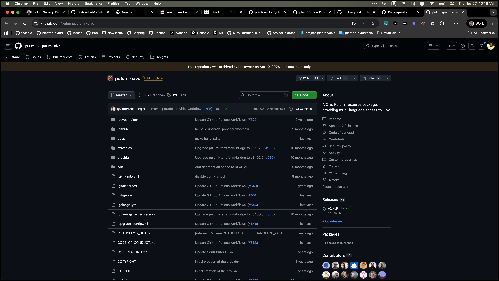

While testing the civo pulumi modules, I discovered that the official pulumi provider for civo has been discontinued.
The instructions on the readme suggest creating the provider as a local provider.

