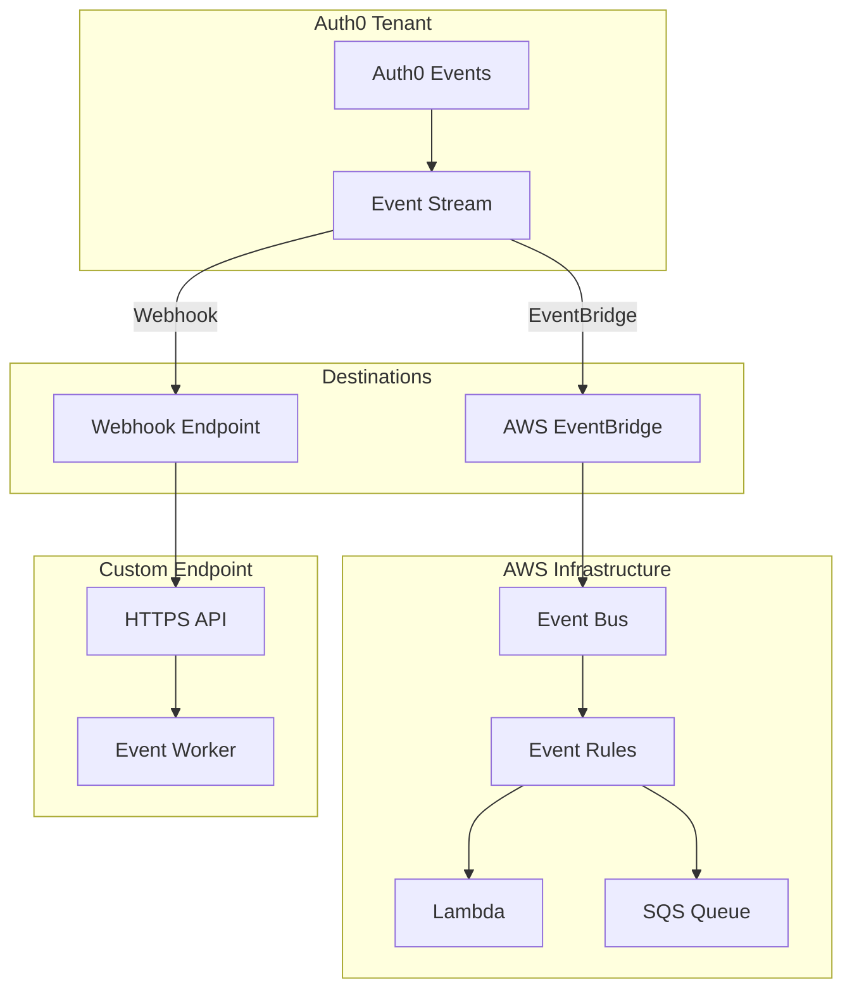
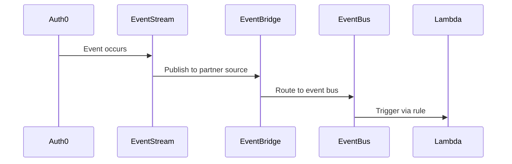
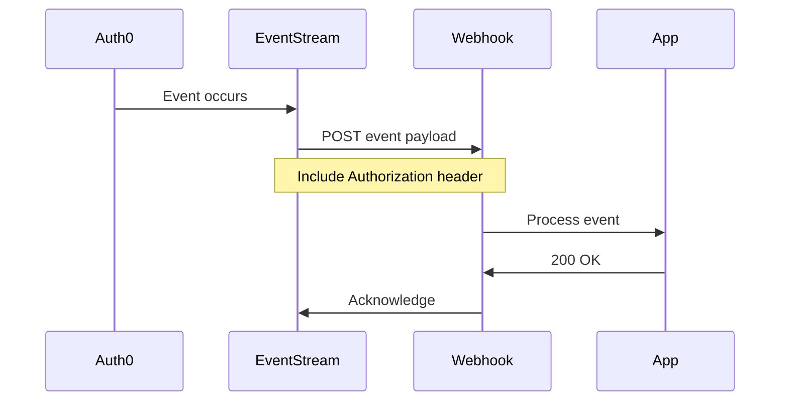

# Auth0EventStream - Technical Documentation

This document provides comprehensive technical documentation for the Auth0EventStream deployment component.

## Architecture Overview



## Resource Model

### Auth0EventStream

The `Auth0EventStream` resource follows the Kubernetes Resource Model (KRM) pattern:

```yaml
apiVersion: auth0.project-planton.org/v1
kind: Auth0EventStream
metadata:
  name: <string>          # Required: unique identifier
  org: <string>           # Organization that owns this resource
  env: <string>           # Environment (production, staging, etc.)
  labels: <map>           # Key-value pairs for filtering
spec:
  destination_type: <string>               # Required: eventbridge | webhook
  subscriptions: <list[string]>            # Required: event types to subscribe
  eventbridge_configuration: <object>      # For EventBridge destination
  webhook_configuration: <object>          # For Webhook destination
status:
  outputs:
    id: <string>                           # Event stream ID (est_XXXX)
    name: <string>                         # Stream name
    status: <string>                       # active | suspended | disabled
    destination_type: <string>             # eventbridge | webhook
    subscriptions: <list[string]>          # Subscribed event types
    created_at: <string>                   # ISO 8601 timestamp
    updated_at: <string>                   # ISO 8601 timestamp
    aws_partner_event_source: <string>     # For EventBridge only
```

## Specification Details

### Destination Types

| Type | Description | Update Policy |
|------|-------------|---------------|
| `eventbridge` | AWS EventBridge integration | Configuration is immutable after creation |
| `webhook` | Custom HTTPS endpoint | Configuration can be updated anytime |

### EventBridge Configuration

```protobuf
message Auth0EventBridgeConfiguration {
  // AWS account ID (12-digit number)
  string aws_account_id = 1;
  
  // AWS region (e.g., us-east-1)
  string aws_region = 2;
}
```

**Validation Rules:**
- `aws_account_id`: Must be exactly 12 digits
- `aws_region`: Required, non-empty string

**Immutability:** EventBridge configuration cannot be changed after creation. Any modification requires deleting and recreating the event stream.

### Webhook Configuration

```protobuf
message Auth0WebhookConfiguration {
  // HTTPS endpoint URL
  string webhook_endpoint = 1;
  
  // Authorization settings
  Auth0WebhookAuthorization webhook_authorization = 2;
}

message Auth0WebhookAuthorization {
  // Authorization method: basic | bearer
  string method = 1;
  
  // For basic auth
  string username = 2;
  string password = 3;
  
  // For bearer token
  string token = 4;
}
```

**Validation Rules:**
- `webhook_endpoint`: Must start with `https://`
- `method`: Must be `basic` or `bearer`
- `webhook_authorization`: Required

### Subscriptions

Subscriptions define which event types the stream receives. At least one subscription is required.

**Common Event Categories:**

| Category | Events |
|----------|--------|
| User | `user.created`, `user.updated`, `user.deleted`, `user.blocked`, `user.unblocked` |
| Authentication | `authentication.success`, `authentication.failure` |
| API | `api.authorization.success`, `api.authorization.failure` |
| Management | `management.client.*`, `management.connection.*` |

## IaC Implementation

### Pulumi Module

The Pulumi module is implemented in Go:

```
iac/pulumi/
├── main.go              # Entry point, loads stack input
├── Pulumi.yaml          # Pulumi project configuration
├── Makefile             # Build and test targets
├── debug.sh             # Local debugging script
└── module/
    ├── main.go          # Provider setup, orchestration
    ├── locals.go        # Input processing
    ├── eventstream.go   # Event stream creation
    └── outputs.go       # Stack output exports
```

**Key Implementation Details:**

1. **Provider Configuration**: Uses `auth0.NewProvider` with credentials from stack input or environment variables
2. **Resource Creation**: Uses `auth0.NewEventStream` with configuration based on destination type
3. **Outputs**: Exports ID, name, status, and destination-specific information

### Terraform Module

The Terraform module uses HCL:

```
iac/tf/
├── provider.tf    # Auth0 provider configuration
├── variables.tf   # Input variable definitions
├── locals.tf      # Computed values
├── main.tf        # Event stream resource
└── outputs.tf     # Output definitions
```

**Key Implementation Details:**

1. **Dynamic Blocks**: Uses `dynamic` blocks to conditionally include EventBridge or Webhook configuration
2. **Conditional Logic**: Applies configuration based on `destination_type`
3. **Sensitive Data**: Passwords and tokens marked as sensitive

## Event Delivery

### EventBridge Flow



**Setup Steps After Deployment:**

1. Get the `aws_partner_event_source` from stack outputs
2. Associate the partner event source with an EventBridge event bus
3. Create rules on the event bus to route events
4. Configure targets (Lambda, SQS, SNS, etc.)

### Webhook Flow



**Webhook Requirements:**

- **Protocol**: HTTPS only (HTTP not supported)
- **Response Time**: Must respond within 10 seconds
- **Success Codes**: 2xx status codes indicate success
- **Retries**: Auth0 retries failed deliveries with exponential backoff

## Security Considerations

### Credential Management

- Store Auth0 credentials securely (not in source control)
- Use environment variables or secret management systems
- Rotate M2M application credentials regularly

### Webhook Security

- Always use HTTPS endpoints
- Verify webhook signatures when possible
- Rotate bearer tokens and passwords periodically
- Use strong, unique credentials for each environment

### EventBridge Security

- Follow AWS IAM best practices
- Use least-privilege permissions for event bus access
- Enable encryption for event data in transit

## Troubleshooting

### Common Issues

| Issue | Cause | Solution |
|-------|-------|----------|
| Event stream not delivering | Subscription mismatch | Verify event types in subscriptions |
| Webhook 401 errors | Invalid credentials | Check authorization configuration |
| EventBridge events missing | Partner source not associated | Associate with event bus in AWS |
| Stream status "suspended" | Delivery failures | Check endpoint availability |

### Debugging

1. **Check stream status**: Should be "active"
2. **Verify subscriptions**: Ensure correct event types
3. **Test webhook endpoint**: Confirm HTTPS accessibility
4. **Review Auth0 logs**: Check for delivery errors

## Performance

### Event Delivery

- **Latency**: Near real-time (typically < 5 seconds)
- **Throughput**: Scales with Auth0 tenant limits
- **Ordering**: Events may arrive out of order

### Best Practices

1. **Minimize subscriptions**: Only subscribe to needed events
2. **Fast webhook response**: Return 200 quickly, process asynchronously
3. **Idempotent processing**: Handle duplicate events gracefully
4. **Monitor delivery**: Track success/failure rates

## Comparison: EventBridge vs Webhook

| Aspect | EventBridge | Webhook |
|--------|-------------|---------|
| Setup Complexity | Higher (AWS configuration) | Lower (just endpoint) |
| Scalability | AWS-managed, highly scalable | Depends on your endpoint |
| Filtering | AWS EventBridge rules | Application-level |
| Retry Logic | AWS-managed | Auth0-managed |
| Update Policy | Immutable | Mutable |
| Best For | AWS-native architectures | Custom integrations |

## References

- [Auth0 Event Streams Documentation](https://auth0.com/docs/customize/log-streams)
- [Auth0 Event Types Reference](https://auth0.com/docs/customize/log-streams/event-types)
- [AWS EventBridge Partner Event Sources](https://docs.aws.amazon.com/eventbridge/latest/userguide/aws-events.html)
- [Terraform auth0_event_stream](https://registry.terraform.io/providers/auth0/auth0/latest/docs/resources/event_stream)
- [Pulumi Auth0 EventStream](https://www.pulumi.com/registry/packages/auth0/api-docs/eventstream/)

