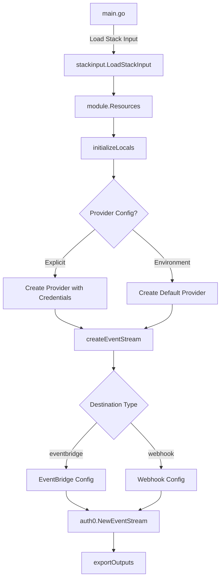

# Auth0EventStream Pulumi Module - Architecture Overview

## Module Structure

```
iac/pulumi/
├── main.go              # Entry point - loads stack input and calls Resources()
├── Pulumi.yaml          # Pulumi project configuration
├── Makefile             # Build, test, and dependency management
├── debug.sh             # Local debugging script
├── README.md            # Usage documentation
├── overview.md          # This file - architecture overview
└── module/
    ├── main.go          # Resources() - provider setup and orchestration
    ├── locals.go        # Locals struct and initializeLocals()
    ├── eventstream.go   # createEventStream() - core resource creation
    └── outputs.go       # exportOutputs() - stack output exports
```

## Execution Flow



## Component Details

### main.go (Entry Point)

- Initializes Pulumi runtime
- Loads stack input from YAML file
- Calls `module.Resources()`

### module/main.go (Orchestration)

- Initializes locals from stack input
- Creates Auth0 provider with credentials or defaults
- Orchestrates event stream creation
- Exports outputs

### module/locals.go (Input Processing)

```go
type Locals struct {
    Auth0EventStream *auth0eventstreamv1.Auth0EventStream
    StreamName       string
    DestinationType  string
    Subscriptions    []string
    EventBridgeConfiguration *auth0eventstreamv1.Auth0EventBridgeConfiguration
    WebhookConfiguration     *auth0eventstreamv1.Auth0WebhookConfiguration
}
```

- Extracts values from stack input
- Provides computed values for resource creation

### module/eventstream.go (Resource Creation)

- Builds `EventStreamArgs` based on destination type
- Configures EventBridge or Webhook settings
- Creates `auth0.EventStream` resource

### module/outputs.go (Output Exports)

- Exports core identifiers (id, name, status)
- Exports destination-specific information
- Registers resource outputs

## Provider Configuration

The module supports two authentication modes:

1. **Explicit Credentials** (via stack input):
```yaml
auth0_provider_config:
  domain: tenant.auth0.com
  client_id: xxx
  client_secret: yyy
```

2. **Environment Variables**:
```bash
AUTH0_DOMAIN=tenant.auth0.com
AUTH0_CLIENT_ID=xxx
AUTH0_CLIENT_SECRET=yyy
```

## Resource Creation Logic

### EventBridge Destination

```go
EventStreamArgs{
    Name:            "stream-name",
    DestinationType: "eventbridge",
    Subscriptions:   ["user.created", ...],
    EventbridgeConfiguration: &EventbridgeConfigurationArgs{
        AwsAccountId: "123456789012",
        AwsRegion:    "us-east-1",
    },
}
```

### Webhook Destination

```go
EventStreamArgs{
    Name:            "stream-name",
    DestinationType: "webhook",
    Subscriptions:   ["user.created", ...],
    WebhookConfiguration: &WebhookConfigurationArgs{
        WebhookEndpoint: "https://example.com/webhook",
        WebhookAuthorization: &WebhookAuthorizationArgs{
            Method: "bearer",
            Token:  "secret-token",
        },
    },
}
```

## Error Handling

- Each function returns errors with context using `errors.Wrap()`
- Provider creation failures are caught early
- Resource creation errors include resource name

## Testing

Run with test manifest:
```bash
make test
```

Debug locally:
```bash
./debug.sh
```

## Dependencies

| Package | Purpose |
|---------|---------|
| `github.com/pulumi/pulumi/sdk/v3/go/pulumi` | Pulumi SDK |
| `github.com/pulumi/pulumi-auth0/sdk/v3/go/auth0` | Auth0 Provider |
| `github.com/pkg/errors` | Error wrapping |
| `project-planton/.../auth0eventstream/v1` | Proto definitions |
| `project-planton/pkg/iac/pulumi/...` | Stack input loading |

