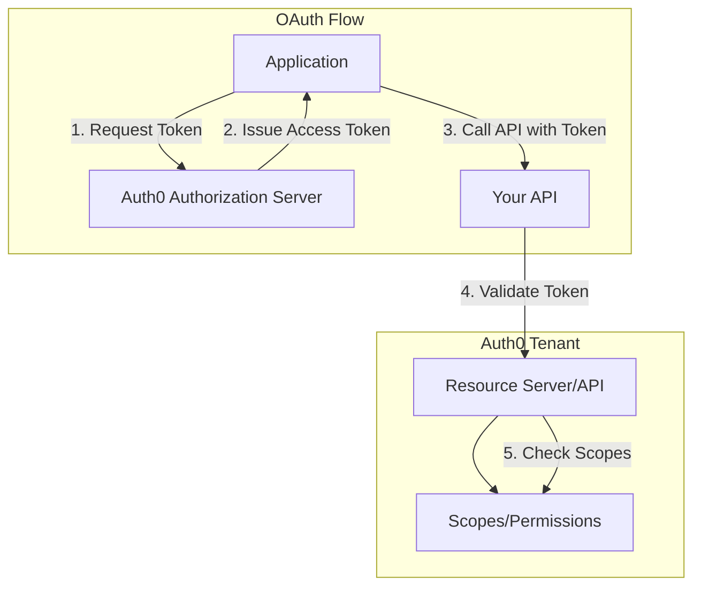
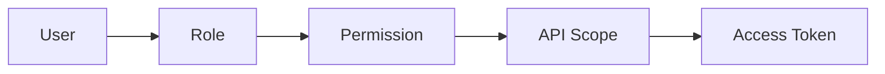

# Auth0 Resource Server - Technical Documentation

This document provides comprehensive technical details about the Auth0ResourceServer deployment component.

## Overview

Auth0 Resource Servers (APIs) are the backend services that your applications need to access. When an application wants to call your API, it first obtains an access token from Auth0, then presents that token when making API calls. The Resource Server validates the token and authorizes the request based on the token's claims and scopes.

## Architecture



## Configuration Details

### Identifier (Audience)

The `identifier` field is the most important configuration. It:

1. **Uniquely identifies your API** in OAuth flows
2. **Becomes the `aud` claim** in access tokens
3. **Cannot be changed** after creation
4. **Should be a stable URI** representing your API

**Best Practices:**
- Use HTTPS URLs (e.g., `https://api.example.com/`)
- Include version in the path if you version your APIs
- Keep it consistent across environments (use different tenants for staging/prod)

### Token Signing Algorithms

| Algorithm | Type | Use Case |
|-----------|------|----------|
| RS256 | Asymmetric | **Recommended**. Uses tenant's private key. Tokens can be verified with public key. |
| HS256 | Symmetric | Uses shared secret. Both parties need the secret to verify. Less secure. |
| PS256 | Asymmetric | RSA-PSS. More modern than RS256 but less widely supported. |

### Token Dialects

The `token_dialect` determines the token format and available claims:

| Dialect | Format | RBAC Claims | Use Case |
|---------|--------|-------------|----------|
| `access_token` | Auth0 JWT | No | Standard Auth0 applications |
| `access_token_authz` | Auth0 JWT | Yes (`permissions` claim) | RBAC-enabled applications |
| `rfc9068_profile` | RFC 9068 JWT | No | IETF-compliant systems |
| `rfc9068_profile_authz` | RFC 9068 JWT | Yes | IETF-compliant + RBAC |

### Scopes

Scopes define the permissions available for your API. They:

1. **Represent specific actions** (e.g., `read:users`, `write:orders`)
2. **Are requested by applications** during authorization
3. **Appear in the `scope` claim** of access tokens
4. **Can be assigned to roles** when RBAC is enabled

**Naming Convention:**
```
action:resource
```

Examples:
- `read:users` - Read user data
- `write:orders` - Create/update orders
- `delete:products` - Delete products
- `admin:settings` - Administrative access

## RBAC Integration

When `enforce_policies` is enabled:

1. **Roles** can be defined with sets of permissions
2. **Users** are assigned to roles
3. **Permissions** appear in the access token's `permissions` claim
4. **Your API** checks the permissions to authorize requests



**Important:** Enable `token_dialect: access_token_authz` or `rfc9068_profile_authz` to include permissions in tokens.

## Token Lifetimes

| Setting | Default | Max | Description |
|---------|---------|-----|-------------|
| `token_lifetime` | 86400 (24h) | 2592000 (30d) | Tokens from token endpoint |
| `token_lifetime_for_web` | 7200 (2h) | Same as above | Tokens from implicit/hybrid flows |

**Security Recommendations:**
- Production: 1-4 hours for standard APIs
- High Security: 15-60 minutes
- Long-running processes: Use refresh tokens instead of long-lived access tokens

## Deployment Architecture

### Pulumi Module

```
iac/pulumi/
├── main.go           # Entry point
├── Pulumi.yaml       # Stack configuration
├── Makefile          # Convenience targets
└── module/
    ├── main.go       # Module orchestration
    ├── locals.go     # Local variable computation
    ├── resourceserver.go  # Resource server creation
    └── outputs.go    # Stack outputs
```

### Terraform Module

```
iac/tf/
├── provider.tf       # Provider configuration
├── variables.tf      # Input variables
├── locals.tf         # Local values
├── main.tf           # Resource definitions
├── outputs.tf        # Output values
└── README.md         # Module documentation
```

## API Permissions Required

The Auth0 M2M application used for deployment needs these scopes:

- `read:resource_servers` - Read resource server configuration
- `create:resource_servers` - Create new resource servers
- `update:resource_servers` - Update existing resource servers
- `delete:resource_servers` - Delete resource servers

## Outputs Reference

| Output | Type | Description |
|--------|------|-------------|
| `id` | string | Auth0's internal identifier |
| `identifier` | string | The API audience |
| `name` | string | Display name |
| `signing_alg` | string | Token signing algorithm |
| `signing_secret` | string | HS256 secret (sensitive) |
| `token_lifetime` | int | Token validity (seconds) |
| `token_lifetime_for_web` | int | Web token validity |
| `allow_offline_access` | bool | Refresh token setting |
| `enforce_policies` | bool | RBAC enabled |
| `token_dialect` | string | Token format |
| `is_system` | bool | System API flag |
| `client_id` | string | Associated client ID |

## Error Handling

### Common Issues

1. **Identifier already exists**: Resource server identifiers are unique per tenant. Use a different identifier or import the existing one.

2. **Invalid signing_alg**: Must be one of RS256, HS256, or PS256.

3. **Token lifetime exceeded**: Maximum is 2592000 seconds (30 days).

4. **RBAC not working**: Ensure both `enforce_policies: true` and an `_authz` token dialect are set.

## Migration Notes

### From Manual Configuration

If you have existing resource servers created in the Auth0 dashboard:

1. Note the current configuration
2. Create the Auth0ResourceServer manifest with matching settings
3. Import using `pulumi import` or `terraform import`

### Updating Identifier

The `identifier` cannot be changed after creation. To change it:

1. Create a new resource server with the new identifier
2. Update all applications to use the new audience
3. Delete the old resource server

## Related Components

- **Auth0Client**: Applications that access this API
- **Auth0Connection**: Identity providers for users accessing the API
- **Auth0EventStream**: Audit logging for API access
