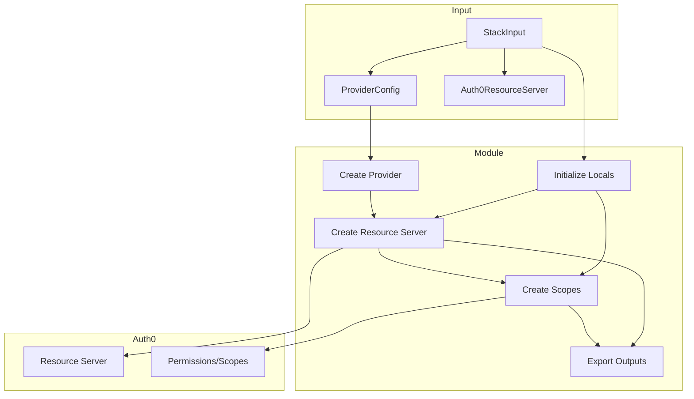
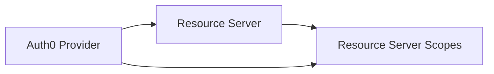
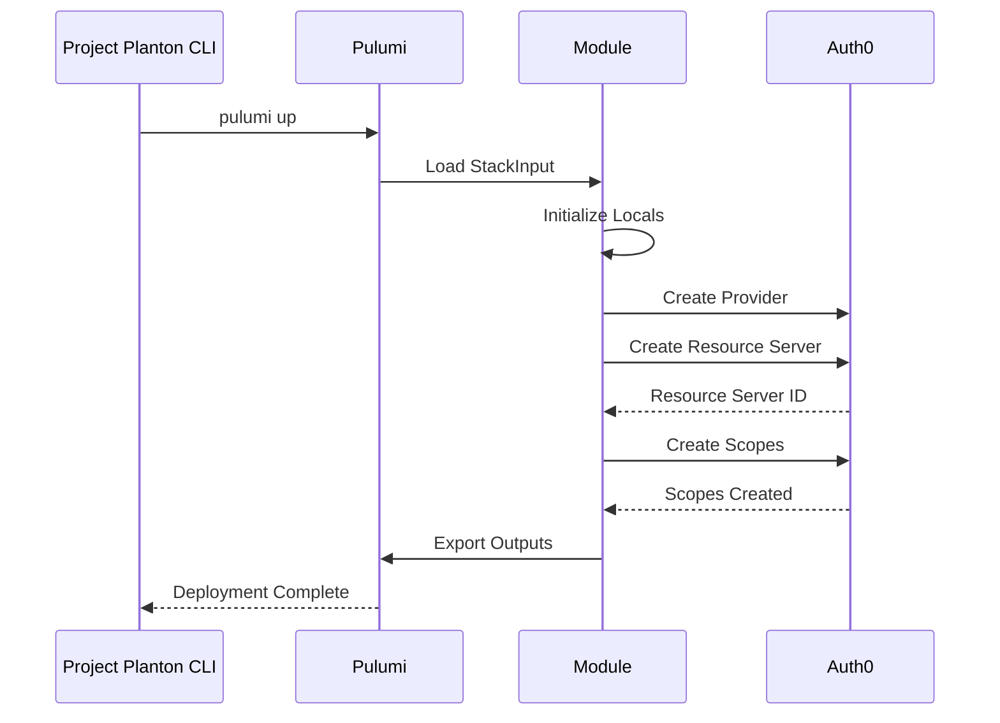

# Auth0 Resource Server - Pulumi Module Overview

## Architecture

This module creates Auth0 Resource Server resources using the Pulumi Go SDK.



## Component Structure

### Entry Point (`main.go`)

Loads stack input and invokes the module:

```go
pulumi.Run(func(ctx *pulumi.Context) error {
    stackInput := &auth0resourceserverv1.Auth0ResourceServerStackInput{}
    if err := stackinput.LoadStackInput(ctx, stackInput); err != nil {
        return err
    }
    return module.Run(ctx, stackInput)
})
```

### Module (`module/main.go`)

Orchestrates resource creation:

1. Validate input
2. Initialize locals
3. Create Auth0 provider
4. Create resource server
5. Create scopes (if defined)
6. Export outputs

### Locals (`module/locals.go`)

Computes derived values from stack input:

- Resource name from metadata
- Display name (spec.name or metadata.name)
- Token configuration
- Access control settings
- Scope list

### Resource Server (`module/resourceserver.go`)

Creates the Auth0 Resource Server resource:

```go
auth0.NewResourceServer(ctx, name, &auth0.ResourceServerArgs{
    Identifier: pulumi.String(identifier),
    Name:       pulumi.String(displayName),
    SigningAlg: pulumi.String(signingAlg),
    // ... other settings
})
```

Also creates scopes using `auth0.NewResourceServerScopes`.

### Outputs (`module/outputs.go`)

Exports stack outputs:

- `id` - Auth0 resource ID
- `identifier` - API audience
- `name` - Display name
- `signing_alg` - Signing algorithm
- Token settings
- Access control flags

## Resource Dependencies



## Configuration Flow



## Error Handling

The module handles errors at each step:

1. **Input validation**: Ensures required fields are present
2. **Provider creation**: Validates Auth0 credentials
3. **Resource creation**: Handles API errors gracefully
4. **Scope creation**: Ensures resource server exists first

## Testing Strategy

1. **Unit tests**: Validate input transformation in locals
2. **Integration tests**: Deploy to test tenant
3. **Smoke tests**: Use hack manifest for quick validation

## Performance Considerations

- Single API call for resource server creation
- Batch scope creation in one resource
- Minimal state management overhead
