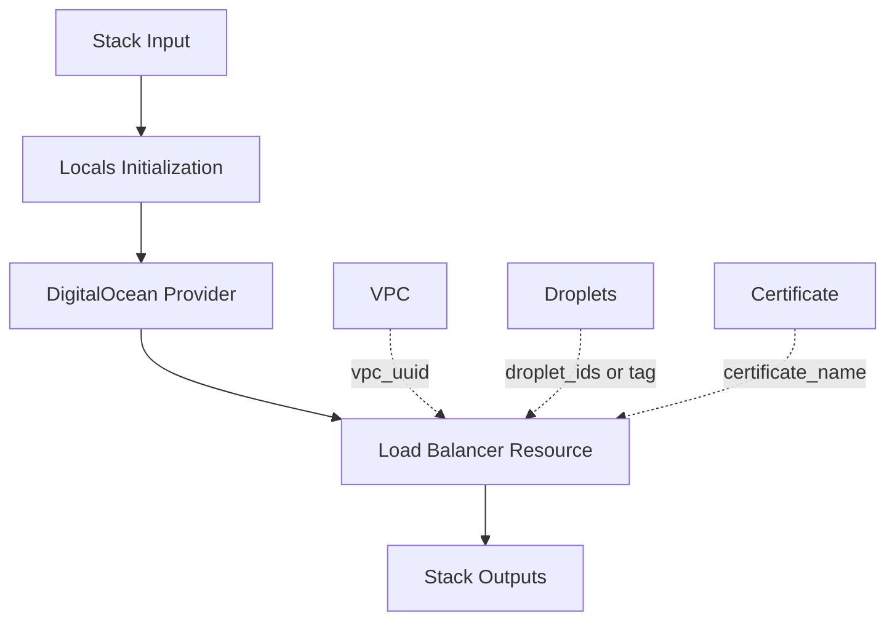

# DigitalOcean Load Balancer - Pulumi Module Architecture

## Module Design Philosophy

This Pulumi module translates Project Planton's protobuf-defined `DigitalOceanLoadBalancerSpec` into DigitalOcean Load Balancer resources. The design follows these principles:

1. **Spec-Driven**: The module reads configuration from protobuf messages, not raw Pulumi code
2. **80/20 Coverage**: Implements the 20% of features that 80% of users need
3. **Foreign Key Resolution**: Handles resource references (VPC, Droplets) via the `StringValueOrRef` pattern
4. **Idempotent**: Multiple runs converge to desired state without side effects

## Module Structure

```
module/
├── main.go              # Entry point: orchestrates resource creation
├── locals.go            # Local variables, labels, and computed values
├── load_balancer.go     # Load balancer resource provisioning
└── outputs.go           # Stack output definitions
```

### File Responsibilities

#### `main.go` - Orchestration

The entry point that coordinates the module workflow:

```go
func Resources(ctx *pulumi.Context, stackInput *StackInput) error {
    // 1. Initialize locals (labels, computed values)
    locals := initializeLocals(ctx, stackInput)
    
    // 2. Create DigitalOcean provider
    digitalOceanProvider := createProvider(ctx, locals)
    
    // 3. Provision load balancer
    loadBalancer := loadBalancer(ctx, locals, digitalOceanProvider)
    
    // 4. Export outputs
    outputs(ctx, loadBalancer)
    
    return nil
}
```

**Key Decisions:**
- Provider is created explicitly (not using default provider config)
- Resources are created in dependency order (provider → load balancer)
- Outputs are exported for cross-stack references

#### `locals.go` - Configuration Preprocessing

Prepares data structures and labels:

```go
type Locals struct {
    DigitalOceanProviderConfig *DigitalOceanProviderConfig
    DigitalOceanLoadBalancer   *DigitalOceanLoadBalancer
    DigitalOceanLabels         map[string]string
}

func initializeLocals(ctx *pulumi.Context, stackInput *StackInput) *Locals {
    // Extract metadata
    // Build standard Planton labels
    // Prepare provider configuration
}
```

**Label Structure:**

Standard Project Planton labels applied to resources:

```go
labels := {
    "planton.cloud/resource":      "true",
    "planton.cloud/resource-kind": "DigitalOceanLoadBalancer",
    "planton.cloud/resource-name": "prod-web-lb",
    "planton.cloud/resource-id":   "dolb-abc123",
    "planton.cloud/organization":  "my-org",
    "planton.cloud/environment":   "production",
}
```

**Note:** DigitalOcean Load Balancers don't support labels/tags directly. These are used for Pulumi stack organization and resource tracking.

#### `load_balancer.go` - Core Resource Logic

Provisions the `digitalocean.LoadBalancer` resource:

```go
func loadBalancer(
    ctx *pulumi.Context,
    locals *Locals,
    digitalOceanProvider *digitalocean.Provider,
) (*digitalocean.LoadBalancer, error) {
    
    spec := locals.DigitalOceanLoadBalancer.Spec
    
    // 1. Process Droplet IDs from foreign key refs
    // 2. Extract Droplet tag
    // 3. Build forwarding rules with certificate names
    // 4. Configure health check
    // 5. Set up sticky sessions (optional)
    // 6. Create load balancer resource
    // 7. Export stack outputs
}
```

**Key Implementation Details:**

1. **Droplet ID Resolution**:
   ```go
   var dropletIds pulumi.IntArray
   for _, dropletId := range spec.DropletIds {
       if id, err := strconv.Atoi(dropletId.GetValue()); err == nil {
           dropletIds = append(dropletIds, pulumi.Int(id))
       }
   }
   ```
   - Converts `StringValueOrRef` to integer IDs
   - Filters out invalid values
   - Note: Tag-based targeting is preferred in production

2. **Forwarding Rules**:
   ```go
   for _, fr := range spec.ForwardingRules {
       rule := LoadBalancerForwardingRuleArgs{
           EntryPort:      pulumi.Int(int(fr.EntryPort)),
           EntryProtocol:  pulumi.String(fr.EntryProtocol.String()),
           TargetPort:     pulumi.Int(int(fr.TargetPort)),
           TargetProtocol: pulumi.String(fr.TargetProtocol.String()),
       }
       if fr.CertificateName != "" {
           rule.CertificateName = pulumi.StringPtr(fr.CertificateName)
       }
       forwardingRules = append(forwardingRules, rule)
   }
   ```
   - Iterates over spec's forwarding rules
   - Converts protobuf enums to strings (e.g., `http`, `https`, `tcp`)
   - Conditionally adds certificate name for HTTPS rules

3. **Health Check Configuration**:
   ```go
   if spec.HealthCheck != nil {
       healthcheck = &LoadBalancerHealthcheckArgs{
           Port:                 pulumi.Int(int(spec.HealthCheck.Port)),
           Protocol:             pulumi.String(spec.HealthCheck.Protocol.String()),
           Path:                 pulumi.StringPtr(spec.HealthCheck.Path),
           CheckIntervalSeconds: pulumi.IntPtr(int(spec.HealthCheck.CheckIntervalSec)),
       }
   }
   ```
   - Uses protobuf's `optional` field presence detection
   - Defaults `check_interval_sec` to 10 if not specified (handled in proto defaults)

4. **Sticky Sessions**:
   ```go
   if spec.EnableStickySessions {
       stickySessions = &LoadBalancerStickySessionsArgs{
           Type: pulumi.String("cookies"),
       }
   }
   ```
   - Simple boolean toggle
   - Hardcoded to cookie-based sessions (80/20 principle)

#### `outputs.go` - Stack Output Definitions

Exports load balancer metadata for cross-stack references:

```go
const (
    OpLoadBalancerId = "load_balancer_id"
    OpIp             = "ip"
    OpDnsName        = "dns_name"
)

func outputs(ctx *pulumi.Context, lb *digitalocean.LoadBalancer) {
    ctx.Export(OpLoadBalancerId, lb.ID())
    ctx.Export(OpIp, lb.Ip)
    ctx.Export(OpDnsName, lb.Name) // LBs don't have DNS, use name
}
```

**Output Usage in Other Stacks:**

```typescript
// Reference load balancer IP in another Pulumi stack
const lbStack = new pulumi.StackReference("prod/load-balancer/prod");
const lbIp = lbStack.getOutput("ip");
```

## Resource Dependencies



**Explicit Dependencies:**
- Load balancer requires DigitalOcean provider
- Load balancer implicitly depends on VPC (via `vpc_uuid`)

**Implicit Dependencies:**
- Droplets must exist before load balancer creation (if using IDs)
- Certificate must be uploaded before referencing in forwarding rules
- VPC must exist in the specified region

## Foreign Key Resolution Pattern

Project Planton uses `StringValueOrRef` for resource references:

```protobuf
message StringValueOrRef {
  oneof literal_or_ref {
    string value = 1;  // Direct value (e.g., "vpc-123456")
    string ref = 2;    // Reference to another resource (e.g., "my-vpc")
  }
}
```

**In this Module:**

VPC reference example:
```go
// Spec contains:
vpc: &StringValueOrRef{
    LiteralOrRef: &StringValueOrRef_Value{Value: "vpc-123456"}
}

// Module resolves:
vpcUuid := pulumi.String(spec.Vpc.GetValue())
```

Droplet IDs example:
```go
// Spec contains:
droplet_ids: []*StringValueOrRef{
    {LiteralOrRef: &StringValueOrRef_Value{Value: "386734086"}},
    {LiteralOrRef: &StringValueOrRef_Ref{Ref: "my-droplet"}},
}

// Module resolves:
for _, dropletId := range spec.DropletIds {
    id := dropletId.GetValue()  // Handles both value and ref cases
    // Convert to int and append to dropletIds array
}
```

**Current Limitation:** The module uses `GetValue()` which works for literal values but doesn't resolve `ref` to actual resource IDs. Full reference resolution requires:
1. Looking up the referenced resource in the stack
2. Extracting its `status.outputs.droplet_id` field
3. Using that value in the load balancer configuration

This is a planned enhancement but not currently implemented.

## Protocol Enum Handling

Protobuf enums are converted to lowercase strings for DigitalOcean API:

```go
// Spec proto:
enum DigitalOceanLoadBalancerProtocol {
  digitalocean_load_balancer_protocol_unspecified = 0;
  http = 1;
  https = 2;
  tcp = 3;
}

// Pulumi code:
EntryProtocol: pulumi.String(fr.EntryProtocol.String())
// Outputs: "http", "https", or "tcp"
```

**Why lowercase?** DigitalOcean API expects lowercase protocol names.

## Health Check Strategy

Health checks determine backend availability. The module implements:

**HTTP/HTTPS Health Checks:**
```go
healthcheck := &LoadBalancerHealthcheckArgs{
    Port:     pulumi.Int(80),
    Protocol: pulumi.String("http"),
    Path:     pulumi.StringPtr("/healthz"),  // Application endpoint
}
```

**TCP Health Checks:**
```go
healthcheck := &LoadBalancerHealthcheckArgs{
    Port:     pulumi.Int(3306),
    Protocol: pulumi.String("tcp"),
    // No path for TCP checks
}
```

**Best Practices:**
- Use HTTP checks for application-level health verification
- Implement health endpoints that check database connectivity
- Return 200 OK only when truly healthy
- Use TCP checks only when HTTP is unavailable (databases, non-HTTP services)

## Tag-Based vs ID-Based Targeting

### Tag-Based (Recommended)

```go
args := &LoadBalancerArgs{
    DropletTag: pulumi.String("web-prod"),
}
```

**Advantages:**
- Automatic backend discovery
- Works with autoscaling
- Supports blue-green deployments
- Droplets can be added/removed without updating load balancer config

**How It Works:**
1. DigitalOcean Load Balancer polls the API
2. Discovers all Droplets with matching tag in the VPC
3. Automatically adds/removes them from the backend pool

### ID-Based (Static)

```go
args := &LoadBalancerArgs{
    DropletIds: pulumi.IntArray{
        pulumi.Int(386734086),
        pulumi.Int(386734087),
    },
}
```

**Disadvantages:**
- Manual management required
- Doesn't work with autoscaling
- Requires load balancer config update for every backend change

**Use Cases:**
- Testing environments
- Static infrastructure without autoscaling
- Manual control over backend pool

## Sticky Sessions Implementation

```go
if spec.EnableStickySessions {
    stickySessions = &LoadBalancerStickySessionsArgs{
        Type: pulumi.String("cookies"),
    }
}
```

**What It Does:**
- Enables session affinity via cookies
- Load balancer sets a cookie on first request
- Subsequent requests with the cookie go to the same backend

**When to Use:**
- Session-based applications (server-side sessions)
- Legacy apps that store state locally (not recommended for new apps)

**When NOT to Use:**
- Stateless applications (REST APIs)
- Applications using centralized session stores (Redis, Memcached)

## Error Handling

The module uses Pulumi's automatic error propagation:

```go
createdLoadBalancer, err := digitalocean.NewLoadBalancer(ctx, "load_balancer", args, ...)
if err != nil {
    return nil, errors.Wrap(err, "failed to create digitalocean load balancer")
}
```

**Error Scenarios:**
1. **Invalid VPC UUID** - Pulumi fails during apply
2. **Invalid Droplet IDs** - DigitalOcean API returns 404
3. **Certificate not found** - API error during create
4. **Invalid region** - Validation fails

All errors bubble up to Pulumi's stack execution and are reported to the user.

## Idempotency Guarantees

Pulumi ensures idempotency:
1. **Create**: If resource doesn't exist, create it
2. **Update**: If resource exists but config changed, update in place
3. **No-op**: If resource exists with correct config, do nothing
4. **Replace**: If change requires replacement, delete and recreate

**Example:**
```bash
# First run: Creates load balancer
pulumi up

# Second run: No changes
pulumi up  # "No updates to perform"

# Third run with config change: Updates load balancer
# (e.g., change droplet_tag from "blue" to "green")
pulumi up  # "1 to update"
```

## State Management

Pulumi stores state in a backend (Pulumi Service, S3, DigitalOcean Spaces):

```
State:
  load_balancer (digitalocean:LoadBalancer):
    id: "lb-abc123"
    ip: "203.0.113.42"
    name: "prod-web-lb"
    vpc_uuid: "vpc-123456"
    droplet_tag: "web-prod"
```

**State Drift:**
- If Droplets are added/removed via tag, Pulumi state doesn't drift
- If load balancer is modified via UI, `pulumi refresh` detects changes
- `pulumi up` reconciles drift back to desired state

## Design Decisions

### 1. Why Use Provider Explicitly?

```go
provider := digitalocean.NewProvider(ctx, "digitalocean", &digitalocean.ProviderArgs{
    Token: pulumi.String(locals.DigitalOceanProviderConfig.DigitaloceanToken),
})
```

**Reason:** Allows multiple DigitalOcean providers in the same stack (different accounts or tokens).

### 2. Why String Protocol Conversion?

```go
EntryProtocol: pulumi.String(fr.EntryProtocol.String())
```

**Reason:** Protobuf enums are integers. `.String()` converts to name. DigitalOcean API expects lowercase strings.

### 3. Why StringPtr for Optional Fields?

```go
Path: pulumi.StringPtr(spec.HealthCheck.Path)
```

**Reason:** Pulumi differentiates between:
- `pulumi.String("")` - Empty string (invalid for some fields)
- `pulumi.StringPtr(nil)` - Omit field (use API default)

### 4. Why Export DNS Name as Load Balancer Name?

```go
ctx.Export(OpDnsName, lb.Name)
```

**Reason:** DigitalOcean Load Balancers don't have DNS names (use IP). Exporting name maintains consistency with other cloud providers.

## Testing Strategy

Module testing is implicit through Pulumi's plan/preview:

```bash
# Dry-run to verify configuration
pulumi preview

# Expected output shows:
# - Resources to create/update/delete
# - Property changes
# - Dependency graph
```

**Manual Testing:**
```bash
# Deploy load balancer
pulumi up

# Test connectivity
LB_IP=$(pulumi stack output ip)
curl http://$LB_IP

# Verify backends
doctl compute load-balancer get $(pulumi stack output load_balancer_id)
```

## Performance Considerations

**Resource Creation Time:**
- Load balancer provisioning: ~2-3 minutes
- First health check stabilization: ~30-60 seconds
- Total deploy time: ~3-5 minutes

**Optimization:**
- Use tag-based targeting (no need to wait for Droplets to be created first)
- Parallel stack deploys (if creating multiple load balancers)

## Limitations and Future Enhancements

### Current Limitations

1. **Foreign Key Refs Not Resolved** - `StringValueOrRef.ref` requires manual resolution
2. **No Advanced Health Check Tuning** - Only `check_interval_sec` exposed
3. **No HTTP-to-HTTPS Redirect** - Excluded per 80/20 principle (can be done with two rules)
4. **No PROXY Protocol** - Advanced feature excluded
5. **No Algorithm Selection** - Defaults to round-robin

### Planned Enhancements

1. Implement full foreign key resolution
2. Add support for multiple regions (multi-region load balancing)
3. Add integration tests with actual Droplet provisioning
4. Support for advanced health check parameters

## Related Documentation

- [README.md](README.md) - Deployment workflow
- [../../docs/README.md](../../docs/README.md) - Research and best practices
- [../../examples.md](../../examples.md) - Usage examples
- [../tf/README.md](../tf/README.md) - Terraform alternative

